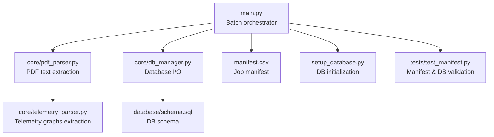
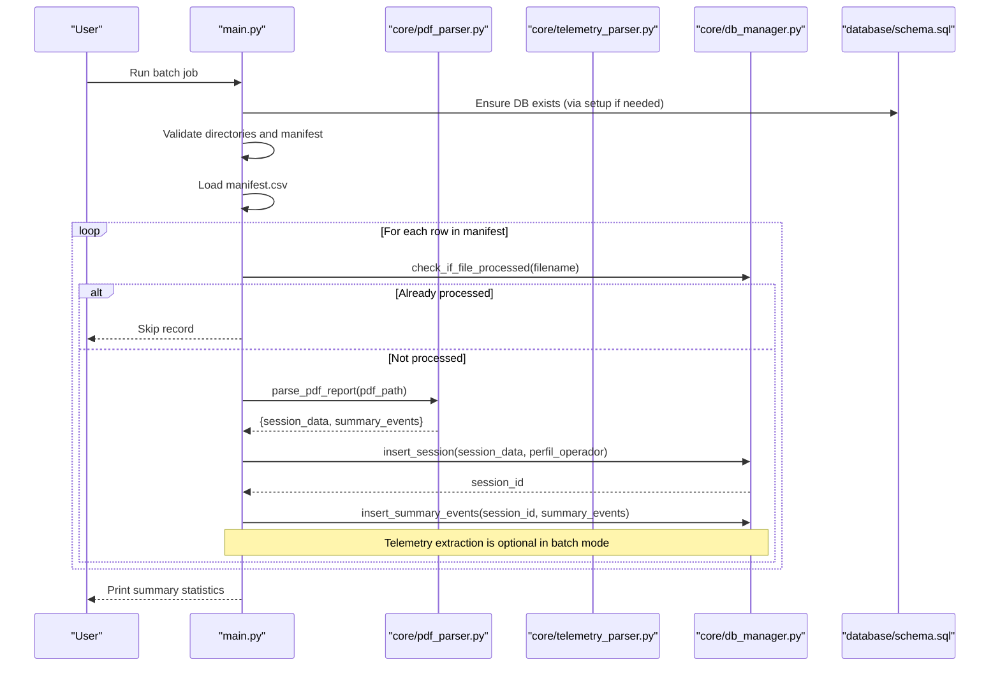
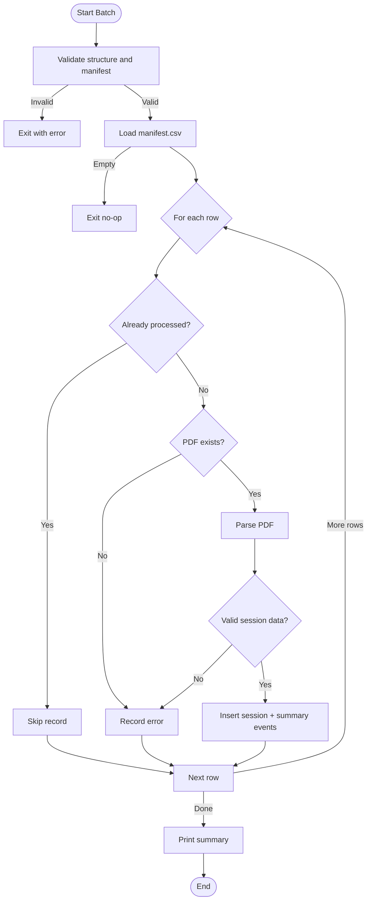
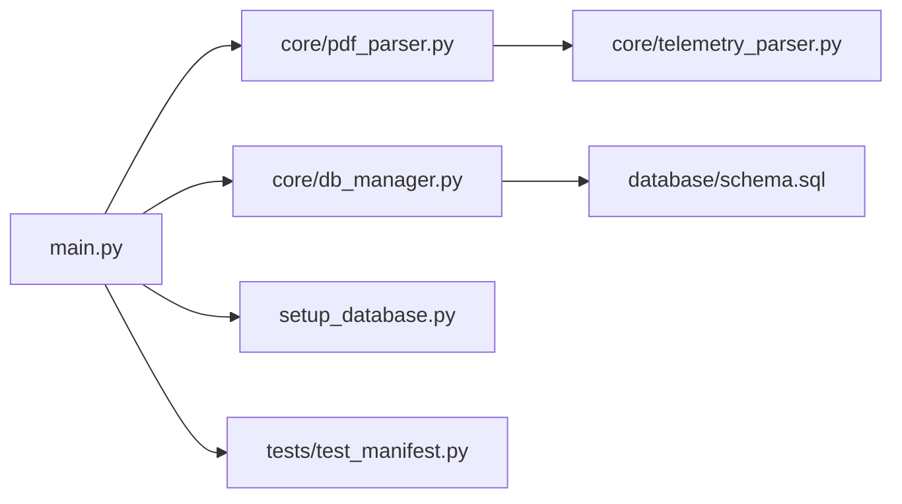

# Batch Processing System

<cite>
**Referenced Files in This Document**
- [main.py](file://main.py)
- [manifest.csv](file://manifest.csv)
- [core/pdf_parser.py](file://core/pdf_parser.py)
- [core/db_manager.py](file://core/db_manager.py)
- [core/telemetry_parser.py](file://core/telemetry_parser.py)
- [database/schema.sql](file://database/schema.sql)
- [setup_database.py](file://setup_database.py)
- [tests/test_manifest.py](file://tests/test_manifest.py)
</cite>

## Table of Contents
1. [Introduction](#introduction)
2. [Project Structure](#project-structure)
3. [Core Components](#core-components)
4. [Architecture Overview](#architecture-overview)
5. [Detailed Component Analysis](#detailed-component-analysis)
6. [Dependency Analysis](#dependency-analysis)
7. [Performance Considerations](#performance-considerations)
8. [Troubleshooting Guide](#troubleshooting-guide)
9. [Conclusion](#conclusion)
10. [Appendices](#appendices)

## Introduction
This document describes the batch processing system that drives manifest-driven ETL (Extract-Transform-Load) operations for multiple PDF reports. The system reads a CSV manifest, validates and processes each referenced PDF report, extracts structured session data and telemetry, and loads results into a SQLite database. It includes robust error handling, idempotent execution to avoid reprocessing, progress reporting, and utilities for setup and validation.

The primary goals are:
- Define the CSV manifest format specification used to drive batch jobs.
- Explain the end-to-end workflow from manifest ingestion to database persistence.
- Detail data extraction and transformation logic for PDF reports.
- Provide guidance on configuration, command-line usage, logging, error reporting, and recovery.
- Offer performance optimization techniques and troubleshooting strategies for large-scale operations.

## Project Structure
At a high level, the batch pipeline is orchestrated by a main script that coordinates manifest loading, PDF parsing, and database writes. Supporting modules handle PDF text extraction, telemetry graph extraction, and database interactions. A schema file defines the database structure, and a setup script initializes it. Tests validate manifest structure and database schema.

**Diagram sources**
- [main.py:22-43](file://main.py#L22-L43)
- [core/pdf_parser.py:27-57](file://core/pdf_parser.py#L27-L57)
- [core/db_manager.py:23-33](file://core/db_manager.py#L23-L33)
- [core/telemetry_parser.py:125-154](file://core/telemetry_parser.py#L125-L154)
- [database/schema.sql:14-58](file://database/schema.sql#L14-L58)
- [setup_database.py:9-43](file://setup_database.py#L9-L43)
- [tests/test_manifest.py:7-60](file://tests/test_manifest.py#L7-L60)

**Section sources**
- [main.py:22-43](file://main.py#L22-L43)
- [core/pdf_parser.py:27-57](file://core/pdf_parser.py#L27-L57)
- [core/db_manager.py:23-33](file://core/db_manager.py#L23-L33)
- [core/telemetry_parser.py:125-154](file://core/telemetry_parser.py#L125-L154)
- [database/schema.sql:14-58](file://database/schema.sql#L14-L58)
- [setup_database.py:9-43](file://setup_database.py#L9-L43)
- [tests/test_manifest.py:7-60](file://tests/test_manifest.py#L7-L60)

## Core Components
- Manifest loader and validator: Reads and validates the CSV manifest, ensuring required columns and non-null critical fields.
- PDF parser: Extracts session metadata and summary events from the first page of each PDF using regex patterns.
- Telemetry extractor: Parses image-based graphs from specific pages, calibrates pixel coordinates to real-world values, and returns time-series data.
- Database manager: Provides connection management, session insertion, event summary insertion, telemetry insertion, and duplicate detection.
- Setup utility: Initializes or recreates the SQLite database using the provided schema.
- Test suite: Validates manifest structure and database schema integrity.

Key responsibilities:
- Ensure idempotency by skipping already processed files.
- Validate inputs and fail fast with clear messages.
- Maintain transactional integrity when writing to the database.
- Provide comprehensive status output for monitoring.

**Section sources**
- [main.py:69-98](file://main.py#L69-L98)
- [core/pdf_parser.py:27-57](file://core/pdf_parser.py#L27-L57)
- [core/telemetry_parser.py:125-154](file://core/telemetry_parser.py#L125-L154)
- [core/db_manager.py:93-152](file://core/db_manager.py#L93-L152)
- [setup_database.py:9-43](file://setup_database.py#L9-L43)
- [tests/test_manifest.py:7-60](file://tests/test_manifest.py#L7-L60)

## Architecture Overview
The batch pipeline follows an ETL pattern driven by a manifest:

**Diagram sources**
- [main.py:22-43](file://main.py#L22-L43)
- [main.py:100-176](file://main.py#L100-L176)
- [core/pdf_parser.py:27-57](file://core/pdf_parser.py#L27-L57)
- [core/db_manager.py:93-152](file://core/db_manager.py#L93-L152)
- [database/schema.sql:14-58](file://database/schema.sql#L14-L58)

## Detailed Component Analysis

### Manifest Format Specification
The manifest is a CSV file that drives batch processing. Each row represents one PDF report to process. Required columns include:
- nombre_archivo_pdf: Name of the PDF file located under the configured reports directory.
- perfil_etiquetado: Label/profile assigned to the operator/session during processing.
- id_operador: Identifier for the operator associated with the session.
- nombre_ejercicio: Exercise name linked to the session.
- fecha_creacion: Creation date of the exercise/report.

Validation rules:
- All required columns must be present.
- Rows missing critical fields (e.g., PDF filename or profile label) are dropped with a warning.
- Missing PDF files result in an error for that row.

Example rows can be found in the manifest file.

**Section sources**
- [manifest.csv:1-20](file://manifest.csv#L1-L20)
- [main.py:69-98](file://main.py#L69-L98)
- [tests/test_manifest.py:7-60](file://tests/test_manifest.py#L7-L60)

### Batch Execution Workflow
The orchestration flow:
1. Validate project structure (reports directory, database path, manifest file).
2. Load and validate manifest CSV.
3. Iterate through manifest rows:
   - Check if the file was already processed to ensure idempotency.
   - Build full path to the PDF and verify existence.
   - Parse the PDF to extract session data and summary events.
   - Insert session into the database with the provided profile label.
   - Insert summary events linked to the session.
4. Commit changes and print a summary with counts for processed, skipped, and errors.

**Diagram sources**
- [main.py:22-43](file://main.py#L22-L43)
- [main.py:100-176](file://main.py#L100-L176)

**Section sources**
- [main.py:22-43](file://main.py#L22-L43)
- [main.py:100-176](file://main.py#L100-L176)

### Data Validation Rules
- Manifest columns: Must include all required fields; missing critical fields cause row omission.
- PDF existence: If a referenced PDF is missing, the row is marked as an error.
- Session data validity: If parsing fails or yields no valid session data, the row is marked as an error.
- Database integrity: Duplicate filenames are detected and skipped; inserts use transactions to maintain consistency.

**Section sources**
- [main.py:69-98](file://main.py#L69-L98)
- [main.py:125-176](file://main.py#L125-L176)
- [core/db_manager.py:93-152](file://core/db_manager.py#L93-L152)

### Progress Tracking and Reporting
- Console output provides step-by-step status for each manifest row.
- Summary at the end includes total records, successfully processed, skipped, and errors, plus success rate.
- Idempotency prevents reprocessing and reduces redundant work.

**Section sources**
- [main.py:178-193](file://main.py#L178-L193)

### Logging System and Error Reporting
- Errors are printed to console with descriptive messages indicating the stage and nature of failure.
- Critical failures (e.g., database connection issues) halt processing and mark all remaining rows as errors.
- Row-level exceptions are caught and reported without aborting the entire batch.

Recommendations:
- Redirect console output to a log file for archival and analysis.
- Add structured logging (e.g., JSON lines) for machine-readable logs.
- Implement retry logic for transient database errors.

**Section sources**
- [main.py:119-123](file://main.py#L119-L123)
- [core/pdf_parser.py:55-57](file://core/pdf_parser.py#L55-L57)
- [core/db_manager.py:19-21](file://core/db_manager.py#L19-L21)
- [core/db_manager.py:121-152](file://core/db_manager.py#L121-L152)

### Recovery Procedures for Failed Batch Operations
- Idempotent design allows rerunning the batch safely; already processed files will be skipped.
- For failed rows due to missing PDFs or invalid data, correct the input and rerun.
- Database rollback occurs on insert errors to prevent partial writes.

Operational steps:
- Fix manifest entries or restore missing PDFs.
- Re-run the batch; duplicates will be skipped automatically.
- Inspect console output and logs to identify problematic rows.

**Section sources**
- [main.py:137-149](file://main.py#L137-L149)
- [core/db_manager.py:121-152](file://core/db_manager.py#L121-L152)

### Command-Line Parameters and Configuration
Current implementation uses hardcoded configuration within the main script:
- Reports directory path
- Database path
- Manifest path

To support command-line parameters:
- Add argument parsing (e.g., argparse) to override defaults.
- Accept flags such as --manifest-path, --reports-dir, --db-path.
- Validate arguments before starting the pipeline.

Example parameter set (conceptual):
- --manifest-path: Path to manifest.csv
- --reports-dir: Directory containing PDF reports
- --db-path: Path to SQLite database file

**Section sources**
- [main.py:15-20](file://main.py#L15-L20)

### Extract-Transform-Load Process for Multiple PDF Reports
- Extract: Parse PDFs to retrieve session metadata and summary events.
- Transform: Normalize and validate extracted data; map profile labels from manifest.
- Load: Insert sessions and summary events into the database; ensure uniqueness by filename.

Telemetry extraction:
- Optional in batch mode; available via separate module for advanced analysis.
- Uses calibrated image processing to convert graph pixels to real-world values.

**Section sources**
- [core/pdf_parser.py:27-57](file://core/pdf_parser.py#L27-L57)
- [core/telemetry_parser.py:125-154](file://core/telemetry_parser.py#L125-L154)
- [core/db_manager.py:106-152](file://core/db_manager.py#L106-L152)

## Dependency Analysis
The batch system has clear dependencies between components:
- main.py depends on core modules for parsing and database operations.
- pdf_parser.py relies on regex patterns and locale settings for robust text extraction.
- db_manager.py encapsulates database interactions and ensures safe connections.
- telemetry_parser.py depends on OpenCV and numpy for image processing.
- schema.sql defines the database structure used by db_manager.py.

**Diagram sources**
- [main.py:7-13](file://main.py#L7-L13)
- [core/pdf_parser.py:4-9](file://core/pdf_parser.py#L4-L9)
- [core/db_manager.py:4-7](file://core/db_manager.py#L4-L7)
- [core/telemetry_parser.py:7-11](file://core/telemetry_parser.py#L7-L11)
- [database/schema.sql:14-58](file://database/schema.sql#L14-L58)
- [setup_database.py:5-7](file://setup_database.py#L5-L7)
- [tests/test_manifest.py:3-5](file://tests/test_manifest.py#L3-L5)

**Section sources**
- [main.py:7-13](file://main.py#L7-L13)
- [core/pdf_parser.py:4-9](file://core/pdf_parser.py#L4-L9)
- [core/db_manager.py:4-7](file://core/db_manager.py#L4-L7)
- [core/telemetry_parser.py:7-11](file://core/telemetry_parser.py#L7-L11)
- [database/schema.sql:14-58](file://database/schema.sql#L14-L58)
- [setup_database.py:5-7](file://setup_database.py#L5-L7)
- [tests/test_manifest.py:3-5](file://tests/test_manifest.py#L3-L5)

## Performance Considerations
Optimization techniques for large-scale batch operations:
- Use batching for database inserts: Group multiple inserts into a single transaction to reduce commit overhead.
- Avoid unnecessary PDF parsing: Leverage idempotency checks to skip already processed files.
- Parallelize independent tasks: If feasible, process multiple PDFs concurrently while respecting I/O constraints.
- Optimize telemetry extraction: Only enable telemetry parsing when needed; it involves heavy image processing.
- Tune locale and parsing: Ensure locale settings are applied once per process to avoid repeated setup costs.
- Monitor disk I/O: Place reports and database on fast storage; consider compressing archived outputs.

Practical tips:
- Pre-validate manifests to minimize runtime errors.
- Log metrics (e.g., parse times, insert durations) to identify bottlenecks.
- Use indexes on frequently queried columns (already defined in schema).

[No sources needed since this section provides general guidance]

## Troubleshooting Guide
Common issues and resolutions:
- Missing manifest file: Ensure manifest.csv exists at the configured path.
- Missing columns in manifest: Add required columns and remove rows with critical nulls.
- Missing PDF files: Verify that all referenced PDFs exist in the reports directory.
- Database not initialized: Run the setup script to create or recreate the database schema.
- Parsing failures: Check PDF content and regex patterns; update parsers if report formats change.
- Duplicate processing: Confirm idempotency behavior; duplicates should be skipped automatically.

Diagnostic steps:
- Run tests to validate manifest structure and database schema.
- Inspect console output for detailed error messages.
- Review database tables to confirm inserted records.

**Section sources**
- [main.py:44-67](file://main.py#L44-L67)
- [main.py:69-98](file://main.py#L69-L98)
- [tests/test_manifest.py:7-60](file://tests/test_manifest.py#L7-L60)
- [setup_database.py:9-43](file://setup_database.py#L9-L43)

## Conclusion
The batch processing system provides a robust, manifest-driven ETL pipeline for processing multiple PDF reports. It emphasizes idempotency, validation, and clear error reporting. By following the guidelines in this document, users can efficiently configure, run, monitor, and troubleshoot batch jobs, and optimize performance for large-scale operations.

[No sources needed since this section summarizes without analyzing specific files]

## Appendices

### Appendix A: Manifest File Example
See the manifest file for example rows demonstrating the expected format and field values.

**Section sources**
- [manifest.csv:1-20](file://manifest.csv#L1-L20)

### Appendix B: Database Schema Overview
The database schema defines three tables:
- Sesiones: Stores session metadata including operator name, exercise, timestamps, score, and profile label.
- ResumenEventos: Aggregated event summaries linked to sessions.
- Telemetria: Time-series telemetry data for various graphs.

Indexes are provided to improve query performance.

**Section sources**
- [database/schema.sql:14-58](file://database/schema.sql#L14-L58)

### Appendix C: Setup and Initialization
Use the setup script to initialize or recreate the database. It executes the schema file to create tables and indexes.

**Section sources**
- [setup_database.py:9-43](file://setup_database.py#L9-L43)

### Appendix D: Testing and Validation
Run the test suite to validate manifest structure and database schema integrity before executing the batch pipeline.

**Section sources**
- [tests/test_manifest.py:7-60](file://tests/test_manifest.py#L7-L60)