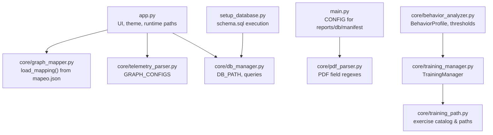
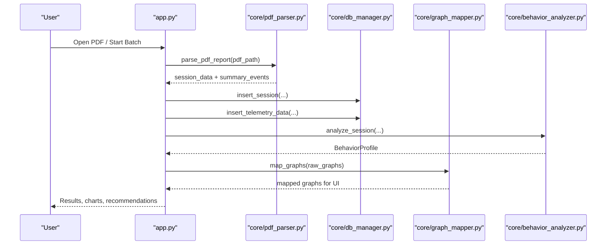
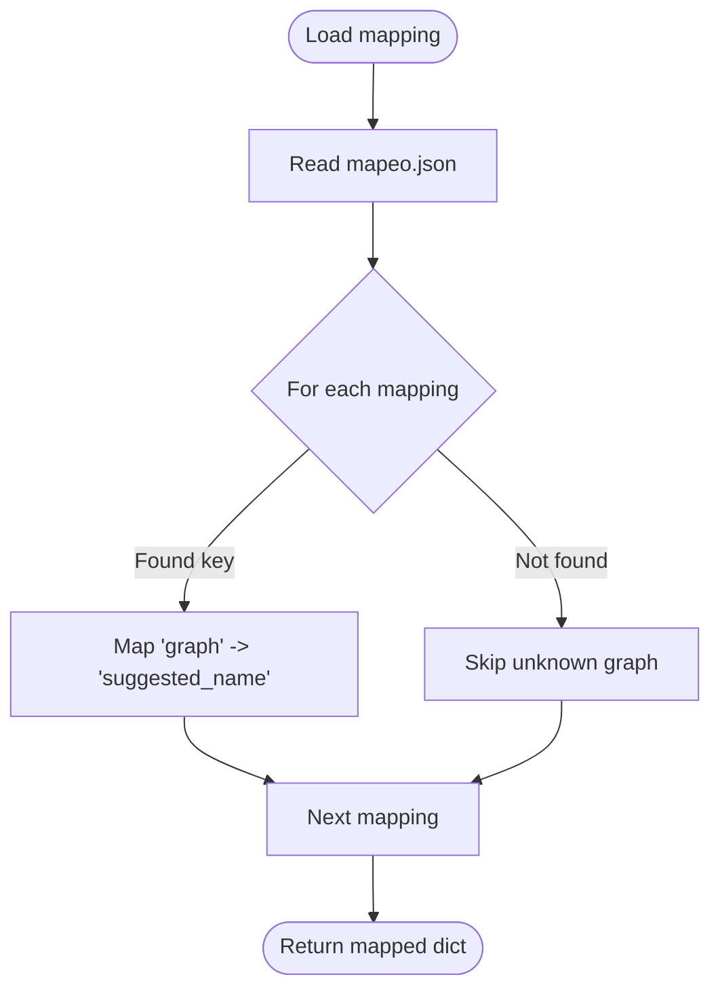
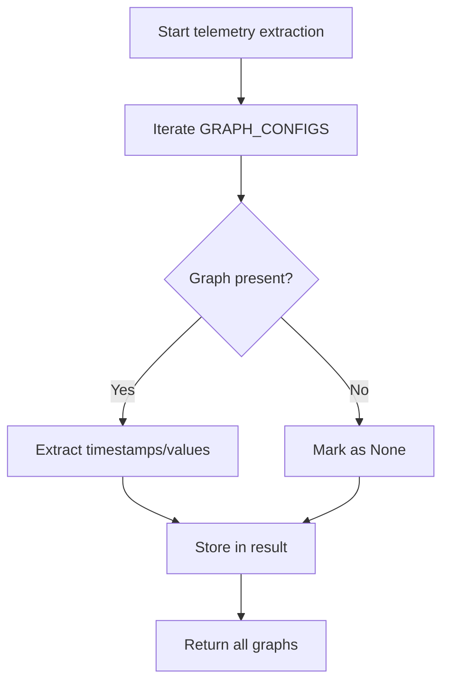
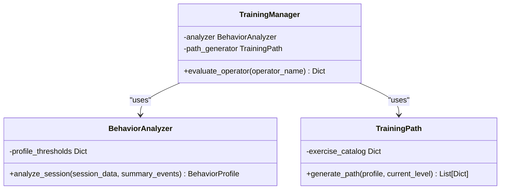
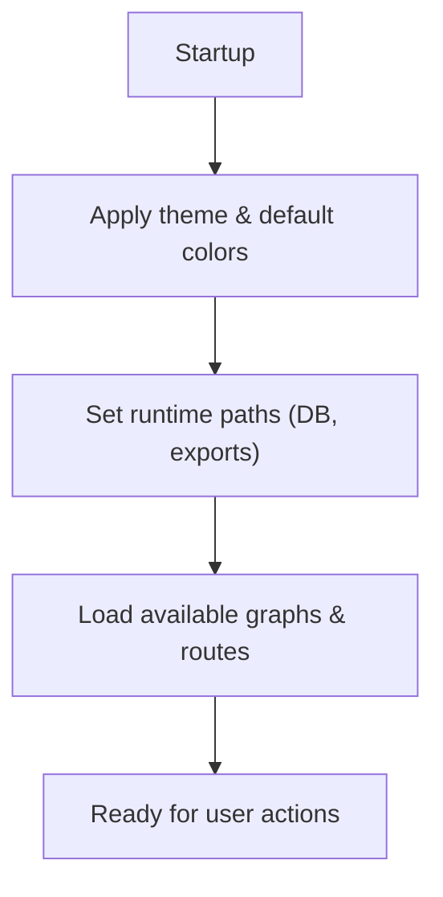
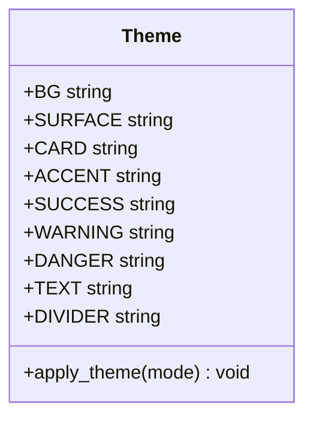
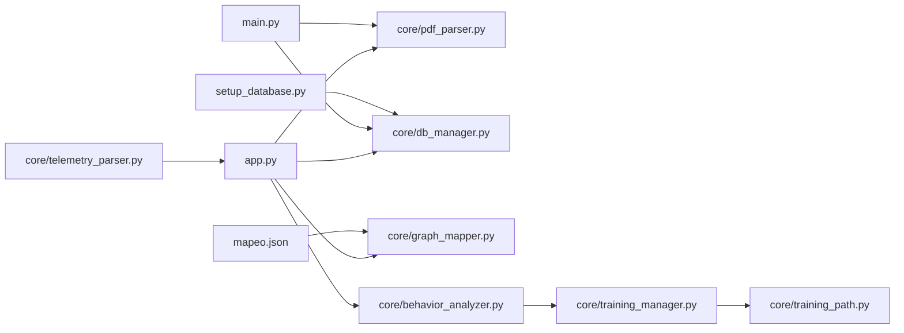

# Configuration and Customization

<cite>
**Referenced Files in This Document**
- [mapeo.json](file://mapeo.json)
- [core/graph_mapper.py](file://core/graph_mapper.py)
- [core/telemetry_parser.py](file://core/telemetry_parser.py)
- [app.py](file://app.py)
- [main.py](file://main.py)
- [core/training_manager.py](file://core/training_manager.py)
- [core/training_path.py](file://core/training_path.py)
- [core/behavior_analyzer.py](file://core/behavior_analyzer.py)
- [core/pdf_parser.py](file://core/pdf_parser.py)
- [core/db_manager.py](file://core/db_manager.py)
- [setup_database.py](file://setup_database.py)
- [manifest.csv](file://manifest.csv)
</cite>

## Table of Contents
1. Introduction
2. Project Structure
3. Core Components
4. Architecture Overview
5. Detailed Component Analysis
6. Dependency Analysis
7. Performance Considerations
8. Troubleshooting Guide
9. Conclusion
10. Appendices

## Introduction
This document explains how to configure and customize the application, focusing on:
- The mapeo.json configuration file structure and graph mapping definitions
- Training path customization options
- Environment variables and runtime parameters
- Configuration file locations
- Theming system (colors, fonts, UI customization)
- Extension mechanisms for new PDF formats, custom analysis rules, and additional visualization types
- Guidelines for maintaining configuration consistency across environments

## Project Structure
The project is organized into core modules that handle parsing, mapping, training, database access, and UI. Key configuration points include:
- Graph-to-display-name mapping via mapeo.json
- Telemetry extraction and graph configuration via core/telemetry_parser.py
- Application settings and paths via app.py and main.py
- Training profiles and learning paths via core/training_manager.py and core/training_path.py
- Database schema and setup via setup_database.py and core/db_manager.py

**Diagram sources**
- [app.py:308-369](file://app.py#L308-L369)
- [core/graph_mapper.py:1-32](file://core/graph_mapper.py#L1-L32)
- [core/telemetry_parser.py:13-44](file://core/telemetry_parser.py#L13-L44)
- [core/db_manager.py:9-11](file://core/db_manager.py#L9-L11)
- [main.py:15-20](file://main.py#L15-L20)
- [core/pdf_parser.py:11-25](file://core/pdf_parser.py#L11-L25)
- [core/training_manager.py:7-40](file://core/training_manager.py#L7-L40)
- [core/training_path.py:5-22](file://core/training_path.py#L5-L22)
- [core/behavior_analyzer.py:16-34](file://core/behavior_analyzer.py#L16-L34)
- [setup_database.py:9-39](file://setup_database.py#L9-L39)

**Section sources**
- [app.py:308-369](file://app.py#L308-L369)
- [main.py:15-20](file://main.py#L15-L20)
- [core/graph_mapper.py:1-32](file://core/graph_mapper.py#L1-L32)
- [core/telemetry_parser.py:13-44](file://core/telemetry_parser.py#L13-L44)
- [core/db_manager.py:9-11](file://core/db_manager.py#L9-L11)
- [core/pdf_parser.py:11-25](file://core/pdf_parser.py#L11-L25)
- [core/training_manager.py:7-40](file://core/training_manager.py#L7-L40)
- [core/training_path.py:5-22](file://core/training_path.py#L5-L22)
- [core/behavior_analyzer.py:16-34](file://core/behavior_analyzer.py#L16-L34)
- [setup_database.py:9-39](file://setup_database.py#L9-L39)

## Core Components
- Graph mapping: mapeo.json defines a list of mappings from internal graph identifiers to user-friendly names used by the UI and downstream components.
- Telemetry parser: GRAPH_CONFIGS centralizes which graphs are extracted and how they are named during telemetry processing.
- Application config: app.py sets runtime paths (database, exports), available graphs, and learning routes; main.py provides batch pipeline configuration for reports, manifest, and DB location.
- Training system: behavior_analyzer.py classifies operator profiles; training_path.py generates personalized exercise sequences based on profiles.
- Database: db_manager.py manages connections and queries; setup_database.py applies schema.sql to initialize the database.

**Section sources**
- [mapeo.json:1-27](file://mapeo.json#L1-L27)
- [core/graph_mapper.py:1-32](file://core/graph_mapper.py#L1-L32)
- [core/telemetry_parser.py:13-44](file://core/telemetry_parser.py#L13-L44)
- [app.py:308-369](file://app.py#L308-L369)
- [main.py:15-20](file://main.py#L15-L20)
- [core/training_manager.py:7-40](file://core/training_manager.py#L7-L40)
- [core/training_path.py:5-22](file://core/training_path.py#L5-L22)
- [core/behavior_analyzer.py:16-34](file://core/behavior_analyzer.py#L16-L34)
- [core/db_manager.py:9-11](file://core/db_manager.py#L9-L11)
- [setup_database.py:9-39](file://setup_database.py#L9-L39)

## Architecture Overview
The configuration and customization architecture centers around three layers:
- Data layer: SQLite database with schema applied by setup_database.py; accessed via core/db_manager.py.
- Processing layer: PDF parsing (core/pdf_parser.py), telemetry extraction (core/telemetry_parser.py), graph mapping (core/graph_mapper.py), and behavior analysis (core/behavior_analyzer.py).
- Presentation layer: Desktop UI (app.py) with theming and runtime parameters; batch pipeline (main.py) for manifest-driven processing.

**Diagram sources**
- [app.py:411-449](file://app.py#L411-L449)
- [core/pdf_parser.py:27-57](file://core/pdf_parser.py#L27-L57)
- [core/db_manager.py:106-152](file://core/db_manager.py#L106-L152)
- [core/graph_mapper.py:7-31](file://core/graph_mapper.py#L7-L31)
- [core/behavior_analyzer.py:36-67](file://core/behavior_analyzer.py#L36-L67)

## Detailed Component Analysis

### mapeo.json: Graph Mapping Definitions
- Purpose: Maps internal graph identifiers to display names used throughout the UI and analysis outputs.
- Structure: An array of objects with two keys:
  - graph: Internal identifier string
  - suggested_name: Human-readable name shown in the UI
- Usage: Loaded by core/graph_mapper.py to rename raw graph keys into friendly labels for plotting and selection.

**Diagram sources**
- [core/graph_mapper.py:7-31](file://core/graph_mapper.py#L7-L31)
- [mapeo.json:1-27](file://mapeo.json#L1-L27)

**Section sources**
- [mapeo.json:1-27](file://mapeo.json#L1-L27)
- [core/graph_mapper.py:1-32](file://core/graph_mapper.py#L1-L32)

### Telemetry Parser: GRAPH_CONFIGS and Extraction
- Centralized configuration for telemetry graphs resides in core/telemetry_parser.py under GRAPH_CONFIGS.
- This dictionary controls which graphs are extracted and their naming conventions during telemetry processing.
- Extensibility: Add new entries to GRAPH_CONFIGS to support additional sensor streams or derived metrics.

**Diagram sources**
- [core/telemetry_parser.py:13-44](file://core/telemetry_parser.py#L13-L44)

**Section sources**
- [core/telemetry_parser.py:13-44](file://core/telemetry_parser.py#L13-L44)

### Training Path Customization
- Behavior classification: core/behavior_analyzer.py defines BehaviorProfile and thresholds used to classify sessions.
- Learning paths: core/training_path.py contains an exercise catalog and profile-specific path generators.
- Orchestration: core/training_manager.py evaluates operators, generates personalized training paths, and produces recommendations.

**Diagram sources**
- [core/behavior_analyzer.py:16-67](file://core/behavior_analyzer.py#L16-L67)
- [core/training_path.py:5-86](file://core/training_path.py#L5-L86)
- [core/training_manager.py:7-40](file://core/training_manager.py#L7-L40)

**Section sources**
- [core/behavior_analyzer.py:16-67](file://core/behavior_analyzer.py#L16-L67)
- [core/training_path.py:5-86](file://core/training_path.py#L5-L86)
- [core/training_manager.py:7-40](file://core/training_manager.py#L7-L40)

### Application Settings and Runtime Parameters
- Desktop app (app.py):
  - Theme constants define colors and UI appearance.
  - Runtime paths: DB_PATH, EXPORTS_DIR, available graphs list, and learning routes are set at startup.
  - UI scaling and theme switching are exposed via menu commands.
- Batch pipeline (main.py):
  - CONFIG holds paths for reports directory, database, and manifest CSV.
  - Validates required directories/files before processing.

**Diagram sources**
- [app.py:48-67](file://app.py#L48-L67)
- [app.py:317-369](file://app.py#L317-L369)
- [main.py:15-20](file://main.py#L15-L20)

**Section sources**
- [app.py:48-67](file://app.py#L48-L67)
- [app.py:317-369](file://app.py#L317-L369)
- [main.py:15-20](file://main.py#L15-L20)

### Environment Variables and Configuration Locations
- No explicit environment variables are read in the analyzed files. Configuration is centralized in:
  - mapeo.json: Graph mapping definitions
  - core/telemetry_parser.py: GRAPH_CONFIGS for telemetry extraction
  - app.py: Runtime paths and UI settings
  - main.py: CONFIG for batch processing
  - setup_database.py: Database schema application
- Recommended approach for environment-specific overrides:
  - Use separate configuration files per environment (e.g., config_dev.json, config_prod.json) and load them conditionally based on a simple flag or environment variable you introduce at the entry point.
  - Keep sensitive values (like DB paths) out of version control and inject them via environment variables at deployment time.

**Section sources**
- [mapeo.json:1-27](file://mapeo.json#L1-L27)
- [core/telemetry_parser.py:13-44](file://core/telemetry_parser.py#L13-L44)
- [app.py:317-369](file://app.py#L317-L369)
- [main.py:15-20](file://main.py#L15-L20)
- [setup_database.py:9-39](file://setup_database.py#L9-L39)

### Theming System: Colors, Fonts, and UI Customization
- Color palette: Defined in app.py Theme class for backgrounds, surfaces, accents, success/warning/danger states, text, and dividers.
- Fonts: Centralized font definitions for headings, body, and monospace text.
- UI scaling and themes: Menu commands allow switching between dark/light modes and adjusting widget scaling.

**Diagram sources**
- [app.py:48-67](file://app.py#L48-L67)

**Section sources**
- [app.py:48-67](file://app.py#L48-L67)
- [app.py:317-354](file://app.py#L317-L354)

### Examples of Modifying Configuration

- Modify training paths:
  - Update the exercise catalog and path generators in core/training_path.py to add or reorder exercises for specific profiles.
  - Adjust thresholds in core/behavior_analyzer.py to influence profile classification.
  - Reference: [core/training_path.py:24-86](file://core/training_path.py#L24-L86), [core/behavior_analyzer.py:28-67](file://core/behavior_analyzer.py#L28-L67)

- Add new operator profiles:
  - Extend BehaviorProfile enum and classification logic in core/behavior_analyzer.py.
  - Add corresponding path generator methods in core/training_path.py.
  - Reference: [core/behavior_analyzer.py:16-67](file://core/behavior_analyzer.py#L16-L67), [core/training_path.py:11-22](file://core/training_path.py#L11-L22)

- Customize analysis parameters:
  - Adjust thresholds and metric calculations in core/behavior_analyzer.py.
  - Add or modify telemetry analysis functions for new sensors or derived metrics.
  - Reference: [core/behavior_analyzer.py:28-67](file://core/behavior_analyzer.py#L28-L67)

- Extend graph mapping:
  - Add new entries to mapeo.json to map internal graph IDs to display names.
  - Ensure telemetry extraction supports the new graph via core/telemetry_parser.py GRAPH_CONFIGS.
  - Reference: [mapeo.json:1-27](file://mapeo.json#L1-L27), [core/telemetry_parser.py:13-44](file://core/telemetry_parser.py#L13-L44)

- Configure batch pipeline:
  - Edit main.py CONFIG to point to correct reports_dir, db_path, and manifest_path.
  - Validate manifest.csv columns and content.
  - Reference: [main.py:15-20](file://main.py#L15-L20), [manifest.csv:1-20](file://manifest.csv#L1-L20)

**Section sources**
- [core/training_path.py:24-86](file://core/training_path.py#L24-L86)
- [core/behavior_analyzer.py:28-67](file://core/behavior_analyzer.py#L28-L67)
- [mapeo.json:1-27](file://mapeo.json#L1-L27)
- [core/telemetry_parser.py:13-44](file://core/telemetry_parser.py#L13-L44)
- [main.py:15-20](file://main.py#L15-L20)
- [manifest.csv:1-20](file://manifest.csv#L1-L20)

### Extension Mechanisms

- Adding new PDF formats:
  - Extend core/pdf_parser.py with additional regex patterns and extraction logic to support new fields or layouts.
  - Ensure inserted fields align with database schema and downstream usage.
  - Reference: [core/pdf_parser.py:11-25](file://core/pdf_parser.py#L11-L25), [core/db_manager.py:106-124](file://core/db_manager.py#L106-L124)

- Adding custom analysis rules:
  - Implement new analysis functions in core/behavior_analyzer.py and integrate them into the orchestration function.
  - Update thresholds and classification logic as needed.
  - Reference: [core/behavior_analyzer.py:95-167](file://core/behavior_analyzer.py#L95-L167)

- Adding visualization types:
  - Register new graphs in core/telemetry_parser.py GRAPH_CONFIGS.
  - Map to display names via mapeo.json if needed.
  - Reference: [core/telemetry_parser.py:13-44](file://core/telemetry_parser.py#L13-L44), [mapeo.json:1-27](file://mapeo.json#L1-L27)

**Section sources**
- [core/pdf_parser.py:11-25](file://core/pdf_parser.py#L11-L25)
- [core/db_manager.py:106-124](file://core/db_manager.py#L106-L124)
- [core/behavior_analyzer.py:95-167](file://core/behavior_analyzer.py#L95-L167)
- [core/telemetry_parser.py:13-44](file://core/telemetry_parser.py#L13-L44)
- [mapeo.json:1-27](file://mapeo.json#L1-L27)

## Dependency Analysis
Key dependencies and relationships:
- app.py depends on core modules for parsing, mapping, analysis, and database operations.
- main.py orchestrates batch processing using core modules and manifest.csv.
- core/graph_mapper.py reads mapeo.json to normalize graph names.
- core/telemetry_parser.py drives telemetry extraction based on GRAPH_CONFIGS.
- core/behavior_analyzer.py influences training paths via core/training_manager.py and core/training_path.py.
- setup_database.py initializes the database schema consumed by core/db_manager.py.

**Diagram sources**
- [app.py:308-369](file://app.py#L308-L369)
- [main.py:15-20](file://main.py#L15-L20)
- [core/graph_mapper.py:1-32](file://core/graph_mapper.py#L1-L32)
- [core/telemetry_parser.py:13-44](file://core/telemetry_parser.py#L13-L44)
- [core/behavior_analyzer.py:16-67](file://core/behavior_analyzer.py#L16-L67)
- [core/training_manager.py:7-40](file://core/training_manager.py#L7-L40)
- [core/training_path.py:5-22](file://core/training_path.py#L5-L22)
- [setup_database.py:9-39](file://setup_database.py#L9-L39)
- [mapeo.json:1-27](file://mapeo.json#L1-L27)

**Section sources**
- [app.py:308-369](file://app.py#L308-L369)
- [main.py:15-20](file://main.py#L15-L20)
- [core/graph_mapper.py:1-32](file://core/graph_mapper.py#L1-L32)
- [core/telemetry_parser.py:13-44](file://core/telemetry_parser.py#L13-L44)
- [core/behavior_analyzer.py:16-67](file://core/behavior_analyzer.py#L16-L67)
- [core/training_manager.py:7-40](file://core/training_manager.py#L7-L40)
- [core/training_path.py:5-22](file://core/training_path.py#L5-L22)
- [setup_database.py:9-39](file://setup_database.py#L9-L39)
- [mapeo.json:1-27](file://mapeo.json#L1-L27)

## Performance Considerations
- Avoid excessive logging in production; debug prints in graph mapping can be noisy.
- Ensure telemetry data integrity to prevent misaligned timestamp/value arrays during plotting.
- Keep GRAPH_CONFIGS minimal and only include necessary graphs to reduce parsing overhead.
- Use efficient database queries and avoid repeated connections; leverage context managers in core/db_manager.py.

## Troubleshooting Guide
Common issues and resolutions:
- Missing model file: If the ML model is not found, the app will show an error indicating the expected path. Ensure models/modelo_clasificador.joblib exists.
- Database not initialized: Run setup_database.py to apply schema.sql before processing.
- Manifest validation errors: Ensure manifest.csv has required columns and valid rows; missing critical fields cause skips or errors.
- Graph mapping mismatches: Verify mapeo.json entries match internal graph identifiers used by telemetry extraction.

**Section sources**
- [app.py:526-531](file://app.py#L526-L531)
- [setup_database.py:21-39](file://setup_database.py#L21-L39)
- [main.py:77-98](file://main.py#L77-L98)
- [core/graph_mapper.py:7-31](file://core/graph_mapper.py#L7-L31)

## Conclusion
Configuration and customization in this project are centered around well-defined files and modules:
- mapeo.json for graph-to-name mapping
- core/telemetry_parser.py for telemetry extraction configuration
- app.py and main.py for runtime and batch settings
- core/behavior_analyzer.py and core/training_path.py for training personalization
- setup_database.py and core/db_manager.py for database management

By following the extension mechanisms and guidelines above, you can safely add new PDF formats, analysis rules, visualizations, and training paths while maintaining consistency across environments.

## Appendices

### Configuration File Locations Summary
- mapeo.json: Graph mapping definitions
- core/telemetry_parser.py: GRAPH_CONFIGS for telemetry extraction
- app.py: Runtime paths, theme, UI scaling, available graphs, learning routes
- main.py: CONFIG for reports_dir, db_path, manifest_path
- setup_database.py: Applies schema.sql to create/recreate database tables
- manifest.csv: Batch input manifest with required columns

**Section sources**
- [mapeo.json:1-27](file://mapeo.json#L1-L27)
- [core/telemetry_parser.py:13-44](file://core/telemetry_parser.py#L13-L44)
- [app.py:317-369](file://app.py#L317-L369)
- [main.py:15-20](file://main.py#L15-L20)
- [setup_database.py:9-39](file://setup_database.py#L9-L39)
- [manifest.csv:1-20](file://manifest.csv#L1-L20)