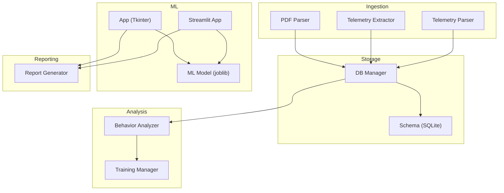
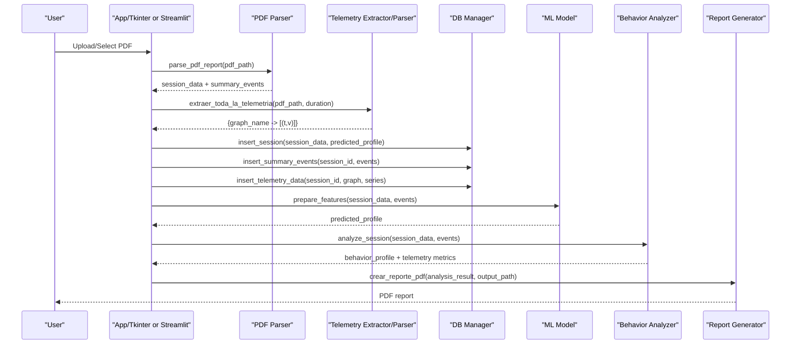
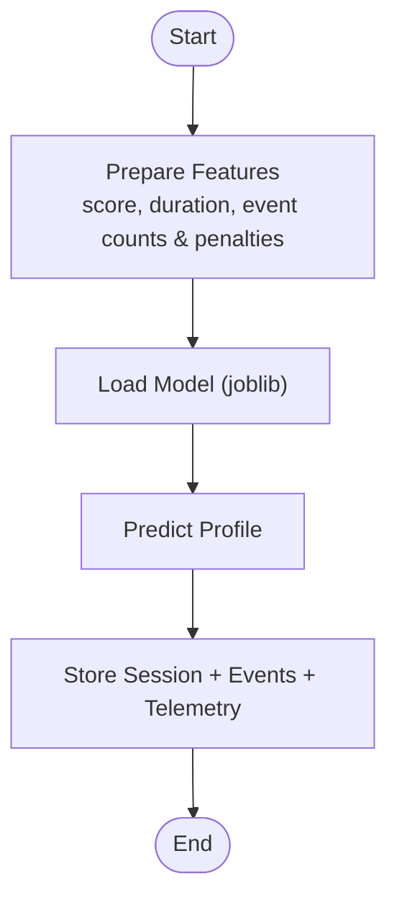
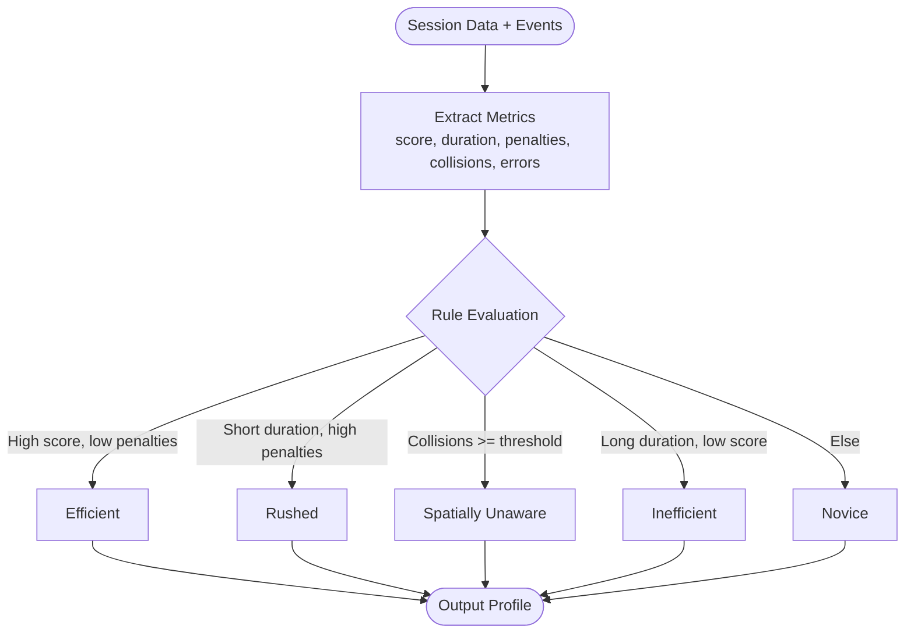
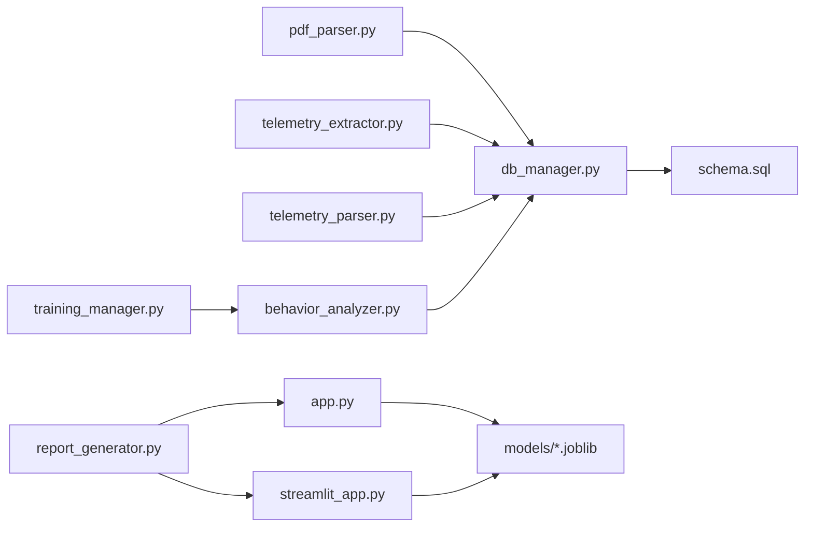

# Behavioral Analysis System

<cite>
**Referenced Files in This Document**
- [behavior_analyzer.py](file://core/behavior_analyzer.py)
- [training_manager.py](file://core/training_manager.py)
- [db_manager.py](file://core/db_manager.py)
- [telemetry_extractor.py](file://core/telemetry_extractor.py)
- [telemetry_parser.py](file://core/telemetry_parser.py)
- [pdf_parser.py](file://core/pdf_parser.py)
- [report_generator.py](file://core/report_generator.py)
- [app.py](file://app.py)
- [streamlit_app.py](file://streamlit_app.py)
- [main.py](file://main.py)
- [schema.sql](file://database/schema.sql)
- [requirements.txt](file://requirements.txt)
</cite>

## Table of Contents
1. Introduction
2. Project Structure
3. Core Components
4. Architecture Overview
5. Detailed Component Analysis
6. Dependency Analysis
7. Performance Considerations
8. Troubleshooting Guide
9. Conclusion
10. Appendices

## Introduction
This document describes the Behavioral Analysis System that integrates machine learning model inference with operator classification and behavior profiling. It explains how PDF reports are parsed, telemetry is extracted and stored, features are engineered for ML predictions, and operators are classified into behavior types (efficient, rushed, novice, expert-like). It also covers scoring algorithms, thresholds, confidence considerations, custom rules, retraining procedures, evaluation metrics, database integration for historical analysis, model versioning, A/B testing strategies, and debugging tools to improve classification accuracy.

## Project Structure
The system is organized into modular components:
- Data ingestion and parsing: PDF parsing and telemetry extraction
- Storage and retrieval: SQLite schema and DB utilities
- Feature engineering and ML pipeline: feature preparation and model loading/inference
- Behavior analysis: rule-based classification and detailed telemetry analytics
- Training management: operator evaluation and personalized training paths
- Reporting and visualization: text/PDF reports and interactive UIs (Tkinter and Streamlit)
- Orchestration: CLI ETL pipeline driven by a manifest file

**Diagram sources**
- [pdf_parser.py:27-57](file://core/pdf_parser.py#L27-L57)
- [telemetry_extractor.py:202-238](file://core/telemetry_extractor.py#L202-L238)
- [telemetry_parser.py:125-154](file://core/telemetry_parser.py#L125-L154)
- [db_manager.py:106-152](file://core/db_manager.py#L106-L152)
- [behavior_analyzer.py:26-67](file://core/behavior_analyzer.py#L26-L67)
- [training_manager.py:7-40](file://core/training_manager.py#L7-L40)
- [app.py:514-569](file://app.py#L514-L569)
- [streamlit_app.py:69-110](file://streamlit_app.py#L69-L110)
- [report_generator.py:28-75](file://core/report_generator.py#L28-L75)

**Section sources**
- [main.py:22-43](file://main.py#L22-L43)
- [schema.sql:14-59](file://database/schema.sql#L14-L59)

## Core Components
- PDF parser extracts session metadata and summary events from report PDFs.
- Telemetry extractor/parser retrieves time-series data from charts in PDFs and calibrates them to real units.
- DB manager provides connection handling and CRUD operations for sessions, events, and telemetry series.
- Behavior analyzer implements rule-based classification and detailed telemetry analytics (braking, steering, acceleration, fork height, tilt, speed).
- Training manager evaluates operators based on latest session and generates personalized training paths.
- Apps (Tkinter and Streamlit) orchestrate ML model loading, prediction, storage, visualization, and reporting.
- Report generator produces professional PDF reports for individual sessions and evolution comparisons.

**Section sources**
- [pdf_parser.py:27-124](file://core/pdf_parser.py#L27-L124)
- [telemetry_extractor.py:202-238](file://core/telemetry_extractor.py#L202-L238)
- [telemetry_parser.py:16-72](file://core/telemetry_parser.py#L16-L72)
- [db_manager.py:23-91](file://core/db_manager.py#L23-L91)
- [behavior_analyzer.py:26-167](file://core/behavior_analyzer.py#L26-L167)
- [training_manager.py:7-63](file://core/training_manager.py#L7-L63)
- [app.py:514-569](file://app.py#L514-L569)
- [streamlit_app.py:54-110](file://streamlit_app.py#L54-L110)
- [report_generator.py:28-149](file://core/report_generator.py#L28-L149)

## Architecture Overview
End-to-end flow:
- Ingest PDF reports via CLI or UI.
- Parse session data and summary events; extract telemetry series.
- Store all data in SQLite (sessions, events, telemetry).
- Engineer features from session data and events; load ML model; predict operator profile.
- Apply rule-based behavior analysis for detailed insights and recommendations.
- Generate reports and visualizations; support evolution tracking across sessions.

**Diagram sources**
- [app.py:514-569](file://app.py#L514-L569)
- [streamlit_app.py:69-110](file://streamlit_app.py#L69-L110)
- [pdf_parser.py:27-57](file://core/pdf_parser.py#L27-L57)
- [telemetry_parser.py:125-154](file://core/telemetry_parser.py#L125-L154)
- [db_manager.py:106-152](file://core/db_manager.py#L106-L152)
- [behavior_analyzer.py:36-67](file://core/behavior_analyzer.py#L36-L67)
- [report_generator.py:28-75](file://core/report_generator.py#L28-L75)

## Detailed Component Analysis

### Machine Learning Model Integration and Prediction Pipeline
- Feature preparation:
  - Uses session score and duration plus event counts and penalties per event type to build a feature vector aligned with the trained model’s expected columns.
  - Safely fills missing columns with zeros to ensure compatibility with different model versions.
- Model loading and inference:
  - Loads a joblib model from models/modelo_clasificador.joblib.
  - Predicts operator profile (e.g., efficient, rushed, novice, etc.).
- Confidence levels:
  - The current code uses point predictions; if the model supports predict_proba, confidence can be derived from probability outputs.
- Versioning and A/B testing:
  - Maintain multiple model files (e.g., v1, v2) and switch via configuration or environment variables.
  - For A/B testing, route incoming requests to different model versions and compare outcomes using stored labels and metrics.

**Diagram sources**
- [app.py:549-569](file://app.py#L549-L569)
- [streamlit_app.py:54-90](file://streamlit_app.py#L54-L90)

**Section sources**
- [app.py:514-569](file://app.py#L514-L569)
- [streamlit_app.py:69-110](file://streamlit_app.py#L69-L110)

### Feature Engineering Processes
- Features include:
  - Final score and session duration.
  - Per-event-type counts and penalties aggregated from summary events.
- Alignment with model expectations:
  - Dynamically builds DataFrame columns matching model.feature_names_in_ to avoid mismatches.
  - Fills missing values with zero to maintain robustness.

**Section sources**
- [app.py:549-569](file://app.py#L549-L569)
- [streamlit_app.py:54-67](file://streamlit_app.py#L54-L67)

### Behavior Profiling Algorithms
- Rule-based classifier:
  - Classifies into profiles based on score, duration, penalties, collisions, and errors.
  - Profiles include efficient, rushed, spatially unaware, inefficient, and novice.
- Thresholds:
  - Score threshold, duration threshold, collision threshold, error threshold are configurable within the analyzer.
- Telemetry analytics:
  - Counts abrupt braking, steering corrections, acceleration spikes, fork height adjustments, tilt adjustments, and speed incidents.
  - Computes coverage of telemetry data relative to session duration.

**Diagram sources**
- [behavior_analyzer.py:26-67](file://core/behavior_analyzer.py#L26-L67)

**Section sources**
- [behavior_analyzer.py:26-167](file://core/behavior_analyzer.py#L26-L167)

### Operator Classification System
- Combines ML prediction and rule-based analysis:
  - ML predicts primary profile used for training path generation.
  - Rule-based analysis refines insights and provides actionable feedback.
- Recommendations:
  - Each profile maps to tailored training exercises and guidance.

**Section sources**
- [training_manager.py:7-63](file://core/training_manager.py#L7-L63)
- [behavior_analyzer.py:26-67](file://core/behavior_analyzer.py#L26-L67)

### Scoring Algorithms, Threshold Configurations, and Confidence Levels
- Scoring:
  - Derived from session score and event penalties/rewards; thresholds determine classification.
- Thresholds:
  - Configurable in BehaviorAnalyzer (score, duration, collision, error thresholds).
- Confidence:
  - If model exposes probabilities, compute confidence from predicted class probability; otherwise rely on deterministic predictions.

**Section sources**
- [behavior_analyzer.py:29-34](file://core/behavior_analyzer.py#L29-L34)
- [app.py:549-569](file://app.py#L549-L569)

### Examples of Custom Behavior Rules
- Braking: count rate-of-change exceeding threshold to detect harsh braking.
- Steering: count rapid direction changes to identify overcorrections.
- Acceleration: count sharp accelerations beyond threshold.
- Fork height and tilt: detect sign changes in velocity to count micro-adjustments.
- Speed: compute mean/max speed and count incidents above threshold.

**Section sources**
- [behavior_analyzer.py:95-147](file://core/behavior_analyzer.py#L95-L147)

### Model Retraining Procedures
- Data collection:
  - Persist sessions, events, and telemetry in SQLite for historical analysis.
- Labeling:
  - Use labeled profiles from manifest or manual review to create ground truth.
- Feature alignment:
  - Ensure new datasets match model feature names; handle missing features gracefully.
- Training loop:
  - Train model (e.g., scikit-learn), save as joblib with feature_names_in_ attribute.
  - Validate performance before deployment.
- Deployment:
  - Replace model file in models directory; update app configurations if needed.

[No sources needed since this section provides general guidance]

### Performance Evaluation Metrics
- Classification metrics:
  - Accuracy, precision, recall, F1-score per class; confusion matrix for multi-class.
- Regression-style metrics (if applicable):
  - MAE/RMSE for continuous scores.
- Operational metrics:
  - Throughput (sessions per minute), latency (parsing + inference time), storage growth (telemetry series size).
- Drift detection:
  - Monitor feature distributions over time to detect data drift impacting model performance.

[No sources needed since this section provides general guidance]

### Database Integration for Historical Analysis and Trend Tracking
- Schema:
  - Sessions table stores session metadata and predicted profile.
  - ResumenEventos stores aggregated event counts, rewards, and penalties.
  - Telemetria stores time-series data for each chart per session.
- Queries:
  - Retrieve telemetry series for specific graphs and sessions.
  - Track operator progress across sessions by comparing scores and profiles.
- Indexes:
  - Optimized indexes on operator name, profile, and session foreign keys.

**Section sources**
- [schema.sql:14-59](file://database/schema.sql#L14-L59)
- [db_manager.py:36-91](file://core/db_manager.py#L36-L91)

### Model Versioning, A/B Testing Capabilities, and Debugging Tools
- Model versioning:
  - Store multiple model files (e.g., modelo_v1.joblib, modelo_v2.joblib); select via config or environment variable.
- A/B testing:
  - Route traffic to different models; log predictions and user interactions; evaluate outcomes using stored labels and metrics.
- Debugging:
  - Visualize telemetry curves per graph; export reports; inspect coverage analysis to validate data completeness.
  - Use UI overlays and debug outputs to diagnose extraction issues.

**Section sources**
- [app.py:514-569](file://app.py#L514-L569)
- [streamlit_app.py:69-110](file://streamlit_app.py#L69-L110)
- [behavior_analyzer.py:170-205](file://core/behavior_analyzer.py#L170-L205)

## Dependency Analysis
Key dependencies and relationships:
- PDF parsing depends on pdfplumber and regex patterns to extract structured data.
- Telemetry extraction uses OpenCV and color ranges to isolate curves; calibration maps pixel coordinates to real-world units.
- DB manager abstracts SQLite connections and provides safe insertion of sessions, events, and telemetry.
- Behavior analyzer relies on session data and events; optional telemetry analytics enrich insights.
- Apps integrate ML model inference and orchestrate the full pipeline.

**Diagram sources**
- [pdf_parser.py:27-57](file://core/pdf_parser.py#L27-L57)
- [telemetry_extractor.py:202-238](file://core/telemetry_extractor.py#L202-L238)
- [telemetry_parser.py:125-154](file://core/telemetry_parser.py#L125-L154)
- [db_manager.py:106-152](file://core/db_manager.py#L106-L152)
- [behavior_analyzer.py:26-67](file://core/behavior_analyzer.py#L26-L67)
- [training_manager.py:7-40](file://core/training_manager.py#L7-L40)
- [app.py:514-569](file://app.py#L514-L569)
- [streamlit_app.py:69-110](file://streamlit_app.py#L69-L110)
- [report_generator.py:28-75](file://core/report_generator.py#L28-L75)

**Section sources**
- [requirements.txt:1-61](file://requirements.txt#L1-L61)

## Performance Considerations
- Parsing efficiency:
  - Limit PDF pages processed; cache parsed results when possible.
- Telemetry extraction:
  - Optimize color masks and morphological operations; precompute calibration ranges.
- Database operations:
  - Batch inserts for events and telemetry; use transactions to reduce overhead.
- ML inference:
  - Minimize feature construction overhead; reuse feature column lists from model metadata.
- Visualization:
  - Downsample large telemetry series for rendering; lazy-load plots.

[No sources needed since this section provides general guidance]

## Troubleshooting Guide
Common issues and resolutions:
- Missing model file:
  - Ensure models/modelo_clasificador.joblib exists; provide clear error messages and fallbacks.
- No telemetry data:
  - Verify PDF structure and page indices; check color ranges and calibration parameters.
- Database errors:
  - Validate schema; ensure connections are properly managed; rollback on failures.
- Feature mismatch:
  - Align DataFrame columns with model.feature_names_in_; fill missing values safely.
- Coverage gaps:
  - Analyze telemetry coverage percentage per graph; flag incomplete sessions.

**Section sources**
- [app.py:526-531](file://app.py#L526-L531)
- [telemetry_parser.py:125-154](file://core/telemetry_parser.py#L125-L154)
- [db_manager.py:23-33](file://core/db_manager.py#L23-L33)
- [behavior_analyzer.py:170-205](file://core/behavior_analyzer.py#L170-L205)

## Conclusion
The Behavioral Analysis System integrates PDF parsing, telemetry extraction, SQLite storage, ML-based classification, and rule-based behavior profiling to deliver actionable insights and personalized training paths. It supports robust feature engineering, configurable thresholds, comprehensive reporting, and extensibility for model versioning and A/B testing. With careful attention to performance and troubleshooting, it enables effective operator evaluation and continuous improvement.

## Appendices

### API and Entry Points
- CLI ETL pipeline:
  - main.py orchestrates manifest-driven processing, parsing, and storage.
- Interactive UIs:
  - app.py provides Tkinter-based interface for single-session analysis and evolution comparison.
  - streamlit_app.py offers web-based interface for upload, analysis, visualization, and comparison.

**Section sources**
- [main.py:22-43](file://main.py#L22-L43)
- [app.py:308-584](file://app.py#L308-L584)
- [streamlit_app.py:138-202](file://streamlit_app.py#L138-L202)

### Configuration and Dependencies
- Requirements:
  - Libraries include scikit-learn, joblib, pandas, numpy, opencv-python, pdfplumber, fpdf, customtkinter, streamlit, and others.
- Paths:
  - Database at database/titan.db; models at models/modelo_clasificador.joblib; reports at data/reports; exports at data/exports.

**Section sources**
- [requirements.txt:1-61](file://requirements.txt#L1-L61)
- [app.py:356-369](file://app.py#L356-L369)
- [streamlit_app.py:32-48](file://streamlit_app.py#L32-L48)