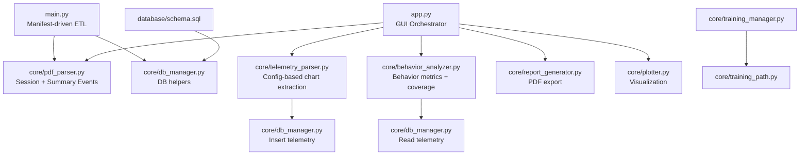
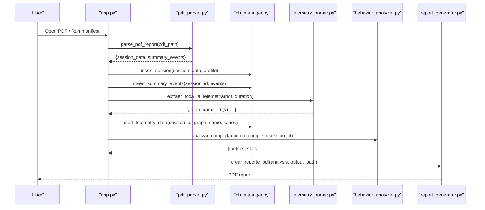
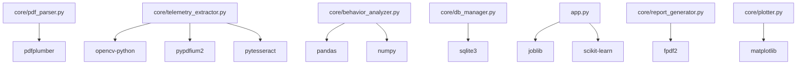

# Core Processing Engine

<cite>
**Referenced Files in This Document**
- [main.py](file://main.py)
- [app.py](file://app.py)
- [core/pdf_parser.py](file://core/pdf_parser.py)
- [core/telemetry_extractor.py](file://core/telemetry_extractor.py)
- [core/telemetry_parser.py](file://core/telemetry_parser.py)
- [core/behavior_analyzer.py](file://core/behavior_analyzer.py)
- [core/training_manager.py](file://core/training_manager.py)
- [core/training_path.py](file://core/training_path.py)
- [core/db_manager.py](file://core/db_manager.py)
- [database/schema.sql](file://database/schema.sql)
- [requirements.txt](file://requirements.txt)
</cite>

## Table of Contents
1. Introduction
2. Project Structure
3. Core Components
4. Architecture Overview
5. Detailed Component Analysis
6. Dependency Analysis
7. Performance Considerations
8. Troubleshooting Guide
9. Conclusion
10. Appendices

## Introduction
This document describes the core processing engine of Proyecto Titán with a focus on the main business logic modules. It explains how PDF reports are parsed, how telemetry is extracted and calibrated, how behavior analysis and operator classification work, and how training management generates personalized learning paths. It also provides API references for each module, integration points between stages, error handling patterns, and guidance for extending the pipeline with new analysis types or custom parsing rules.

## Project Structure
The system is organized into modular components under core/, orchestration scripts at the root, and a SQLite database schema. Key responsibilities:
- PDF parsing and session metadata extraction
- Telemetry extraction from PDF charts (two strategies: image-based OCR/heuristics and page/image-index based calibration)
- Behavior analysis and operator classification using rule-based heuristics and optional ML model inference
- Training management that recommends learning paths based on operator profiles
- Database persistence for sessions, events, and telemetry series
- CLI and GUI entry points to run the full pipeline

**Diagram sources**
- [main.py:22-196](file://main.py#L22-L196)
- [app.py:308-589](file://app.py#L308-L589)
- [core/pdf_parser.py:27-124](file://core/pdf_parser.py#L27-L124)
- [core/telemetry_parser.py:125-154](file://core/telemetry_parser.py#L125-L154)
- [core/behavior_analyzer.py:150-167](file://core/behavior_analyzer.py#L150-L167)
- [core/db_manager.py:106-152](file://core/db_manager.py#L106-L152)
- [database/schema.sql:14-59](file://database/schema.sql#L14-L59)

**Section sources**
- [main.py:22-196](file://main.py#L22-L196)
- [app.py:308-589](file://app.py#L308-L589)
- [core/pdf_parser.py:27-124](file://core/pdf_parser.py#L27-L124)
- [core/telemetry_parser.py:125-154](file://core/telemetry_parser.py#L125-L154)
- [core/behavior_analyzer.py:150-167](file://core/behavior_analyzer.py#L150-L167)
- [core/db_manager.py:106-152](file://core/db_manager.py#L106-L152)
- [database/schema.sql:14-59](file://database/schema.sql#L14-L59)

## Core Components
- PDF Parser: Extracts session metadata and summary events from PDF reports using regex-based text extraction and locale-aware date parsing.
- Telemetry Extraction: Two complementary strategies:
  - Image-based OCR and color segmentation with fallback heuristics to identify and calibrate chart series.
  - Config-driven extraction targeting specific pages and images with pixel-to-real-value calibration.
- Behavior Analyzer: Computes behavioral metrics from session data and summary events; classifies operators into profiles; analyzes telemetry series for braking, steering, acceleration, fork height, tilt, and speed.
- Training Management: Evaluates operators by retrieving latest session and events, classifying behavior, and generating personalized training paths with recommendations.
- Database Manager: Provides connection management and CRUD operations for sessions, events, and telemetry series.

**Section sources**
- [core/pdf_parser.py:27-124](file://core/pdf_parser.py#L27-L124)
- [core/telemetry_extractor.py:202-239](file://core/telemetry_extractor.py#L202-L239)
- [core/telemetry_parser.py:125-154](file://core/telemetry_parser.py#L125-L154)
- [core/behavior_analyzer.py:26-68](file://core/behavior_analyzer.py#L26-L68)
- [core/training_manager.py:7-82](file://core/training_manager.py#L7-L82)
- [core/db_manager.py:13-152](file://core/db_manager.py#L13-L152)

## Architecture Overview
The processing pipeline integrates multiple stages:
- Ingestion: Manifest-driven batch processing or single-file GUI processing.
- Parsing: PDF text extraction yields session metadata and summary events.
- Telemetry: Chart images are segmented and calibrated to time-series data.
- Storage: Session, events, and telemetry are persisted in SQLite.
- Analysis: Behavior metrics are computed; operator profile is assigned via rules or ML model.
- Reporting: Textual summaries and PDF exports are generated; interactive plots are rendered.

**Diagram sources**
- [app.py:411-547](file://app.py#L411-L547)
- [core/pdf_parser.py:27-124](file://core/pdf_parser.py#L27-L124)
- [core/telemetry_parser.py:125-154](file://core/telemetry_parser.py#L125-L154)
- [core/behavior_analyzer.py:150-167](file://core/behavior_analyzer.py#L150-L167)
- [core/db_manager.py:106-152](file://core/db_manager.py#L106-L152)

## Detailed Component Analysis

### PDF Processing Pipeline
Responsibilities:
- Extract session metadata (operator name, class, exercise, start time, duration, final score).
- Extract consolidated results table rows as summary events (type, total_events, rewards, penalties).
- Normalize dates and durations; handle locale issues.

Key behaviors:
- Uses pdfplumber to read text from the first page.
- Applies regex patterns to capture fields robustly.
- Returns None on critical failures; logs errors for diagnostics.

API reference:
- parse_pdf_report(pdf_path: str) -> Optional[Dict]
  - Parameters:
    - pdf_path: Absolute or relative path to the PDF report.
  - Returns:
    - Dict with keys:
      - session_data: Dict containing operator/class/exercise/time/score/duration/file origin.
      - summary_events: List of dicts with type, total_events, rewards, penalties.
    - None if parsing fails or required fields are missing.
  - Errors:
    - Exceptions during PDF reading or parsing are caught; returns None and prints an error message.

Error handling and recovery:
- Locale setup attempts to set en_US.UTF-8; falls back gracefully.
- Date parsing tolerates minor formatting differences; invalid dates become None.
- Duration parsing converts HH:MM:SS to seconds; invalid values become None.

Extension points:
- Add new regex patterns in REGEX_PATTERNS to extract additional fields.
- Extend _extract_session_data to map new fields into session_data.
- Extend _extract_summary_events to parse additional table columns.

**Section sources**
- [core/pdf_parser.py:11-25](file://core/pdf_parser.py#L11-L25)
- [core/pdf_parser.py:27-57](file://core/pdf_parser.py#L27-L57)
- [core/pdf_parser.py:66-124](file://core/pdf_parser.py#L66-L124)

### Telemetry Extraction Strategies
Two complementary strategies exist:

1) Image-based OCR and color segmentation (fallback-oriented):
- Detects candidate chart regions via color masking and morphological operations.
- Uses OCR near chart titles to infer metric names; falls back to heuristics based on value ranges and series characteristics.
- Calibrates pixel coordinates to real-world units using predefined Y ranges and total duration.

API reference:
- extraer_telemetria_visual(ruta_pdf: str, duracion_total_segundos: int) -> Dict[str, Optional[List[Tuple[float, float]]]]
  - Parameters:
    - ruta_pdf: Path to the PDF file.
    - duracion_total_segundos: Total session duration in seconds for X-axis scaling.
  - Returns:
    - Mapping from graph name to list of (time, value) tuples; None if extraction fails for a given graph.
  - Errors:
    - Missing images or OCR failures result in None entries; debug outputs saved to debug_outputs.

2) Config-driven extraction (page and image index based):
- Centralized GRAPH_CONFIGS defines page numbers, image indices, color masks, and calibration ranges per metric.
- Extracts curves by masking purple-colored lines and mapping pixel coordinates to real values.

API reference:
- extraer_toda_la_telemetria(pdf_path: str, total_duration_seconds: int) -> Dict[str, Optional[List[Tuple[float, float]]]]
  - Parameters:
    - pdf_path: Path to the PDF file.
    - total_duration_seconds: Total session duration in seconds.
  - Returns:
    - Mapping from graph name to list of (time, value) tuples; None if extraction fails for a given graph.
  - Errors:
    - Missing pages or images return None for that graph; exceptions are caught and logged.

Calibration and validation:
- Pixel-to-time scaling uses chart width mapped to total duration.
- Pixel-to-value scaling uses configured min/max ranges per metric; values are clamped to valid ranges.
- Deduplication and overlap checks avoid duplicate chart detections.

Extension points:
- Add new metrics by adding entries to GRAPH_CONFIGS with appropriate page, image_index, color bounds, and calibration ranges.
- Extend fallback heuristics in _fallback_assign to improve unknown chart identification.

**Section sources**
- [core/telemetry_extractor.py:11-19](file://core/telemetry_extractor.py#L11-L19)
- [core/telemetry_extractor.py:58-92](file://core/telemetry_extractor.py#L58-L92)
- [core/telemetry_extractor.py:104-131](file://core/telemetry_extractor.py#L104-L131)
- [core/telemetry_extractor.py:142-177](file://core/telemetry_extractor.py#L142-L177)
- [core/telemetry_extractor.py:181-239](file://core/telemetry_extractor.py#L181-L239)
- [core/telemetry_parser.py:16-72](file://core/telemetry_parser.py#L16-L72)
- [core/telemetry_parser.py:81-123](file://core/telemetry_parser.py#L81-L123)
- [core/telemetry_parser.py:125-154](file://core/telemetry_parser.py#L125-L154)

### Behavior Analysis System
Responsibilities:
- Compute metrics from session data and summary events.
- Classify operator behavior into profiles using rule-based thresholds.
- Analyze telemetry series for operational indicators (braking, steering, acceleration, fork height, tilt, speed).
- Assess telemetry coverage completeness.

Key algorithms:
- Metric extraction aggregates penalties, rewards, collisions, and errors from summary events.
- Classification applies thresholds for score, duration, collision count, and error count to assign a BehaviorProfile.
- Telemetry analysis computes rates of change and counts anomalies (e.g., harsh braking, sharp turns).
- Coverage analysis calculates percentage of session duration covered by each telemetry series.

API reference:
- BehaviorAnalyzer.analyze_session(session_data: Dict, summary_events: List[Dict]) -> BehaviorProfile
  - Parameters:
    - session_data: Parsed session metadata including score and duration.
    - summary_events: Consolidated results events.
  - Returns:
    - BehaviorProfile enum value indicating operator behavior.
- analizar_comportamiento_completo(id_sesion: int) -> Dict[str, Any]
  - Parameters:
    - id_sesion: Session ID to analyze.
  - Returns:
    - Dict with metrics like harsh braking count, steering corrections, acceleration spikes, fork/tilt adjustments, and speed statistics.
- analizar_cobertura_telemetria(id_sesion: int, duracion_total: int) -> Dict[str, float]
  - Parameters:
    - id_sesion: Session ID.
    - duracion_total: Total session duration in seconds.
  - Returns:
    - Mapping from graph name to coverage percentage (0–100).

Error handling:
- Database queries catch sqlite3.Error and return empty results when data is missing or malformed.
- Series parsing handles ValueError/IndexError gracefully.

Extension points:
- Adjust thresholds in profile_thresholds to refine classification.
- Add new telemetry analyses by implementing functions similar to existing ones and integrating them into el orquestador function.

**Section sources**
- [core/behavior_analyzer.py:16-68](file://core/behavior_analyzer.py#L16-L68)
- [core/behavior_analyzer.py:71-147](file://core/behavior_analyzer.py#L71-L147)
- [core/behavior_analyzer.py:150-167](file://core/behavior_analyzer.py#L150-L167)
- [core/behavior_analyzer.py:170-205](file://core/behavior_analyzer.py#L170-L205)

### Training Management System
Responsibilities:
- Retrieve latest session and events for an operator.
- Classify behavior and generate personalized training paths.
- Provide recommendations based on operator profile.

API reference:
- TrainingManager.evaluate_operator(operator_name: str) -> Optional[Dict]
  - Parameters:
    - operator_name: Name of the operator to evaluate.
  - Returns:
    - Dict with operator, profile, last_session, training_path, recommendation; None if no sessions found.
- TrainingPath.generate_path(profile: BehaviorProfile, current_level: int = 1) -> List[Dict]
  - Parameters:
    - profile: BehaviorProfile from behavior analysis.
    - current_level: Optional level for future scalability.
  - Returns:
    - List of exercises with name, description, duration, difficulty.

Error handling:
- Database access uses context manager to ensure connections are closed.
- Recommendations default to generic advice if profile is unrecognized.

Integration points:
- Uses db_manager to fetch sessions and events.
- Integrates with behavior_analyzer for classification.
- Produces structured training plans consumable by UI or reporting modules.

**Section sources**
- [core/training_manager.py:7-82](file://core/training_manager.py#L7-L82)
- [core/training_path.py:5-86](file://core/training_path.py#L5-L86)
- [core/db_manager.py:23-33](file://core/db_manager.py#L23-L33)

### Data Validation and Cleaning
- PDF parser validates presence of required fields; returns None if essential data is missing.
- Telemetry extraction validates series length and point counts; filters out low-quality extractions.
- Calibration ensures values fall within expected ranges; timestamps are non-negative.
- Database insertion functions validate inputs and rollback on errors.

Error handling patterns:
- Try/except blocks around PDF reading, OCR, and database operations.
- Logging/print statements for diagnostics without breaking flow.
- Graceful degradation: missing data leads to None or zeroed metrics rather than crashes.

**Section sources**
- [core/pdf_parser.py:27-57](file://core/pdf_parser.py#L27-L57)
- [core/telemetry_extractor.py:142-177](file://core/telemetry_extractor.py#L142-L177)
- [core/telemetry_parser.py:81-123](file://core/telemetry_parser.py#L81-L123)
- [core/db_manager.py:106-152](file://core/db_manager.py#L106-L152)

### Integration Points and Data Flow
- main.py orchestrates manifest-driven ETL: validates structure, loads manifest, processes PDFs, inserts sessions and events.
- app.py orchestrates GUI workflow: parses PDF, runs ML classification (if model exists), extracts telemetry, persists data, analyzes behavior, renders plots, exports PDFs.
- db_manager centralizes database interactions; schema defines tables and indexes for performance.

Data flow:
- PDF -> Parser -> Session + Events -> DB
- PDF -> Telemetry Extractors -> Calibrated Series -> DB
- DB -> Behavior Analyzer -> Metrics -> Reports/Exports
- DB -> Training Manager -> Learning Paths -> UI/Reports

**Section sources**
- [main.py:22-196](file://main.py#L22-L196)
- [app.py:411-547](file://app.py#L411-L547)
- [core/db_manager.py:106-152](file://core/db_manager.py#L106-L152)
- [database/schema.sql:14-59](file://database/schema.sql#L14-L59)

## Dependency Analysis
External dependencies relevant to core processing:
- pdfplumber: PDF text extraction.
- opencv-python, pypdfium2, pytesseract: Image processing, PDF rendering, OCR for telemetry extraction.
- pandas, numpy: Data manipulation and numerical computations.
- sqlite3: Database persistence.
- joblib, scikit-learn: ML model loading and prediction (used in GUI for classification).
- matplotlib, fpdf2: Plotting and PDF report generation.

**Diagram sources**
- [requirements.txt:1-61](file://requirements.txt#L1-L61)
- [core/pdf_parser.py:4-9](file://core/pdf_parser.py#L4-L9)
- [core/telemetry_extractor.py:3-10](file://core/telemetry_extractor.py#L3-L10)
- [core/behavior_analyzer.py:4-9](file://core/behavior_analyzer.py#L4-L9)
- [core/db_manager.py:4-7](file://core/db_manager.py#L4-L7)
- [app.py:17-42](file://app.py#L17-L42)

**Section sources**
- [requirements.txt:1-61](file://requirements.txt#L1-L61)

## Performance Considerations
- PDF parsing is lightweight but can be slow on large documents; consider caching parsed results if reprocessing frequently.
- Telemetry extraction involves image processing and OCR; optimize by limiting pages processed and reducing scale factors where possible.
- Database writes use batched inserts for events; ensure proper indexing (already present) to maintain query performance.
- Behavior analysis reads stored telemetry; consider precomputing derived metrics for repeated queries.
- ML model loading occurs once per GUI session; reuse the loaded model across predictions.

[No sources needed since this section provides general guidance]

## Troubleshooting Guide
Common issues and resolutions:
- PDF parsing returns None:
  - Verify PDF contains expected fields; check regex patterns and locale settings.
  - Ensure PDF is not password-protected or scanned images without OCR layers.
- Telemetry extraction yields None for graphs:
  - Check page numbers and image indices in GRAPH_CONFIGS; verify chart colors and visibility.
  - Inspect debug_outputs for cropped images and overlays to diagnose detection failures.
- Behavior analysis shows unexpected profiles:
  - Review thresholds in profile_thresholds; adjust based on domain knowledge.
  - Validate summary events and telemetry coverage; incomplete data skews metrics.
- Database errors:
  - Confirm schema initialization; run setup_database.py if tables are missing.
  - Check constraints and foreign keys; ensure session IDs match between tables.

**Section sources**
- [core/pdf_parser.py:27-57](file://core/pdf_parser.py#L27-L57)
- [core/telemetry_extractor.py:58-92](file://core/telemetry_extractor.py#L58-L92)
- [core/behavior_analyzer.py:170-205](file://core/behavior_analyzer.py#L170-L205)
- [core/db_manager.py:13-33](file://core/db_manager.py#L13-L33)
- [database/schema.sql:14-59](file://database/schema.sql#L14-L59)

## Conclusion
The core processing engine integrates PDF parsing, telemetry extraction, behavior analysis, and training management into a cohesive pipeline. It supports both batch and interactive workflows, offers robust error handling, and provides clear extension points for adding new analysis types or custom parsing rules. The modular design facilitates maintenance and scalability while delivering actionable insights for operator skill assessment and learning path recommendations.

[No sources needed since this section summarizes without analyzing specific files]

## Appendices

### API References Summary
- PDF Parser
  - parse_pdf_report(pdf_path) -> Optional[Dict]
- Telemetry Extractor
  - extraer_telemetria_visual(ruta_pdf, duracion_total_segundos) -> Dict[str, Optional[List[Tuple[float, float]]]]
  - extraer_toda_la_telemetria(pdf_path, total_duration_seconds) -> Dict[str, Optional[List[Tuple[float, float]]]]
- Behavior Analyzer
  - BehaviorAnalyzer.analyze_session(session_data, summary_events) -> BehaviorProfile
  - analizar_comportamiento_completo(id_sesion) -> Dict[str, Any]
  - analizar_cobertura_telemetria(id_sesion, duracion_total) -> Dict[str, float]
- Training Manager
  - TrainingManager.evaluate_operator(operator_name) -> Optional[Dict]
  - TrainingPath.generate_path(profile, current_level=1) -> List[Dict]
- Database Manager
  - get_db_connection(db_path) -> ContextManager
  - insert_session(connection, parsed_data, perfil_operador) -> Optional[int]
  - insert_summary_events(connection, session_id, summary_events) -> None
  - insert_telemetry_data(connection, session_id, graph_name, calibrated_data) -> None
  - get_telemetry_for_graph(id_sesion, graph_name, conn=None, db_path=None) -> Optional[List[Tuple[float, float]]]

**Section sources**
- [core/pdf_parser.py:27-124](file://core/pdf_parser.py#L27-L124)
- [core/telemetry_extractor.py:202-239](file://core/telemetry_extractor.py#L202-L239)
- [core/telemetry_parser.py:125-154](file://core/telemetry_parser.py#L125-L154)
- [core/behavior_analyzer.py:26-68](file://core/behavior_analyzer.py#L26-L68)
- [core/behavior_analyzer.py:150-167](file://core/behavior_analyzer.py#L150-L167)
- [core/behavior_analyzer.py:170-205](file://core/behavior_analyzer.py#L170-L205)
- [core/training_manager.py:7-82](file://core/training_manager.py#L7-L82)
- [core/training_path.py:5-86](file://core/training_path.py#L5-L86)
- [core/db_manager.py:23-152](file://core/db_manager.py#L23-L152)

### Extending the Processing Pipeline
To add a new analysis type or custom parsing rule:
- For PDF fields:
  - Add a new regex pattern in REGEX_PATTERNS.
  - Map the captured group in _extract_session_data to a new field in session_data.
- For telemetry metrics:
  - Add a new entry to GRAPH_CONFIGS with page, image_index, color bounds, and calibration ranges.
  - Implement a new analysis function in behavior_analyzer to compute metrics from the series.
  - Integrate the function into analizar_comportamiento_completo to include it in the consolidated output.
- For training paths:
  - Add new exercises to the exercise catalog in TrainingPath.
  - Define a new path generator method and map it to a BehaviorProfile in generate_path.

**Section sources**
- [core/pdf_parser.py:11-25](file://core/pdf_parser.py#L11-L25)
- [core/pdf_parser.py:66-92](file://core/pdf_parser.py#L66-L92)
- [core/telemetry_parser.py:16-72](file://core/telemetry_parser.py#L16-L72)
- [core/behavior_analyzer.py:150-167](file://core/behavior_analyzer.py#L150-L167)
- [core/training_path.py:24-86](file://core/training_path.py#L24-L86)