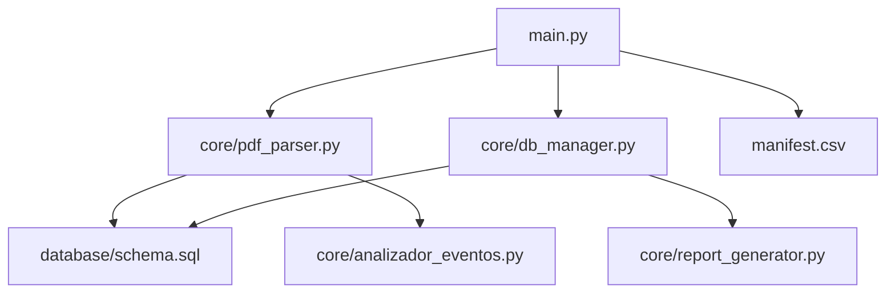
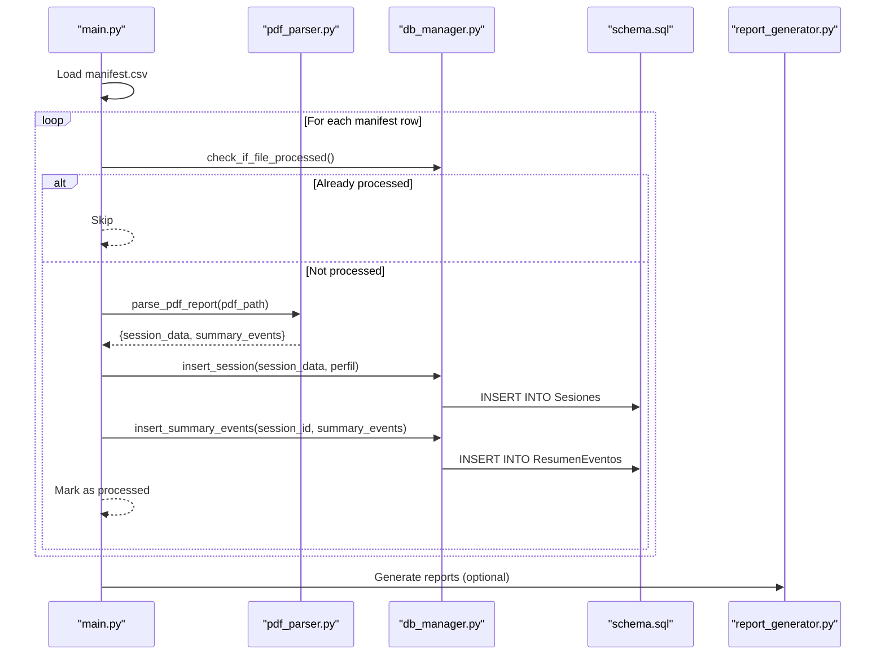
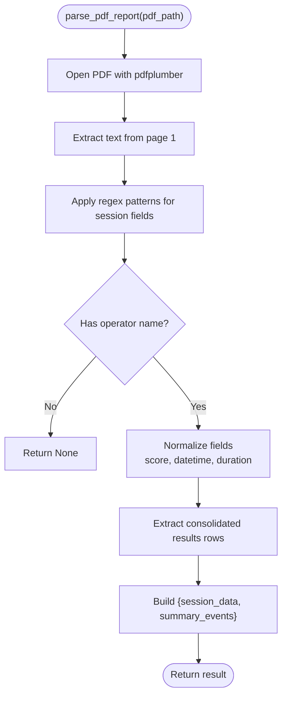
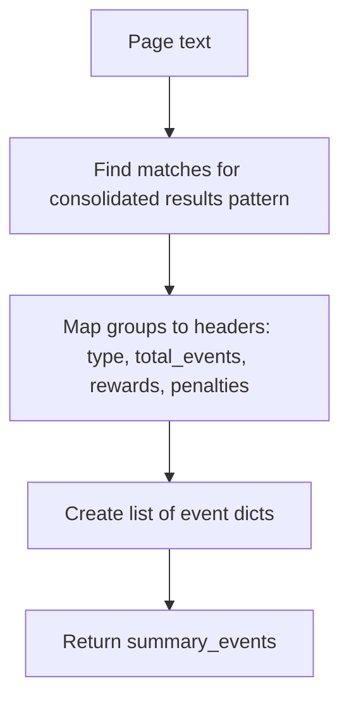
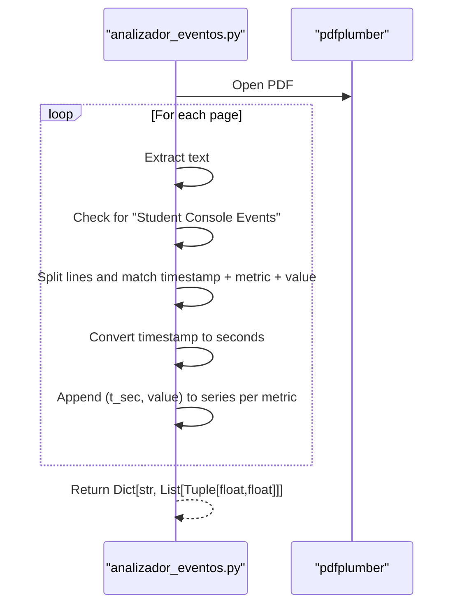
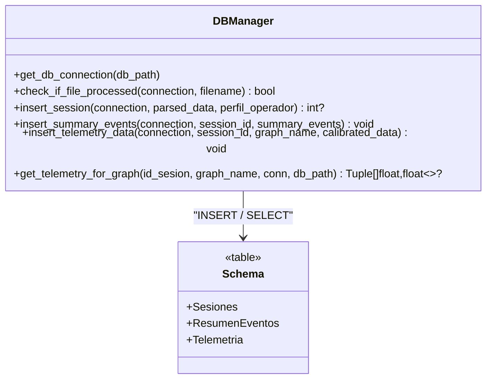
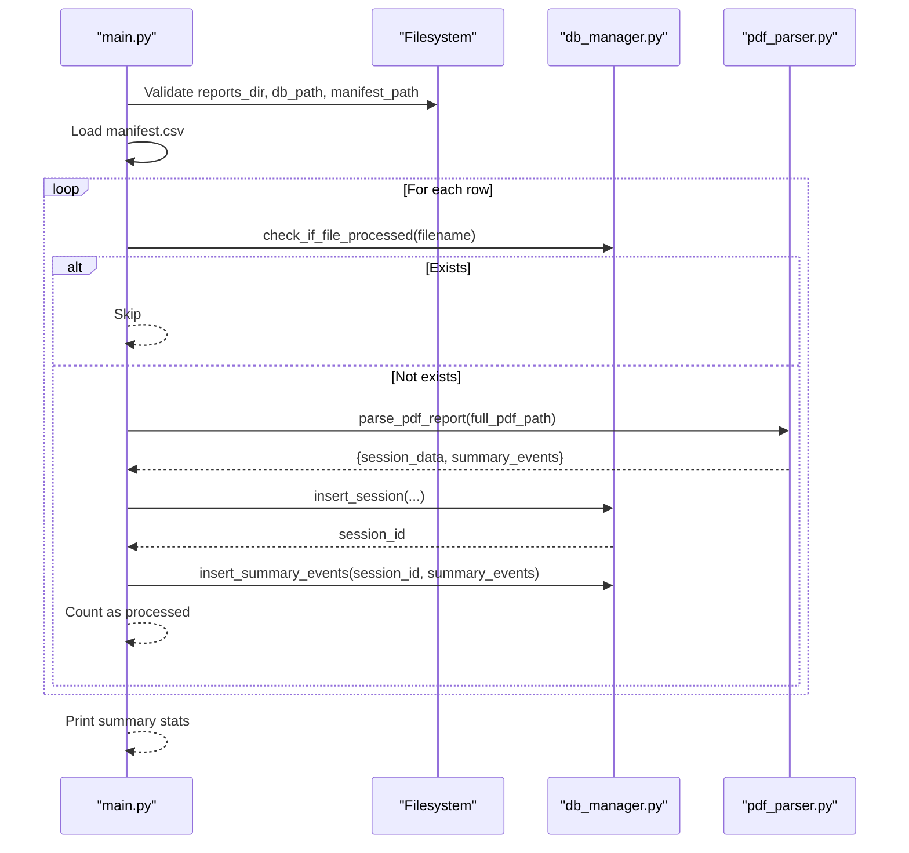
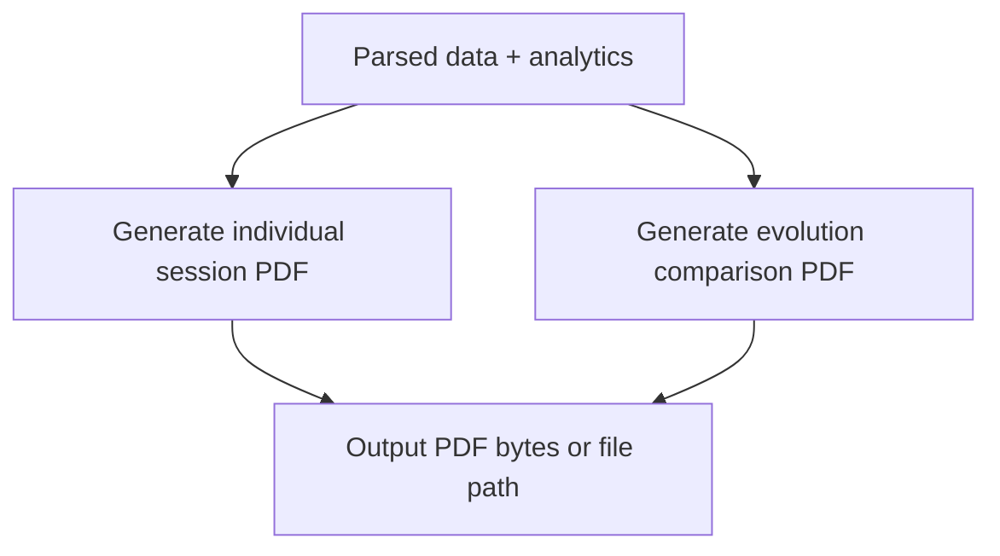
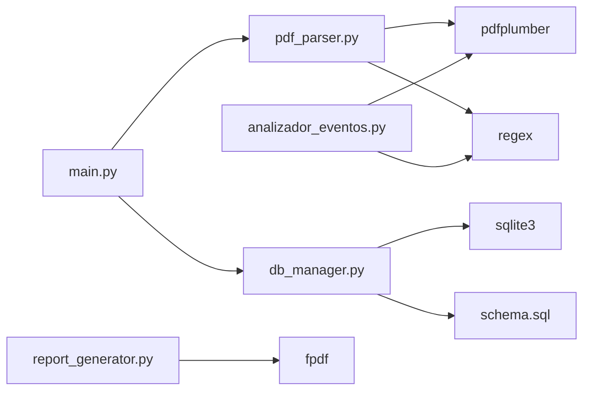

# PDF Processing Pipeline

<cite>
**Referenced Files in This Document**
- [pdf_parser.py](file://core/pdf_parser.py)
- [analizador_eventos.py](file://core/analizador_eventos.py)
- [db_manager.py](file://core/db_manager.py)
- [schema.sql](file://database/schema.sql)
- [main.py](file://main.py)
- [manifest.csv](file://manifest.csv)
- [report_generator.py](file://core/report_generator.py)
</cite>

## Table of Contents
1. [Introduction](#introduction)
2. [Project Structure](#project-structure)
3. [Core Components](#core-components)
4. [Architecture Overview](#architecture-overview)
5. [Detailed Component Analysis](#detailed-component-analysis)
6. [Dependency Analysis](#dependency-analysis)
7. [Performance Considerations](#performance-considerations)
8. [Troubleshooting Guide](#troubleshooting-guide)
9. [Conclusion](#conclusion)
10. [Appendices](#appendices)

## Introduction
This document describes the PDF processing pipeline that extracts and parses training reports into structured session data and event summaries. It focuses on:
- PDF parsing using pdfplumber
- Regex-based pattern matching for text extraction
- Data validation and normalization (dates, durations, scores)
- Consolidated results table parsing for event summaries
- Error handling strategies and locale configuration for date parsing
- Fallback mechanisms for malformed or incomplete PDFs
- Return data structures, field mappings, and integration with downstream components (database storage and reporting)

The pipeline is orchestrated by a manifest-driven ETL process that iterates over a CSV manifest to locate and process PDF reports, persisting parsed results into a SQLite database.

## Project Structure
At a high level, the pipeline consists of:
- Entry point and orchestration: main.py reads manifest.csv and drives processing
- PDF parsing: core/pdf_parser.py extracts session metadata and consolidated events from PDFs
- Event telemetry extraction: core/analizador_eventos.py parses raw console events for time-series metrics
- Database persistence: core/db_manager.py persists sessions, summary events, and telemetry
- Schema definition: database/schema.sql defines tables for sessions, summary events, and telemetry
- Reporting: core/report_generator.py generates PDF reports from analyzed data

**Diagram sources**
- [main.py:1-196](file://main.py#L1-L196)
- [pdf_parser.py:1-124](file://core/pdf_parser.py#L1-L124)
- [db_manager.py:1-152](file://core/db_manager.py#L1-L152)
- [schema.sql:1-59](file://database/schema.sql#L1-L59)
- [manifest.csv:1-20](file://manifest.csv#L1-L20)
- [analizador_eventos.py:1-65](file://core/analizador_eventos.py#L1-L65)
- [report_generator.py:1-149](file://core/report_generator.py#L1-L149)

**Section sources**
- [main.py:1-196](file://main.py#L1-L196)
- [manifest.csv:1-20](file://manifest.csv#L1-L20)

## Core Components
- PDF Parser: Extracts session-level fields (operator name, class name, exercise name, score, start time, duration) and consolidated event summaries using regex patterns against extracted page text.
- Event Analyzer: Parses raw console events from PDFs into time-value series for further analysis.
- Database Manager: Persists parsed session data and summary events; provides helpers to check duplicates and retrieve telemetry series.
- Orchestration: Reads manifest.csv, validates environment, processes each PDF, and aggregates statistics.
- Reporting: Generates individual and evolution PDF reports from processed data.

Key responsibilities and interactions are detailed in subsequent sections.

**Section sources**
- [pdf_parser.py:1-124](file://core/pdf_parser.py#L1-L124)
- [analizador_eventos.py:1-65](file://core/analizador_eventos.py#L1-L65)
- [db_manager.py:1-152](file://core/db_manager.py#L1-L152)
- [main.py:1-196](file://main.py#L1-L196)
- [report_generator.py:1-149](file://core/report_generator.py#L1-L149)

## Architecture Overview
The end-to-end flow:
1. main.py loads manifest.csv and validates required directories and database existence.
2. For each row, it checks if the PDF has already been processed.
3. It calls parse_pdf_report to extract session_data and summary_events.
4. On success, it inserts session data and summary events into the database via db_manager.
5. Optional downstream steps can use analizador_eventos to extract raw console events for telemetry graphs.
6. Reports can be generated using report_generator based on stored data.

**Diagram sources**
- [main.py:100-176](file://main.py#L100-L176)
- [pdf_parser.py:27-57](file://core/pdf_parser.py#L27-L57)
- [db_manager.py:106-139](file://core/db_manager.py#L106-L139)
- [schema.sql:14-39](file://database/schema.sql#L14-L39)
- [report_generator.py:28-75](file://core/report_generator.py#L28-L75)

## Detailed Component Analysis

### PDF Parser: Session Data Extraction
The parser uses pdfplumber to open the PDF and extract text from the first page. It applies a set of regex patterns to capture:
- Operator name
- Class name
- Exercise name
- Duration (HH:MM:SS)
- Final score
- Start timestamp (with AM/PM)
It also extracts consolidated results rows representing event summaries.

Data normalization:
- Scores are parsed to float with fallback to 0.0
- Timestamps are cleaned and parsed to a standardized format
- Duration strings are converted to total seconds
- Missing operator name causes early termination for that file

Locale configuration:
- Attempts to set locale for date parsing; failures are ignored to ensure robustness.

Error handling:
- Exceptions during PDF opening or parsing are caught and logged; function returns None to signal failure.

Return structure:
- session_data: dictionary with normalized fields
- summary_events: list of dictionaries with type, total_events, rewards, penalties

**Diagram sources**
- [pdf_parser.py:27-57](file://core/pdf_parser.py#L27-L57)
- [pdf_parser.py:66-101](file://core/pdf_parser.py#L66-L101)
- [pdf_parser.py:103-124](file://core/pdf_parser.py#L103-L124)

**Section sources**
- [pdf_parser.py:1-124](file://core/pdf_parser.py#L1-L124)

### Consolidated Results Table Parsing
The parser identifies lines matching a multi-line pattern to extract:
- type: event category
- total_events: count of events
- rewards: reward metric
- penalties: penalty metric

These rows are mapped to a list of dictionaries and persisted to the ResumenEventos table.

**Diagram sources**
- [pdf_parser.py:21-25](file://core/pdf_parser.py#L21-L25)
- [pdf_parser.py:94-101](file://core/pdf_parser.py#L94-L101)

**Section sources**
- [pdf_parser.py:21-25](file://core/pdf_parser.py#L21-L25)
- [pdf_parser.py:94-101](file://core/pdf_parser.py#L94-L101)

### Raw Console Events Extraction
The analyzer opens the PDF and scans pages for a specific section header. It then parses lines containing timestamps and numeric values into time-value series per metric.

**Diagram sources**
- [analizador_eventos.py:49-64](file://core/analizador_eventos.py#L49-L64)

**Section sources**
- [analizador_eventos.py:1-65](file://core/analizador_eventos.py#L1-L65)

### Database Integration and Persistence
The database manager provides:
- Connection management with context manager
- Duplicate detection by filename
- Insertion of session data into Sesiones
- Insertion of summary events into ResumenEventos
- Telemetry insertion and retrieval helpers

Schema includes:
- Sesiones: stores session metadata and operator profile
- ResumenEventos: stores aggregated event counts and metrics
- Telemetria: stores time-series data for graphs

**Diagram sources**
- [db_manager.py:23-33](file://core/db_manager.py#L23-L33)
- [db_manager.py:100-152](file://core/db_manager.py#L100-L152)
- [schema.sql:14-59](file://database/schema.sql#L14-L59)

**Section sources**
- [db_manager.py:1-152](file://core/db_manager.py#L1-L152)
- [schema.sql:1-59](file://database/schema.sql#L1-L59)

### Orchestration and Manifest-Driven Processing
main.py:
- Validates directory structure and database presence
- Loads manifest.csv and verifies required columns
- Iterates through rows, skipping already processed files
- Calls parse_pdf_report and persists results
- Aggregates and prints processing statistics

**Diagram sources**
- [main.py:44-67](file://main.py#L44-L67)
- [main.py:69-98](file://main.py#L69-L98)
- [main.py:100-176](file://main.py#L100-L176)
- [pdf_parser.py:27-57](file://core/pdf_parser.py#L27-L57)
- [db_manager.py:100-139](file://core/db_manager.py#L100-L139)

**Section sources**
- [main.py:1-196](file://main.py#L1-L196)
- [manifest.csv:1-20](file://manifest.csv#L1-L20)

### Reporting Generation
report_generator.py creates professional PDF reports:
- Individual session diagnosis including operator, class, final score, behavior profile, recommended route, and telemetry metrics
- Evolution report comparing initial and final states with comparative tables and verdicts

**Diagram sources**
- [report_generator.py:28-75](file://core/report_generator.py#L28-L75)
- [report_generator.py:80-147](file://core/report_generator.py#L80-L147)

**Section sources**
- [report_generator.py:1-149](file://core/report_generator.py#L1-L149)

## Dependency Analysis
- main.py depends on pdf_parser, db_manager, and manifest.csv
- pdf_parser depends on pdfplumber and uses regex patterns for extraction
- db_manager depends on sqlite3 and schema.sql
- analizador_eventos depends on pdfplumber and regex for console events
- report_generator depends on fpdf for output generation

**Diagram sources**
- [main.py:1-196](file://main.py#L1-L196)
- [pdf_parser.py:1-124](file://core/pdf_parser.py#L1-L124)
- [db_manager.py:1-152](file://core/db_manager.py#L1-L152)
- [analizador_eventos.py:1-65](file://core/analizador_eventos.py#L1-L65)
- [report_generator.py:1-149](file://core/report_generator.py#L1-L149)

**Section sources**
- [main.py:1-196](file://main.py#L1-L196)
- [pdf_parser.py:1-124](file://core/pdf_parser.py#L1-L124)
- [db_manager.py:1-152](file://core/db_manager.py#L1-L152)
- [analizador_eventos.py:1-65](file://core/analizador_eventos.py#L1-L65)
- [report_generator.py:1-149](file://core/report_generator.py#L1-L149)

## Performance Considerations
- PDF text extraction is performed only on the first page for session data; additional pages may be scanned for console events when needed.
- Regex matching is applied once per pattern; keep patterns concise to minimize backtracking.
- Database operations are batched where possible (e.g., executemany for summary events).
- Locale setup is attempted once; failures are ignored to avoid overhead.
- Avoid repeated file I/O by caching paths and validating existence upfront.

[No sources needed since this section provides general guidance]

## Troubleshooting Guide
Common issues and resolutions:
- Missing operator name: The parser requires an operator name to consider session data valid; ensure the PDF contains the expected label and text.
- Date parsing failures: If locale en_US.UTF-8 is unavailable, date parsing falls back gracefully; verify input format matches expected patterns.
- Malformed consolidated results: If regex does not match rows, summary_events will be empty; inspect PDF layout and adjust patterns accordingly.
- Duplicate processing: The system skips files already present in the database; remove entries or rename files to reprocess.
- Database connection errors: Ensure the database file exists and schema is initialized before running the pipeline.

Operational tips:
- Validate manifest.csv columns and presence of PDF files prior to execution.
- Use tests to verify manifest structure and database schema integrity.
- Inspect logs for critical errors during PDF parsing and database insertion.

**Section sources**
- [pdf_parser.py:27-57](file://core/pdf_parser.py#L27-L57)
- [pdf_parser.py:109-124](file://core/pdf_parser.py#L109-L124)
- [main.py:44-67](file://main.py#L44-L67)
- [tests/test_manifest.py:7-60](file://tests/test_manifest.py#L7-L60)

## Conclusion
The PDF processing pipeline provides a robust mechanism to extract training report data, normalize it, and persist it for downstream analysis and reporting. It leverages pdfplumber for text extraction, regex for pattern matching, and SQLite for reliable storage. The manifest-driven orchestration ensures scalable batch processing with clear error handling and logging. Extensions can be added by introducing new regex patterns and corresponding database fields, enabling adaptation to evolving PDF formats.

[No sources needed since this section summarizes without analyzing specific files]

## Appendices

### Field Mappings and Return Structures
- Session data fields:
  - nombre_operador: string
  - nombre_clase: string
  - nombre_ejercicio: string
  - nombre_archivo_origen: string
  - puntaje_final: float
  - fecha_hora_inicio: string (normalized timestamp)
  - duracion_segundos: integer (seconds)
- Summary events fields:
  - type: string
  - total_events: integer
  - rewards: float
  - penalties: float

These fields map directly to database columns in Sesiones and ResumenEventos.

**Section sources**
- [pdf_parser.py:82-90](file://core/pdf_parser.py#L82-L90)
- [pdf_parser.py:94-101](file://core/pdf_parser.py#L94-L101)
- [db_manager.py:106-139](file://core/db_manager.py#L106-L139)
- [schema.sql:14-39](file://database/schema.sql#L14-L39)

### Custom Regex Patterns and Extension Points
- Current patterns target labels such as operator name, class name, exercise name, duration, score, start time, and consolidated results rows.
- To support new PDF formats:
  - Add new keys to REGEX_PATTERNS with appropriate patterns
  - Extend _extract_session_data to handle new fields
  - Update database schema and insertion logic if necessary
  - Adjust _parse_* helpers for new formats (e.g., alternative date or duration formats)

**Section sources**
- [pdf_parser.py:12-25](file://core/pdf_parser.py#L12-L25)
- [pdf_parser.py:66-92](file://core/pdf_parser.py#L66-L92)
- [schema.sql:14-59](file://database/schema.sql#L14-L59)

### Downstream Integration Notes
- Telemetry series can be retrieved via get_telemetry_for_graph for visualization.
- Reports can be generated using report_generator functions to produce individual and evolution PDFs.
- Tests validate manifest structure and database schema readiness.

**Section sources**
- [db_manager.py:36-90](file://core/db_manager.py#L36-L90)
- [report_generator.py:28-147](file://core/report_generator.py#L28-L147)
- [tests/test_manifest.py:7-110](file://tests/test_manifest.py#L7-L110)