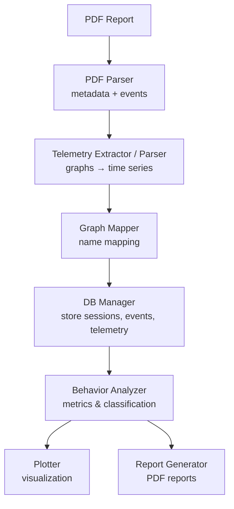
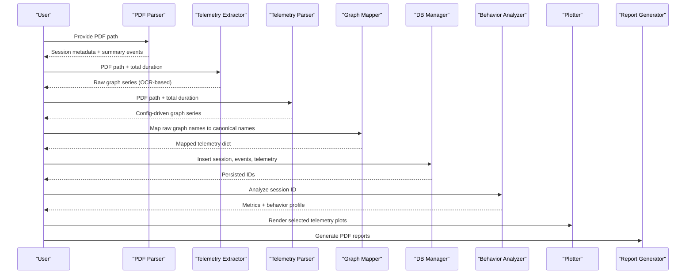
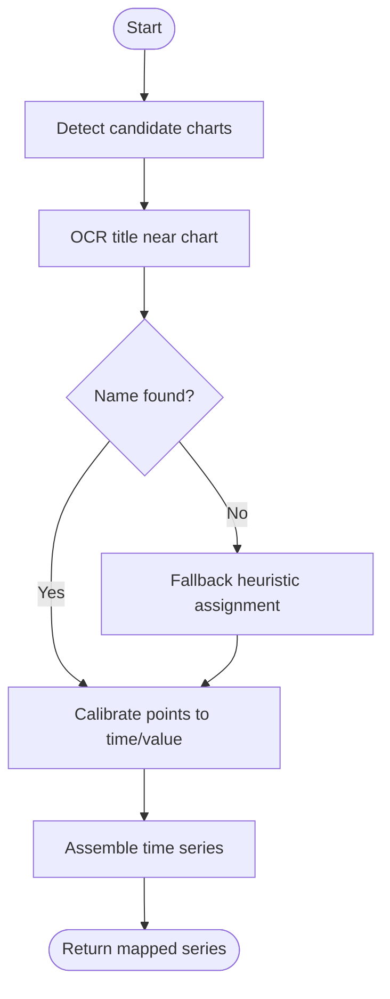
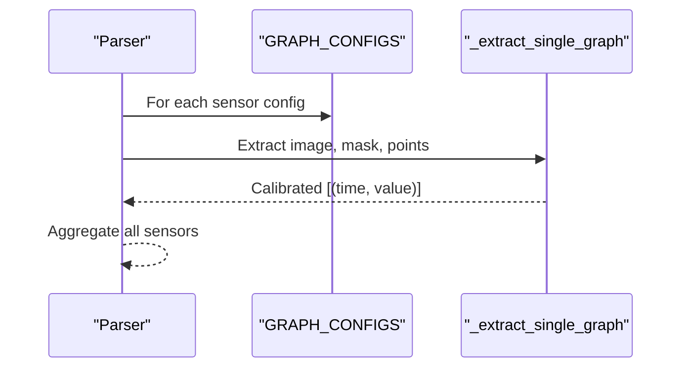
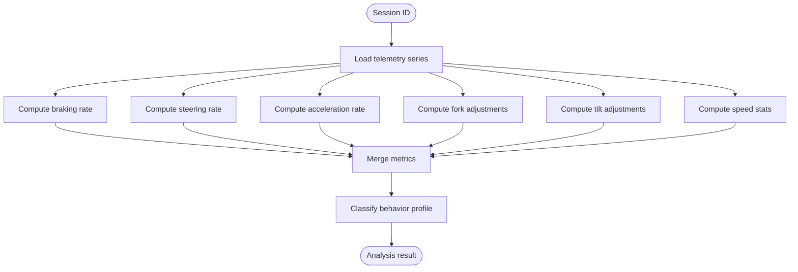
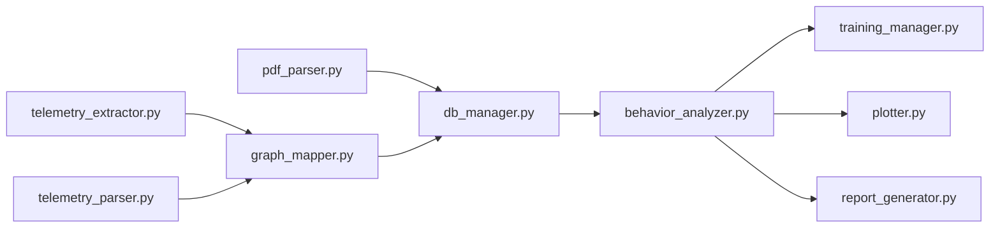

# Telemetry Processing

<cite>
**Referenced Files in This Document**
- [telemetry_extractor.py](file://core/telemetry_extractor.py)
- [telemetry_parser.py](file://core/telemetry_parser.py)
- [pdf_parser.py](file://core/pdf_parser.py)
- [db_manager.py](file://core/db_manager.py)
- [behavior_analyzer.py](file://core/behavior_analyzer.py)
- [graph_mapper.py](file://core/graph_mapper.py)
- [plotter.py](file://core/plotter.py)
- [training_manager.py](file://core/training_manager.py)
- [report_generator.py](file://core/report_generator.py)
- [schema.sql](file://database/schema.sql)
- [mapeo.json](file://mapeo.json)
</cite>

## Table of Contents
1. [Introduction](#introduction)
2. [Project Structure](#project-structure)
3. [Core Components](#core-components)
4. [Architecture Overview](#architecture-overview)
5. [Detailed Component Analysis](#detailed-component-analysis)
6. [Dependency Analysis](#dependency-analysis)
7. [Performance Considerations](#performance-considerations)
8. [Troubleshooting Guide](#troubleshooting-guide)
9. [Conclusion](#conclusion)
10. [Appendices](#appendices)

## Introduction
This document explains the telemetry processing system that extracts, validates, normalizes, and analyzes sensor data from training session reports. It covers:
- The extraction pipeline for raw sensor graphs (PDF-based), including timestamp alignment, cleaning, and normalization.
- Parsing mechanisms for multiple sensor types with format validation and quality assessment.
- Performance metrics derived from telemetry such as speed analysis, braking patterns, acceleration profiles, and operational efficiency indicators.
- Custom parsers, transformation pipelines, and visualization preparation.
- Integration with plotting systems, streaming considerations, and historical analysis.
- Data retention policies, compression strategies, and performance optimization for large datasets.

## Project Structure
The telemetry subsystem is implemented across several modules:
- PDF parsing and metadata extraction
- Graph extraction and calibration to time-series
- Mapping and normalization of graph names
- Storage in a relational database
- Behavior analysis and metric computation
- Visualization and reporting

**Diagram sources**
- [pdf_parser.py:27-57](file://core/pdf_parser.py#L27-L57)
- [telemetry_extractor.py:202-238](file://core/telemetry_extractor.py#L202-L238)
- [telemetry_parser.py:125-154](file://core/telemetry_parser.py#L125-L154)
- [graph_mapper.py:13-31](file://core/graph_mapper.py#L13-L31)
- [db_manager.py:106-151](file://core/db_manager.py#L106-L151)
- [behavior_analyzer.py:150-167](file://core/behavior_analyzer.py#L150-L167)
- [plotter.py:15-69](file://core/plotter.py#L15-L69)
- [report_generator.py:28-75](file://core/report_generator.py#L28-L75)

**Section sources**
- [pdf_parser.py:27-57](file://core/pdf_parser.py#L27-L57)
- [schema.sql:14-58](file://database/schema.sql#L14-L58)

## Core Components
- PDF Parser: Extracts session metadata and summary events from the first page of the report.
- Telemetry Extractors: Two complementary approaches:
  - OCR-based visual extraction from PDF pages using color segmentation and curve tracing.
  - Config-driven extraction targeting specific images on known pages.
- Graph Mapper: Normalizes extracted graph keys to canonical sensor names via a JSON mapping.
- Database Manager: Persists sessions, event summaries, and telemetry time series; provides retrieval utilities.
- Behavior Analyzer: Computes metrics (braking, steering, acceleration, fork height, tilt, speed) and classifies operator behavior.
- Plotter: Renders telemetry time series into UI canvases.
- Training Manager: Orchestrates evaluation by combining session data, behavior profile, and recommended training path.
- Report Generator: Produces individual and evolution PDF reports summarizing analysis results.

**Section sources**
- [pdf_parser.py:27-57](file://core/pdf_parser.py#L27-L57)
- [telemetry_extractor.py:202-238](file://core/telemetry_extractor.py#L202-L238)
- [telemetry_parser.py:125-154](file://core/telemetry_parser.py#L125-L154)
- [graph_mapper.py:13-31](file://core/graph_mapper.py#L13-L31)
- [db_manager.py:36-87](file://core/db_manager.py#L36-L87)
- [behavior_analyzer.py:95-167](file://core/behavior_analyzer.py#L95-L167)
- [plotter.py:15-69](file://core/plotter.py#L15-L69)
- [training_manager.py:15-40](file://core/training_manager.py#L15-L40)
- [report_generator.py:28-75](file://core/report_generator.py#L28-L75)

## Architecture Overview
End-to-end flow from PDF to insights:

**Diagram sources**
- [pdf_parser.py:27-57](file://core/pdf_parser.py#L27-L57)
- [telemetry_extractor.py:202-238](file://core/telemetry_extractor.py#L202-L238)
- [telemetry_parser.py:125-154](file://core/telemetry_parser.py#L125-L154)
- [graph_mapper.py:13-31](file://core/graph_mapper.py#L13-L31)
- [db_manager.py:106-151](file://core/db_manager.py#L106-L151)
- [behavior_analyzer.py:150-167](file://core/behavior_analyzer.py#L150-L167)
- [plotter.py:15-69](file://core/plotter.py#L15-L69)
- [report_generator.py:28-75](file://core/report_generator.py#L28-L75)

## Detailed Component Analysis

### PDF Metadata and Event Extraction
- Parses session-level fields (operator name, class, exercise, start time, duration, score).
- Extracts consolidated event counts and rewards/penalties for later behavior analysis.
- Provides robust fallbacks for locale and date parsing.

Key responsibilities:
- Regex-based field extraction.
- Duration conversion to seconds.
- Summary event aggregation.

**Section sources**
- [pdf_parser.py:27-57](file://core/pdf_parser.py#L27-L57)
- [pdf_parser.py:66-124](file://core/pdf_parser.py#L66-L124)

### Telemetry Extraction Pipeline (OCR-based)
- Detects candidate chart regions using color thresholding and morphological operations.
- Uses OCR near each candidate to infer the sensor type; falls back to heuristics when OCR fails.
- Traces curves by color segmentation and computes pixel-to-time/value calibration.
- Outputs per-sensor time series aligned to total session duration.

Processing steps:
1. Candidate detection via HSV mask and bounding boxes.
2. Title OCR and keyword matching to sensor names.
3. Curve extraction by finding top-most pixels per column.
4. Calibration to real-world units and timestamps.
5. Deduplication and best-series selection per sensor.

**Diagram sources**
- [telemetry_extractor.py:58-92](file://core/telemetry_extractor.py#L58-L92)
- [telemetry_extractor.py:104-131](file://core/telemetry_extractor.py#L104-L131)
- [telemetry_extractor.py:142-177](file://core/telemetry_extractor.py#L142-L177)
- [telemetry_extractor.py:181-198](file://core/telemetry_extractor.py#L181-L198)
- [telemetry_extractor.py:202-238](file://core/telemetry_extractor.py#L202-L238)

**Section sources**
- [telemetry_extractor.py:58-92](file://core/telemetry_extractor.py#L58-L92)
- [telemetry_extractor.py:104-131](file://core/telemetry_extractor.py#L104-L131)
- [telemetry_extractor.py:142-177](file://core/telemetry_extractor.py#L142-L177)
- [telemetry_extractor.py:181-198](file://core/telemetry_extractor.py#L181-L198)
- [telemetry_extractor.py:202-238](file://core/telemetry_extractor.py#L202-L238)

### Telemetry Extraction Pipeline (Config-driven)
- Targets specific images on known pages using a central configuration dictionary.
- Applies color masking to isolate curves and maps pixel coordinates to time and value ranges.
- Returns calibrated time series per configured sensor.

Key aspects:
- Centralized GRAPH_CONFIGS defines page, image index, color bounds, and calibration ranges.
- Single-graph extractor handles cropping, masking, point collection, and scaling.
- Orchestration iterates all configured graphs and aggregates results.

**Diagram sources**
- [telemetry_parser.py:16-72](file://core/telemetry_parser.py#L16-L72)
- [telemetry_parser.py:81-123](file://core/telemetry_parser.py#L81-L123)
- [telemetry_parser.py:125-154](file://core/telemetry_parser.py#L125-L154)

**Section sources**
- [telemetry_parser.py:16-72](file://core/telemetry_parser.py#L16-L72)
- [telemetry_parser.py:81-123](file://core/telemetry_parser.py#L81-L123)
- [telemetry_parser.py:125-154](file://core/telemetry_parser.py#L125-L154)

### Graph Name Mapping and Validation
- Loads a JSON mapping to translate internal graph identifiers to canonical sensor names.
- Validates presence and non-empty series before inclusion.

Use cases:
- Standardize outputs from different extractors.
- Prepare consistent keys for downstream storage and analysis.

**Section sources**
- [graph_mapper.py:1-31](file://core/graph_mapper.py#L1-L31)
- [mapeo.json:1-27](file://mapeo.json#L1-L27)

### Data Storage and Retrieval
- Stores session metadata, event summaries, and telemetry series in SQLite tables.
- Telemetry series are stored as comma-separated strings of timestamps and values.
- Retrieval function parses these strings into aligned time-value pairs, ensuring length consistency.

Data model highlights:
- Sessions table captures high-level info and operator profile.
- ResumenEventos stores aggregated event counts and rewards/penalties.
- Telemetria stores per-sensor time series linked to sessions.

**Section sources**
- [db_manager.py:106-151](file://core/db_manager.py#L106-L151)
- [db_manager.py:36-87](file://core/db_manager.py#L36-L87)
- [schema.sql:14-58](file://database/schema.sql#L14-L58)

### Behavior Analysis and Metric Computation
- Reads telemetry series from the database and computes:
  - Braking intensity (rate of change thresholds).
  - Steering corrections (steering rate of change).
  - Acceleration spikes (accelerator rate of change).
  - Fork height micro-adjustments (sign changes in derivative).
  - Tilt angle micro-adjustments (sign changes in derivative).
  - Speed statistics (mean, max, incident count above threshold).
- Aggregates into a comprehensive analysis result for a session.

Quality assessment:
- Coverage analysis measures how much of the total session duration is covered by each sensor’s last timestamp.

**Diagram sources**
- [behavior_analyzer.py:95-167](file://core/behavior_analyzer.py#L95-L167)
- [behavior_analyzer.py:170-205](file://core/behavior_analyzer.py#L170-L205)

**Section sources**
- [behavior_analyzer.py:95-167](file://core/behavior_analyzer.py#L95-L167)
- [behavior_analyzer.py:170-205](file://core/behavior_analyzer.py#L170-L205)

### Visualization and Reporting
- Plotting module renders telemetry time series into UI frames with dark theme styling.
- Report generator produces PDFs summarizing session diagnosis, behavior profile, recommended training path, and telemetry analysis metrics.

Integration points:
- Plotter consumes lists of timestamps and values.
- Reports consume analysis results and session info.

**Section sources**
- [plotter.py:15-69](file://core/plotter.py#L15-L69)
- [report_generator.py:28-75](file://core/report_generator.py#L28-L75)

### Training Management and Recommendations
- Orchestrates evaluation by retrieving latest session, analyzing behavior, generating personalized training paths, and producing recommendations.

**Section sources**
- [training_manager.py:15-40](file://core/training_manager.py#L15-L40)
- [training_path.py:11-22](file://core/training_path.py#L11-L22)
- [training_path.py:24-86](file://core/training_path.py#L24-L86)

## Dependency Analysis
High-level dependencies among core modules:

**Diagram sources**
- [pdf_parser.py:27-57](file://core/pdf_parser.py#L27-L57)
- [telemetry_extractor.py:202-238](file://core/telemetry_extractor.py#L202-L238)
- [telemetry_parser.py:125-154](file://core/telemetry_parser.py#L125-L154)
- [graph_mapper.py:13-31](file://core/graph_mapper.py#L13-L31)
- [db_manager.py:36-87](file://core/db_manager.py#L36-L87)
- [behavior_analyzer.py:150-167](file://core/behavior_analyzer.py#L150-L167)
- [training_manager.py:15-40](file://core/training_manager.py#L15-L40)
- [plotter.py:15-69](file://core/plotter.py#L15-L69)
- [report_generator.py:28-75](file://core/report_generator.py#L28-L75)

**Section sources**
- [graph_mapper.py:13-31](file://core/graph_mapper.py#L13-L31)
- [db_manager.py:36-87](file://core/db_manager.py#L36-L87)
- [behavior_analyzer.py:150-167](file://core/behavior_analyzer.py#L150-L167)

## Performance Considerations
- Image processing:
  - Color thresholding and morphological operations are efficient but can be tuned (kernel size, thresholds) to reduce false positives and improve curve detection.
  - Downsampling or region-of-interest cropping can reduce OCR and contour costs.
- OCR:
  - Adaptive binarization improves text recognition; consider caching OCR results per page to avoid reprocessing.
- Calibration:
  - Ensure accurate pixel-to-real mappings; validate against known chart axes to minimize systematic errors.
- Database:
  - Use indexes on foreign keys and frequently queried columns (already present for sessions and telemetry).
  - Batch inserts for event summaries and telemetry where possible.
- Large datasets:
  - Store telemetry as compressed strings or chunked arrays if series become very long.
  - Consider partitioning by session or time windows for faster queries.
- Real-time streaming:
  - Current design is batch-oriented; for streaming, introduce a queue and incremental updates to the database and UI.

[No sources needed since this section provides general guidance]

## Troubleshooting Guide
Common issues and resolutions:
- Missing or empty telemetry series:
  - Verify that the PDF contains the expected images on specified pages and that color masks match the plotted line colors.
  - Check OCR results and fallback heuristics for correct sensor naming.
- Misaligned timestamps:
  - Confirm total session duration matches the actual chart x-axis range.
  - Validate pixel-to-time scaling parameters in the configuration or calibration functions.
- Database errors:
  - Ensure schema is initialized and indexes exist.
  - Validate that timestamps and values strings have equal lengths before insertion.
- Plotting failures:
  - Ensure input lists are non-empty and properly formatted; handle exceptions gracefully in the plotter.

**Section sources**
- [telemetry_extractor.py:58-92](file://core/telemetry_extractor.py#L58-L92)
- [telemetry_extractor.py:104-131](file://core/telemetry_extractor.py#L104-L131)
- [telemetry_parser.py:81-123](file://core/telemetry_parser.py#L81-L123)
- [db_manager.py:140-151](file://core/db_manager.py#L140-L151)
- [plotter.py:38-69](file://core/plotter.py#L38-L69)

## Conclusion
The telemetry processing system provides a robust pipeline to convert PDF-based training reports into structured, analyzable time-series data. It supports dual extraction strategies (OCR-based and config-driven), standardizes sensor names, persists data efficiently, and computes actionable metrics for operator behavior analysis. Visualization and reporting tools complete the workflow, enabling both interactive exploration and formal documentation. Future enhancements can focus on streaming support, advanced compression, and adaptive calibration tuning for improved accuracy at scale.

[No sources needed since this section summarizes without analyzing specific files]

## Appendices

### Sensor Types and Ranges
- Steering: angular position range used for calibration.
- Brake Pad: pressure or force range.
- Acceleration Pad: throttle input range.
- Speed In Km/h: velocity range.
- Fork Height In Mtrs: vertical displacement range.
- Tilt Angle In Deg: inclination range.

These ranges inform calibration and quality checks during extraction.

**Section sources**
- [telemetry_extractor.py:12-19](file://core/telemetry_extractor.py#L12-L19)
- [telemetry_parser.py:16-72](file://core/telemetry_parser.py#L16-L72)

### Example Custom Parsers and Transformations
- Custom parser pattern: define a configuration entry with page, image index, color bounds, and calibration ranges; reuse the single-graph extractor to produce calibrated series.
- Transformation pipeline: extract → map names → store → analyze → visualize.

**Section sources**
- [telemetry_parser.py:16-72](file://core/telemetry_parser.py#L16-L72)
- [graph_mapper.py:13-31](file://core/graph_mapper.py#L13-L31)
- [db_manager.py:106-151](file://core/db_manager.py#L106-L151)
- [behavior_analyzer.py:150-167](file://core/behavior_analyzer.py#L150-L167)
- [plotter.py:15-69](file://core/plotter.py#L15-L69)