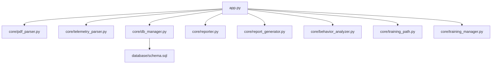
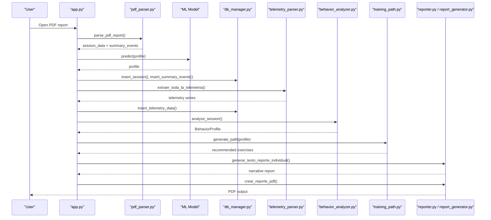
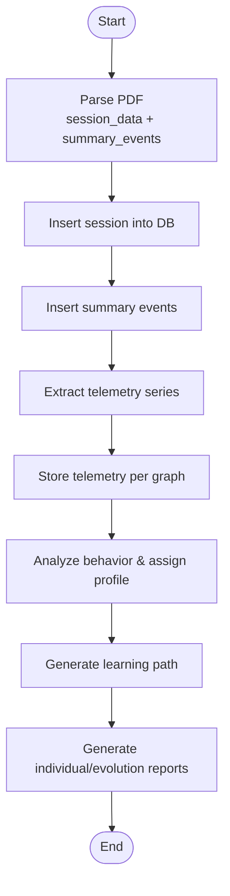
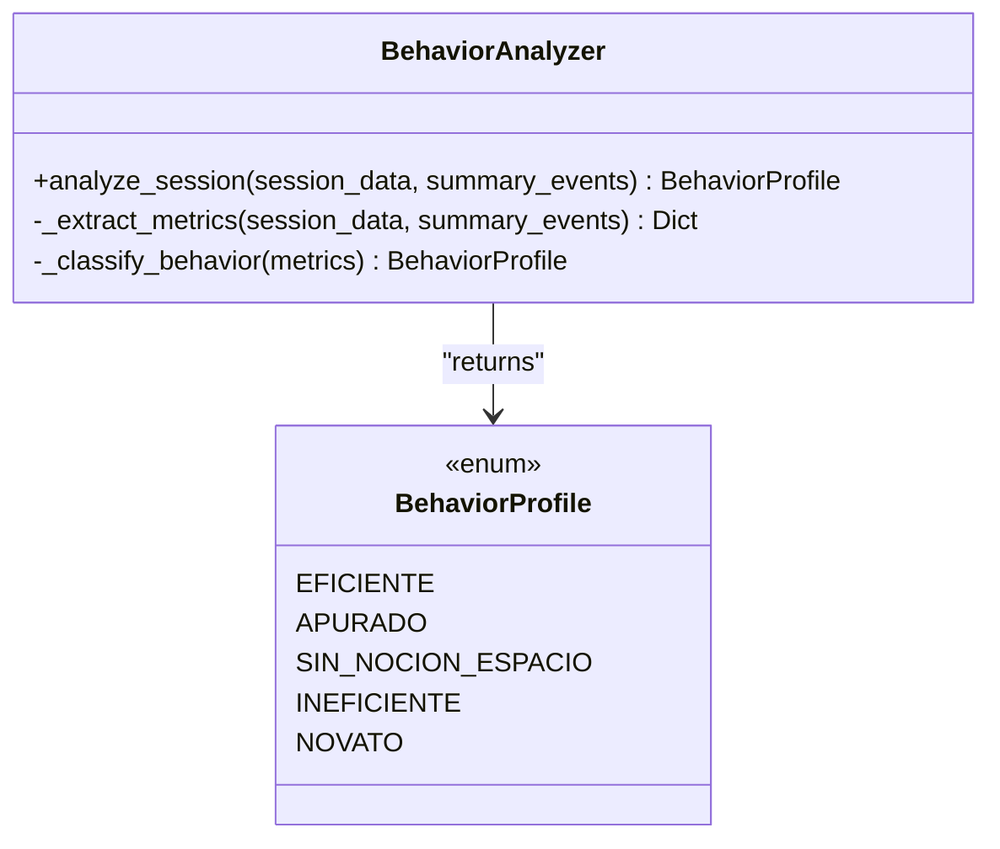
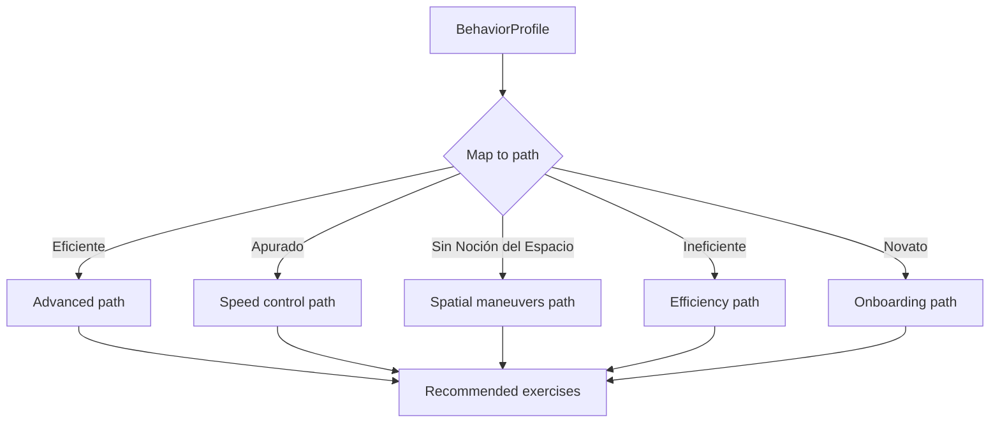
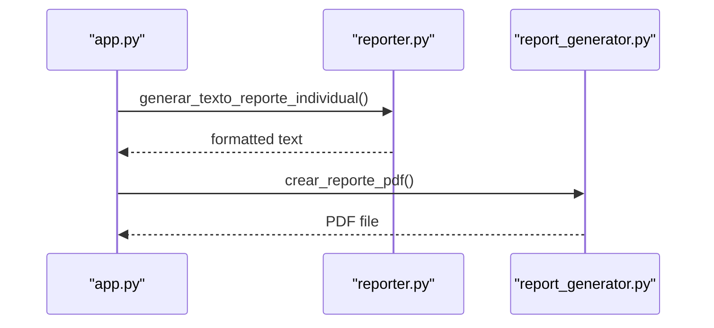
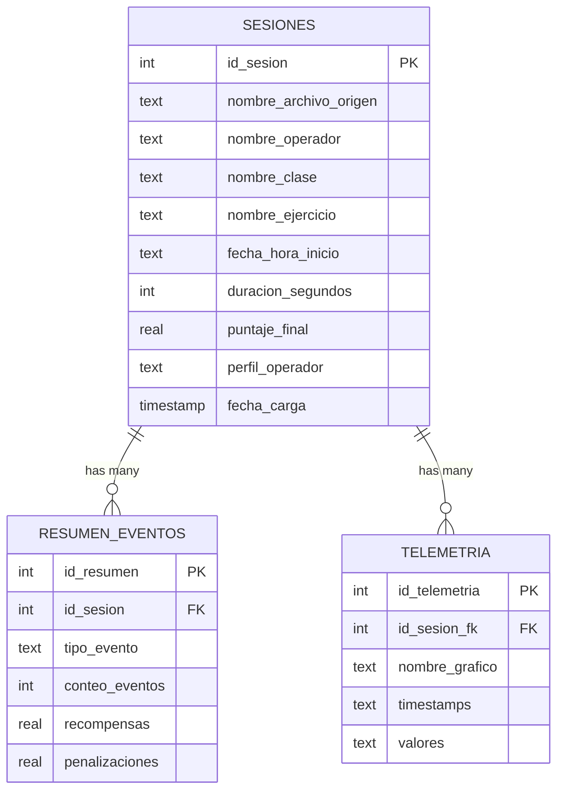
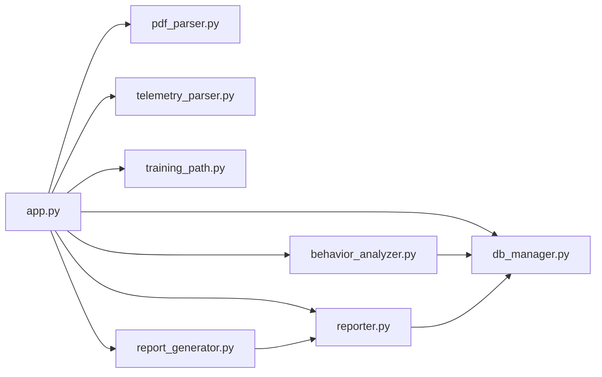

# Training Management

<cite>
**Referenced Files in This Document**
- [app.py](file://app.py)
- [core/training_manager.py](file://core/training_manager.py)
- [core/training_path.py](file://core/training_path.py)
- [core/behavior_analyzer.py](file://core/behavior_analyzer.py)
- [core/db_manager.py](file://core/db_manager.py)
- [core/reporter.py](file://core/reporter.py)
- [core/report_generator.py](file://core/report_generator.py)
- [core/pdf_parser.py](file://core/pdf_parser.py)
- [core/telemetry_parser.py](file://core/telemetry_parser.py)
- [database/schema.sql](file://database/schema.sql)
</cite>

## Table of Contents
1. [Introduction](#introduction)
2. [Project Structure](#project-structure)
3. [Core Components](#core-components)
4. [Architecture Overview](#architecture-overview)
5. [Detailed Component Analysis](#detailed-component-analysis)
6. [Dependency Analysis](#dependency-analysis)
7. [Performance Considerations](#performance-considerations)
8. [Troubleshooting Guide](#troubleshooting-guide)
9. [Conclusion](#conclusion)
10. [Appendices](#appendices)

## Introduction
This document describes the training management system for operator skill assessment and learning path recommendations. It covers how training sessions are created, tracked, and completed; how behavior analysis algorithms evaluate operator competency across exercises to produce proficiency indicators; how personalized learning paths are generated based on performance gaps; and how results integrate with behavioral telemetry, historical performance data, and reporting outputs. It also addresses scalability considerations for large operator populations, batch processing capabilities, and automated plan generation.

## Project Structure
The system is organized into a user-facing application, core analytics modules, database schema, and utilities for parsing reports and generating outputs:
- Application layer: app.py orchestrates UI workflows, PDF ingestion, model-based classification, storage, and report generation.
- Core modules:
  - Behavior analysis and profiling: core/behavior_analyzer.py
  - Learning path recommendation: core/training_path.py
  - Training orchestration: core/training_manager.py
  - Data persistence: core/db_manager.py and database/schema.sql
  - Reporting: core/reporter.py and core/report_generator.py
  - Input parsing: core/pdf_parser.py and core/telemetry_parser.py

**Diagram sources**
- [app.py:33-42](file://app.py#L33-L42)
- [core/db_manager.py:106-152](file://core/db_manager.py#L106-L152)
- [database/schema.sql:14-58](file://database/schema.sql#L14-L58)

**Section sources**
- [app.py:33-42](file://app.py#L33-L42)
- [database/schema.sql:14-58](file://database/schema.sql#L14-L58)

## Core Components
- Session creation and tracking:
  - Sessions are created from parsed PDF reports, storing operator metadata, exercise details, duration, final score, and predicted profile. Summary events and telemetry series are persisted per session.
- Skill assessment and profiling:
  - A rule-based classifier evaluates session metrics (score, duration, penalties, collisions, errors) to assign an operator behavior profile used for recommendations.
- Learning path recommendation:
  - Based on the assigned profile, a curated sequence of exercises is recommended to address specific competency gaps.
- Reporting and evolution tracking:
  - Individual and comparative reports are generated in text and PDF formats, including telemetry-derived insights and feedback narratives.

**Section sources**
- [core/db_manager.py:106-152](file://core/db_manager.py#L106-L152)
- [core/behavior_analyzer.py:26-68](file://core/behavior_analyzer.py#L26-L68)
- [core/training_path.py:5-86](file://core/training_path.py#L5-L86)
- [core/reporter.py:19-122](file://core/reporter.py#L19-L122)
- [core/report_generator.py:28-149](file://core/report_generator.py#L28-L149)

## Architecture Overview
The end-to-end flow starts with a PDF report input, proceeds through parsing, optional ML-based classification, storage, telemetry extraction, behavior analysis, and culminates in personalized learning paths and reports.

**Diagram sources**
- [app.py:411-449](file://app.py#L411-L449)
- [core/pdf_parser.py:27-57](file://core/pdf_parser.py#L27-L57)
- [core/db_manager.py:106-152](file://core/db_manager.py#L106-L152)
- [core/telemetry_parser.py:125-154](file://core/telemetry_parser.py#L125-L154)
- [core/behavior_analyzer.py:36-68](file://core/behavior_analyzer.py#L36-L68)
- [core/training_path.py:11-22](file://core/training_path.py#L11-L22)
- [core/reporter.py:51-92](file://core/reporter.py#L51-L92)
- [core/report_generator.py:28-75](file://core/report_generator.py#L28-L75)

## Detailed Component Analysis

### Session Management and Progress Tracking
- Session creation:
  - The application parses PDFs to extract session metadata and summary events, persists them via database functions, and stores telemetry time-series for visualization and analysis.
- Progress tracking:
  - Each session records final score, duration, and predicted profile. Evolution reports compare two sessions to quantify improvement or regression.
- Completion criteria:
  - While no explicit completion gate exists in code, profiles such as “Eficiente” indicate high proficiency based on thresholds applied by the behavior analyzer.

**Diagram sources**
- [core/pdf_parser.py:27-57](file://core/pdf_parser.py#L27-L57)
- [core/db_manager.py:106-152](file://core/db_manager.py#L106-L152)
- [core/telemetry_parser.py:125-154](file://core/telemetry_parser.py#L125-L154)
- [core/behavior_analyzer.py:36-68](file://core/behavior_analyzer.py#L36-L68)
- [core/training_path.py:11-22](file://core/training_path.py#L11-L22)
- [core/reporter.py:51-92](file://core/reporter.py#L51-L92)

**Section sources**
- [core/db_manager.py:106-152](file://core/db_manager.py#L106-L152)
- [core/reporter.py:98-122](file://core/reporter.py#L98-L122)

### Skill Assessment Algorithms
- Metrics extraction:
  - From session data and summary events, the analyzer computes score, duration, total penalties/rewards, collision count, and error count.
- Classification rules:
  - Profiles include Eficiente, Apurado, Sin Noción del Espacio, Ineficiente, Novato. Thresholds guide decisions (e.g., high score with low penalties indicates efficiency; excessive collisions suggest spatial perception issues).
- Telemetry-derived indicators:
  - Functions analyze braking, steering, acceleration, fork height, tilt angle, and speed metrics to enrich behavioral insights and feedback.

**Diagram sources**
- [core/behavior_analyzer.py:26-68](file://core/behavior_analyzer.py#L26-L68)

**Section sources**
- [core/behavior_analyzer.py:36-68](file://core/behavior_analyzer.py#L36-L68)
- [core/behavior_analyzer.py:95-147](file://core/behavior_analyzer.py#L95-L147)

### Learning Path Recommendation Engine
- Profile-driven mapping:
  - Each behavior profile maps to a tailored sequence of exercises designed to address identified gaps (e.g., precision maneuvers for spatial issues; efficiency drills for inefficient operators).
- Exercise catalog:
  - Includes ambientación, control de velocidad, maniobras de precisión, eficiencia operativa with durations and difficulty levels.

**Diagram sources**
- [core/training_path.py:11-22](file://core/training_path.py#L11-L22)
- [core/training_path.py:24-86](file://core/training_path.py#L24-L86)

**Section sources**
- [core/training_path.py:24-86](file://core/training_path.py#L24-L86)

### Reporting Formats and Integration
- Individual reports:
  - Text reports summarize operator info, predicted profile, recommended learning path, detailed telemetry analysis, and actionable feedback.
- Evolution reports:
  - Compare initial and final sessions to show score deltas, profile changes, and metric improvements/regressions.
- PDF export:
  - Professional PDFs encapsulate diagnosis, recommended path, and telemetry highlights.

**Diagram sources**
- [core/reporter.py:51-92](file://core/reporter.py#L51-L92)
- [core/report_generator.py:28-75](file://core/report_generator.py#L28-L75)

**Section sources**
- [core/reporter.py:51-92](file://core/reporter.py#L51-L92)
- [core/report_generator.py:28-75](file://core/report_generator.py#L28-L75)

### Database Schema and Data Models
- Tables:
  - Sesiones: stores session metadata, operator name, class, exercise, start time, duration, final score, and predicted profile.
  - ResumenEventos: aggregated event counts, rewards, and penalties per session.
  - Telemetria: time-series data per graph per session for visualization and analysis.
- Indexes:
  - Optimized queries on operator name, profile, and session foreign keys.

**Diagram sources**
- [database/schema.sql:14-58](file://database/schema.sql#L14-L58)

**Section sources**
- [database/schema.sql:14-58](file://database/schema.sql#L14-L58)

### Custom Training Modules and Configuration
- Exercise catalog:
  - Modular definitions for exercises with names, descriptions, durations, and difficulty levels can be extended within the training path module.
- Assessment criteria configuration:
  - Thresholds for scoring, duration, penalties, collisions, and errors are centralized in the behavior analyzer and can be tuned to reflect organizational standards.

**Section sources**
- [core/training_path.py:24-51](file://core/training_path.py#L24-L51)
- [core/behavior_analyzer.py:28-34](file://core/behavior_analyzer.py#L28-L34)

### Integration Points
- Behavioral analysis integration:
  - Telemetry-derived metrics feed into narrative feedback and inform recommendations.
- Historical performance data:
  - Evolution reports leverage stored sessions to compare progress over time.
- Certification tracking:
  - While not explicitly implemented, the predicted profile and scores can serve as proxies for certification milestones; additional fields could be added to track certifications in the Sesiones table.

**Section sources**
- [core/reporter.py:19-45](file://core/reporter.py#L19-L45)
- [core/reporter.py:98-122](file://core/reporter.py#L98-L122)

## Dependency Analysis
Key dependencies and coupling:
- app.py depends on parsing, storage, analysis, path generation, and reporting modules.
- db_manager provides data access abstractions and context-managed connections.
- behavior_analyzer relies on session and event data plus telemetry functions.
- training_path depends on behavior profiles to select appropriate exercise sequences.
- reporter and report_generator depend on analyzed data to produce outputs.

**Diagram sources**
- [app.py:33-42](file://app.py#L33-L42)
- [core/db_manager.py:106-152](file://core/db_manager.py#L106-L152)
- [core/behavior_analyzer.py:36-68](file://core/behavior_analyzer.py#L36-L68)
- [core/training_path.py:11-22](file://core/training_path.py#L11-L22)
- [core/reporter.py:51-92](file://core/reporter.py#L51-L92)
- [core/report_generator.py:28-75](file://core/report_generator.py#L28-L75)

**Section sources**
- [app.py:33-42](file://app.py#L33-L42)
- [core/db_manager.py:106-152](file://core/db_manager.py#L106-L152)

## Performance Considerations
- Batch processing:
  - The current UI processes one PDF at a time. For large operator populations, implement a batch pipeline that iterates over multiple PDFs, queues parsing and storage tasks, and aggregates results.
- Scalability:
  - Use connection pooling or transaction batching for inserts to reduce overhead.
  - Consider partitioning telemetry data by date or operator if datasets grow significantly.
- Asynchronous operations:
  - Offload heavy image processing and telemetry extraction to background workers to keep the UI responsive.
- Caching:
  - Cache parsed session data and telemetry series to avoid reprocessing identical inputs.
- Automated plan generation:
  - Schedule periodic runs to generate updated learning paths for all active operators based on latest sessions.

[No sources needed since this section provides general guidance]

## Troubleshooting Guide
Common issues and resolutions:
- Missing or invalid PDF content:
  - Ensure the PDF contains required fields; parser returns None if session data cannot be extracted.
- Model loading failures:
  - Verify the presence of the machine learning model file in the models directory before prediction.
- Database connectivity:
  - Confirm the database path and permissions; context manager ensures proper connection handling.
- Telemetry extraction errors:
  - Check page indices and image availability; ensure calibration parameters match report layout.

**Section sources**
- [core/pdf_parser.py:27-57](file://core/pdf_parser.py#L27-L57)
- [app.py:526-535](file://app.py#L526-L535)
- [core/db_manager.py:23-33](file://core/db_manager.py#L23-L33)
- [core/telemetry_parser.py:125-154](file://core/telemetry_parser.py#L125-L154)

## Conclusion
The training management system integrates PDF-based session ingestion, robust behavior analysis, and personalized learning path recommendations to support operator skill development. It provides comprehensive reporting and evolution tracking, enabling continuous improvement. With enhancements for batch processing, asynchronous execution, and scalable storage strategies, the system can effectively support large operator populations and automated training plan generation.

[No sources needed since this section summarizes without analyzing specific files]

## Appendices

### Example: Custom Training Module Definition
- Add a new exercise entry to the catalog with name, description, duration, and difficulty.
- Create a corresponding path method to include it in relevant profiles.

**Section sources**
- [core/training_path.py:24-51](file://core/training_path.py#L24-L51)
- [core/training_path.py:53-86](file://core/training_path.py#L53-L86)

### Example: Assessment Criteria Configuration
- Adjust thresholds in the behavior analyzer to align with organizational standards (e.g., score_threshold, duration_threshold, collision_threshold, error_threshold).

**Section sources**
- [core/behavior_analyzer.py:28-34](file://core/behavior_analyzer.py#L28-L34)

### Example: Progress Reporting Format
- Individual text report includes operator details, predicted profile, recommended exercises, telemetry metrics, and narrative feedback.
- Evolution report compares initial and final sessions with score deltas and profile transitions.

**Section sources**
- [core/reporter.py:51-92](file://core/reporter.py#L51-L92)
- [core/reporter.py:98-122](file://core/reporter.py#L98-L122)