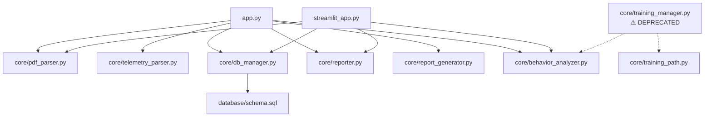
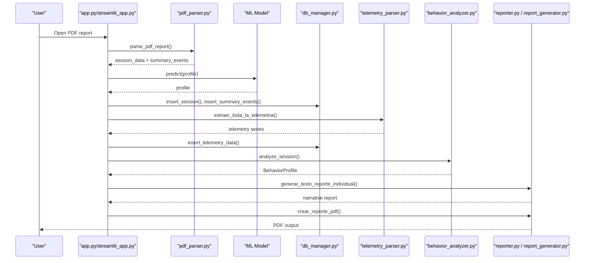
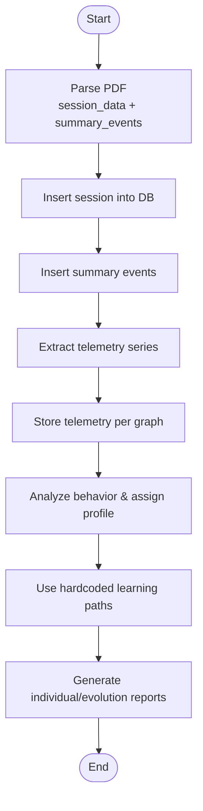
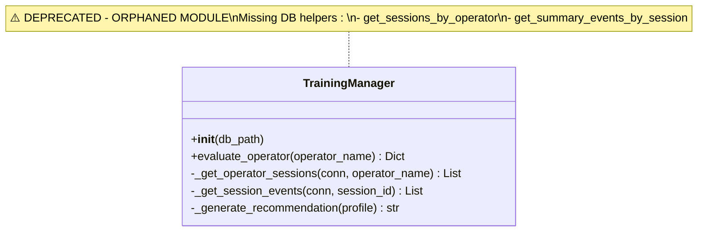
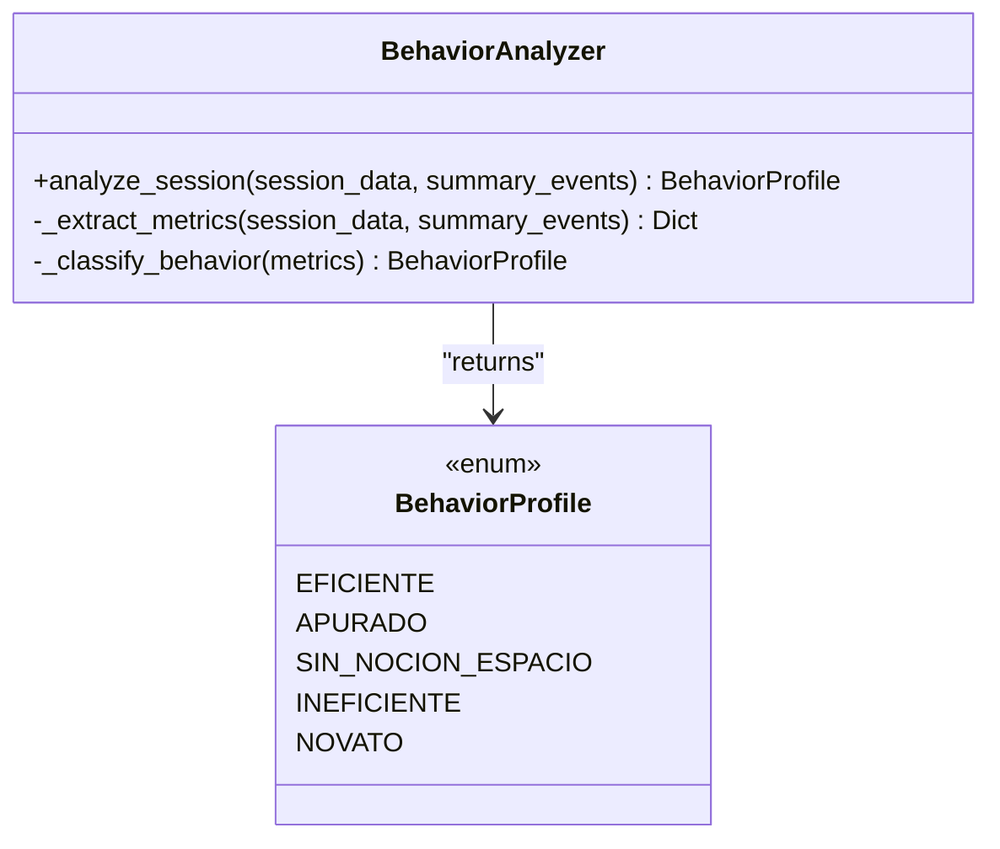
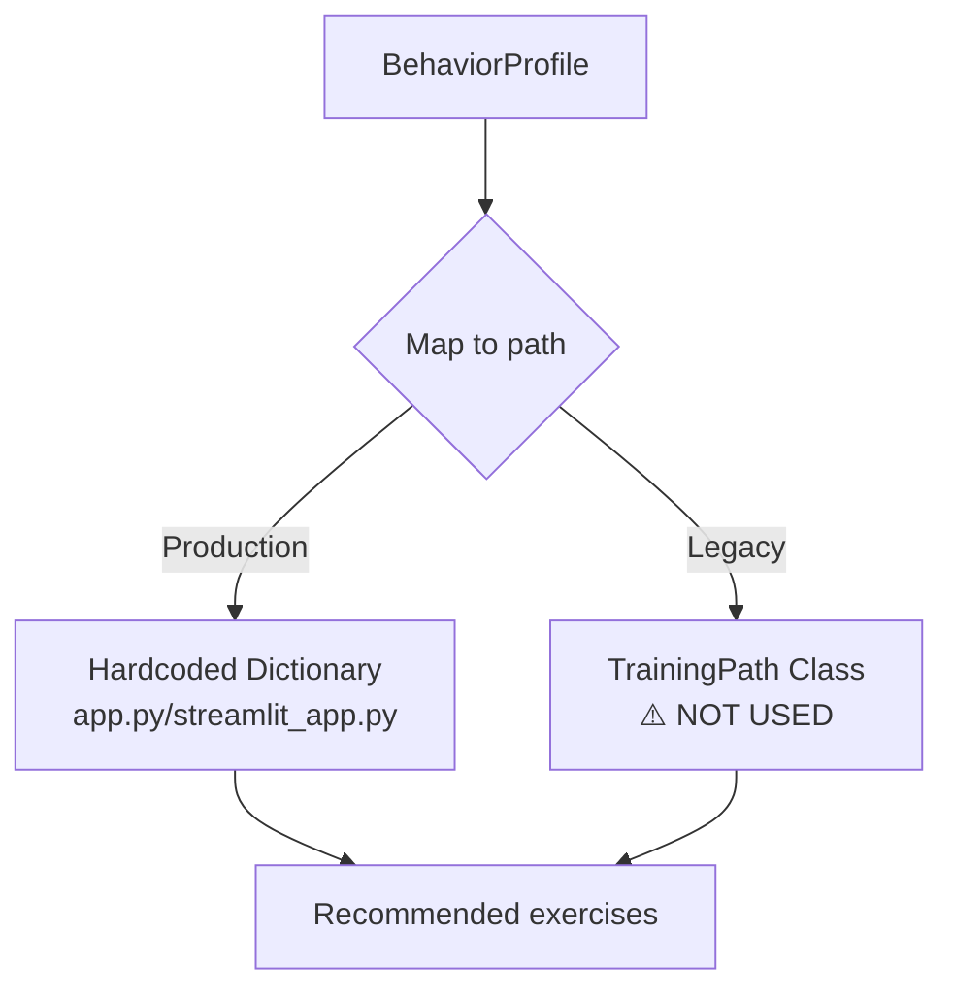
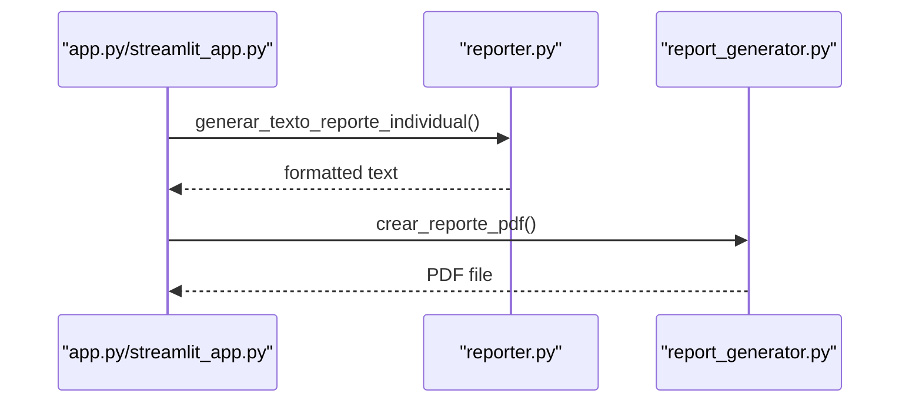
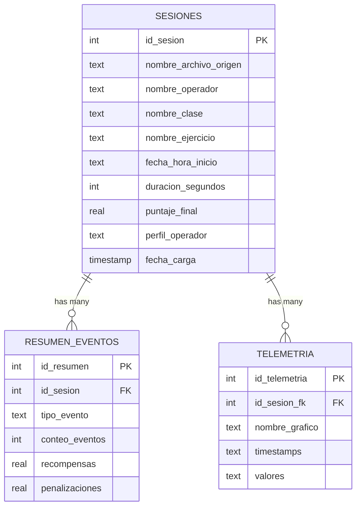
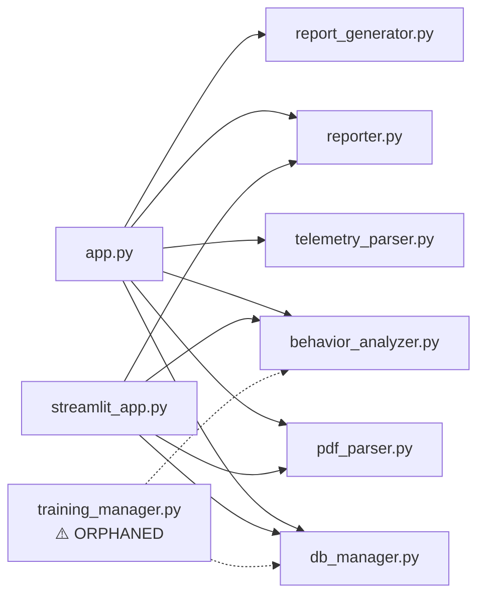

# Training Management

<cite>
**Referenced Files in This Document**
- [app.py](file://app.py)
- [streamlit_app.py](file://streamlit_app.py)
- [core/training_manager.py](file://core/training_manager.py)
- [core/training_path.py](file://core/training_path.py)
- [core/behavior_analyzer.py](file://core/behavior_analyzer.py)
- [core/db_manager.py](file://core/db_manager.py)
- [core/reporter.py](file://core/reporter.py)
- [core/report_generator.py](file://core/report_generator.py)
- [core/pdf_parser.py](file://core/pdf_parser.py)
- [core/telemetry_parser.py](file://core/telemetry_parser.py)
- [database/schema.sql](file://database/schema.sql)
</cite>

## Update Summary
**Changes Made**
- Updated training management architecture section to reflect deprecation of `training_manager.py`
- Added warning section about orphaned/deprecated components
- Updated dependency analysis to show current production flow vs deprecated paths
- Modified troubleshooting guide to address deprecated module issues
- Updated conclusion to reflect current system state

## Table of Contents
1. [Introduction](#introduction)
2. [Project Structure](#project-structure)
3. [Core Components](#core-components)
4. [Architecture Overview](#architecture-overview)
5. [Detailed Component Analysis](#detailed-component-analysis)
6. [Dependency Analysis](#dependency-analysis)
7. [Performance Considerations](#performance-considerations)
8. [Troubleshooting Guide](#troubleshooting-guide)
9. [Conclusion](#conclusion)
10. [Appendices](#appendices)

## Introduction
This document describes the training management system for operator skill assessment and learning path recommendations. **Important Note**: The legacy `training_manager.py` module is currently orphaned and deprecated due to missing database helper functions and should not be used in production. The current production system uses direct frontend implementations with hardcoded learning path dictionaries and ML-based profile classification.

The system covers how training sessions are created, tracked, and completed; how behavior analysis algorithms evaluate operator competency across exercises to produce proficiency indicators; how personalized learning paths are generated based on performance gaps; and how results integrate with behavioral telemetry, historical performance data, and reporting outputs. It also addresses scalability considerations for large operator populations, batch processing capabilities, and automated plan generation.

## Project Structure
The system is organized into user-facing applications, core analytics modules, database schema, and utilities for parsing reports and generating outputs:
- Application layers: 
  - Desktop UI: app.py orchestrates workflows using direct database queries and hardcoded learning paths
  - Web UI: streamlit_app.py provides web interface with similar functionality
- Core modules:
  - Behavior analysis and profiling: core/behavior_analyzer.py
  - Learning path recommendation: core/training_path.py (deprecated usage)
  - Legacy training orchestration: core/training_manager.py (**DEPRECATED - ORPHANED**)
  - Data persistence: core/db_manager.py and database/schema.sql
  - Reporting: core/reporter.py and core/report_generator.py
  - Input parsing: core/pdf_parser.py and core/telemetry_parser.py



**Diagram sources**
- [app.py:28-33](file://app.py#L28-L33)
- [streamlit_app.py:16-21](file://streamlit_app.py#L16-L21)
- [core/db_manager.py:106-152](file://core/db_manager.py#L106-L152)
- [database/schema.sql:14-58](file://database/schema.sql#L14-L58)
- [core/training_manager.py:1-16](file://core/training_manager.py#L1-L16)

**Section sources**
- [app.py:28-33](file://app.py#L28-L33)
- [streamlit_app.py:16-21](file://streamlit_app.py#L16-L21)
- [database/schema.sql:14-58](file://database/schema.sql#L14-L58)

## Core Components
- Session creation and tracking:
  - Sessions are created from parsed PDF reports, storing operator metadata, exercise details, duration, final score, and predicted profile. Summary events and telemetry series are persisted per session.
  - **Current Implementation**: Both app.py and streamlit_app.py handle session management directly without using the deprecated TrainingManager class.
- Skill assessment and profiling:
  - A rule-based classifier evaluates session metrics (score, duration, penalties, collisions, errors) to assign an operator behavior profile used for recommendations.
  - **Production Flow**: Profiles come from ML model predictions rather than the deprecated training manager.
- Learning path recommendation:
  - **Current Production**: Hardcoded dictionaries in both app.py and streamlit_app.py map profiles to recommended exercises.
  - **Legacy System**: The deprecated training_manager.py attempted to use a more sophisticated approach via training_path.py but is non-functional.
- Reporting and evolution tracking:
  - Individual and comparative reports are generated in text and PDF formats, including telemetry-derived insights and feedback narratives.

**Section sources**
- [core/db_manager.py:106-152](file://core/db_manager.py#L106-L152)
- [core/behavior_analyzer.py:26-68](file://core/behavior_analyzer.py#L26-L68)
- [app.py:354-360](file://app.py#L354-L360)
- [streamlit_app.py:34-40](file://streamlit_app.py#L34-L40)
- [core/training_manager.py:1-16](file://core/training_manager.py#L1-L16)

## Architecture Overview
The end-to-end flow starts with a PDF report input, proceeds through parsing, optional ML-based classification, storage, telemetry extraction, behavior analysis, and culminates in personalized learning paths and reports. **Note**: The deprecated training_manager.py is not part of this production flow.



**Diagram sources**
- [app.py:411-449](file://app.py#L411-L449)
- [streamlit_app.py:46-72](file://streamlit_app.py#L46-L72)
- [core/pdf_parser.py:27-57](file://core/pdf_parser.py#L27-L57)
- [core/db_manager.py:106-152](file://core/db_manager.py#L106-L152)
- [core/telemetry_parser.py:125-154](file://core/telemetry_parser.py#L125-L154)
- [core/behavior_analyzer.py:36-68](file://core/behavior_analyzer.py#L36-L68)
- [core/reporter.py:51-92](file://core/reporter.py#L51-L92)
- [core/report_generator.py:28-75](file://core/report_generator.py#L28-L75)

## Detailed Component Analysis

### Session Management and Progress Tracking
- Session creation:
  - The application parses PDFs to extract session metadata and summary events, persists them via database functions, and stores telemetry time-series for visualization and analysis.
  - **Current Implementation**: Both frontends handle session management directly without relying on the deprecated TrainingManager.
- Progress tracking:
  - Each session records final score, duration, and predicted profile. Evolution reports compare two sessions to quantify improvement or regression.
- Completion criteria:
  - While no explicit completion gate exists in code, profiles such as "Eficiente" indicate high proficiency based on thresholds applied by the behavior analyzer.



**Diagram sources**
- [core/pdf_parser.py:27-57](file://core/pdf_parser.py#L27-L57)
- [core/db_manager.py:106-152](file://core/db_manager.py#L106-L152)
- [core/telemetry_parser.py:125-154](file://core/telemetry_parser.py#L125-L154)
- [core/behavior_analyzer.py:36-68](file://core/behavior_analyzer.py#L36-L68)
- [app.py:354-360](file://app.py#L354-L360)
- [streamlit_app.py:34-40](file://streamlit_app.py#L34-L40)

**Section sources**
- [core/db_manager.py:106-152](file://core/db_manager.py#L106-L152)
- [core/reporter.py:98-122](file://core/reporter.py#L98-L122)

### ⚠️ Deprecated Training Manager Module
**CRITICAL**: The `core/training_manager.py` module is currently orphaned and deprecated. It should not be used in production until missing database helper functions are implemented.

- **Status**: Orphaned module with broken dependencies
- **Issue**: Depends on non-existent database functions (`get_sessions_by_operator`, `get_summary_events_by_session`)
- **Warning**: Emits `DeprecationWarning` when imported
- **Impact**: Calling `TrainingManager.evaluate_operator()` raises `RuntimeError` due to missing imports



**Diagram sources**
- [core/training_manager.py:32-65](file://core/training_manager.py#L32-L65)
- [core/training_manager.py:67-94](file://core/training_manager.py#L67-L94)

**Section sources**
- [core/training_manager.py:1-16](file://core/training_manager.py#L1-L16)
- [core/training_manager.py:67-94](file://core/training_manager.py#L67-L94)

### Skill Assessment Algorithms
- Metrics extraction:
  - From session data and summary events, the analyzer computes score, duration, total penalties/rewards, collision count, and error count.
- Classification rules:
  - Profiles include Eficiente, Apurado, Sin Noción del Espacio, Ineficiente, Novato. Thresholds guide decisions (e.g., high score with low penalties indicates efficiency; excessive collisions suggest spatial perception issues).
- Telemetry-derived indicators:
  - Functions analyze braking, steering, acceleration, fork height, tilt angle, and speed metrics to enrich behavioral insights and feedback.



**Diagram sources**
- [core/behavior_analyzer.py:26-68](file://core/behavior_analyzer.py#L26-L68)

**Section sources**
- [core/behavior_analyzer.py:36-68](file://core/behavior_analyzer.py#L36-L68)
- [core/behavior_analyzer.py:95-147](file://core/behavior_analyzer.py#L95-L147)

### Learning Path Recommendation Engine
- **Current Production Implementation**:
  - Hardcoded dictionaries in both app.py and streamlit_app.py provide simple profile-to-path mapping
  - Maps profiles like "Novato", "Apurado", "Sin nocion del espacio", etc. to specific exercise sequences
- **Legacy System (Deprecated)**:
  - The training_path.py module provides a more sophisticated approach with exercise catalogs and difficulty levels
  - Currently not used by production frontends due to the orphaned training_manager.py



**Diagram sources**
- [app.py:354-360](file://app.py#L354-L360)
- [streamlit_app.py:34-40](file://streamlit_app.py#L34-L40)
- [core/training_path.py:11-22](file://core/training_path.py#L11-L22)

**Section sources**
- [app.py:354-360](file://app.py#L354-L360)
- [streamlit_app.py:34-40](file://streamlit_app.py#L34-L40)
- [core/training_path.py:24-86](file://core/training_path.py#L24-L86)

### Reporting Formats and Integration
- Individual reports:
  - Text reports summarize operator info, predicted profile, recommended learning path, detailed telemetry analysis, and actionable feedback.
- Evolution reports:
  - Compare initial and final sessions to show score deltas, profile changes, and metric improvements/regressions.
- PDF export:
  - Professional PDFs encapsulate diagnosis, recommended path, and telemetry highlights.



**Diagram sources**
- [core/reporter.py:51-92](file://core/reporter.py#L51-L92)
- [core/report_generator.py:28-75](file://core/report_generator.py#L28-L75)

**Section sources**
- [core/reporter.py:51-92](file://core/reporter.py#L51-L92)
- [core/report_generator.py:28-75](file://core/report_generator.py#L28-L75)

### Database Schema and Data Models
- Tables:
  - Sesiones: stores session metadata, operator name, class, exercise, start time, duration, final score, and predicted profile.
  - ResumenEventos: aggregated event counts, rewards, and penalties per session.
  - Telemetria: time-series data per graph per session for visualization and analysis.
- Indexes:
  - Optimized queries on operator name, profile, and session foreign keys.



**Diagram sources**
- [database/schema.sql:14-58](file://database/schema.sql#L14-L58)

**Section sources**
- [database/schema.sql:14-58](file://database/schema.sql#L14-L58)

### Custom Training Modules and Configuration
- **Current Production Configuration**:
  - Exercise catalogs are defined as hardcoded dictionaries in both app.py and streamlit_app.py
  - Simple profile-to-exercise mapping without complex categorization
- **Assessment criteria configuration**:
  - Thresholds for scoring, duration, penalties, collisions, and errors are centralized in the behavior analyzer and can be tuned to reflect organizational standards.

**Section sources**
- [app.py:354-360](file://app.py#L354-L360)
- [streamlit_app.py:34-40](file://streamlit_app.py#L34-L40)
- [core/behavior_analyzer.py:28-34](file://core/behavior_analyzer.py#L28-L34)

### Integration Points
- Behavioral analysis integration:
  - Telemetry-derived metrics feed into narrative feedback and inform recommendations.
- Historical performance data:
  - Evolution reports leverage stored sessions to compare progress over time.
- Certification tracking:
  - While not explicitly implemented, the predicted profile and scores can serve as proxies for certification milestones; additional fields could be added to track certifications in the Sesiones table.

**Section sources**
- [core/reporter.py:19-45](file://core/reporter.py#L19-L45)
- [core/reporter.py:98-122](file://core/reporter.py#L98-L122)

## Dependency Analysis
Key dependencies and coupling:
- **Production Flow**: app.py and streamlit_app.py depend on parsing, storage, analysis, and reporting modules directly
- **Deprecated Path**: training_manager.py depends on non-existent database functions and is not imported by any production code
- db_manager provides data access abstractions and context-managed connections
- behavior_analyzer relies on session and event data plus telemetry functions
- reporter and report_generator depend on analyzed data to produce outputs



**Diagram sources**
- [app.py:28-33](file://app.py#L28-L33)
- [streamlit_app.py:16-21](file://streamlit_app.py#L16-L21)
- [core/db_manager.py:106-152](file://core/db_manager.py#L106-L152)
- [core/behavior_analyzer.py:36-68](file://core/behavior_analyzer.py#L36-L68)
- [core/reporter.py:51-92](file://core/reporter.py#L51-L92)
- [core/report_generator.py:28-75](file://core/report_generator.py#L28-L75)
- [core/training_manager.py:28-30](file://core/training_manager.py#L28-L30)

**Section sources**
- [app.py:28-33](file://app.py#L28-L33)
- [streamlit_app.py:16-21](file://streamlit_app.py#L16-L21)
- [core/db_manager.py:106-152](file://core/db_manager.py#L106-L152)

## Performance Considerations
- Batch processing:
  - The current UI processes one PDF at a time. For large operator populations, implement a batch pipeline that iterates over multiple PDFs, queues parsing and storage tasks, and aggregates results.
- Scalability:
  - Use connection pooling or transaction batching for inserts to reduce overhead.
  - Consider partitioning telemetry data by date or operator if datasets grow significantly.
- Asynchronous operations:
  - Offload heavy image processing and telemetry extraction to background workers to keep the UI responsive.
- Caching:
  - Cache parsed session data and telemetry series to avoid reprocessing identical inputs.
- Automated plan generation:
  - Schedule periodic runs to generate updated learning paths for all active operators based on latest sessions.

## Troubleshooting Guide
Common issues and resolutions:
- Missing or invalid PDF content:
  - Ensure the PDF contains required fields; parser returns None if session data cannot be extracted.
- Model loading failures:
  - Verify the presence of the machine learning model file in the models directory before prediction.
- Database connectivity:
  - Confirm the database path and permissions; context manager ensures proper connection handling.
- Telemetry extraction errors:
  - Check page indices and image availability; ensure calibration parameters match report layout.
- **⚠️ Deprecated Module Issues**:
  - If you encounter `ImportError` or `RuntimeError` related to `training_manager.py`, this is expected behavior
  - The module is intentionally broken and should not be used in production
  - Use the direct frontend implementations in app.py or streamlit_app.py instead
  - Error messages will indicate missing database helper functions

**Section sources**
- [core/pdf_parser.py:27-57](file://core/pdf_parser.py#L27-L57)
- [app.py:526-535](file://app.py#L526-L535)
- [core/db_manager.py:23-33](file://core/db_manager.py#L23-L33)
- [core/telemetry_parser.py:125-154](file://core/telemetry_parser.py#L125-L154)
- [core/training_manager.py:73-94](file://core/training_manager.py#L73-L94)

## Conclusion
The training management system integrates PDF-based session ingestion, robust behavior analysis, and personalized learning path recommendations to support operator skill development. **Important Update**: The legacy `training_manager.py` module is currently orphaned and deprecated due to missing database helper functions and should not be used in production. The current production system uses direct frontend implementations with hardcoded learning path dictionaries and ML-based profile classification.

The system provides comprehensive reporting and evolution tracking, enabling continuous improvement. With enhancements for batch processing, asynchronous execution, and scalable storage strategies, the system can effectively support large operator populations and automated training plan generation. Future work may involve implementing the missing database helpers to restore the training_manager.py functionality or consolidating on the current simpler approach.

## Appendices

### Example: Current Production Learning Path Configuration
- **app.py implementation**:
  ```python
  self.RUTAS_DE_APRENDIZAJE = {
      "Novato": {"titulo": "Ruta de Iniciación", "ejercicios": ["1.1. Controles", "2.1. Conducción básica"]},
      "Sin nocion del espacio": {"titulo": "Ruta de Precisión Espacial", "ejercicios": ["2.2. Curvas en S", "5.7. Carga Vertical"]},
      "Apurado": {"titulo": "Ruta de Control de Impulsos", "ejercicios": ["Módulo 4 (Apilamiento)", "7.1. Operación con Señales"]},
      "Ineficiente": {"titulo": "Ruta de Productividad", "ejercicios": ["Módulo 6 (Estanterías)"]},
      "Eficiente": {"titulo": "Ruta de Especialización", "ejercicios": ["Módulo 8 (Cargas Pesadas)"]}
  }
  ```

**Section sources**
- [app.py:354-360](file://app.py#L354-L360)
- [streamlit_app.py:34-40](file://streamlit_app.py#L34-L40)

### Example: Assessment Criteria Configuration
- Adjust thresholds in the behavior analyzer to align with organizational standards (e.g., score_threshold, duration_threshold, collision_threshold, error_threshold).

**Section sources**
- [core/behavior_analyzer.py:28-34](file://core/behavior_analyzer.py#L28-L34)

### Example: Progress Reporting Format
- Individual text report includes operator details, predicted profile, recommended exercises, telemetry metrics, and narrative feedback.
- Evolution report compares initial and final sessions with score deltas and profile transitions.

**Section sources**
- [core/reporter.py:51-92](file://core/reporter.py#L51-L92)
- [core/reporter.py:98-122](file://core/reporter.py#L98-L122)

### Deprecated Module Migration Guide
If you need to migrate away from the deprecated training_manager.py:

1. **Remove imports** of training_manager from your codebase
2. **Use direct frontend implementations** from app.py or streamlit_app.py
3. **Implement custom learning path logic** using the hardcoded dictionary pattern
4. **Handle errors gracefully** when attempting to use the deprecated module

**Section sources**
- [core/training_manager.py:1-16](file://core/training_manager.py#L1-L16)
- [core/training_manager.py:73-94](file://core/training_manager.py#L73-L94)