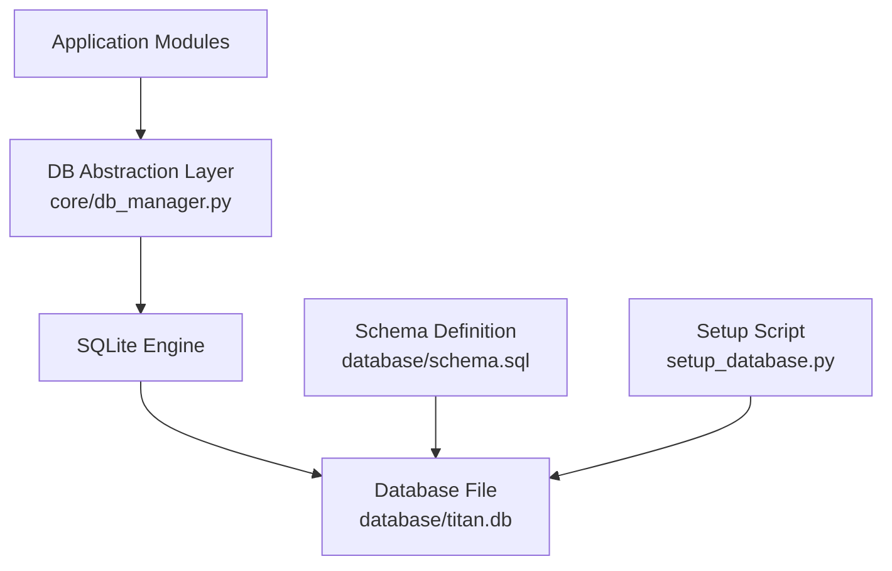
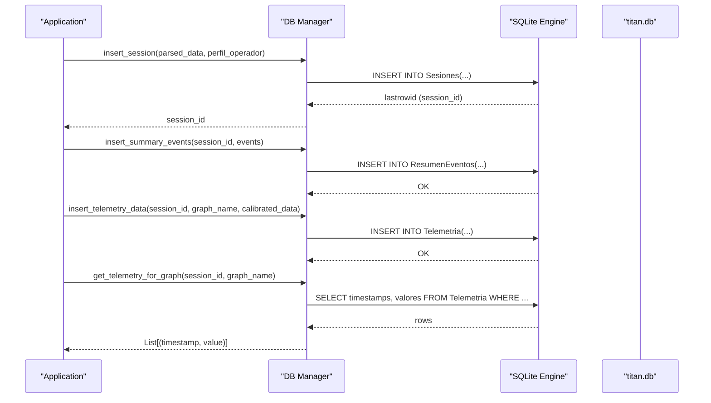
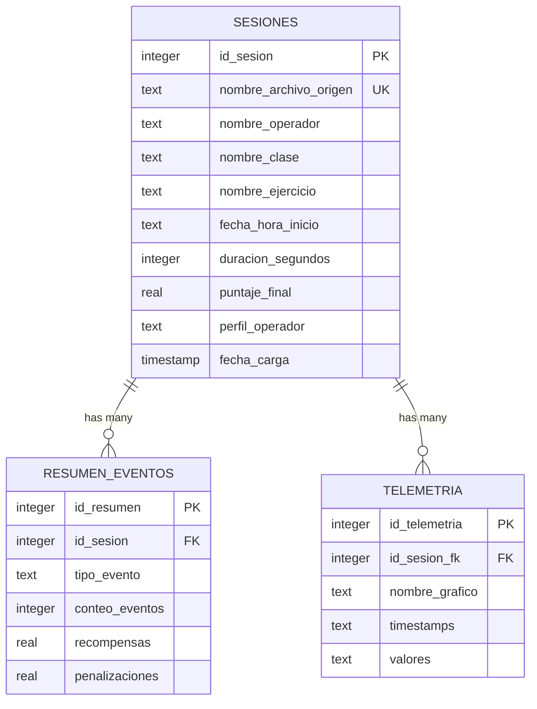
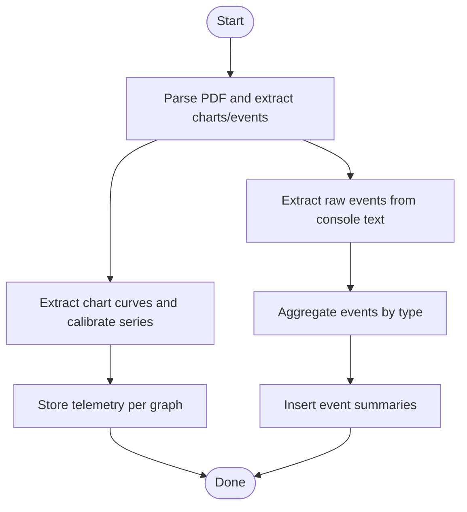
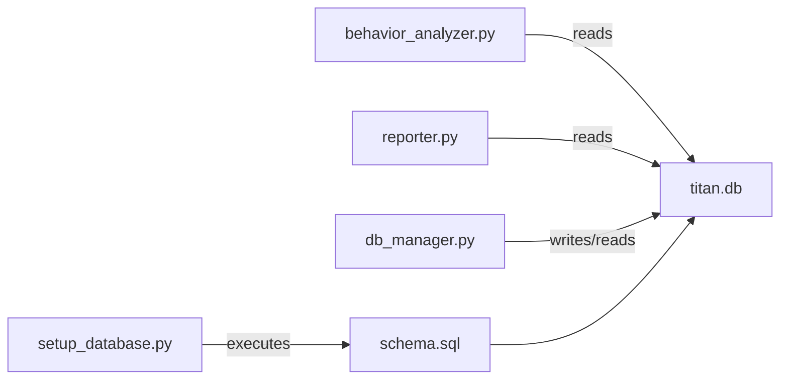

# Database Design

<cite>
**Referenced Files in This Document**
- [schema.sql](file://database/schema.sql)
- [db_manager.py](file://core/db_manager.py)
- [setup_database.py](file://setup_database.py)
- [behavior_analyzer.py](file://core/behavior_analyzer.py)
- [reporter.py](file://core/reporter.py)
- [telemetry_extractor.py](file://core/telemetry_extractor.py)
</cite>

## Table of Contents
1. [Introduction](#introduction)
2. [Project Structure](#project-structure)
3. [Core Components](#core-components)
4. [Architecture Overview](#architecture-overview)
5. [Detailed Component Analysis](#detailed-component-analysis)
6. [Dependency Analysis](#dependency-analysis)
7. [Performance Considerations](#performance-considerations)
8. [Troubleshooting Guide](#troubleshooting-guide)
9. [Conclusion](#conclusion)
10. [Appendices](#appendices)

## Introduction
This document provides comprehensive data model documentation for the Proyecto Titán SQLite database system. It details the complete schema, table relationships, entity definitions, field specifications, and data types. It also documents session management tables, telemetry storage, event summary structures, operator profile information, indexing strategy, query patterns, validation rules, integrity constraints, performance considerations, lifecycle management, backup procedures, and migration strategies.

## Project Structure
The database subsystem is centered around a single SQLite file (titan.db) with a declarative schema and an abstraction layer for connection and query operations. The key files are:
- Schema definition: database/schema.sql
- Database abstraction and utilities: core/db_manager.py
- Initialization script: setup_database.py
- Consumers that read/write data: core/behavior_analyzer.py, core/reporter.py, core/telemetry_extractor.py

**Diagram sources**
- [schema.sql:1-59](file://database/schema.sql#L1-L59)
- [db_manager.py:1-152](file://core/db_manager.py#L1-L152)
- [setup_database.py:1-53](file://setup_database.py#L1-L53)

**Section sources**
- [schema.sql:1-59](file://database/schema.sql#L1-L59)
- [db_manager.py:1-152](file://core/db_manager.py#L1-L152)
- [setup_database.py:1-53](file://setup_database.py#L1-L53)

## Core Components
- Session Management: Stores training session metadata and operator profile hints.
- Event Summary: Aggregated counts and scores per event type per session.
- Telemetry Storage: Time-series data extracted from charts, stored as comma-separated strings per graph per session.
- DB Abstraction: Connection management, context manager, and helper functions for inserts and queries.

Key entities and relationships:
- Sesiones (Sessions): Primary entity for each training session.
- ResumenEventos (Event Summaries): One-to-many relationship to Sesiones via id_sesion.
- Telemetria (Telemetry): One-to-many relationship to Sesiones via id_sesion_fk; multiple graphs per session.

Indexes:
- idx_sesiones_operador on Sesiones(nombre_operador)
- idx_sesiones_perfil on Sesiones(perfil_operador)
- idx_telemetria_sesion on Telemetria(id_sesion_fk)

**Section sources**
- [schema.sql:14-59](file://database/schema.sql#L14-L59)

## Architecture Overview
The system follows a layered architecture:
- Data ingestion pipeline extracts telemetry and events from PDFs and stores them into the database.
- Analysis modules read telemetry and summaries to compute metrics and behavioral profiles.
- Reporting modules generate text/PDF outputs based on session data and analysis results.
- The DB abstraction layer centralizes connection handling and common SQL operations.

**Diagram sources**
- [db_manager.py:106-152](file://core/db_manager.py#L106-L152)
- [db_manager.py:36-90](file://core/db_manager.py#L36-L90)

## Detailed Component Analysis

### Database Schema and Entity Relationships
- Sesiones
  - Purpose: Captures session-level metadata including source file name, operator name, class, exercise, start time, duration, final score, operator profile, and load timestamp.
  - Keys: id_sesion (PK), nombre_archivo_origen (UNIQUE).
  - Foreign keys: None.
- ResumenEventos
  - Purpose: Aggregates event counts, rewards, and penalties by event type per session.
  - Keys: id_resumen (PK), id_sesion (FK -> Sesiones.id_sesion ON DELETE CASCADE).
  - Notes: Each row represents one event type within a session.
- Telemetria
  - Purpose: Stores time-series data per graph per session. Timestamps and values are serialized as comma-separated strings.
  - Keys: id_telemetria (PK), id_sesion_fk (FK -> Sesiones.id_sesion ON DELETE CASCADE).
  - Notes: Multiple graphs per session; each graph has its own row.

**Diagram sources**
- [schema.sql:14-59](file://database/schema.sql#L14-L59)

**Section sources**
- [schema.sql:14-59](file://database/schema.sql#L14-L59)

### Session Management Tables
- Sesiones stores high-level session attributes and operator profile hints.
- Unique constraint on nombre_archivo_origen prevents duplicate processing of the same source file.
- Indexes on nombre_operador and perfil_operador optimize filtering and grouping by operator or profile.

Data access patterns:
- Lookup session by filename: used to avoid reprocessing and to retrieve session_id for subsequent inserts.
- Insert session: returns auto-incremented session_id for child records.

**Section sources**
- [schema.sql:14-25](file://database/schema.sql#L14-L25)
- [db_manager.py:93-124](file://core/db_manager.py#L93-L124)

### Telemetry Data Storage
- Telemetria stores two columns per graph: timestamps and valores as CSV-like strings.
- Parsing logic reconstructs pairs of (time, value) for plotting and analysis.
- Index on id_sesion_fk accelerates retrieval per session.

Query pattern:
- Retrieve series for a specific graph and session: SELECT timestamps, valores FROM Telemetria WHERE id_sesion_fk = ? AND nombre_grafico = ?.

Validation and robustness:
- Parsing handles empty or misaligned lists by truncating to the minimum length of timestamps/values.
- Errors during parsing or DB access return None to signal absence of valid data.

**Section sources**
- [schema.sql:45-52](file://database/schema.sql#L45-L52)
- [db_manager.py:36-90](file://core/db_manager.py#L36-L90)

### Event Summary Structures
- ResumenEventos aggregates per-session event metrics: type, count, rewards, penalties.
- Bulk insertion uses executemany for efficiency.
- Foreign key ensures referential integrity with Sesiones.

Usage:
- Insertion occurs after event extraction/aggregation from PDF content.
- Queries can sum rewards/penalties or filter by event type per session.

**Section sources**
- [schema.sql:31-39](file://database/schema.sql#L31-L39)
- [db_manager.py:126-139](file://core/db_manager.py#L126-L139)

### Operator Profile Information
- Operator profile is captured in Sesiones.perfil_operador and used for reporting and evolution comparisons.
- Behavioral classification logic exists in application code but the persisted profile resides in this column.

**Section sources**
- [schema.sql:14-25](file://database/schema.sql#L14-L25)
- [reporter.py:98-120](file://core/reporter.py#L98-L120)

### DB Manager Module (Abstraction Layer)
Responsibilities:
- Connection creation with row_factory set to sqlite3.Row for dict-like access.
- Context manager for automatic connection lifecycle.
- Helper functions:
  - get_telemetry_for_graph: retrieves and parses time-series data for a given session and graph.
  - get_session_id_by_filename / check_if_file_processed: support idempotent processing.
  - insert_session: persists session metadata and returns session_id.
  - insert_summary_events: bulk inserts event summaries.
  - insert_telemetry_data: serializes and stores telemetry series.

Error handling:
- Try/except blocks around DB operations with rollback on failure.
- Graceful handling of missing or malformed telemetry data.

**Section sources**
- [db_manager.py:13-33](file://core/db_manager.py#L13-L33)
- [db_manager.py:36-90](file://core/db_manager.py#L36-L90)
- [db_manager.py:93-152](file://core/db_manager.py#L93-L152)

### Data Ingestion and Processing Flow

**Diagram sources**
- [telemetry_extractor.py:202-239](file://core/telemetry_extractor.py#L202-L239)
- [analizador_eventos.py:49-65](file://core/analizador_eventos.py#L49-L65)
- [db_manager.py:106-152](file://core/db_manager.py#L106-L152)

## Dependency Analysis
- Consumers depend on db_manager for all DB interactions.
- behavior_analyzer reads telemetry directly via sqlite3 for analysis; it does not modify data.
- reporter reads session data via db_manager’s context manager for report generation.
- setup_database executes schema.sql to initialize/recreate the database structure.

**Diagram sources**
- [behavior_analyzer.py:71-93](file://core/behavior_analyzer.py#L71-L93)
- [reporter.py:98-120](file://core/reporter.py#L98-L120)
- [db_manager.py:106-152](file://core/db_manager.py#L106-L152)
- [setup_database.py:25-39](file://setup_database.py#L25-L39)
- [schema.sql:1-59](file://database/schema.sql#L1-L59)

**Section sources**
- [behavior_analyzer.py:71-93](file://core/behavior_analyzer.py#L71-L93)
- [reporter.py:98-120](file://core/reporter.py#L98-L120)
- [db_manager.py:106-152](file://core/db_manager.py#L106-L152)
- [setup_database.py:25-39](file://setup_database.py#L25-L39)
- [schema.sql:1-59](file://database/schema.sql#L1-L59)

## Performance Considerations
- Indexing:
  - Operators and profiles are frequently filtered; indexes on nombre_operador and perfil_operador improve query performance.
  - Telemetry lookups per session benefit from index on id_sesion_fk.
- Serialization:
  - Storing arrays as CSV strings avoids complex JSON parsing overhead but requires careful parsing in consumers.
- Bulk Inserts:
  - Event summaries use executemany to reduce round-trips.
- Query Optimization:
  - Always filter by id_sesion_fk and nombre_grafico when retrieving telemetry to minimize result sets.
  - Use unique constraint on nombre_archivo_origen to prevent redundant processing.

[No sources needed since this section provides general guidance]

## Troubleshooting Guide
Common issues and resolutions:
- No telemetry data returned:
  - Verify session_id and graph_name match stored records.
  - Check that timestamps and valores are non-empty and properly formatted.
- Duplicate session processing:
  - Ensure check_if_file_processed is called before insert_session to avoid duplicates.
- Integrity errors:
  - Ensure foreign key references exist; onDelete cascade will remove child records when sessions are deleted.
- Parsing errors:
  - Handle ValueError/IndexError when splitting CSV strings; ensure alignment between timestamps and values.

Operational checks:
- Validate DB path resolution across modules to avoid connecting to wrong databases.
- Confirm schema.sql execution succeeded and indexes were created.

**Section sources**
- [db_manager.py:36-90](file://core/db_manager.py#L36-L90)
- [db_manager.py:93-124](file://core/db_manager.py#L93-L124)
- [schema.sql:55-59](file://database/schema.sql#L55-L59)

## Conclusion
The Proyecto Titán database provides a compact and efficient schema for storing session metadata, aggregated event summaries, and time-series telemetry. The design leverages simple string serialization for arrays to keep the schema lightweight while enabling flexible analysis. Indexing and unique constraints support performance and data integrity. The DB abstraction layer standardizes connection management and common operations, reducing duplication and error risk across modules.

[No sources needed since this section summarizes without analyzing specific files]

## Appendices

### Data Validation Rules and Business Constraints
- Uniqueness:
  - nombre_archivo_origen must be unique to prevent duplicate sessions.
- Referential Integrity:
  - id_sesion in ResumenEventos and id_sesion_fk in Telemetria reference Sesiones.id_sesion with ON DELETE CASCADE.
- Data Types:
  - Numeric fields use INTEGER and REAL appropriately; timestamps stored as TEXT/TIMESTAMP depending on context.
- Parsing Robustness:
  - Telemetry parsing aligns timestamps and values by minimum length to avoid misalignment.

**Section sources**
- [schema.sql:14-52](file://database/schema.sql#L14-L52)
- [db_manager.py:66-83](file://core/db_manager.py#L66-L83)

### Common Queries and Access Patterns
- Get session ID by filename:
  - SELECT id_sesion FROM Sesiones WHERE nombre_archivo_origen = ?
- Check if file already processed:
  - SELECT 1 FROM Sesiones WHERE nombre_archivo_origen = ?
- Insert session:
  - INSERT INTO Sesiones(...) VALUES(...)
- Insert event summaries:
  - INSERT INTO ResumenEventos(...) VALUES(...)
- Insert telemetry:
  - INSERT INTO Telemetria(id_sesion_fk, nombre_grafico, timestamps, valores) VALUES(...)
- Retrieve telemetry series:
  - SELECT timestamps, valores FROM Telemetria WHERE id_sesion_fk = ? AND nombre_grafico = ?

**Section sources**
- [db_manager.py:93-152](file://core/db_manager.py#L93-L152)

### Data Lifecycle Management
- Creation:
  - Initialize DB using setup_database.py which executes schema.sql to create/recreate tables and indexes.
- Updates:
  - New sessions and telemetry are appended; no updates to existing rows are performed in current usage.
- Deletion:
  - Deleting a session cascades to related telemetry and event summaries due to foreign key constraints.

**Section sources**
- [setup_database.py:25-39](file://setup_database.py#L25-L39)
- [schema.sql:31-52](file://database/schema.sql#L31-L52)

### Backup Procedures
- SQLite supports consistent backups by copying the database file when no writes are occurring.
- Recommended approach:
  - Stop application writers temporarily or use WAL mode if enabled.
  - Copy database/titan.db to a backup location.
  - Schedule periodic backups to preserve historical sessions and telemetry.

[No sources needed since this section provides general guidance]

### Migration Strategies for Schema Updates
- Current schema includes DROP TABLE IF EXISTS statements to recreate tables cleanly.
- For production migrations:
  - Avoid destructive drops; instead, add new tables/columns and migrate data.
  - Maintain versioned migration scripts that apply incremental changes.
  - Test migrations against a copy of the database before applying to production.

**Section sources**
- [schema.sql:5-9](file://database/schema.sql#L5-L9)