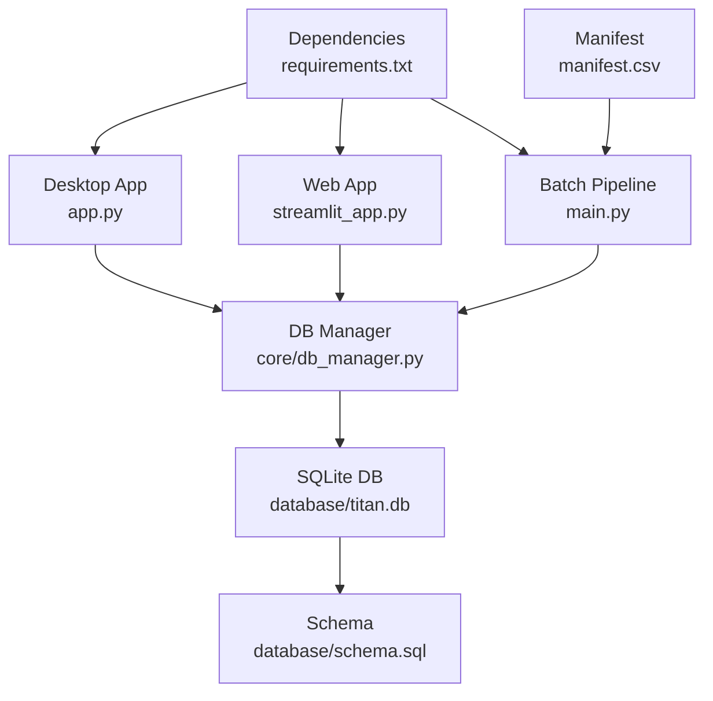
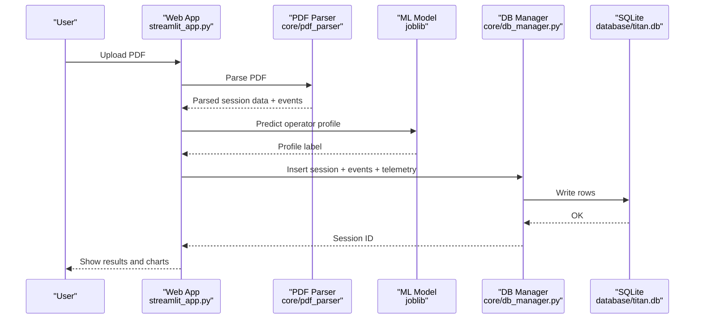
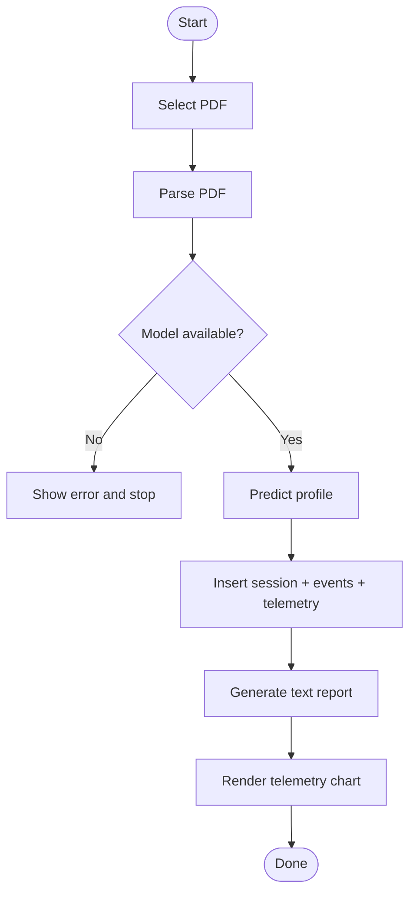
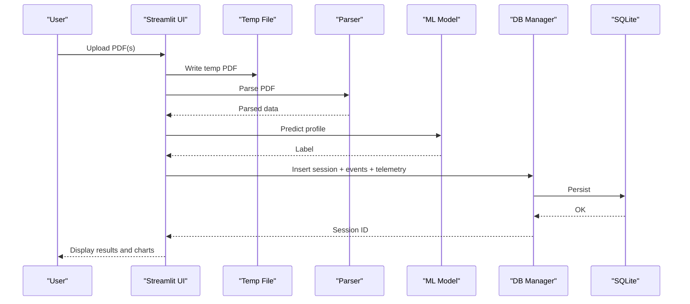
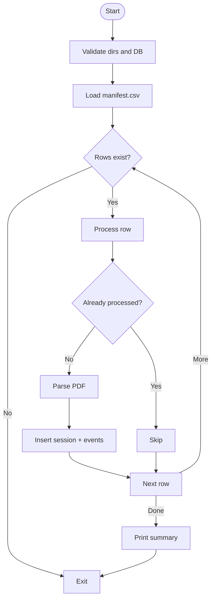
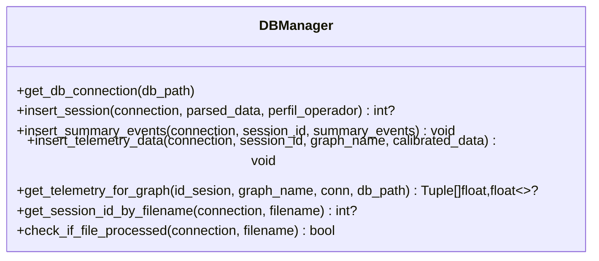
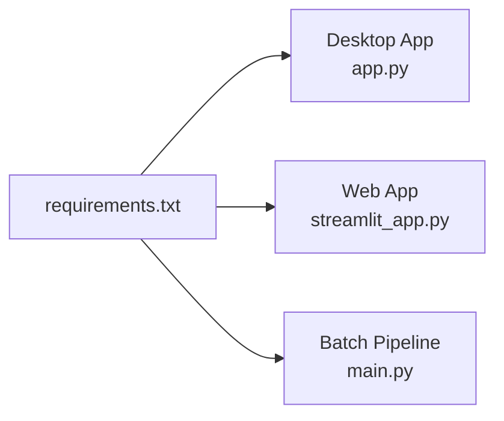

# Deployment and Production

<cite>
**Referenced Files in This Document**
- [app.py](file://app.py)
- [streamlit_app.py](file://streamlit_app.py)
- [main.py](file://main.py)
- [setup_database.py](file://setup_database.py)
- [database/schema.sql](file://database/schema.sql)
- [core/db_manager.py](file://core/db_manager.py)
- [requirements.txt](file://requirements.txt)
- [manifest.csv](file://manifest.csv)
</cite>

## Table of Contents
1. Introduction
2. Project Structure
3. Core Components
4. Architecture Overview
5. Detailed Component Analysis
6. Dependency Analysis
7. Performance Considerations
8. Troubleshooting Guide
9. Conclusion
10. Appendices

## Introduction
This document provides deployment and production guidance for the desktop (Tkinter/CustomTkinter) and web (Streamlit) applications, focusing on environment setup, configuration management, database initialization, dependency management, monitoring, containerization, cloud hosting, scaling, security, access control, data protection, maintenance procedures, and troubleshooting. It is designed to be accessible to both technical and non-technical readers while remaining grounded in the repository’s codebase.

## Project Structure
The project includes:
- Desktop application entry point using CustomTkinter
- Web application entry point using Streamlit
- Batch ETL pipeline driven by a manifest file
- SQLite database schema and setup script
- Database manager module for consistent DB operations
- Requirements file listing Python dependencies

**Diagram sources**
- [app.py:1-591](file://app.py#L1-L591)
- [streamlit_app.py:1-202](file://streamlit_app.py#L1-L202)
- [main.py:1-196](file://main.py#L1-L196)
- [core/db_manager.py:1-152](file://core/db_manager.py#L1-L152)
- [database/schema.sql:1-59](file://database/schema.sql#L1-L59)
- [requirements.txt:1-61](file://requirements.txt#L1-L61)
- [manifest.csv:1-20](file://manifest.csv#L1-L20)

**Section sources**
- [app.py:1-591](file://app.py#L1-L591)
- [streamlit_app.py:1-202](file://streamlit_app.py#L1-L202)
- [main.py:1-196](file://main.py#L1-L196)
- [core/db_manager.py:1-152](file://core/db_manager.py#L1-L152)
- [database/schema.sql:1-59](file://database/schema.sql#L1-L59)
- [requirements.txt:1-61](file://requirements.txt#L1-L61)
- [manifest.csv:1-20](file://manifest.csv#L1-L20)

## Core Components
- Desktop Application (app.py): Provides GUI for processing PDF reports, running ML classification, storing sessions/events/telemetry, generating evolution reports, exporting PDFs, and visualizing telemetry charts. Uses SQLite via core/db_manager.py.
- Web Application (streamlit_app.py): Same core logic exposed as a web UI with file upload, session analysis, telemetry visualization, and comparison workflows.
- Batch Pipeline (main.py): Processes PDFs listed in manifest.csv, validates structure, parses PDFs, inserts sessions and summary events into SQLite, and prints processing summaries.
- Database Manager (core/db_manager.py): Centralizes SQLite connections, session/event/telemetry insertion, and telemetry retrieval for graphs.
- Schema (database/schema.sql): Defines tables Sesiones, ResumenEventos, Telemetria and indexes.
- Setup Script (setup_database.py): Creates/recreates the SQLite database from schema.sql.
- Dependencies (requirements.txt): Pin versions for all Python packages used by the app and pipeline.
- Manifest (manifest.csv): Input list of PDF files and metadata for batch processing.

**Section sources**
- [app.py:308-589](file://app.py#L308-L589)
- [streamlit_app.py:32-110](file://streamlit_app.py#L32-L110)
- [main.py:22-196](file://main.py#L22-L196)
- [core/db_manager.py:23-152](file://core/db_manager.py#L23-L152)
- [database/schema.sql:14-59](file://database/schema.sql#L14-L59)
- [setup_database.py:9-53](file://setup_database.py#L9-L53)
- [requirements.txt:1-61](file://requirements.txt#L1-L61)
- [manifest.csv:1-20](file://manifest.csv#L1-L20)

## Architecture Overview
End-to-end flow for processing a PDF report:
- User uploads or selects a PDF
- System parses PDF content
- ML model predicts operator profile
- Session, event summaries, and telemetry are stored in SQLite
- Reports and charts are generated and displayed

**Diagram sources**
- [streamlit_app.py:69-110](file://streamlit_app.py#L69-L110)
- [core/db_manager.py:106-152](file://core/db_manager.py#L106-L152)
- [database/schema.sql:14-59](file://database/schema.sql#L14-L59)

## Detailed Component Analysis

### Desktop Application (app.py)
- Entry point initializes UI, loads config paths, builds layout, binds shortcuts, and handles user actions.
- Processing workflow:
  - Opens PDF selection dialog
  - Parses PDF, loads ML model, predicts profile
  - Inserts session, summary events, and telemetry into SQLite
  - Generates text report and renders telemetry chart
  - Supports export to PDF and evolution comparison
- Error handling uses try/except blocks with user-facing messages and status updates.

**Diagram sources**
- [app.py:411-547](file://app.py#L411-L547)

**Section sources**
- [app.py:308-589](file://app.py#L308-L589)

### Web Application (streamlit_app.py)
- Exposes same core logic via Streamlit UI with file uploaders for individual and comparative analyses.
- Uses temporary files for uploaded PDFs, processes them, stores results in SQLite, and displays JSON/session info, text reports, and telemetry charts.
- Includes helper functions for preparing prediction data and plotting charts.

**Diagram sources**
- [streamlit_app.py:69-110](file://streamlit_app.py#L69-L110)
- [core/db_manager.py:106-152](file://core/db_manager.py#L106-L152)

**Section sources**
- [streamlit_app.py:1-202](file://streamlit_app.py#L1-L202)

### Batch Pipeline (main.py)
- Validates required directories/files, reads manifest.csv, iterates rows, checks if already processed, parses PDFs, inserts sessions and summary events, and prints a summary including success rate.
- Robust error handling per row and overall connection errors.

**Diagram sources**
- [main.py:22-196](file://main.py#L22-L196)

**Section sources**
- [main.py:22-196](file://main.py#L22-L196)

### Database Manager (core/db_manager.py)
- Provides context-managed connections, safe insertions for sessions, summary events, and telemetry, and retrieval of telemetry series for charts.
- Handles parsing of comma-separated timestamp/value strings and ensures alignment before returning data points.

**Diagram sources**
- [core/db_manager.py:23-152](file://core/db_manager.py#L23-L152)

**Section sources**
- [core/db_manager.py:1-152](file://core/db_manager.py#L1-L152)

### Database Schema (database/schema.sql)
- Defines tables for sessions, event summaries, and telemetry with foreign keys and indexes for performance.
- Drops existing tables to ensure clean initialization when run via setup script.

**Section sources**
- [database/schema.sql:1-59](file://database/schema.sql#L1-L59)

### Database Setup (setup_database.py)
- Creates the database directory if missing, connects to SQLite, executes schema.sql, and confirms successful setup.
- Removes existing database file to ensure a clean start when executed directly.

**Section sources**
- [setup_database.py:9-53](file://setup_database.py#L9-L53)

## Dependency Analysis
- The application depends on Python packages for UI (CustomTkinter/Tkinter), data processing (pandas, numpy), PDF parsing (pdfminer.six, pdfplumber, PyMuPDF), image handling (Pillow), ML inference (joblib, scikit-learn, scipy), plotting (matplotlib), and web serving (streamlit).
- All dependencies are pinned in requirements.txt for reproducibility.

**Diagram sources**
- [requirements.txt:1-61](file://requirements.txt#L1-L61)
- [app.py:1-591](file://app.py#L1-L591)
- [streamlit_app.py:1-202](file://streamlit_app.py#L1-L202)
- [main.py:1-196](file://main.py#L1-L196)

**Section sources**
- [requirements.txt:1-61](file://requirements.txt#L1-L61)

## Performance Considerations
- Use SQLite indexes defined in schema.sql for faster queries on operator name, profile, and session IDs.
- Avoid unnecessary re-parsing by checking if a file was already processed before re-inserting.
- For large telemetry series, consider streaming or chunked processing in future enhancements.
- Keep models cached in memory during a single process run to avoid repeated disk reads.

[No sources needed since this section provides general guidance]

## Troubleshooting Guide
Common issues and resolutions:
- Missing ML model file: Ensure the classifier model exists at the expected path; otherwise, processing will fail with an error message.
- Database not initialized: Run the setup script to create/recreate the database schema before starting any pipeline or app.
- Manifest validation failures: Verify manifest columns and presence of referenced PDFs; missing fields cause rows to be skipped or errors logged.
- Connection errors: Confirm database directory exists and permissions allow read/write access.

Operational tips:
- Use the batch pipeline’s summary output to identify skipped and errored rows.
- In the web app, check temporary file cleanup and ensure sufficient disk space for uploads.
- When exporting PDFs, verify write permissions to the target directory.

**Section sources**
- [app.py:526-531](file://app.py#L526-L531)
- [streamlit_app.py:82-87](file://streamlit_app.py#L82-L87)
- [main.py:44-67](file://main.py#L44-L67)
- [setup_database.py:21-39](file://setup_database.py#L21-L39)

## Conclusion
This guide outlines how to deploy and maintain both desktop and web interfaces, manage configurations and dependencies, initialize and maintain the SQLite database, and operate the batch pipeline. Following these practices ensures reliable operation in production environments, supports scalability considerations, and helps maintain security and data integrity.

[No sources needed since this section summarizes without analyzing specific files]

## Appendices

### Environment Setup and Configuration Management
- Install dependencies using the pinned requirements file to ensure consistency across environments.
- Configure paths:
  - Desktop app sets database and exports directories relative to the project root.
  - Web app sets similar paths and creates the exports directory if missing.
  - Batch pipeline reads configuration constants for reports directory, database path, and manifest path.
- Environment variables:
  - While the current code uses hardcoded paths, you can externalize sensitive or environment-specific values (e.g., DB_PATH, MODELS_PATH, EXPORTS_DIR) via environment variables and load them at startup in each entry point.

**Section sources**
- [requirements.txt:1-61](file://requirements.txt#L1-L61)
- [app.py:356-369](file://app.py#L356-L369)
- [streamlit_app.py:32-48](file://streamlit_app.py#L32-L48)
- [main.py:15-20](file://main.py#L15-L20)

### Database Initialization Scripts
- Run the setup script to create/recreate the database schema from schema.sql.
- The schema defines tables and indexes necessary for sessions, event summaries, and telemetry storage.

**Section sources**
- [setup_database.py:9-53](file://setup_database.py#L9-L53)
- [database/schema.sql:1-59](file://database/schema.sql#L1-L59)

### Dependency Management
- Use the provided requirements file to install exact versions of all dependencies.
- Maintain a virtual environment per deployment to isolate dependencies.

**Section sources**
- [requirements.txt:1-61](file://requirements.txt#L1-L61)

### Monitoring Setup
- Add logging to capture key events:
  - Start/end of processing steps
  - Errors and exceptions with stack traces
  - Counts of processed/skipped/error rows in batch mode
- Metrics to track:
  - Number of sessions inserted per time window
  - Average processing time per PDF
  - Error rates by step (parse, predict, insert)
- Export metrics to a central system (e.g., Prometheus) if running in containers or cloud services.

[No sources needed since this section provides general guidance]

### Security Best Practices and Access Control
- Restrict file system access:
  - Limit write permissions to the database and exports directories to the application user only.
- Secure model artifacts:
  - Store ML models in a protected location and validate their integrity before loading.
- Input validation:
  - Validate filenames and paths to prevent injection or traversal attacks.
- Network exposure:
  - For Streamlit deployments, use reverse proxies with TLS termination and authentication.
- Data protection:
  - Encrypt backups of the SQLite database at rest.
  - Apply least privilege principles for database access.

[No sources needed since this section provides general guidance]

### Containerized Deployment
- Create a Dockerfile that:
  - Uses a Python base image matching your environment
  - Installs dependencies from requirements.txt
  - Copies application code and assets
  - Sets working directory and entrypoint for the desired mode (desktop headless, Streamlit server, or batch pipeline)
- Example modes:
  - Streamlit server: run streamlit with appropriate host/port flags
  - Batch pipeline: execute main.py with scheduled jobs or CI/CD triggers
- Volume mounts:
  - Mount persistent volumes for the database and exports directory to preserve data across restarts.

[No sources needed since this section provides general guidance]

### Cloud Hosting Options
- Streamlit apps can be hosted on platforms that support Python web apps (e.g., managed container services or app platforms).
- Use environment variables to configure DB_PATH, MODELS_PATH, and other settings per environment.
- Enable HTTPS and authentication at the platform level.

[No sources needed since this section provides general guidance]

### Scaling Considerations
- Read-heavy workloads:
  - Consider read replicas or caching layers for telemetry retrieval if scaling beyond a single instance.
- Concurrency:
  - SQLite has limitations under high concurrency; consider connection pooling strategies or migrating to a more robust RDBMS if needed.
- Horizontal scaling:
  - Stateless Streamlit instances behind a load balancer can scale horizontally; ensure shared storage for DB and exports.

[No sources needed since this section provides general guidance]

### Maintenance Procedures
- Database backup:
  - Regularly copy the SQLite database file to a secure backup location.
  - Schedule automated backups with retention policies.
- Migration:
  - Update schema.sql for new features and apply migrations carefully; test in staging first.
- Model updates and versioning:
  - Version ML models alongside application releases; validate feature compatibility before deployment.
- Performance monitoring:
  - Track query performance and adjust indexes or data structures as needed.

**Section sources**
- [database/schema.sql:55-59](file://database/schema.sql#L55-L59)

### Batch Processing and Manifest Usage
- Prepare manifest.csv with required columns and valid PDF references.
- Run the batch pipeline to process all entries; review the printed summary for success rates and errors.

**Section sources**
- [main.py:69-98](file://main.py#L69-L98)
- [manifest.csv:1-20](file://manifest.csv#L1-L20)