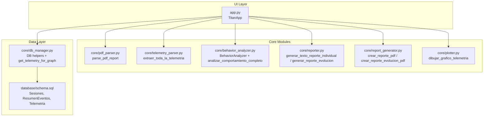
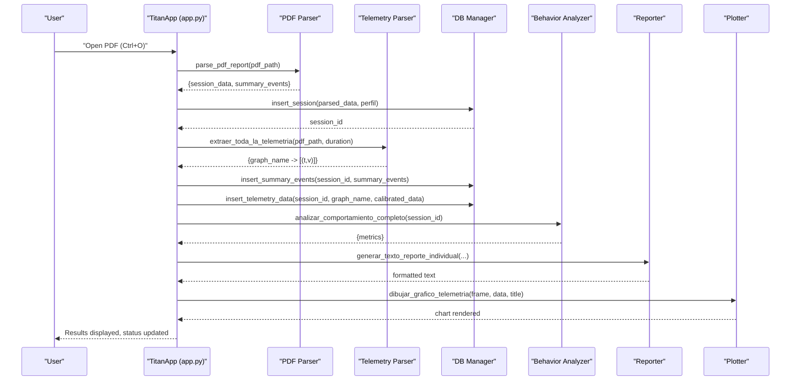
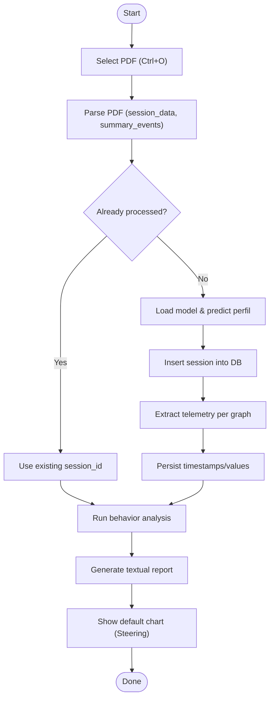
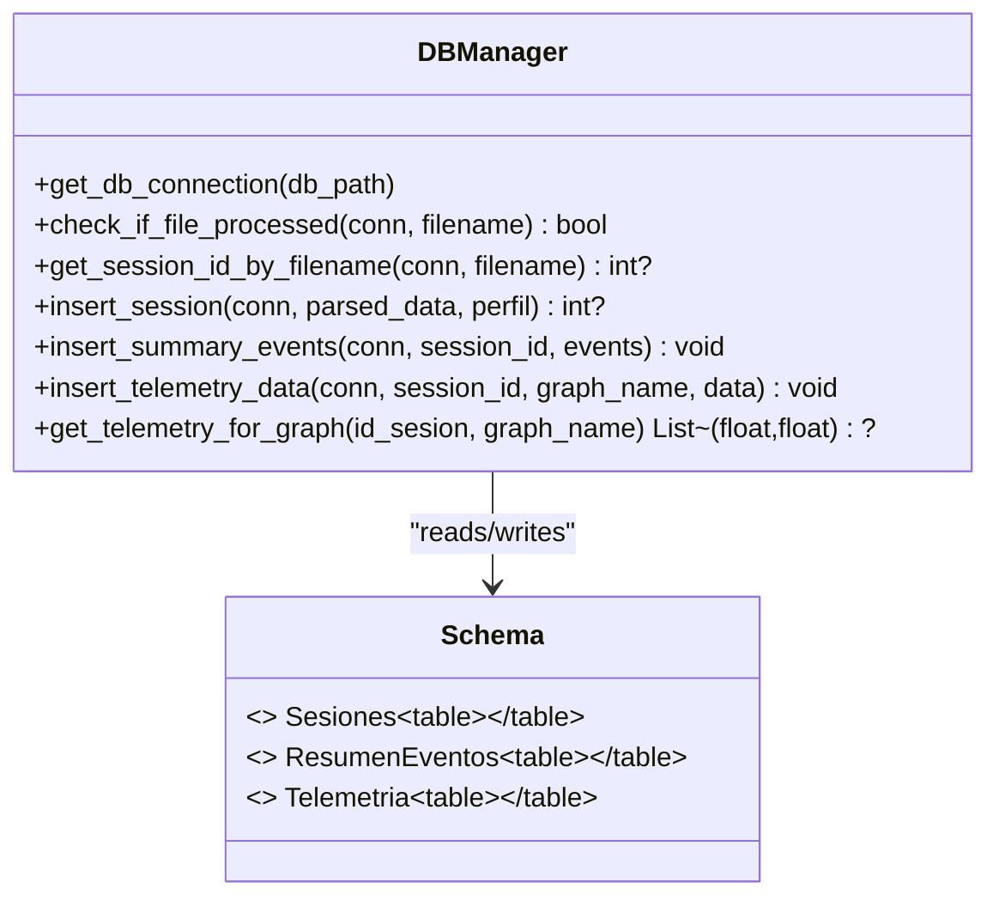
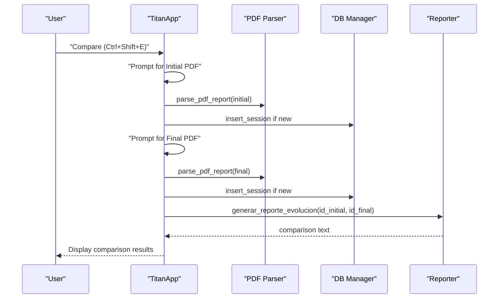
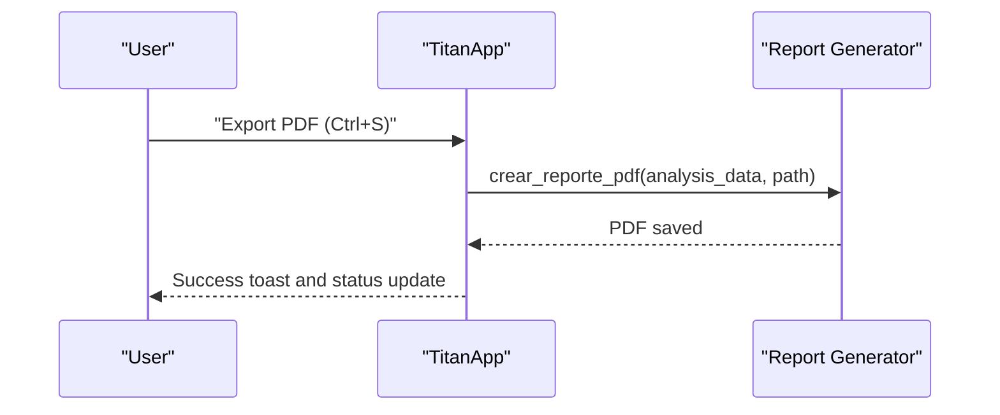
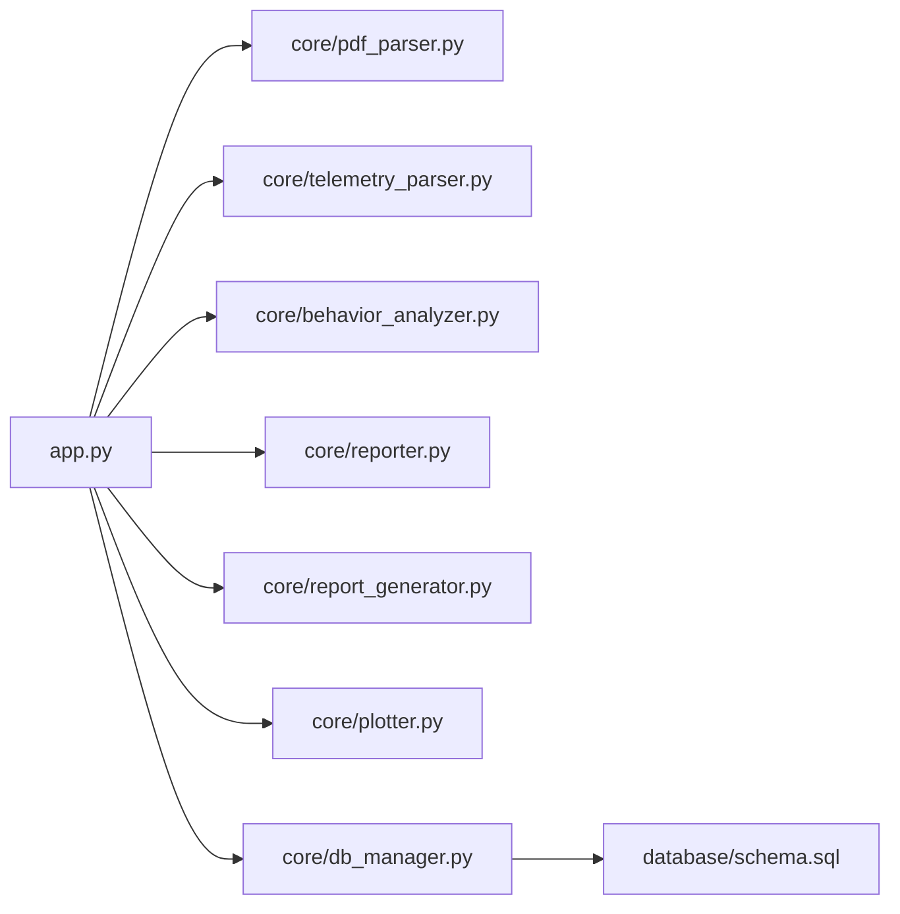

# Core Workflows and Operations

<cite>
**Referenced Files in This Document**
- [main.py](file://main.py)
- [app.py](file://app.py)
- [core/pdf_parser.py](file://core/pdf_parser.py)
- [core/telemetry_parser.py](file://core/telemetry_parser.py)
- [core/db_manager.py](file://core/db_manager.py)
- [core/behavior_analyzer.py](file://core/behavior_analyzer.py)
- [core/reporter.py](file://core/reporter.py)
- [core/report_generator.py](file://core/report_generator.py)
- [core/plotter.py](file://core/plotter.py)
- [database/schema.sql](file://database/schema.sql)
</cite>

## Table of Contents
1. [Introduction](#introduction)
2. [Project Structure](#project-structure)
3. [Core Components](#core-components)
4. [Architecture Overview](#architecture-overview)
5. [Detailed Component Analysis](#detailed-component-analysis)
6. [Dependency Analysis](#dependency-analysis)
7. [Performance Considerations](#performance-considerations)
8. [Troubleshooting Guide](#troubleshooting-guide)
9. [Conclusion](#conclusion)
10. [Appendices](#appendices)

## Introduction
This document explains the main application workflows of the Proyecto Titán desktop application, focusing on:
- PDF processing workflow from file selection through parsing, analysis, and result display
- Session management system with database integration, session creation, and data persistence
- Comparison workflow for analyzing multiple training sessions side-by-side
- Export functionality to generate reports and data files
- Keyboard shortcuts, menu operations, and error handling strategies
- Step-by-step examples of each workflow with expected user interactions and system responses

## Project Structure
The application is organized into a UI layer (CustomTkinter), core processing modules, and a SQLite database. Key directories and files include:
- app.py: Main desktop application with UI, menus, keyboard shortcuts, and workflow orchestration
- core/: Processing modules for PDF parsing, telemetry extraction, behavior analysis, reporting, plotting, and database access
- database/schema.sql: Database schema defining tables for sessions, event summaries, and telemetry series

**Diagram sources**
- [app.py:308-395](file://app.py#L308-L395)
- [core/pdf_parser.py:27-57](file://core/pdf_parser.py#L27-L57)
- [core/telemetry_parser.py:125-154](file://core/telemetry_parser.py#L125-L154)
- [core/behavior_analyzer.py:150-167](file://core/behavior_analyzer.py#L150-L167)
- [core/reporter.py:51-120](file://core/reporter.py#L51-L120)
- [core/report_generator.py:28-149](file://core/report_generator.py#L28-L149)
- [core/plotter.py:15-70](file://core/plotter.py#L15-L70)
- [core/db_manager.py:23-90](file://core/db_manager.py#L23-L90)
- [database/schema.sql:14-59](file://database/schema.sql#L14-L59)

**Section sources**
- [app.py:308-395](file://app.py#L308-L395)
- [database/schema.sql:14-59](file://database/schema.sql#L14-L59)

## Core Components
- PDF Parser: Extracts session metadata and summary events from the first page of the report PDF using regex patterns.
- Telemetry Parser: Extracts time-series data from specific pages and images within the PDF, calibrating pixel coordinates to real-world values.
- Behavior Analyzer: Computes behavioral metrics from telemetry and summary events, classifying operator profiles and generating detailed analyses.
- Reporter: Formats textual reports for individual sessions and evolution comparisons, including narrative feedback.
- Report Generator: Produces professional PDF reports for individual analysis and evolution comparison.
- Plotter: Renders telemetry time-series charts inside the CustomTkinter UI.
- DB Manager: Provides database connections, session/event/telemetry insertion, and retrieval functions for graphs and session lookups.

**Section sources**
- [core/pdf_parser.py:27-124](file://core/pdf_parser.py#L27-L124)
- [core/telemetry_parser.py:16-154](file://core/telemetry_parser.py#L16-L154)
- [core/behavior_analyzer.py:16-167](file://core/behavior_analyzer.py#L16-L167)
- [core/reporter.py:19-120](file://core/reporter.py#L19-L120)
- [core/report_generator.py:12-149](file://core/report_generator.py#L12-L149)
- [core/plotter.py:15-70](file://core/plotter.py#L15-L70)
- [core/db_manager.py:23-152](file://core/db_manager.py#L23-L152)

## Architecture Overview
The application follows a layered architecture:
- UI orchestrates workflows via TitanApp methods bound to menu items and keyboard shortcuts
- Core modules perform parsing, analysis, reporting, and visualization
- Data layer persists sessions, event summaries, and telemetry series in SQLite

**Diagram sources**
- [app.py:411-449](file://app.py#L411-L449)
- [core/pdf_parser.py:27-57](file://core/pdf_parser.py#L27-L57)
- [core/telemetry_parser.py:125-154](file://core/telemetry_parser.py#L125-L154)
- [core/db_manager.py:106-152](file://core/db_manager.py#L106-L152)
- [core/behavior_analyzer.py:150-167](file://core/behavior_analyzer.py#L150-L167)
- [core/reporter.py:51-92](file://core/reporter.py#L51-L92)
- [core/plotter.py:15-70](file://core/plotter.py#L15-L70)

## Detailed Component Analysis

### PDF Processing Workflow
End-to-end flow from file selection to results display:
- User selects a PDF via file dialog or Ctrl+O
- Application parses session metadata and summary events
- If not already processed, the app predicts operator profile using a machine learning model and inserts session data
- Telemetry is extracted per configured graphs and persisted
- Behavior analysis runs and textual report is generated
- Default chart is shown; user can switch variables

**Diagram sources**
- [app.py:411-449](file://app.py#L411-L449)
- [core/pdf_parser.py:27-57](file://core/pdf_parser.py#L27-L57)
- [core/telemetry_parser.py:125-154](file://core/telemetry_parser.py#L125-L154)
- [core/db_manager.py:106-152](file://core/db_manager.py#L106-L152)

**Section sources**
- [app.py:411-449](file://app.py#L411-L449)
- [core/pdf_parser.py:27-124](file://core/pdf_parser.py#L27-L124)
- [core/telemetry_parser.py:16-154](file://core/telemetry_parser.py#L16-L154)
- [core/db_manager.py:106-152](file://core/db_manager.py#L106-L152)

### Session Management System
Database integration and persistence:
- Tables: Sesiones (session metadata), ResumenEventos (aggregated events), Telemetria (time-series)
- Functions:
  - get_db_connection: context manager for safe connection handling
  - check_if_file_processed / get_session_id_by_filename: idempotent processing
  - insert_session: persist session metadata and predicted profile
  - insert_summary_events: persist aggregated event counts and penalties/rewards
  - insert_telemetry_data: persist timestamp/value series per graph
  - get_telemetry_for_graph: retrieve series for plotting

**Diagram sources**
- [core/db_manager.py:23-152](file://core/db_manager.py#L23-L152)
- [database/schema.sql:14-59](file://database/schema.sql#L14-L59)

**Section sources**
- [core/db_manager.py:23-152](file://core/db_manager.py#L23-L152)
- [database/schema.sql:14-59](file://database/schema.sql#L14-L59)

### Comparison Workflow
Side-by-side analysis of two training sessions:
- User triggers “Generar evolución” via menu or Ctrl+Shift+E
- App prompts for initial and final PDFs
- Both are parsed and inserted if needed; session IDs retrieved
- Evolution report text is generated comparing scores and profiles
- UI displays comparison results

**Diagram sources**
- [app.py:451-482](file://app.py#L451-L482)
- [core/reporter.py:98-120](file://core/reporter.py#L98-L120)

**Section sources**
- [app.py:451-482](file://app.py#L451-L482)
- [core/reporter.py:98-120](file://core/reporter.py#L98-L120)

### Export Functionality
Generating reports and data files:
- Individual export: Creates a formatted PDF report for the current analysis
- Evolution export: Generates a comparative PDF report for two sessions
- UI provides save-as dialog with default filenames based on operator name

**Diagram sources**
- [app.py:494-512](file://app.py#L494-L512)
- [core/report_generator.py:28-75](file://core/report_generator.py#L28-L75)

**Section sources**
- [app.py:494-512](file://app.py#L494-L512)
- [core/report_generator.py:28-149](file://core/report_generator.py#L28-L149)

### Keyboard Shortcuts and Menu Operations
- File menu:
  - “Procesar reporte…” → Ctrl+O → procesar_reporte_individual
  - “Generar evolución…” → Ctrl+Shift+E → generar_reporte_evolucion
  - “Exportar PDF…” → Ctrl+S → exportar_a_pdf
  - “Salir” → Ctrl+Q → cerrar_aplicacion
- View menu:
  - Theme switching (dark/light)
  - UI scaling options
- Status bar tooltips indicate shortcuts next to buttons

**Section sources**
- [app.py:336-354](file://app.py#L336-L354)
- [app.py:391-395](file://app.py#L391-L395)
- [app.py:237-258](file://app.py#L237-L258)

### Error Handling Strategies
- Centralized error display in the results area with clear titles and details
- Toast notifications for success and error states
- Loading overlay during long-running operations
- Graceful fallbacks when ML model files are missing or PDF parsing fails
- Database errors caught and rolled back where appropriate

**Section sources**
- [app.py:571-575](file://app.py#L571-L575)
- [app.py:445-449](file://app.py#L445-L449)
- [core/db_manager.py:106-152](file://core/db_manager.py#L106-L152)

## Dependency Analysis
Key dependencies and relationships:
- app.py depends on core modules for parsing, analysis, reporting, plotting, and DB access
- core modules depend on sqlite3 and external libraries (pdfplumber, matplotlib, opencv, joblib)
- Database schema defines relational structure between sessions, events, and telemetry

**Diagram sources**
- [app.py:33-42](file://app.py#L33-L42)
- [core/db_manager.py:23-90](file://core/db_manager.py#L23-L90)
- [database/schema.sql:14-59](file://database/schema.sql#L14-L59)

**Section sources**
- [app.py:33-42](file://app.py#L33-L42)
- [core/db_manager.py:23-90](file://core/db_manager.py#L23-L90)
- [database/schema.sql:14-59](file://database/schema.sql#L14-L59)

## Performance Considerations
- PDF parsing uses regex on page text; ensure locale settings are correct for date parsing
- Telemetry extraction relies on image processing; performance depends on PDF structure and image resolution
- Database writes use batched inserts for summary events and serialized telemetry series
- Plotting uses Matplotlib with dark theme; avoid excessive re-renders by clearing frames before drawing

[No sources needed since this section provides general guidance]

## Troubleshooting Guide
Common issues and resolutions:
- Missing ML model file: Ensure models/modelo_clasificador.joblib exists; otherwise prediction cannot proceed
- PDF parsing failures: Validate that required fields exist on page 1; parser returns None on critical errors
- Telemetry extraction failures: Verify PDF contains expected pages and images; parser logs missing pages/images
- Database connectivity: Use context manager to ensure connections are closed; handle sqlite3 errors gracefully
- Chart rendering: If no data available, plotter shows a message instead of crashing

**Section sources**
- [app.py:526-531](file://app.py#L526-L531)
- [core/pdf_parser.py:27-57](file://core/pdf_parser.py#L27-L57)
- [core/telemetry_parser.py:130-151](file://core/telemetry_parser.py#L130-L151)
- [core/db_manager.py:23-33](file://core/db_manager.py#L23-L33)
- [core/plotter.py:32-36](file://core/plotter.py#L32-L36)

## Conclusion
Proyecto Titán’s desktop application provides a robust pipeline for processing training reports, extracting telemetry, analyzing behavior, and generating actionable insights. The modular design separates concerns across UI, core processing, and data layers, enabling scalable extension and maintainability. Users can process single sessions, compare progress over time, and export comprehensive reports, all supported by keyboard shortcuts and intuitive menus.

[No sources needed since this section summarizes without analyzing specific files]

## Appendices

### Step-by-Step Examples

#### Example 1: Process a Single PDF Report
- User action: Open app, press Ctrl+O or click “Procesar reporte”
- Expected interaction:
  - File dialog opens; select a PDF report
  - Loading overlay appears while processing
  - Session is parsed, inserted (if new), telemetry extracted, behavior analyzed
  - Textual report displayed in “Resumen” tab; default chart shown
  - Toast notification confirms success; status bar shows session ID
- System response:
  - If already processed, existing session ID is reused
  - If ML model missing, error dialog guides user to place the model file

**Section sources**
- [app.py:411-449](file://app.py#L411-L449)
- [core/pdf_parser.py:27-57](file://core/pdf_parser.py#L27-L57)
- [core/telemetry_parser.py:125-154](file://core/telemetry_parser.py#L125-L154)
- [core/db_manager.py:106-152](file://core/db_manager.py#L106-L152)

#### Example 2: Compare Two Sessions
- User action: Press Ctrl+Shift+E or click “Generar evolución”
- Expected interaction:
  - Prompt for initial PDF; then prompt for final PDF
  - Both parsed and inserted if necessary
  - Comparison text generated and displayed
  - Toast notification confirms completion; status bar shows session IDs
- System response:
  - If either file fails to process, error message displayed

**Section sources**
- [app.py:451-482](file://app.py#L451-L482)
- [core/reporter.py:98-120](file://core/reporter.py#L98-L120)

#### Example 3: Export Report to PDF
- User action: Press Ctrl+S or click “Exportar a PDF”
- Expected interaction:
  - Save dialog opens with default filename based on operator name
  - PDF generated and saved; toast confirms success; status bar shows filename
- System response:
  - If no analysis active, warning dialog instructs to process a report first

**Section sources**
- [app.py:494-512](file://app.py#L494-L512)
- [core/report_generator.py:28-75](file://core/report_generator.py#L28-L75)