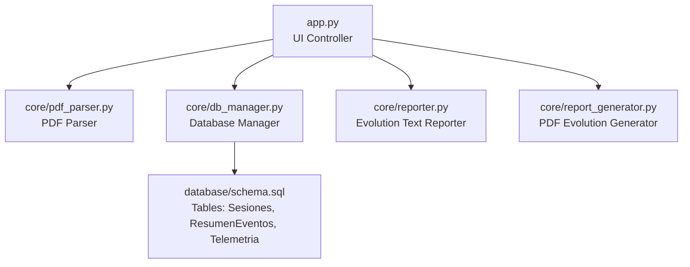
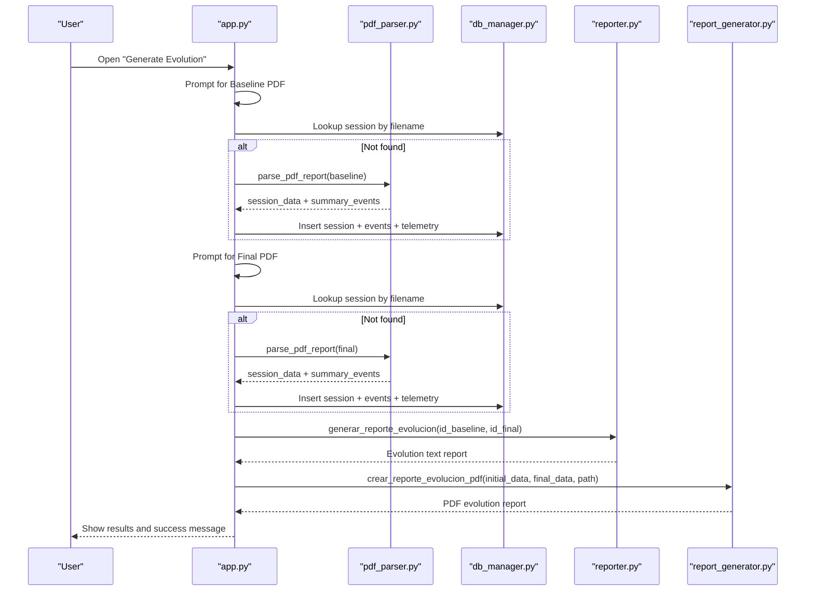
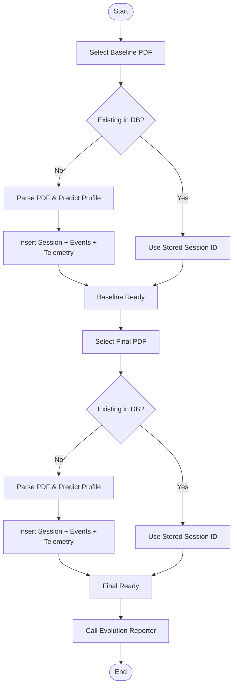
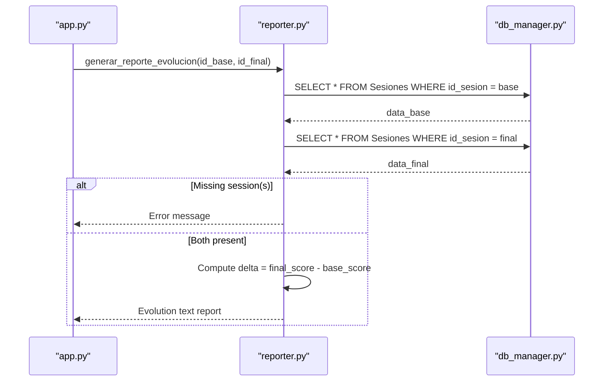
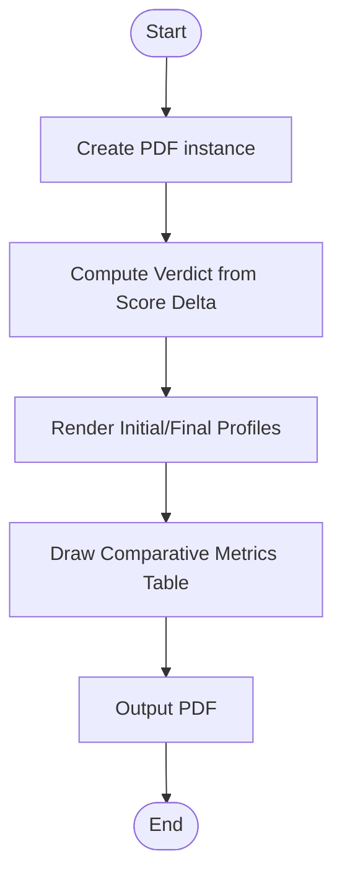
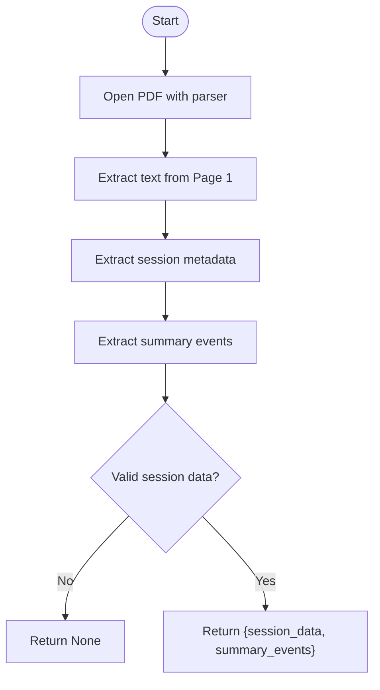
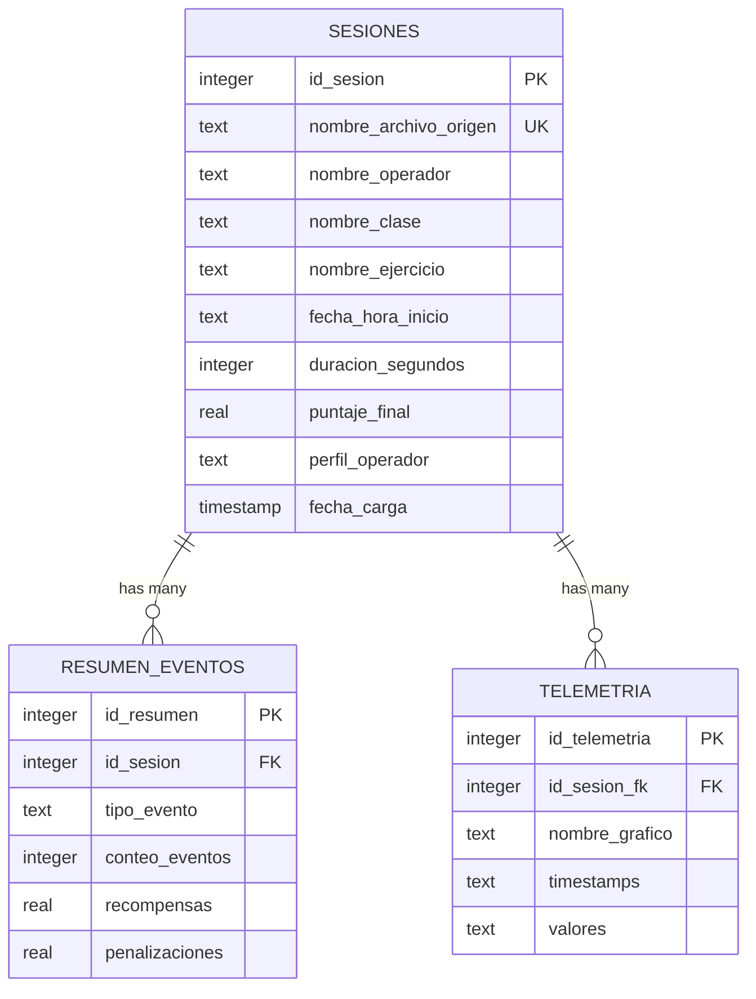
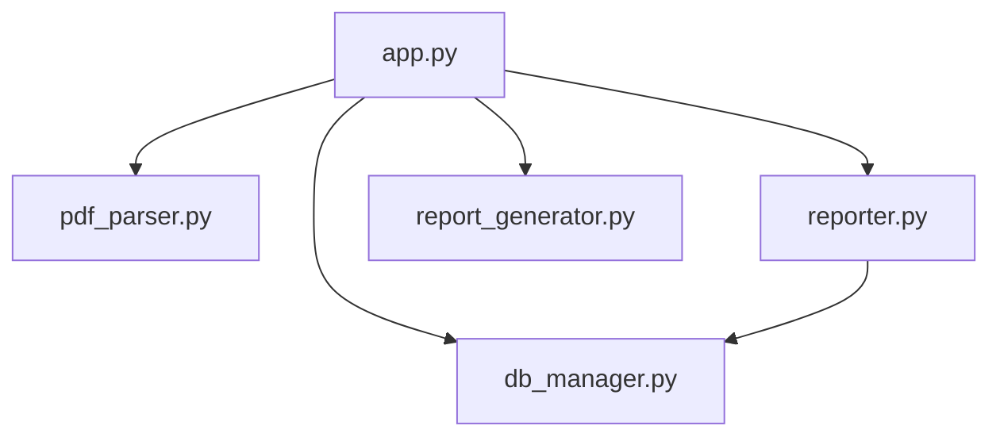

# Multi-Session Comparison Workflow

<cite>
**Referenced Files in This Document**
- [app.py](file://app.py)
- [reporter.py](file://core/reporter.py)
- [report_generator.py](file://core/report_generator.py)
- [pdf_parser.py](file://core/pdf_parser.py)
- [db_manager.py](file://core/db_manager.py)
- [schema.sql](file://database/schema.sql)
</cite>

## Table of Contents
1. [Introduction](#introduction)
2. [Project Structure](#project-structure)
3. [Core Components](#core-components)
4. [Architecture Overview](#architecture-overview)
5. [Detailed Component Analysis](#detailed-component-analysis)
6. [Dependency Analysis](#dependency-analysis)
7. [Performance Considerations](#performance-considerations)
8. [Troubleshooting Guide](#troubleshooting-guide)
9. [Conclusion](#conclusion)
10. [Appendices](#appendices)

## Introduction
This document explains the multi-session comparison workflow that enables evolution analysis between training sessions. The system allows users to select two PDF reports (baseline and final), processes each session individually, and generates a comparative evolution report. At the core is the method that orchestrates dual file selection, per-session processing, and the generation of a comparison output using the evolution reporting function. It also details how baseline and final metrics are extracted, how performance improvements are calculated, and what the report outputs look like. Error handling strategies and user guidance for meaningful comparisons are included.

## Project Structure
The multi-session comparison workflow spans several modules:
- UI orchestration and user interaction for selecting two PDFs and triggering the comparison
- PDF parsing to extract session metadata and event summaries
- Database management to persist or retrieve session records
- Reporter module to generate text-based evolution reports
- Report generator module to create professional PDF evolution reports

**Diagram sources**
- [app.py:451-482](file://app.py#L451-L482)
- [pdf_parser.py:27-57](file://core/pdf_parser.py#L27-L57)
- [db_manager.py:93-152](file://core/db_manager.py#L93-L152)
- [reporter.py:98-120](file://core/reporter.py#L98-L120)
- [report_generator.py:80-147](file://core/report_generator.py#L80-L147)
- [schema.sql:14-52](file://database/schema.sql#L14-L52)

**Section sources**
- [app.py:451-482](file://app.py#L451-L482)
- [pdf_parser.py:27-57](file://core/pdf_parser.py#L27-L57)
- [db_manager.py:93-152](file://core/db_manager.py#L93-L152)
- [reporter.py:98-120](file://core/reporter.py#L98-L120)
- [report_generator.py:80-147](file://core/report_generator.py#L80-L147)
- [schema.sql:14-52](file://database/schema.sql#L14-L52)

## Core Components
- Dual file selection and workflow control: The UI prompts the user twice to choose baseline and final PDF files, then triggers per-session processing and comparison.
- Session processing pipeline: For each selected PDF, the system either retrieves an existing session ID by filename or parses the PDF, runs classification, persists session data, and stores telemetry.
- Evolution report generation: A function compares two sessions by IDs, extracts baseline and final metrics from the database, computes deltas, and returns a formatted evolution report.
- PDF evolution report creation: A dedicated generator creates a professional PDF with verdicts, profile evolution, and comparative metric tables.

Key responsibilities:
- app.py: Orchestrates user interactions, coordinates parsing and storage, and invokes evolution reporting functions.
- pdf_parser.py: Extracts session metadata and summary events from PDFs.
- db_manager.py: Manages SQLite connections and provides helpers to insert/retrieve session data and telemetry.
- reporter.py: Generates text-based evolution reports comparing two sessions.
- report_generator.py: Produces PDF evolution reports with comparative tables and verdicts.

**Section sources**
- [app.py:451-482](file://app.py#L451-L482)
- [app.py:514-547](file://app.py#L514-L547)
- [pdf_parser.py:27-57](file://core/pdf_parser.py#L27-L57)
- [db_manager.py:93-152](file://core/db_manager.py#L93-L152)
- [reporter.py:98-120](file://core/reporter.py#L98-L120)
- [report_generator.py:80-147](file://core/report_generator.py#L80-L147)

## Architecture Overview
The multi-session comparison workflow follows this sequence:
1. User selects baseline PDF; if not found in DB, parse and store session.
2. User selects final PDF; if not found in DB, parse and store session.
3. Call evolution report generator with both session IDs.
4. Generate text report and optionally produce a PDF evolution report.

**Diagram sources**
- [app.py:451-482](file://app.py#L451-L482)
- [app.py:514-547](file://app.py#L514-L547)
- [pdf_parser.py:27-57](file://core/pdf_parser.py#L27-L57)
- [db_manager.py:93-152](file://core/db_manager.py#L93-L152)
- [reporter.py:98-120](file://core/reporter.py#L98-L120)
- [report_generator.py:80-147](file://core/report_generator.py#L80-L147)

## Detailed Component Analysis

### Dual File Selection and Processing Flow
- The UI method prompts for two PDF files sequentially: first the baseline, then the final. If either selection is canceled, the process stops gracefully.
- For each PDF:
  - Check if the file already exists in the database by filename. If yes, reuse the stored session ID.
  - If not present, parse the PDF to extract session metadata and summary events.
  - Load the ML model and predict operator profile based on parsed features.
  - Persist session data, event summaries, and telemetry into the database.
  - Copy the PDF to exports directory for reference.

**Diagram sources**
- [app.py:451-482](file://app.py#L451-L482)
- [app.py:514-547](file://app.py#L514-L547)
- [pdf_parser.py:27-57](file://core/pdf_parser.py#L27-L57)
- [db_manager.py:93-152](file://core/db_manager.py#L93-L152)

**Section sources**
- [app.py:451-482](file://app.py#L451-L482)
- [app.py:514-547](file://app.py#L514-L547)

### Evolution Report Generation: generar_reporte_evolucion
- Input: Two session IDs (baseline and final).
- Data retrieval: Queries the database for both sessions.
- Validation: Returns an error message if either session is missing.
- Output: A formatted text report including:
  - Operator name
  - Initial and final profiles
  - Initial and final scores
  - Delta calculation showing improvement or regression

**Diagram sources**
- [reporter.py:98-120](file://core/reporter.py#L98-L120)
- [db_manager.py:93-98](file://core/db_manager.py#L93-L98)

**Section sources**
- [reporter.py:98-120](file://core/reporter.py#L98-L120)

### PDF Evolution Report Creation: crear_reporte_evolucion_pdf
- Inputs: Dictionaries containing initial and final session data (operator name, profiles, scores, penalties).
- Verdict logic: Computes a qualitative verdict based on score delta thresholds.
- Comparative table: Renders rows for key metrics (final score, total penalties) with deltas and directional arrows indicating improvement or regression.
- Output: A professional PDF with header/footer, verdict, profile evolution, and comparative metrics.

**Diagram sources**
- [report_generator.py:80-147](file://core/report_generator.py#L80-L147)

**Section sources**
- [report_generator.py:80-147](file://core/report_generator.py#L80-L147)

### PDF Parsing and Session Extraction
- Parses the first page of the PDF to extract:
  - Operator name, class name, exercise name, start time, duration, final score
  - Summary events (type, counts, rewards, penalties)
- Validates that essential fields exist; returns None if invalid.
- Converts durations and dates to standardized formats.

**Diagram sources**
- [pdf_parser.py:27-57](file://core/pdf_parser.py#L27-L57)
- [pdf_parser.py:66-101](file://core/pdf_parser.py#L66-L101)

**Section sources**
- [pdf_parser.py:27-57](file://core/pdf_parser.py#L27-L57)
- [pdf_parser.py:66-101](file://core/pdf_parser.py#L66-L101)

### Database Schema and Storage
- Tables:
  - Sesiones: Stores general session info including operator name, class, exercise, timestamps, duration, final score, and predicted profile.
  - ResumenEventos: Aggregated event counts, rewards, and penalties per session.
  - Telemetria: Time series data for graphs (timestamps and values).
- Indexes optimize queries by operator, profile, and session foreign keys.

**Diagram sources**
- [schema.sql:14-52](file://database/schema.sql#L14-L52)

**Section sources**
- [schema.sql:14-52](file://database/schema.sql#L14-L52)

## Dependency Analysis
- app.py depends on:
  - pdf_parser.py for extracting session data from PDFs
  - db_manager.py for database operations and session persistence
  - reporter.py for generating evolution text reports
  - report_generator.py for creating PDF evolution reports
- reporter.py depends on db_manager.py to fetch session records
- report_generator.py is independent but consumes structured dictionaries prepared by app.py and reporter logic
- pdf_parser.py is self-contained except for locale configuration and regex patterns

**Diagram sources**
- [app.py:451-482](file://app.py#L451-L482)
- [reporter.py:98-120](file://core/reporter.py#L98-L120)
- [pdf_parser.py:27-57](file://core/pdf_parser.py#L27-L57)
- [db_manager.py:93-152](file://core/db_manager.py#L93-L152)
- [report_generator.py:80-147](file://core/report_generator.py#L80-L147)

**Section sources**
- [app.py:451-482](file://app.py#L451-L482)
- [reporter.py:98-120](file://core/reporter.py#L98-L120)
- [pdf_parser.py:27-57](file://core/pdf_parser.py#L27-L57)
- [db_manager.py:93-152](file://core/db_manager.py#L93-L152)
- [report_generator.py:80-147](file://core/report_generator.py#L80-L147)

## Performance Considerations
- PDF parsing uses regex on the first page; ensure PDFs have consistent formatting to avoid repeated retries or fallbacks.
- Database queries are indexed for operator and profile; keep session filenames unique to enable fast lookup by filename.
- Model loading occurs only when needed; cache the model object to avoid repeated disk reads during multiple comparisons.
- Telemetry insertion batches event summaries and serializes time series; ensure large datasets do not exceed memory limits during serialization.

[No sources needed since this section provides general guidance]

## Troubleshooting Guide
Common issues and resolutions:
- One or both sessions fail to process:
  - If a PDF cannot be parsed or lacks required fields, the system returns None; the UI will show an error and stop the comparison.
  - Ensure PDFs contain valid operator names, scores, and other required fields.
- Missing ML model:
  - If the classifier file is not found, the system displays a critical error instructing to place the model in the models directory.
- Database connection errors:
  - Connection failures raise exceptions; verify the database path and permissions.
- No matching session by filename:
  - If the same PDF was processed before, it should reuse the stored session ID; otherwise, reprocess the PDF.

Error handling paths:
- UI shows error messages via a dedicated error handler that clears panels and displays detailed messages.
- Evolution reporter returns a clear error string when sessions are missing.

**Section sources**
- [app.py:451-482](file://app.py#L451-L482)
- [app.py:514-547](file://app.py#L514-L547)
- [reporter.py:98-120](file://core/reporter.py#L98-L120)

## Conclusion
The multi-session comparison workflow integrates UI-driven dual file selection, robust PDF parsing, persistent session storage, and comprehensive evolution reporting. Users can compare baseline and final sessions to understand operator performance changes over time. The system calculates deltas, provides qualitative verdicts, and produces both text and PDF reports. Proper error handling ensures graceful failures and actionable feedback. For meaningful comparisons, ensure consistent PDF formats and use sessions from the same operator and similar exercises.

[No sources needed since this section summarizes without analyzing specific files]

## Appendices

### Example Comparison Scenarios
- Scenario A: Improved operator performance
  - Baseline score lower than final score; positive delta indicates improvement; verdict may indicate moderate or significant improvement depending on threshold.
- Scenario B: Regression detected
  - Final score lower than baseline; negative delta; verdict indicates regression; review event summaries and telemetry for causes.
- Scenario C: Stagnant performance
  - Minimal delta; verdict indicates stagnant performance; consider targeted interventions based on event patterns.

### Metric Interpretation
- Final score: Overall performance indicator; higher is better.
- Total penalties: Lower is better; reductions indicate improved behavior.
- Profile evolution: Changes in predicted operator profile reflect behavioral shifts.
- Event summaries: Counts and penalties per event type help identify specific areas for improvement.

### Report Output Formats
- Text evolution report: Includes operator name, initial/final profiles, scores, and delta.
- PDF evolution report: Includes verdict, profile evolution, and comparative metrics table with deltas and directional indicators.

[No sources needed since this section provides conceptual examples and interpretations]