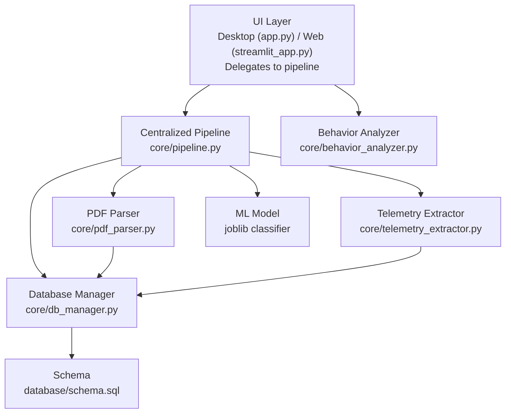
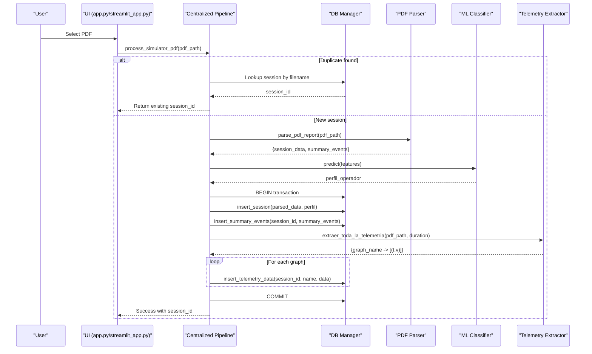
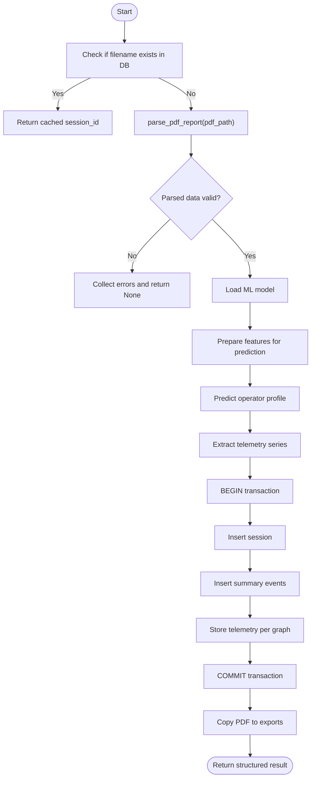
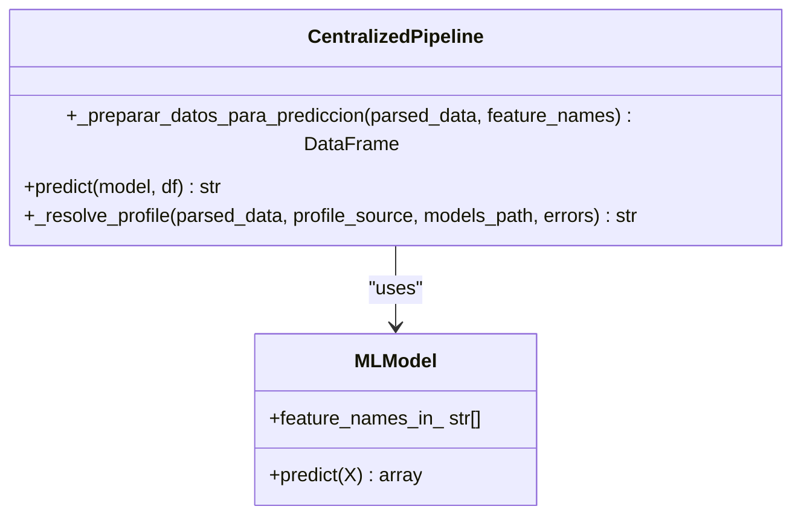
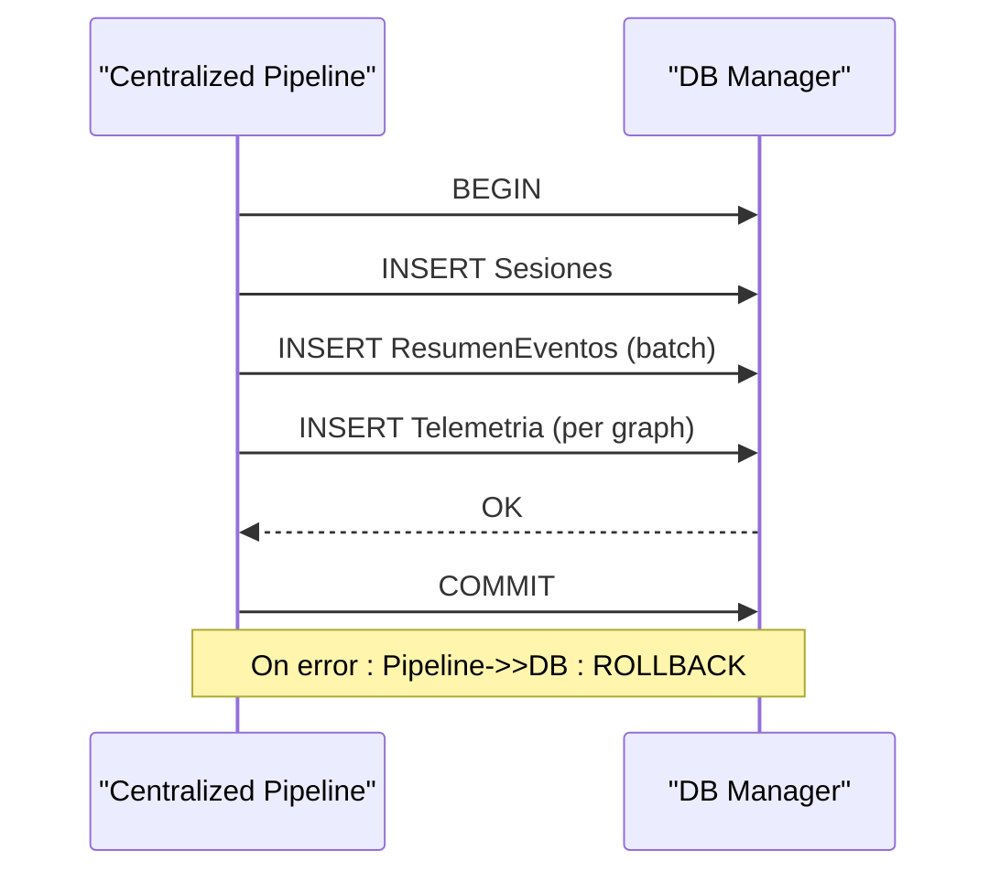
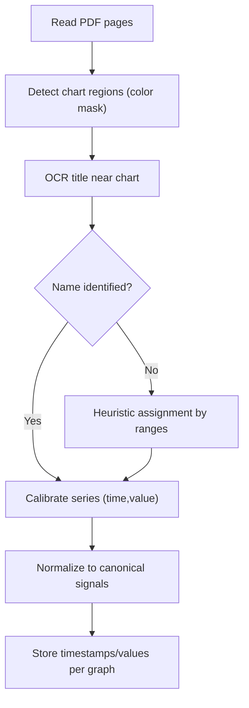
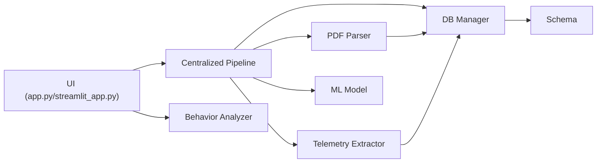

# PDF Processing Workflow

<cite>
**Referenced Files in This Document**
- [app.py](file://app.py)
- [streamlit_app.py](file://streamlit_app.py)
- [core/pipeline.py](file://core/pipeline.py)
- [core/pdf_parser.py](file://core/pdf_parser.py)
- [core/db_manager.py](file://core/db_manager.py)
- [core/telemetry_extractor.py](file://core/telemetry_extractor.py)
- [core/behavior_analyzer.py](file://core/behavior_analyzer.py)
- [database/schema.sql](file://database/schema.sql)
</cite>

## Update Summary
**Changes Made**
- Updated architecture overview to reflect centralized pipeline design
- Modified orchestration section to show delegation pattern instead of internal implementation
- Added new centralized pipeline component documentation
- Updated dependency analysis to show new architectural relationships
- Enhanced error handling documentation to reflect pipeline's robust approach

## Table of Contents
1. [Introduction](#introduction)
2. [Project Structure](#project-structure)
3. [Core Components](#core-components)
4. [Architecture Overview](#architecture-overview)
5. [Detailed Component Analysis](#detailed-component-analysis)
6. [Dependency Analysis](#dependency-analysis)
7. [Performance Considerations](#performance-considerations)
8. [Troubleshooting Guide](#troubleshooting-guide)
9. [Conclusion](#conclusion)

## Introduction
This document explains the end-to-end PDF processing workflow in Proyecto Titán, from file selection to parsing, validation, ML-based operator profiling, and database storage. The system now uses a centralized pipeline architecture where frontend applications delegate all PDF processing logic to a unified headless pipeline, eliminating code duplication and ensuring consistent behavior across desktop and web interfaces.

## Project Structure
The workflow spans UI entry points, centralized pipeline processing, PDF parsing, telemetry extraction, ML prediction, and database persistence:
- Desktop UI (Tkinter): app.py - delegates to centralized pipeline
- Web UI (Streamlit): streamlit_app.py - delegates to centralized pipeline  
- Centralized Pipeline: core/pipeline.py - orchestrates entire ETL process
- PDF parsing: core/pdf_parser.py
- Telemetry extraction: core/telemetry_extractor.py
- Database management: core/db_manager.py
- Behavior analysis: core/behavior_analyzer.py
- Database schema: database/schema.sql



**Diagram sources**
- [app.py:29-33](file://app.py#L29-L33)
- [streamlit_app.py:16-22](file://streamlit_app.py#L16-L22)
- [core/pipeline.py:176-297](file://core/pipeline.py#L176-L297)
- [core/pdf_parser.py:27-124](file://core/pdf_parser.py#L27-L124)
- [core/telemetry_extractor.py:220-273](file://core/telemetry_extractor.py#L220-L273)
- [core/db_manager.py:23-152](file://core/db_manager.py#L23-L152)
- [database/schema.sql:14-59](file://database/schema.sql#L14-L59)

## Core Components
- **Centralized Pipeline**: Orchestrates the entire PDF processing workflow with transactional safety, duplicate detection, and error handling
- **PDF parser**: extracts session metadata and consolidated event summaries using regex patterns on page 1 text
- **Telemetry extractor**: detects chart regions via color segmentation, identifies curves, uses OCR for titles, calibrates time/value series, and maps to canonical graph names
- **Database manager**: provides connection context, session/event/telemetry insertion, duplicate lookup by filename, and telemetry retrieval for graphs
- **ML integration**: loads a joblib classifier, prepares features from parsed data, and predicts an operator profile used for reporting and learning paths
- **Behavior analyzer**: computes detailed metrics from stored telemetry for reporting and insights

**Section sources**
- [core/pipeline.py:176-297](file://core/pipeline.py#L176-L297)
- [core/pdf_parser.py:27-124](file://core/pdf_parser.py#L27-L124)
- [core/telemetry_extractor.py:220-273](file://core/telemetry_extractor.py#L220-L273)
- [core/db_manager.py:23-152](file://core/db_manager.py#L23-L152)
- [core/behavior_analyzer.py:150-167](file://core/behavior_analyzer.py#L150-L167)

## Architecture Overview
The workflow is now orchestrated through a centralized pipeline that both UI components call. Frontend applications delegate all PDF processing logic to `process_simulator_pdf`, which handles duplicate detection, PDF parsing, ML prediction, transactional database writes, and telemetry extraction in a single cohesive flow.



**Diagram sources**
- [app.py:505-531](file://app.py#L505-L531)
- [streamlit_app.py:46-72](file://streamlit_app.py#L46-L72)
- [core/pipeline.py:176-297](file://core/pipeline.py#L176-L297)
- [core/pdf_parser.py:27-124](file://core/pdf_parser.py#L27-L124)
- [core/telemetry_extractor.py:220-273](file://core/telemetry_extractor.py#L220-L273)
- [core/db_manager.py:23-152](file://core/db_manager.py#L23-L152)

## Detailed Component Analysis

### Centralized Pipeline Orchestration: process_simulator_pdf
The centralized pipeline method is now the heart of the workflow, handling:
- Idempotent duplicate detection by filename
- PDF parsing and validation
- ML feature preparation and prediction
- Transactional database writes (session, events, telemetry)
- File copy to exports directory
- Comprehensive error collection and logging
- Return of structured result dictionary



**Diagram sources**
- [core/pipeline.py:176-297](file://core/pipeline.py#L176-L297)

**Section sources**
- [core/pipeline.py:176-297](file://core/pipeline.py#L176-L297)

### Frontend Delegation Pattern
Both frontend applications now use a simple delegation pattern:

**Desktop UI (app.py)**:
```python
def _procesar_y_obtener_id(self, pdf_path: str) -> Optional[int]:
    """Adapter fino de UI: delega 100% en ``core.pipeline.process_simulator_pdf``."""
    resultado = process_simulator_pdf(
        pdf_path,
        profile_source="model",
        db_path=self.DB_PATH,
        exports_dir=self.EXPORTS_DIR,
    )
    # Handle errors and return session_id
```

**Web UI (streamlit_app.py)**:
```python
def _procesar_reporte(pdf_path: str) -> Optional[int]:
    """Adapter fino de UI: delega 100% en ``core.pipeline.process_simulator_pdf``."""
    resultado = process_simulator_pdf(
        pdf_path,
        profile_source="model",
        db_path=DB_PATH,
        models_path=MODELS_PATH,
        exports_dir=EXPORTS_DIR,
    )
    # Display errors and return session_id
```

**Section sources**
- [app.py:505-531](file://app.py#L505-L531)
- [streamlit_app.py:46-72](file://streamlit_app.py#L46-L72)

### PDF Text Extraction: parse_pdf_report
- Opens the PDF and reads page 1 text
- Extracts session metadata (operator name, class, exercise, score, start time, duration)
- Extracts consolidated event rows into structured summaries
- Validates presence of required fields; returns None if invalid

Key behaviors:
- Locale setup for date parsing
- Robust float/datetime/duration parsing helpers
- Regex-based extraction for key fields and consolidated results table

**Section sources**
- [core/pdf_parser.py:27-124](file://core/pdf_parser.py#L27-L124)

### Data Validation Steps
- Session data must include operator name; otherwise parsing fails
- Duration string is converted to seconds; invalid values default safely
- Score is parsed as float; invalid values default to 0.0
- Event summaries are validated during insertion with type-safe conversions

**Section sources**
- [core/pdf_parser.py:66-124](file://core/pdf_parser.py#L66-L124)
- [core/db_manager.py:126-139](file://core/db_manager.py#L126-L139)

### Error Handling Mechanisms
The centralized pipeline implements comprehensive error handling:
- PDF parsing exceptions are collected and logged without aborting the entire process
- ML model loading failures produce explicit warnings and allow session creation without profile
- Database operations use transactions with automatic rollback on failure
- UI layers receive structured error information for appropriate user feedback

**Section sources**
- [core/pipeline.py:221-297](file://core/pipeline.py#L221-L297)
- [app.py:520-531](file://app.py#L520-L531)
- [streamlit_app.py:61-72](file://streamlit_app.py#L61-L72)

### ML Model Integration and Feature Preparation
The centralized pipeline includes robust ML integration:
- Loads a joblib classifier from configurable path
- Prepares features from parsed session data and event summaries:
  - Final score and duration
  - Per-event counts and penalties mapped to column names expected by the model
- Handles missing or mismatched feature names by filling zeros
- Executes prediction to obtain operator profile used for reporting and learning path mapping



**Diagram sources**
- [core/pipeline.py:60-95](file://core/pipeline.py#L60-L95)
- [core/pipeline.py:97-133](file://core/pipeline.py#L97-L133)

**Section sources**
- [core/pipeline.py:60-133](file://core/pipeline.py#L60-L133)

### Database Transaction Flow
The centralized pipeline ensures transactional integrity:
- Begins a transaction before writing session and related data
- Inserts session record with parsed metadata and predicted profile
- Inserts summarized events for the session
- Extracts telemetry series and inserts them per graph
- Commits on success; rolls back on any insertion failure
- Provides comprehensive error reporting



**Diagram sources**
- [core/pipeline.py:264-290](file://core/pipeline.py#L264-L290)
- [core/db_manager.py:106-152](file://core/db_manager.py#L106-L152)

**Section sources**
- [core/pipeline.py:264-290](file://core/pipeline.py#L264-L290)
- [core/db_manager.py:106-152](file://core/db_manager.py#L106-L152)

### Telemetry Extraction and Storage
The centralized pipeline handles telemetry extraction with best-effort approach:
- Detects chart candidates via color segmentation and morphological operations
- Uses OCR to identify chart titles; falls back to heuristics based on value ranges when OCR fails
- Calibrates pixel coordinates to real-world time and value scales using known ranges per graph
- Stores timestamps and values as comma-separated strings in the Telemetria table
- Normalizes signals to canonical names for consistency



**Diagram sources**
- [core/telemetry_extractor.py:220-273](file://core/telemetry_extractor.py#L220-L273)
- [core/pipeline.py:135-161](file://core/pipeline.py#L135-L161)

**Section sources**
- [core/telemetry_extractor.py:220-273](file://core/telemetry_extractor.py#L220-L273)
- [core/pipeline.py:135-161](file://core/pipeline.py#L135-L161)

### Behavior Analysis Integration
After successful processing, behavior analysis retrieves telemetry from the database and computes metrics such as braking intensity, steering volatility, acceleration spikes, fork height adjustments, tilt adjustments, and speed statistics. These metrics feed into textual reports and visualizations.

**Section sources**
- [core/behavior_analyzer.py:150-167](file://core/behavior_analyzer.py#L150-L167)
- [core/behavior_analyzer.py:95-147](file://core/behavior_analyzer.py#L95-L147)

## Dependency Analysis
The new architecture creates clear separation of concerns:
- UI components depend only on the centralized pipeline interface
- Pipeline depends on PDF parser, telemetry extractor, DB manager, and ML model
- PDF parser has no runtime dependencies beyond standard libraries and pdfplumber
- Telemetry extractor depends on OpenCV, NumPy, pypdfium2, and Tesseract OCR
- DB manager abstracts SQLite interactions and provides safe connection handling
- Behavior analyzer reads from the database to compute metrics



**Diagram sources**
- [app.py:29-33](file://app.py#L29-L33)
- [streamlit_app.py:16-22](file://streamlit_app.py#L16-L22)
- [core/pipeline.py:33-44](file://core/pipeline.py#L33-L44)
- [core/db_manager.py:23-33](file://core/db_manager.py#L23-L33)
- [database/schema.sql:14-59](file://database/schema.sql#L14-L59)

**Section sources**
- [app.py:29-33](file://app.py#L29-L33)
- [streamlit_app.py:16-22](file://streamlit_app.py#L16-L22)
- [core/pipeline.py:33-44](file://core/pipeline.py#L33-L44)
- [core/db_manager.py:23-33](file://core/db_manager.py#L23-L33)
- [database/schema.sql:14-59](file://database/schema.sql#L14-L59)

## Performance Considerations
- PDF parsing is limited to page 1 text; ensure reports place key metadata there
- Telemetry extraction uses image processing; performance depends on PDF resolution and chart complexity
- Batch insertion of summary events reduces round-trips to the database
- Storing telemetry as comma-separated strings avoids per-point inserts but increases payload size
- ML prediction is lightweight once the model is loaded; ensure model caching at application startup
- Centralized pipeline eliminates redundant processing between UI components
- Transactional database operations improve data consistency and recovery

## Troubleshooting Guide
Common issues and resolutions with the centralized pipeline:
- Missing ML model file: The pipeline logs warnings and continues without profile assignment
- Duplicate PDF detected: The system returns cached session ID without reprocessing
- Parsing failures: If session data cannot be extracted, the pipeline collects errors and returns None
- Telemetry extraction failures: Best-effort approach allows session creation even without telemetry
- Database errors: Automatic rollback ensures data consistency; check logs for SQL errors

User feedback improvements:
- Desktop UI shows structured error messages from pipeline results
- Streamlit UI displays pipeline errors and success indicators inline
- Both interfaces benefit from consistent error handling and status reporting

**Section sources**
- [core/pipeline.py:221-297](file://core/pipeline.py#L221-L297)
- [app.py:520-531](file://app.py#L520-L531)
- [streamlit_app.py:61-72](file://streamlit_app.py#L61-L72)

## Conclusion
Proyecto Titán's PDF processing workflow now leverages a centralized pipeline architecture that eliminates code duplication while maintaining robust functionality. The unified approach ensures consistent behavior across desktop and web interfaces, provides comprehensive error handling, and maintains transactional integrity for database operations. The modular design allows for easy maintenance and future enhancements while providing clear separation between UI presentation and business logic processing.