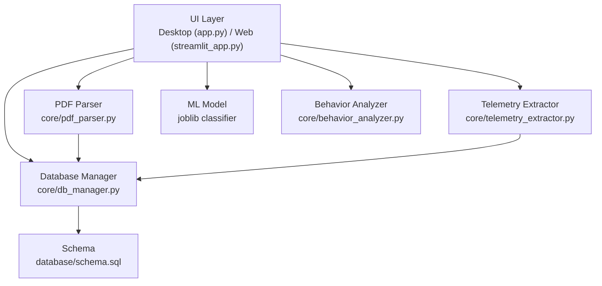
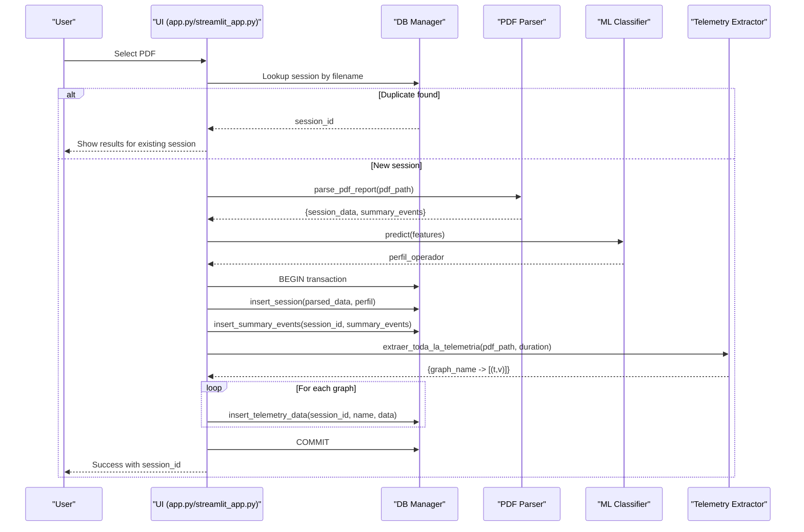
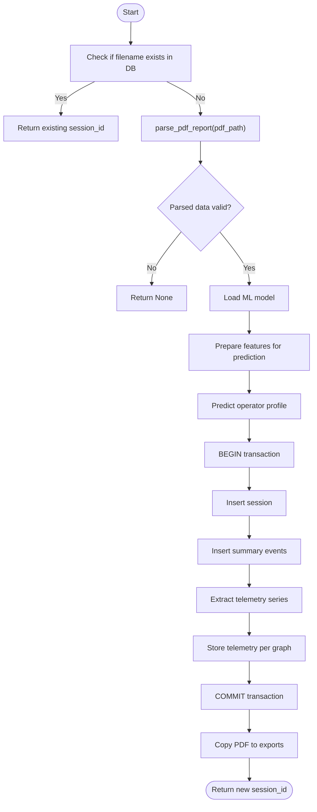
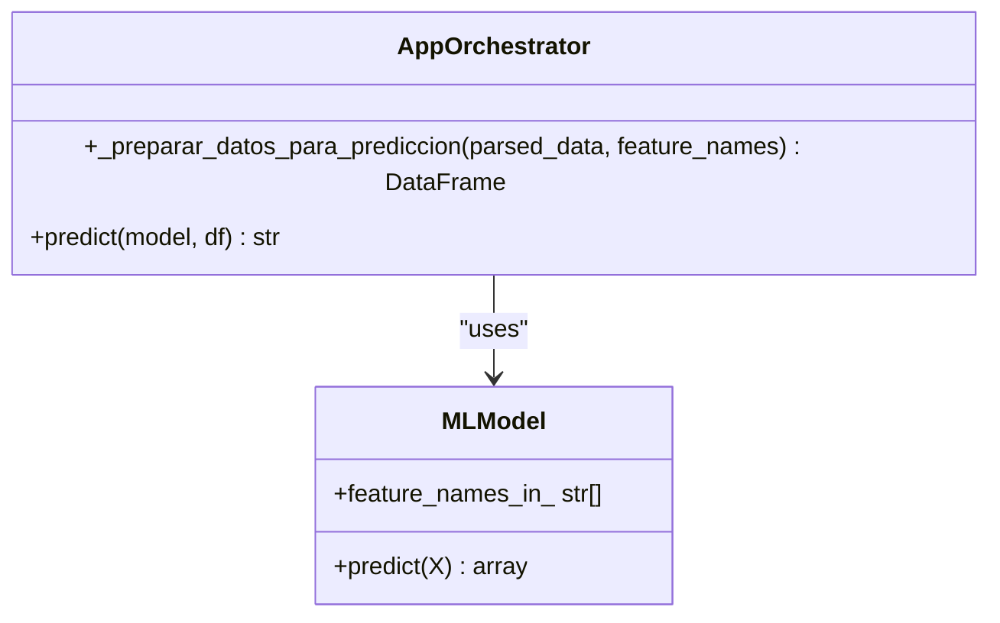
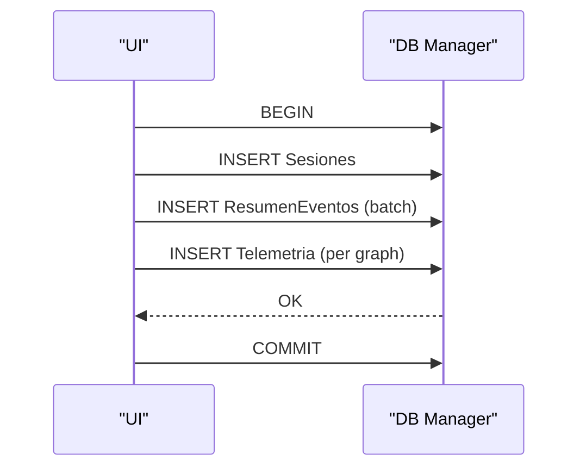
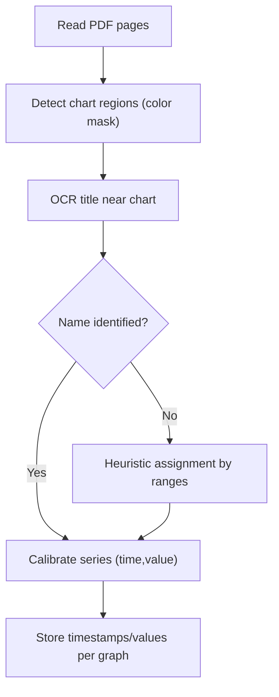
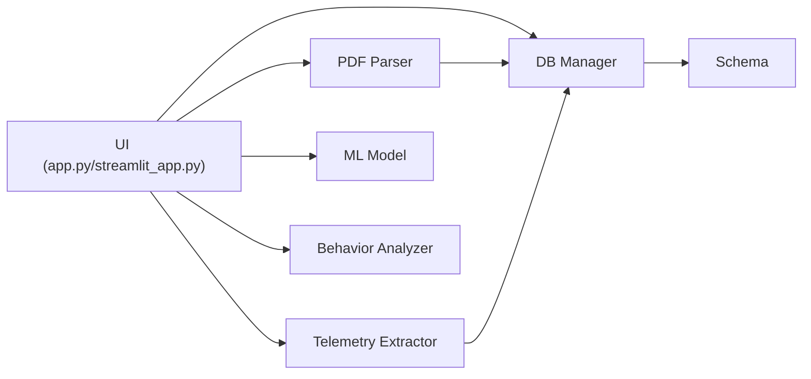

# PDF Processing Workflow

<cite>
**Referenced Files in This Document**
- [app.py](file://app.py)
- [streamlit_app.py](file://streamlit_app.py)
- [core/pdf_parser.py](file://core/pdf_parser.py)
- [core/db_manager.py](file://core/db_manager.py)
- [core/telemetry_extractor.py](file://core/telemetry_extractor.py)
- [core/behavior_analyzer.py](file://core/behavior_analyzer.py)
- [database/schema.sql](file://database/schema.sql)
</cite>

## Table of Contents
1. [Introduction](#introduction)
2. [Project Structure](#project-structure)
3. [Core Components](#core-components)
4. [Architecture Overview](#architecture-overview)
5. [Detailed Component Analysis](#detailed-component-analysis)
6. [Dependency Analysis](#dependency-analysis)
7. [Performance Considerations](#performance-considerations)
8. [Troubleshooting Guide](#troubleshooting-guide)
9. [Conclusion](#conclusion)

## Introduction
This document explains the end-to-end PDF processing workflow in Proyecto Titán, from file selection to parsing, validation, ML-based operator profiling, and database storage. It focuses on the core method that orchestrates both duplicate detection and new session creation, details text extraction and event summarization, describes telemetry extraction and storage, and outlines error handling and user feedback across desktop and web interfaces.

## Project Structure
The workflow spans UI entry points, PDF parsing, telemetry extraction, ML prediction, and database persistence:
- Desktop UI (Tkinter): app.py
- Web UI (Streamlit): streamlit_app.py
- PDF parsing: core/pdf_parser.py
- Telemetry extraction: core/telemetry_extractor.py
- Database management: core/db_manager.py
- Behavior analysis: core/behavior_analyzer.py
- Database schema: database/schema.sql

**Diagram sources**
- [app.py:33-42](file://app.py#L33-L42)
- [streamlit_app.py:17-27](file://streamlit_app.py#L17-L27)
- [core/pdf_parser.py:27-57](file://core/pdf_parser.py#L27-L57)
- [core/telemetry_extractor.py:202-238](file://core/telemetry_extractor.py#L202-L238)
- [core/db_manager.py:23-33](file://core/db_manager.py#L23-L33)
- [database/schema.sql:14-52](file://database/schema.sql#L14-L52)

**Section sources**
- [app.py:308-589](file://app.py#L308-L589)
- [streamlit_app.py:54-110](file://streamlit_app.py#L54-L110)
- [core/pdf_parser.py:27-124](file://core/pdf_parser.py#L27-L124)
- [core/telemetry_extractor.py:202-238](file://core/telemetry_extractor.py#L202-L238)
- [core/db_manager.py:93-152](file://core/db_manager.py#L93-L152)
- [database/schema.sql:14-59](file://database/schema.sql#L14-L59)

## Core Components
- PDF parser: extracts session metadata and consolidated event summaries using regex patterns on page 1 text.
- Telemetry extractor: detects chart regions via color segmentation, identifies curves, uses OCR for titles, calibrates time/value series, and maps to canonical graph names.
- Database manager: provides connection context, session/event/telemetry insertion, duplicate lookup by filename, and telemetry retrieval for graphs.
- ML integration: loads a joblib classifier, prepares features from parsed data, and predicts an operator profile used for reporting and learning paths.
- Behavior analyzer: computes detailed metrics from stored telemetry for reporting and insights.

**Section sources**
- [core/pdf_parser.py:27-124](file://core/pdf_parser.py#L27-L124)
- [core/telemetry_extractor.py:202-238](file://core/telemetry_extractor.py#L202-L238)
- [core/db_manager.py:93-152](file://core/db_manager.py#L93-L152)
- [core/behavior_analyzer.py:150-167](file://core/behavior_analyzer.py#L150-L167)

## Architecture Overview
The workflow is orchestrated by UI components that call a central processing method to handle both existing sessions and new ones. For new sessions, it parses the PDF, runs ML prediction, persists session and events, extracts and stores telemetry, and finally returns the session ID for downstream visualization and reporting.

**Diagram sources**
- [app.py:514-547](file://app.py#L514-L547)
- [streamlit_app.py:69-110](file://streamlit_app.py#L69-L110)
- [core/pdf_parser.py:27-57](file://core/pdf_parser.py#L27-L57)
- [core/telemetry_extractor.py:202-238](file://core/telemetry_extractor.py#L202-L238)
- [core/db_manager.py:106-152](file://core/db_manager.py#L106-L152)

## Detailed Component Analysis

### Orchestration: _procesar_y_obtener_id
This method is the heart of the workflow. It performs:
- Duplicate detection by filename
- PDF parsing and validation
- ML feature preparation and prediction
- Transactional database writes (session, events, telemetry)
- File copy to exports directory
- Return of session_id or None on failure

**Diagram sources**
- [app.py:514-547](file://app.py#L514-L547)
- [streamlit_app.py:69-110](file://streamlit_app.py#L69-L110)
- [core/db_manager.py:106-152](file://core/db_manager.py#L106-L152)

**Section sources**
- [app.py:514-547](file://app.py#L514-L547)
- [streamlit_app.py:69-110](file://streamlit_app.py#L69-L110)

### PDF Text Extraction: parse_pdf_report
- Opens the PDF and reads page 1 text.
- Extracts session metadata (operator name, class, exercise, score, start time, duration).
- Extracts consolidated event rows into structured summaries.
- Validates presence of required fields; returns None if invalid.

Key behaviors:
- Locale setup for date parsing.
- Robust float/datetime/duration parsing helpers.
- Regex-based extraction for key fields and consolidated results table.

**Section sources**
- [core/pdf_parser.py:27-124](file://core/pdf_parser.py#L27-L124)

### Data Validation Steps
- Session data must include operator name; otherwise parsing fails.
- Duration string is converted to seconds; invalid values default safely.
- Score is parsed as float; invalid values default to 0.0.
- Event summaries are validated during insertion with type-safe conversions.

**Section sources**
- [core/pdf_parser.py:66-124](file://core/pdf_parser.py#L66-L124)
- [core/db_manager.py:126-139](file://core/db_manager.py#L126-L139)

### Error Handling Mechanisms
- PDF parsing exceptions return None with diagnostic logs.
- ML model loading failures produce explicit user errors and abort processing.
- Database operations use transactions; failures trigger rollback.
- UI layers show toast messages and status updates; critical errors display stack traces in the results area.

**Section sources**
- [core/pdf_parser.py:55-57](file://core/pdf_parser.py#L55-L57)
- [app.py:526-531](file://app.py#L526-L531)
- [core/db_manager.py:106-152](file://core/db_manager.py#L106-L152)
- [app.py:571-575](file://app.py#L571-L575)

### ML Model Integration and Feature Preparation
- Loads a joblib classifier from models directory.
- Prepares features from parsed session data and event summaries:
  - Final score and duration
  - Per-event counts and penalties mapped to column names expected by the model
- Handles missing or mismatched feature names by filling zeros.
- Executes prediction to obtain operator profile used for reporting and learning path mapping.

**Diagram sources**
- [app.py:549-569](file://app.py#L549-L569)
- [streamlit_app.py:54-67](file://streamlit_app.py#L54-L67)

**Section sources**
- [app.py:526-534](file://app.py#L526-L534)
- [app.py:549-569](file://app.py#L549-L569)
- [streamlit_app.py:82-90](file://streamlit_app.py#L82-L90)
- [streamlit_app.py:54-67](file://streamlit_app.py#L54-L67)

### Database Transaction Flow
- Begins a transaction before writing session and related data.
- Inserts session record with parsed metadata and predicted profile.
- Inserts summarized events for the session.
- Extracts telemetry series and inserts them per graph.
- Commits on success; rolls back on any insertion failure.

**Diagram sources**
- [app.py:536-544](file://app.py#L536-L544)
- [streamlit_app.py:93-108](file://streamlit_app.py#L93-L108)
- [core/db_manager.py:106-152](file://core/db_manager.py#L106-L152)

**Section sources**
- [app.py:536-547](file://app.py#L536-L547)
- [streamlit_app.py:93-110](file://streamlit_app.py#L93-L110)
- [core/db_manager.py:106-152](file://core/db_manager.py#L106-L152)

### Telemetry Extraction and Storage
- Detects chart candidates via color segmentation and morphological operations.
- Uses OCR to identify chart titles; falls back to heuristics based on value ranges when OCR fails.
- Calibrates pixel coordinates to real-world time and value scales using known ranges per graph.
- Stores timestamps and values as comma-separated strings in the Telemetria table.

**Diagram sources**
- [core/telemetry_extractor.py:58-92](file://core/telemetry_extractor.py#L58-L92)
- [core/telemetry_extractor.py:104-131](file://core/telemetry_extractor.py#L104-L131)
- [core/telemetry_extractor.py:167-177](file://core/telemetry_extractor.py#L167-L177)
- [core/telemetry_extractor.py:180-198](file://core/telemetry_extractor.py#L180-L198)
- [core/telemetry_extractor.py:202-238](file://core/telemetry_extractor.py#L202-L238)

**Section sources**
- [core/telemetry_extractor.py:202-238](file://core/telemetry_extractor.py#L202-L238)
- [core/db_manager.py:140-152](file://core/db_manager.py#L140-L152)

### Behavior Analysis Integration
After successful processing, behavior analysis retrieves telemetry from the database and computes metrics such as braking intensity, steering volatility, acceleration spikes, fork height adjustments, tilt adjustments, and speed statistics. These metrics feed into textual reports and visualizations.

**Section sources**
- [core/behavior_analyzer.py:150-167](file://core/behavior_analyzer.py#L150-L167)
- [core/behavior_analyzer.py:95-147](file://core/behavior_analyzer.py#L95-L147)

## Dependency Analysis
- UI depends on PDF parser, telemetry extractor, DB manager, and ML model.
- PDF parser has no runtime dependencies beyond standard libraries and pdfplumber.
- Telemetry extractor depends on OpenCV, NumPy, pypdfium2, and Tesseract OCR.
- DB manager abstracts SQLite interactions and provides safe connection handling.
- Behavior analyzer reads from the database to compute metrics.

**Diagram sources**
- [app.py:33-42](file://app.py#L33-L42)
- [streamlit_app.py:17-27](file://streamlit_app.py#L17-L27)
- [core/db_manager.py:23-33](file://core/db_manager.py#L23-L33)
- [database/schema.sql:14-59](file://database/schema.sql#L14-L59)

**Section sources**
- [app.py:33-42](file://app.py#L33-L42)
- [streamlit_app.py:17-27](file://streamlit_app.py#L17-L27)
- [core/db_manager.py:23-33](file://core/db_manager.py#L23-L33)
- [database/schema.sql:14-59](file://database/schema.sql#L14-L59)

## Performance Considerations
- PDF parsing is limited to page 1 text; ensure reports place key metadata there.
- Telemetry extraction uses image processing; performance depends on PDF resolution and chart complexity. Adjust scale and thresholds if needed.
- Batch insertion of summary events reduces round-trips to the database.
- Storing telemetry as comma-separated strings avoids per-point inserts but increases payload size; consider compression if datasets grow large.
- ML prediction is lightweight once the model is loaded; ensure model caching at application startup for responsiveness.

[No sources needed since this section provides general guidance]

## Troubleshooting Guide
Common issues and resolutions:
- Missing ML model file: The UI displays a clear error indicating the expected path; ensure the classifier file exists under models.
- Duplicate PDF detected: The system returns the existing session ID without reprocessing; verify filename uniqueness if you intend to process the same report again.
- Parsing failures: If session data cannot be extracted (e.g., missing operator name), the method returns None; check PDF structure and ensure metadata appears on page 1.
- Telemetry extraction failures: If charts are not detected or OCR fails, fallback heuristics may misassign graph names; review debug outputs and adjust color ranges or thresholds.
- Database errors: Any insertion error triggers a rollback; inspect logs for SQL errors and validate schema consistency.

User feedback:
- Desktop UI shows toasts and status bar messages; critical errors print stack traces in the results area.
- Streamlit UI shows errors and warnings inline; temporary files are cleaned up after processing.

**Section sources**
- [app.py:526-531](file://app.py#L526-L531)
- [app.py:514-547](file://app.py#L514-L547)
- [app.py:571-575](file://app.py#L571-L575)
- [streamlit_app.py:77-87](file://streamlit_app.py#L77-L87)
- [core/pdf_parser.py:55-57](file://core/pdf_parser.py#L55-L57)
- [core/db_manager.py:106-152](file://core/db_manager.py#L106-L152)

## Conclusion
Proyecto Titán’s PDF processing workflow integrates robust text extraction, computer vision-based telemetry capture, ML-driven operator profiling, and reliable database persistence. The central orchestration method ensures efficient duplicate handling and consistent transactional storage. With clear error handling and user feedback, the system supports both desktop and web usage while providing actionable insights through behavior analysis and visualizations.

[No sources needed since this section summarizes without analyzing specific files]