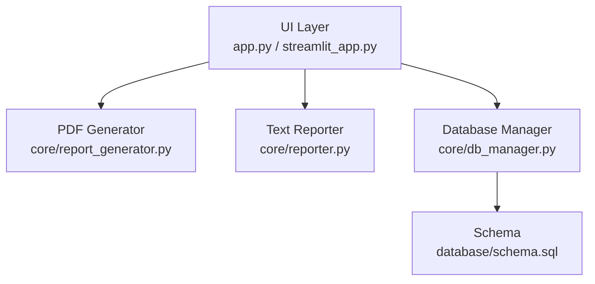
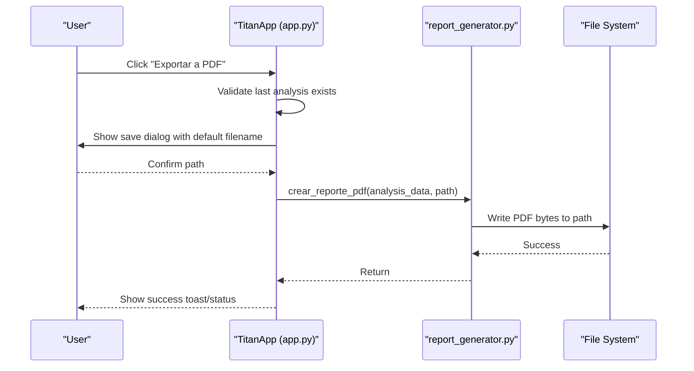
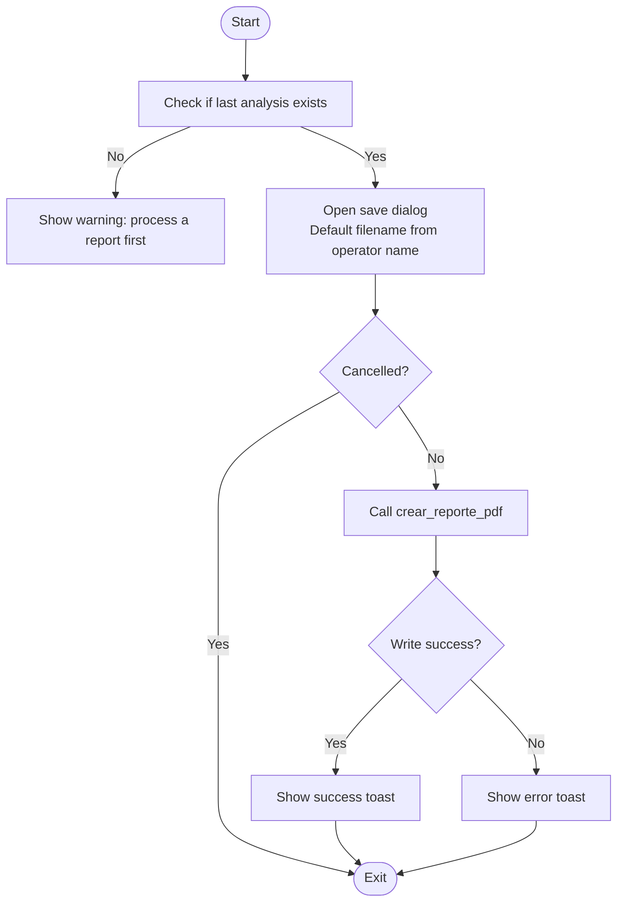
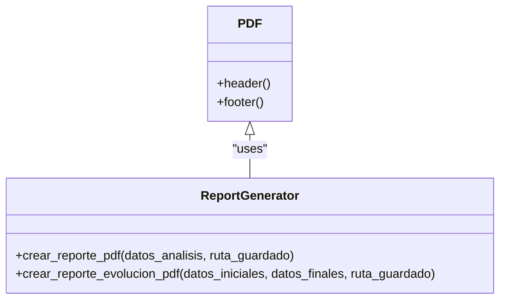
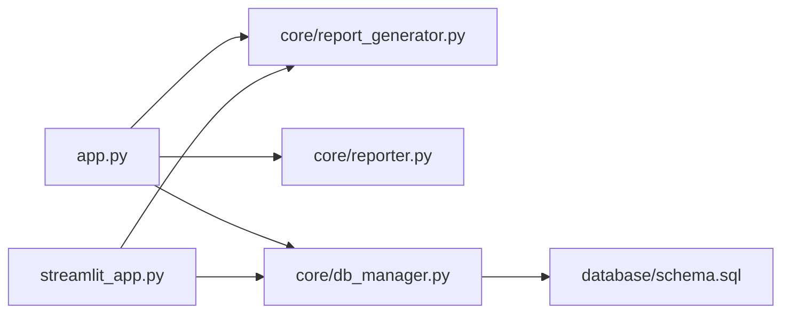

# Report Export and Data Export

<cite>
**Referenced Files in This Document**
- [app.py](file://app.py)
- [streamlit_app.py](file://streamlit_app.py)
- [core/report_generator.py](file://core/report_generator.py)
- [core/reporter.py](file://core/reporter.py)
- [core/db_manager.py](file://core/db_manager.py)
- [database/schema.sql](file://database/schema.sql)
</cite>

## Table of Contents
1. Introduction
2. Project Structure
3. Core Components
4. Architecture Overview
5. Detailed Component Analysis
6. Dependency Analysis
7. Performance Considerations
8. Troubleshooting Guide
9. Conclusion
10. Appendices

## Introduction
This document explains the export functionality in Proyecto Titán with a focus on generating formatted PDF reports from processed analysis data. It covers the report template system, data formatting, chart embedding capabilities, file dialog integration for save location selection, filename generation based on operator names, and automatic PDF creation using crear_reporte_pdf. It also documents available data export formats (CSV, JSON), integration points for external systems, error handling, file permissions, and considerations for large datasets.

## Project Structure
The export pipeline spans UI orchestration, PDF generation, text reporting, and database-backed telemetry retrieval:
- UI layer (Tkinter desktop app and Streamlit web app) orchestrates user actions and triggers exports.
- PDF generator builds professional reports from analysis results.
- Reporter module produces narrative text summaries and evolution comparisons.
- Database manager provides access to session metadata and time-series telemetry used by visualizations and potential exports.

**Diagram sources**
- [app.py:308-513](file://app.py#L308-L513)
- [streamlit_app.py:138-202](file://streamlit_app.py#L138-L202)
- [core/report_generator.py:12-149](file://core/report_generator.py#L12-L149)
- [core/reporter.py:19-122](file://core/reporter.py#L19-L122)
- [core/db_manager.py:36-152](file://core/db_manager.py#L36-L152)
- [database/schema.sql:14-59](file://database/schema.sql#L14-L59)

**Section sources**
- [app.py:308-513](file://app.py#L308-L513)
- [streamlit_app.py:138-202](file://streamlit_app.py#L138-L202)
- [core/report_generator.py:12-149](file://core/report_generator.py#L12-L149)
- [core/reporter.py:19-122](file://core/reporter.py#L19-L122)
- [core/db_manager.py:36-152](file://core/db_manager.py#L36-L152)
- [database/schema.sql:14-59](file://database/schema.sql#L14-L59)

## Core Components
- PDF report generator: Builds structured PDFs with headers/footers, session info, behavior profile, recommended learning path, and telemetry metrics. Also supports an evolution comparison report.
- Text reporter: Produces human-readable narratives and feedback, including comparative evolution summaries.
- Database manager: Provides telemetry series and session metadata used by UI and exporters; stores timestamps and values as comma-separated strings per graph.
- UI controllers: Tkinter app exposes “Exportar a PDF” via menu and toolbar; Streamlit app demonstrates processing and visualization flows.

Key responsibilities:
- File dialog integration and default filename generation based on operator name.
- Invoking PDF creation with preprocessed analysis data.
- Rendering charts in UI (not embedded into PDF in current implementation).
- Persisting and retrieving telemetry for visualization and potential export.

**Section sources**
- [core/report_generator.py:12-149](file://core/report_generator.py#L12-L149)
- [core/reporter.py:19-122](file://core/reporter.py#L19-L122)
- [core/db_manager.py:36-152](file://core/db_manager.py#L36-L152)
- [app.py:308-513](file://app.py#L308-L513)
- [streamlit_app.py:138-202](file://streamlit_app.py#L138-L202)

## Architecture Overview
End-to-end flow for exporting a PDF report:
- User triggers export after analyzing a PDF report.
- UI prompts for save location and generates a default filename using the operator’s name.
- The application calls the PDF generator with the latest analysis result.
- The generator renders sections and outputs the PDF to the selected path.

**Diagram sources**
- [app.py:494-513](file://app.py#L494-L513)
- [core/report_generator.py:28-75](file://core/report_generator.py#L28-L75)

## Detailed Component Analysis

### PDF Export Flow (Tkinter)
- Entry point: Menu item and toolbar button trigger export.
- Validation: Ensures a recent analysis is available.
- Save dialog: Uses filedialog with default extension and initial filename derived from operator name.
- Generation: Calls crear_reporte_pdf with the stored analysis dictionary.
- Feedback: Shows toast and status bar updates; handles errors via centralized error handler.

**Diagram sources**
- [app.py:494-513](file://app.py#L494-L513)

**Section sources**
- [app.py:336-395](file://app.py#L336-L395)
- [app.py:494-513](file://app.py#L494-L513)

### PDF Template System and Data Formatting
- Base PDF class defines header and footer for consistent branding and page numbering.
- Individual report sections:
  - Session diagnosis: operator name, class, final score.
  - Behavior profile and recommended learning path: predicted profile and exercises.
  - Telemetry analysis: counts of braking events, steering corrections, acceleration spikes, lift adjustments, and speed metrics.
- Evolution report:
  - Verdict calculation based on score deltas.
  - Comparative table of metrics with color-coded deltas and arrows.

**Diagram sources**
- [core/report_generator.py:12-149](file://core/report_generator.py#L12-L149)

**Section sources**
- [core/report_generator.py:12-149](file://core/report_generator.py#L12-L149)

### Chart Embedding Capabilities
- Current PDF generator does not embed charts; it focuses on textual metrics and tables.
- Charts are rendered in the UI (Tkinter or Streamlit) using telemetry data retrieved from the database.
- To embed charts in PDFs, integrate image rendering (e.g., Matplotlib to PNG) and insert images into the PDF using FPDF’s image methods.

**Section sources**
- [core/report_generator.py:28-149](file://core/report_generator.py#L28-L149)
- [core/db_manager.py:36-83](file://core/db_manager.py#L36-L83)
- [app.py:484-493](file://app.py#L484-L493)
- [streamlit_app.py:112-132](file://streamlit_app.py#L112-L132)

### File Dialog Integration and Filename Generation
- Save dialog uses filedialog with default extension .pdf and an initial filename constructed from the operator’s name (spaces replaced with underscores).
- If no analysis exists, a warning is shown prompting the user to process a report first.

**Section sources**
- [app.py:494-502](file://app.py#L494-L502)

### Automatic PDF Creation with crear_reporte_pdf
- Accepts a dictionary containing session info, predicted profile, recommended path, and behavior analysis.
- Renders sections and writes output to the provided path or BytesIO buffer.
- Supports both individual session reports and evolution comparison reports.

**Section sources**
- [core/report_generator.py:28-149](file://core/report_generator.py#L28-L149)

### Data Export Formats (CSV, JSON) and External Integrations
- CSV:
  - Telemetry series are stored as comma-separated strings per graph; these can be exported by querying the database and writing to CSV files.
  - Event summaries and session metadata can be exported similarly.
- JSON:
  - Session records and event summaries can be serialized to JSON for external consumption.
- Integration points:
  - Use core/db_manager functions to retrieve telemetry and session data.
  - Streamlit app demonstrates reading and plotting telemetry; similar logic can feed external APIs or data pipelines.

Note: No explicit CSV/JSON export endpoints exist in the analyzed code; implement them by leveraging db_manager queries and standard libraries (csv, json).

**Section sources**
- [core/db_manager.py:36-152](file://core/db_manager.py#L36-L152)
- [database/schema.sql:14-59](file://database/schema.sql#L14-L59)
- [streamlit_app.py:112-132](file://streamlit_app.py#L112-L132)

### Batch Export Scenarios
- For multiple sessions:
  - Iterate over sessions (by operator or date range) using db_manager queries.
  - For each session, assemble analysis data and call crear_reporte_pdf to generate individual PDFs.
  - Optionally aggregate telemetry into CSV/JSON for batch distribution.

[No sources needed since this section describes conceptual batch workflows]

## Dependency Analysis
Core dependencies between components involved in export:

**Diagram sources**
- [app.py:308-513](file://app.py#L308-L513)
- [streamlit_app.py:138-202](file://streamlit_app.py#L138-L202)
- [core/report_generator.py:12-149](file://core/report_generator.py#L12-L149)
- [core/reporter.py:19-122](file://core/reporter.py#L19-L122)
- [core/db_manager.py:36-152](file://core/db_manager.py#L36-L152)
- [database/schema.sql:14-59](file://database/schema.sql#L14-L59)

**Section sources**
- [app.py:308-513](file://app.py#L308-L513)
- [streamlit_app.py:138-202](file://streamlit_app.py#L138-L202)
- [core/report_generator.py:12-149](file://core/report_generator.py#L12-L149)
- [core/reporter.py:19-122](file://core/reporter.py#L19-L122)
- [core/db_manager.py:36-152](file://core/db_manager.py#L36-L152)
- [database/schema.sql:14-59](file://database/schema.sql#L14-L59)

## Performance Considerations
- Large telemetry series:
  - Stored as comma-separated strings; parsing occurs at read time. For very large series, consider chunked reads or downsampling before export.
- PDF generation:
  - Avoid embedding large images unless necessary; prefer textual summaries and small charts.
- I/O operations:
  - Ensure write paths have sufficient permissions and disk space.
  - Use asynchronous or background tasks for long-running exports in UI contexts.

[No sources needed since this section provides general guidance]

## Troubleshooting Guide
Common issues and resolutions:
- Missing model file:
  - When processing PDFs, ensure the ML model file exists; otherwise, display a clear error message.
- Database connection errors:
  - Handle SQLite exceptions and provide user-friendly messages.
- Export failures:
  - Catch exceptions during PDF writing and show detailed errors in the UI.
- File permissions:
  - Verify write permissions to the target directory; create directories if missing.

**Section sources**
- [app.py:527-531](file://app.py#L527-L531)
- [core/db_manager.py:13-33](file://core/db_manager.py#L13-L33)
- [app.py:571-575](file://app.py#L571-L575)

## Conclusion
Proyecto Titán’s export functionality centers on a robust PDF report generator that transforms analysis results into professional documents. While charts are currently rendered in the UI rather than embedded in PDFs, the system provides a solid foundation for extending PDF content with images and for adding CSV/JSON exports via the database layer. Proper error handling, file dialog integration, and filename generation streamline the user experience. For large datasets, consider performance optimizations such as downsampling and background processing.

[No sources needed since this section summarizes without analyzing specific files]

## Appendices

### Example Exported Report Structure
- Header: Project title and report subtitle.
- Session Diagnosis: Operator name, class, final score.
- Behavior Profile and Recommended Path: Predicted profile and suggested exercises.
- Telemetry Analysis: Counts of braking, steering corrections, acceleration spikes, lift adjustments, and speed metrics.
- Evolution Comparison (optional): Verdict, profile changes, and metric deltas.

[No sources needed since this section outlines conceptual structure]

### Customization Options
- Modify PDF templates to add logos, custom fonts, or additional sections.
- Extend report content to include embedded charts by integrating image insertion into the PDF generator.
- Customize filenames and save dialogs to support different naming conventions or batch naming schemes.

[No sources needed since this section provides general guidance]