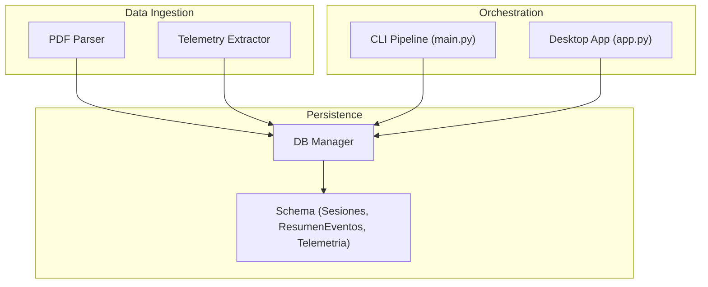
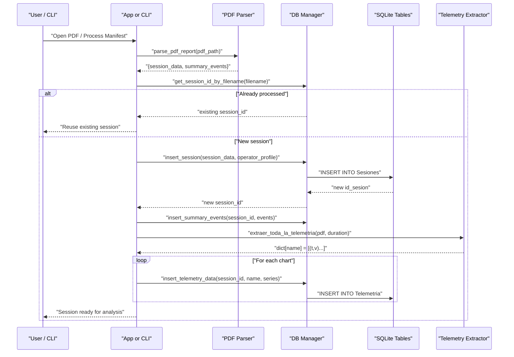
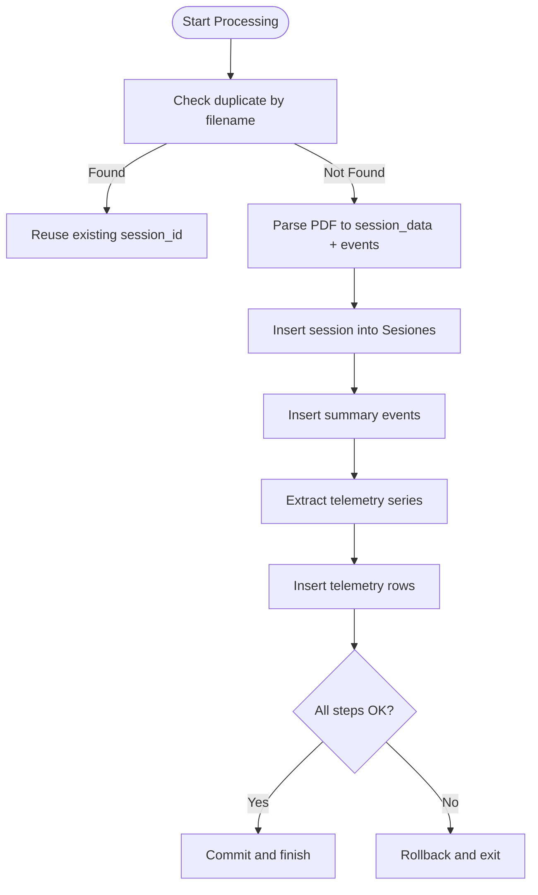
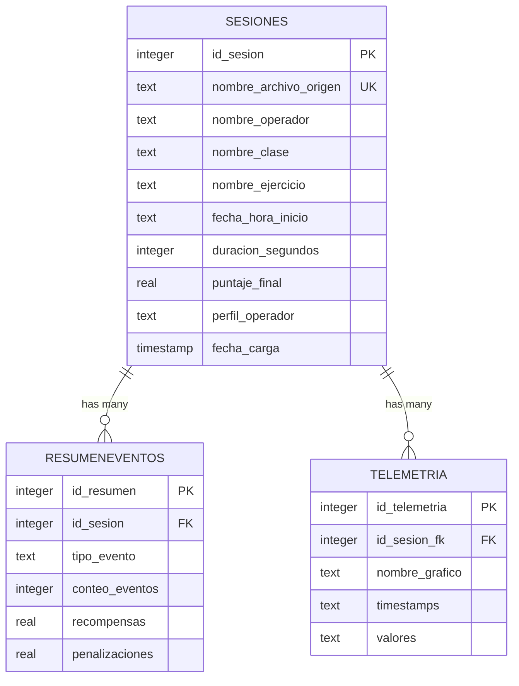
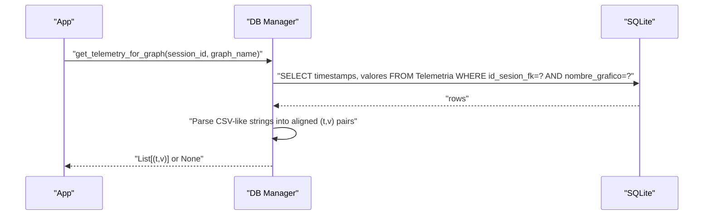
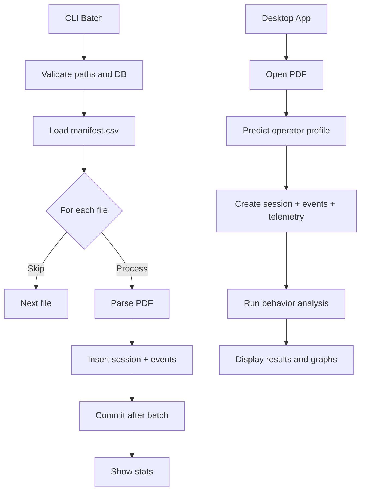
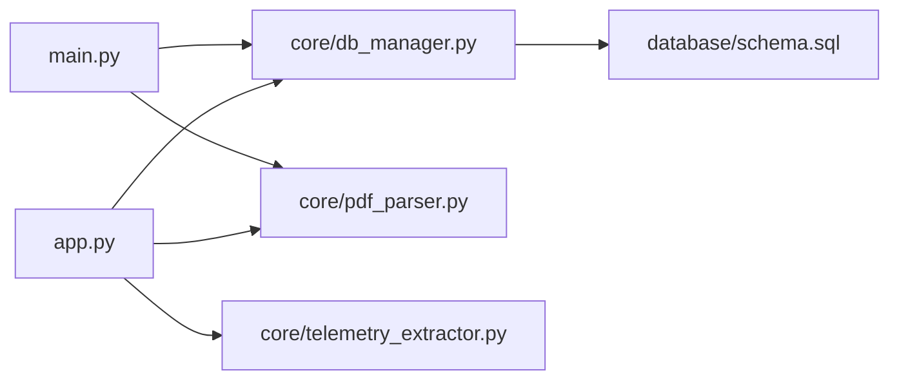

# Session Management System

<cite>
**Referenced Files in This Document**
- [core/db_manager.py](file://core/db_manager.py)
- [database/schema.sql](file://database/schema.sql)
- [setup_database.py](file://setup_database.py)
- [main.py](file://main.py)
- [app.py](file://app.py)
- [core/pdf_parser.py](file://core/pdf_parser.py)
- [core/telemetry_extractor.py](file://core/telemetry_extractor.py)
</cite>

## Table of Contents
1. [Introduction](#introduction)
2. [Project Structure](#project-structure)
3. [Core Components](#core-components)
4. [Architecture Overview](#architecture-overview)
5. [Detailed Component Analysis](#detailed-component-analysis)
6. [Dependency Analysis](#dependency-analysis)
7. [Performance Considerations](#performance-considerations)
8. [Troubleshooting Guide](#troubleshooting-guide)
9. [Conclusion](#conclusion)
10. [Appendices](#appendices)

## Introduction
This document explains the session management system in Proyecto Titán, focusing on how sessions are created, stored, and retrieved from SQLite; how telemetry data is linked to sessions; and how the application lifecycle moves from PDF processing through analysis completion. It details session ID generation, metadata storage (operator info, scores, timestamps), duplicate detection via filename-based lookup, and the relationship between sessions and telemetry series. It also covers error handling, transactional persistence, and recovery strategies used throughout the workflow.

## Project Structure
The session management spans a small set of focused modules:
- Database schema defines tables for sessions, event summaries, and telemetry series.
- A database manager provides connection helpers and functions to insert and query session-related data.
- The main CLI pipeline processes manifest-driven batches, while the desktop app handles interactive single-file processing and visualization.
- PDF parsing extracts session metadata and summary events; telemetry extraction pulls time-series graphs from PDFs.

**Diagram sources**
- [core/pdf_parser.py:27-57](file://core/pdf_parser.py#L27-L57)
- [core/telemetry_extractor.py:201-239](file://core/telemetry_extractor.py#L201-L239)
- [core/db_manager.py:93-152](file://core/db_manager.py#L93-L152)
- [database/schema.sql:14-59](file://database/schema.sql#L14-L59)
- [main.py:100-176](file://main.py#L100-L176)
- [app.py:514-547](file://app.py#L514-L547)

**Section sources**
- [database/schema.sql:14-59](file://database/schema.sql#L14-L59)
- [core/db_manager.py:13-33](file://core/db_manager.py#L13-L33)
- [main.py:100-176](file://main.py#L100-L176)
- [app.py:514-547](file://app.py#L514-L547)

## Core Components
- Session table (Sesiones): Stores core session metadata including operator name, class/exercise names, start timestamp, duration, final score, operator profile, and upload timestamp.
- Event summary table (ResumenEventos): Aggregated counts, rewards, and penalties per event type, linked to a session.
- Telemetry table (Telemetria): Time-series data for each graph per session, stored as comma-separated strings of timestamps and values.
- DB Manager: Provides connection context, session insertion, event summary insertion, telemetry insertion, and retrieval functions.
- PDF Parser: Extracts session metadata and summary events from PDF reports.
- Telemetry Extractor: Detects charts in PDF pages, extracts curves, calibrates them into time-value series, and assigns chart names.

Key responsibilities:
- Create sessions with unique IDs and rich metadata.
- Persist event summaries and telemetry series tied to the session.
- Prevent duplicate processing by filename-based lookup.
- Provide safe retrieval of telemetry series for visualization.

**Section sources**
- [database/schema.sql:14-59](file://database/schema.sql#L14-L59)
- [core/db_manager.py:93-152](file://core/db_manager.py#L93-L152)
- [core/pdf_parser.py:27-124](file://core/pdf_parser.py#L27-L124)
- [core/telemetry_extractor.py:12-19](file://core/telemetry_extractor.py#L12-L19)
- [core/telemetry_extractor.py:201-239](file://core/telemetry_extractor.py#L201-L239)

## Architecture Overview
The session lifecycle flows from PDF ingestion to persistent storage and subsequent analysis/visualization:

**Diagram sources**
- [app.py:514-547](file://app.py#L514-L547)
- [core/db_manager.py:93-152](file://core/db_manager.py#L93-L152)
- [core/pdf_parser.py:27-57](file://core/pdf_parser.py#L27-L57)
- [core/telemetry_extractor.py:201-239](file://core/telemetry_extractor.py#L201-L239)
- [database/schema.sql:14-59](file://database/schema.sql#L14-L59)

## Detailed Component Analysis

### Session Creation and Duplicate Detection
- Duplicate detection: get_session_id_by_filename queries the Sesiones table by the original PDF filename to return an existing session ID if present. This prevents reprocessing identical files.
- New session creation: insert_session inserts a new row into Sesiones using parsed session metadata and the assigned operator profile, returning the autoincremented session ID.
- Transaction safety: In the desktop app, session insertion, event summary insertion, and telemetry insertion are wrapped in a transaction block that commits only when all steps succeed; otherwise it rolls back.

**Diagram sources**
- [core/db_manager.py:93-124](file://core/db_manager.py#L93-L124)
- [app.py:514-547](file://app.py#L514-L547)

**Section sources**
- [core/db_manager.py:93-124](file://core/db_manager.py#L93-L124)
- [app.py:514-547](file://app.py#L514-L547)

### Metadata Storage and Relationships
- Sesiones fields include operator name, class/exercise names, start timestamp, duration, final score, operator profile, and automatic upload timestamp.
- ResumenEventos stores aggregated metrics per event type, linked to a session via foreign key with cascade delete.
- Telemetria stores time-series data per graph per session, linked via foreign key with cascade delete.

**Diagram sources**
- [database/schema.sql:14-59](file://database/schema.sql#L14-L59)

**Section sources**
- [database/schema.sql:14-59](file://database/schema.sql#L14-L59)

### Telemetry Data Flow and Retrieval
- Extraction: extraer_toda_la_telemetria scans PDF pages, detects candidate charts, extracts curve points, calibrates timestamps and values based on known ranges, and returns a mapping from chart name to series.
- Storage: insert_telemetry_data serializes timestamps and values as comma-separated strings and inserts one row per graph per session.
- Retrieval: get_telemetry_for_graph fetches serialized series by session ID and graph name, deserializes them into pairs of (timestamp, value), and ensures alignment before returning.

**Diagram sources**
- [core/db_manager.py:36-90](file://core/db_manager.py#L36-L90)
- [core/db_manager.py:140-152](file://core/db_manager.py#L140-L152)
- [database/schema.sql:45-52](file://database/schema.sql#L45-L52)

**Section sources**
- [core/telemetry_extractor.py:201-239](file://core/telemetry_extractor.py#L201-L239)
- [core/db_manager.py:36-90](file://core/db_manager.py#L36-L90)
- [core/db_manager.py:140-152](file://core/db_manager.py#L140-L152)

### Session State Management Across Workflows
- CLI batch processing (main.py): Validates environment, loads manifest, checks duplicates, parses PDFs, inserts sessions and events, and commits once per batch.
- Desktop app (app.py): Interactive flow that parses PDF, predicts operator profile, creates session, persists events and telemetry, then runs behavior analysis and displays results. It maintains current session state in memory for UI actions like exporting and graph selection.

**Diagram sources**
- [main.py:100-176](file://main.py#L100-L176)
- [app.py:411-449](file://app.py#L411-L449)
- [app.py:514-547](file://app.py#L514-L547)

**Section sources**
- [main.py:100-176](file://main.py#L100-L176)
- [app.py:411-449](file://app.py#L411-L449)
- [app.py:514-547](file://app.py#L514-L547)

## Dependency Analysis
- app.py depends on core modules for parsing, telemetry extraction, and DB operations.
- main.py depends on core modules for parsing and DB operations.
- db_manager.py depends on sqlite3 and implements all DB interactions.
- schema.sql defines the relational structure enforced by foreign keys and indexes.

**Diagram sources**
- [app.py:33-42](file://app.py#L33-L42)
- [main.py:7-13](file://main.py#L7-L13)
- [core/db_manager.py:1-11](file://core/db_manager.py#L1-L11)
- [database/schema.sql:1-59](file://database/schema.sql#L1-L59)

**Section sources**
- [app.py:33-42](file://app.py#L33-L42)
- [main.py:7-13](file://main.py#L7-L13)
- [core/db_manager.py:1-11](file://core/db_manager.py#L1-L11)
- [database/schema.sql:1-59](file://database/schema.sql#L1-L59)

## Performance Considerations
- Indexes: The schema includes indexes on operator and profile fields in Sesiones and on id_sesion_fk in Telemetria to optimize lookups and joins.
- Serialization: Telemetry series are stored as compact comma-separated strings to reduce overhead; retrieval parses them efficiently and aligns lengths to avoid misalignment.
- Transactions: Batching inserts within a single transaction reduces commit overhead and improves throughput.
- Duplicate avoidance: Filename-based deduplication avoids redundant parsing and storage.

[No sources needed since this section provides general guidance]

## Troubleshooting Guide
Common issues and mitigations:
- Missing model file: If the ML model is not found during prediction, the app surfaces a clear error and halts processing. Ensure models/modelo_clasificador.joblib exists.
- Database setup: If the database does not exist, the CLI warns and suggests running setup_database.py to create the schema.
- Parsing failures: If PDF parsing fails to extract valid session data, the process logs an error and skips the file.
- Telemetry retrieval: If no telemetry exists for a selected graph, the retrieval function returns None; the UI should handle gracefully.

Recovery mechanisms:
- Transaction rollback: On errors during session/event/telemetry insertion, the app rolls back to maintain consistency.
- Safe connections: Context managers ensure connections are closed even on exceptions.

**Section sources**
- [app.py:526-531](file://app.py#L526-L531)
- [main.py:54-61](file://main.py#L54-L61)
- [core/pdf_parser.py:46-57](file://core/pdf_parser.py#L46-L57)
- [core/db_manager.py:16-33](file://core/db_manager.py#L16-L33)
- [app.py:536-544](file://app.py#L536-L544)

## Conclusion
Proyecto Titán’s session management system provides robust, transactional persistence of session metadata, event summaries, and telemetry series. It prevents duplicate processing via filename-based lookup, supports both batch and interactive workflows, and offers reliable retrieval for visualization. The design balances performance with clarity, leveraging indexes, compact serialization, and careful error handling to ensure data integrity and user experience.

[No sources needed since this section summarizes without analyzing specific files]

## Appendices

### Example: Session Data Structure
- Sesiones fields:
  - id_sesion: Autoincremented primary key
  - nombre_archivo_origen: Unique filename of the source PDF
  - nombre_operador: Operator name
  - nombre_clase: Class name
  - nombre_ejercicio: Exercise name
  - fecha_hora_inicio: Start timestamp
  - duracion_segundos: Duration in seconds
  - puntaje_final: Final score
  - perfil_operador: Predicted operator profile
  - fecha_carga: Upload timestamp

- ResumenEventos fields:
  - id_resumen: Primary key
  - id_sesion: Foreign key to Sesiones
  - tipo_evento: Event type
  - conteo_eventos: Count of events
  - recompensas: Rewards sum
  - penalizaciones: Penalties sum

- Telemetria fields:
  - id_telemetria: Primary key
  - id_sesion_fk: Foreign key to Sesiones
  - nombre_grafico: Graph name (e.g., Steering, Brake Pad)
  - timestamps: Comma-separated timestamps
  - valores: Comma-separated values

**Section sources**
- [database/schema.sql:14-59](file://database/schema.sql#L14-L59)

### Example: Key Database Queries
- Duplicate check: SELECT id_sesion FROM Sesiones WHERE nombre_archivo_origen = ?
- Insert session: INSERT INTO Sesiones(...) VALUES(...)
- Insert event summary: INSERT INTO ResumenEventos(id_sesion, tipo_evento, conteo_eventos, recompensas, penalizaciones) VALUES(...)
- Insert telemetry: INSERT INTO Telemetria(id_sesion_fk, nombre_grafico, timestamps, valores) VALUES(...)
- Retrieve telemetry: SELECT timestamps, valores FROM Telemetria WHERE id_sesion_fk = ? AND nombre_grafico = ?

**Section sources**
- [core/db_manager.py:93-152](file://core/db_manager.py#L93-L152)

### Example: Session Lifecycle Steps
- Step 1: Check duplicate by filename
- Step 2: Parse PDF to extract session_data and summary_events
- Step 3: Predict operator profile (desktop app)
- Step 4: Insert session and summary events
- Step 5: Extract telemetry series from PDF
- Step 6: Insert telemetry series
- Step 7: Commit transaction
- Step 8: Run behavior analysis and display results

**Section sources**
- [app.py:514-547](file://app.py#L514-L547)
- [core/pdf_parser.py:27-57](file://core/pdf_parser.py#L27-L57)
- [core/telemetry_extractor.py:201-239](file://core/telemetry_extractor.py#L201-L239)