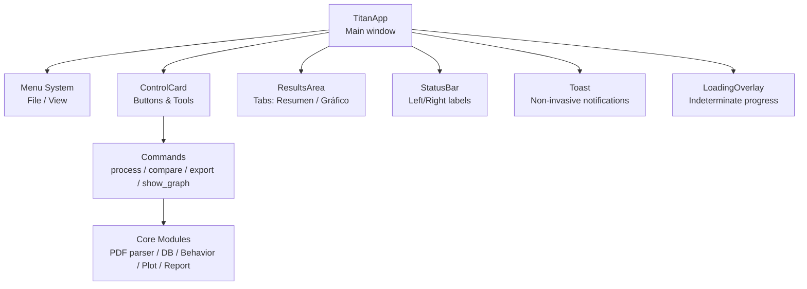
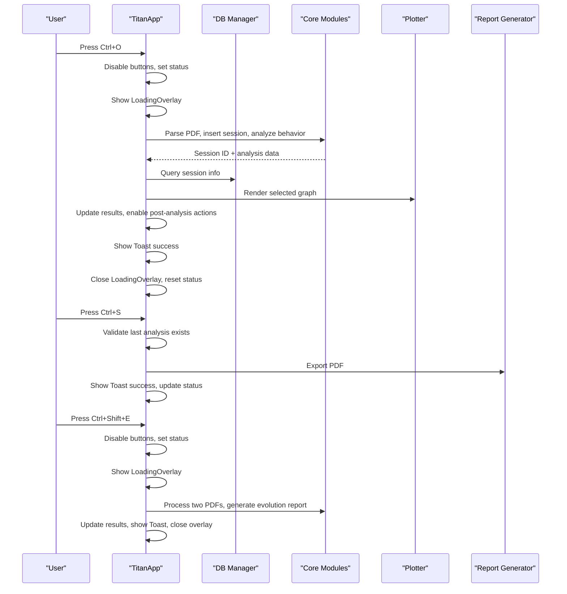
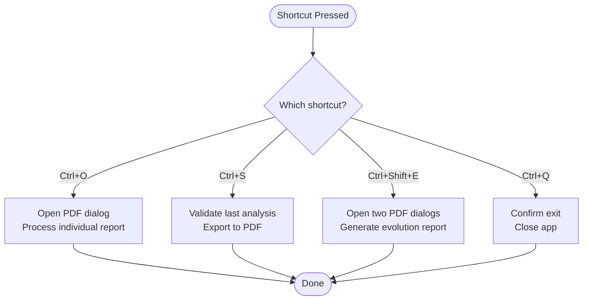
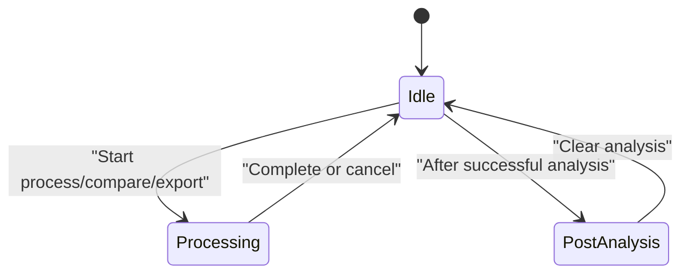
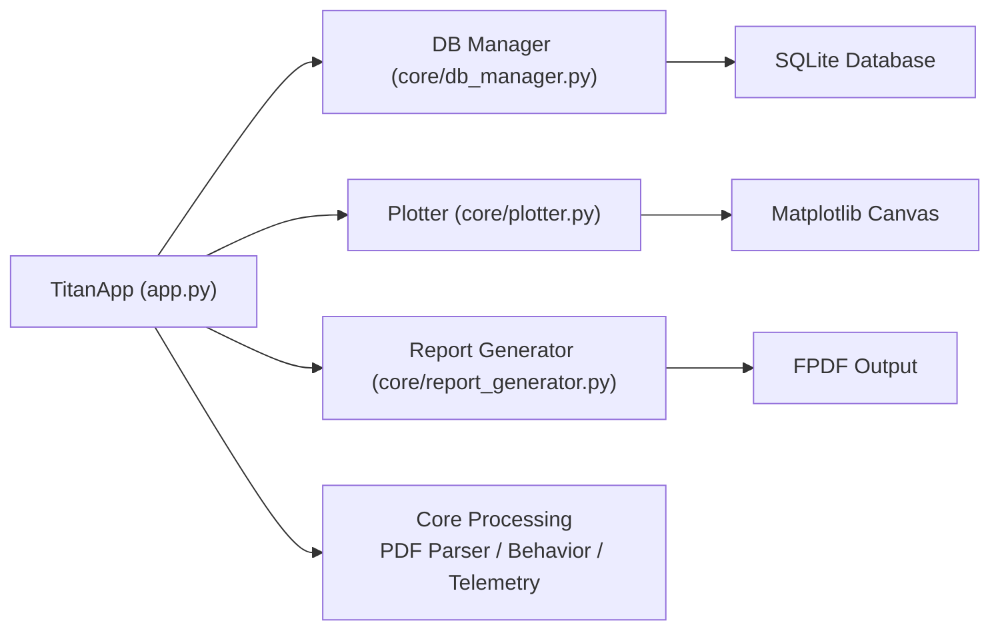

# User Interface Interaction Patterns

<cite>
**Referenced Files in This Document**
- [app.py](file://app.py)
- [db_manager.py](file://core/db_manager.py)
- [plotter.py](file://core/plotter.py)
- [report_generator.py](file://core/report_generator.py)
</cite>

## Table of Contents
1. [Introduction](#introduction)
2. [Project Structure](#project-structure)
3. [Core Components](#core-components)
4. [Architecture Overview](#architecture-overview)
5. [Detailed Component Analysis](#detailed-component-analysis)
6. [Dependency Analysis](#dependency-analysis)
7. [Performance Considerations](#performance-considerations)
8. [Troubleshooting Guide](#troubleshooting-guide)
9. [Conclusion](#conclusion)

## Introduction
This document explains the user interface interaction patterns for Proyecto Titán’s desktop application, focusing on keyboard shortcuts, status bar updates, toast notifications, loading overlays, button state management, form validation and error display, theme switching, UI scaling, responsive layout, menu system, command bindings, accessibility considerations, common workflows, expected UI responses, and troubleshooting guidance.

## Project Structure
The desktop application is implemented as a single-window Tkinter-based app using CustomTkinter for styling and widgets. The main entry point initializes the UI, builds menus, binds keyboard shortcuts, and wires actions to core processing modules (PDF parsing, database operations, behavior analysis, plotting, and PDF export).

**Diagram sources**
- [app.py:308-395](file://app.py#L308-L395)
- [app.py:196-269](file://app.py#L196-L269)
- [app.py:113-173](file://app.py#L113-L173)

**Section sources**
- [app.py:308-395](file://app.py#L308-L395)

## Core Components
- Theme: Centralized color palette and appearance mode control.
- Tooltip: Hover help for controls.
- Toast: Non-blocking success/warning/info/error messages.
- LoadingOverlay: Full-screen indeterminate progress overlay during long operations.
- Header, StatusBar: Title area and persistent status feedback.
- ControlCard: Action buttons and tools with dynamic states and tooltips.
- ResultsArea: Tabbed view for textual summary and telemetry graphs.
- TitanApp: Orchestrates UI state, commands, menus, and keyboard shortcuts.

Key responsibilities:
- Keyboard shortcuts bind to process, export, compare, and quit actions.
- Status bar updates inform users about current context and session IDs.
- Toasts provide immediate, non-blocking feedback.
- LoadingOverlay prevents interaction during heavy tasks.
- Button states disable/enable actions based on workflow stage.
- Error handling centralizes error display in results and status.

**Section sources**
- [app.py:48-67](file://app.py#L48-L67)
- [app.py:72-111](file://app.py#L72-L111)
- [app.py:113-173](file://app.py#L113-L173)
- [app.py:196-269](file://app.py#L196-L269)
- [app.py:271-303](file://app.py#L271-L303)
- [app.py:308-395](file://app.py#L308-L395)

## Architecture Overview
The UI layer (CustomTkinter/Tkinter) interacts with core modules via method calls. Commands trigger file dialogs, database queries, ML model inference, telemetry extraction, and report generation. Feedback is provided through status bar, toasts, and overlays.

**Diagram sources**
- [app.py:391-395](file://app.py#L391-L395)
- [app.py:411-449](file://app.py#L411-L449)
- [app.py:451-482](file://app.py#L451-L482)
- [app.py:494-512](file://app.py#L494-L512)
- [db_manager.py:23-33](file://core/db_manager.py#L23-L33)
- [db_manager.py:93-152](file://core/db_manager.py#L93-L152)
- [plotter.py:15-70](file://core/plotter.py#L15-L70)
- [report_generator.py:28-75](file://core/report_generator.py#L28-L75)

## Detailed Component Analysis

### Keyboard Shortcuts and Menu Bindings
- Ctrl+O: Opens a file dialog to select a PDF and processes it individually.
- Ctrl+S: Exports the current analysis to a PDF if available.
- Ctrl+Shift+E: Starts a two-step comparison workflow by selecting initial and final PDFs.
- Ctrl+Q: Quits the application after confirmation.

These shortcuts are bound at the root level and mirror menu commands under File.

**Diagram sources**
- [app.py:336-354](file://app.py#L336-L354)
- [app.py:391-395](file://app.py#L391-L395)
- [app.py:411-449](file://app.py#L411-L449)
- [app.py:451-482](file://app.py#L451-L482)
- [app.py:494-512](file://app.py#L494-L512)
- [app.py:577-581](file://app.py#L577-L581)

**Section sources**
- [app.py:336-354](file://app.py#L336-L354)
- [app.py:391-395](file://app.py#L391-L395)

### Status Bar Updates
- Left label shows contextual messages such as waiting for selection, action cancellations, or completion summaries.
- Right label displays session identifiers or exported filenames when relevant.
- On hover over controls, temporary hints appear in the left label and revert on leave.

Patterns:
- Before long operations: set left to indicate next step.
- After success: set left to “Ready.” and right to session or file info.
- On errors: set left to an error message directing attention to the Summary tab.

**Section sources**
- [app.py:204-219](file://app.py#L204-L219)
- [app.py:228-231](file://app.py#L228-L231)
- [app.py:411-449](file://app.py#L411-L449)
- [app.py:451-482](file://app.py#L451-L482)
- [app.py:494-512](file://app.py#L494-L512)
- [app.py:571-576](file://app.py#L571-L576)

### Toast Notifications
- Non-invasive messages appear in the top-right corner with different colors for success, warning, error, and info.
- Automatically dismissed after a short duration.
- Used to confirm successful processing, comparisons, and exports; also used for critical errors.

**Section sources**
- [app.py:113-139](file://app.py#L113-L139)
- [app.py:443-444](file://app.py#L443-L444)
- [app.py:476-477](file://app.py#L476-L477)
- [app.py:507-508](file://app.py#L507-L508)
- [app.py:571-576](file://app.py#L571-L576)

### Loading Overlay System
- Displays a full-screen overlay with an indeterminate progress indicator during long-running tasks.
- Prevents accidental interactions while ensuring visibility of ongoing work.
- Opened before heavy operations and closed in finally blocks to guarantee restoration.

**Section sources**
- [app.py:141-173](file://app.py#L141-L173)
- [app.py:421-422](file://app.py#L421-L422)
- [app.py:462-463](file://app.py#L462-L463)
- [app.py:505-506](file://app.py#L505-L506)
- [app.py:447-449](file://app.py#L447-L449)
- [app.py:480-482](file://app.py#L480-L482)
- [app.py:511-512](file://app.py#L511-L512)

### Button State Management
- Primary action buttons (Process, Compare) are disabled during processing and re-enabled afterward.
- Post-analysis actions (Export, Graph selector) are enabled only after a successful analysis.
- State transitions ensure consistent UX and prevent invalid operations.

**Diagram sources**
- [app.py:404-410](file://app.py#L404-L410)
- [app.py:260-268](file://app.py#L260-L268)
- [app.py:411-449](file://app.py#L411-L449)
- [app.py:451-482](file://app.py#L451-L482)
- [app.py:494-512](file://app.py#L494-L512)

**Section sources**
- [app.py:260-268](file://app.py#L260-L268)
- [app.py:404-410](file://app.py#L404-L410)

### Form Validation and Error Display
- File dialogs validate user selections; cancellation returns gracefully with status updates.
- Missing ML model triggers a detailed error message guiding the user to place the required file.
- Errors are displayed in the Summary tab and accompanied by an error toast and status message.

Validation patterns:
- Ensure last analysis exists before export.
- Validate parsed data and session insertion outcomes.
- Handle missing files and malformed data with clear messaging.

**Section sources**
- [app.py:411-449](file://app.py#L411-L449)
- [app.py:451-482](file://app.py#L451-L482)
- [app.py:494-512](file://app.py#L494-L512)
- [app.py:514-547](file://app.py#L514-L547)
- [app.py:571-576](file://app.py#L571-L576)

### Theme Switching and UI Scaling
- Theme switching toggles between dark and light modes via appearance mode.
- UI scaling supports multiple percentages (80%–150%) applied globally to widgets.
- Both options are exposed in the View menu for quick access.

Accessibility considerations:
- High contrast themes improve readability.
- Scaling helps users with visual impairments or high-DPI displays.

**Section sources**
- [app.py:48-67](file://app.py#L48-L67)
- [app.py:347-353](file://app.py#L347-L353)

### Responsive Layout Behavior
- The main window uses grid layout with weighted columns to adapt to resizing.
- Sidebar and results panes expand proportionally; minimum sizes constrain usability.
- Graph frames and text areas resize dynamically within tabs.

**Section sources**
- [app.py:371-389](file://app.py#L371-L389)
- [app.py:271-303](file://app.py#L271-L303)

### Menu System Structure and Command Bindings
- File menu:
  - Procesar reporte… (Ctrl+O)
  - Generar evolución… (Ctrl+Shift+E)
  - Exportar PDF… (Ctrl+S)
  - Salir (Ctrl+Q)
- View menu:
  - Tema Oscuro / Tema Claro
  - Escala UI {80–150}%

All menu commands map directly to application methods, ensuring consistency with keyboard shortcuts.

**Section sources**
- [app.py:336-354](file://app.py#L336-L354)
- [app.py:391-395](file://app.py#L391-L395)

### Accessibility Features
- Tooltips provide contextual help on hover for key controls.
- Clear status messages guide users through workflows.
- Consistent keyboard shortcuts reduce reliance on mouse usage.
- Theme and scaling options support diverse accessibility needs.

**Section sources**
- [app.py:72-111](file://app.py#L72-L111)
- [app.py:228-231](file://app.py#L228-L231)
- [app.py:336-354](file://app.py#L336-L354)
- [app.py:347-353](file://app.py#L347-L353)

## Dependency Analysis
The UI depends on core modules for data processing and visualization:

**Diagram sources**
- [app.py:33-42](file://app.py#L33-L42)
- [db_manager.py:23-33](file://core/db_manager.py#L23-L33)
- [db_manager.py:93-152](file://core/db_manager.py#L93-L152)
- [plotter.py:15-70](file://core/plotter.py#L15-L70)
- [report_generator.py:28-75](file://core/report_generator.py#L28-L75)

**Section sources**
- [app.py:33-42](file://app.py#L33-L42)
- [db_manager.py:23-33](file://core/db_manager.py#L23-L33)
- [db_manager.py:93-152](file://core/db_manager.py#L93-L152)
- [plotter.py:15-70](file://core/plotter.py#L15-L70)
- [report_generator.py:28-75](file://core/report_generator.py#L28-L75)

## Performance Considerations
- Use LoadingOverlay to mask long operations and avoid blocking the UI thread.
- Reuse and clear graph canvases to prevent memory leaks.
- Keep status updates lightweight; defer heavy computations until necessary.
- Ensure database connections are managed via context managers to avoid leaks.

[No sources needed since this section provides general guidance]

## Troubleshooting Guide
Common issues and resolutions:
- No ML model found: Place the required model file in the models directory; the app will display a detailed error message.
- Export disabled: Ensure you have processed at least one report; otherwise, a warning informs you to process first.
- Graph not rendering: Verify that telemetry data exists for the selected metric; the plotter shows a “no data” message if empty.
- Unexpected behavior after crash: Restart the app; ensure database integrity and correct paths.

Error handling patterns:
- Centralized error display in Summary tab with toast and status updates.
- Graceful fallbacks for missing data or failed operations.

**Section sources**
- [app.py:514-547](file://app.py#L514-L547)
- [app.py:494-512](file://app.py#L494-L512)
- [plotter.py:32-36](file://core/plotter.py#L32-L36)
- [app.py:571-576](file://app.py#L571-L576)

## Conclusion
Proyecto Titán’s desktop UI emphasizes clarity, responsiveness, and accessibility. Keyboard shortcuts streamline workflows, while status bars, toasts, and overlays keep users informed. Button state management ensures valid operations at each stage. Theme switching and UI scaling enhance comfort across devices and user needs. Robust error handling and clear messaging make troubleshooting straightforward.

[No sources needed since this section summarizes without analyzing specific files]