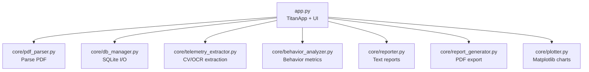
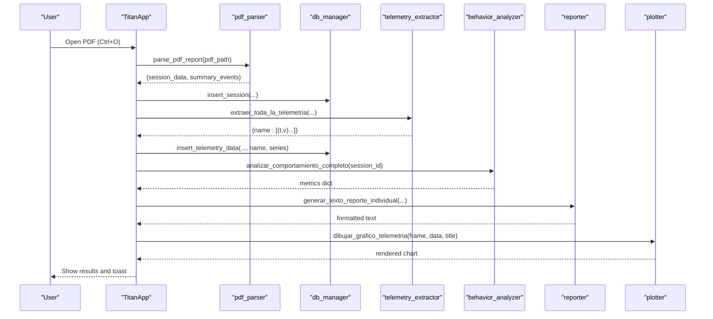
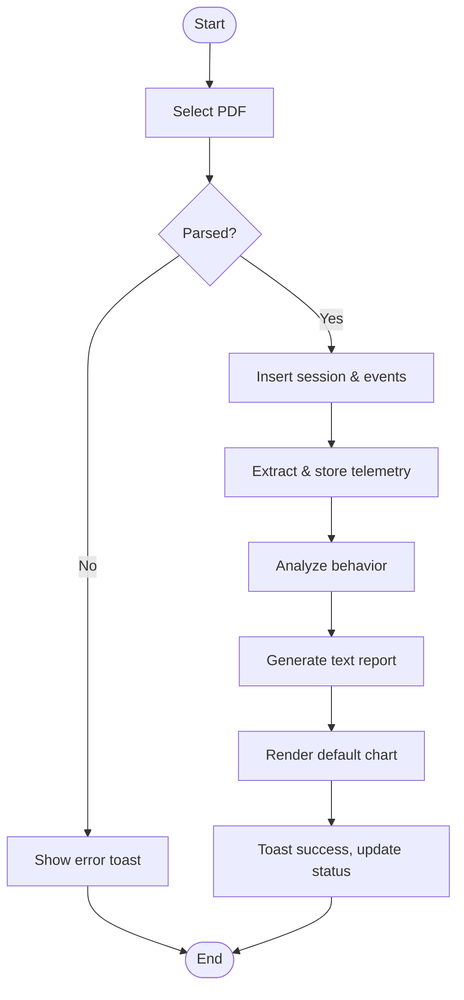
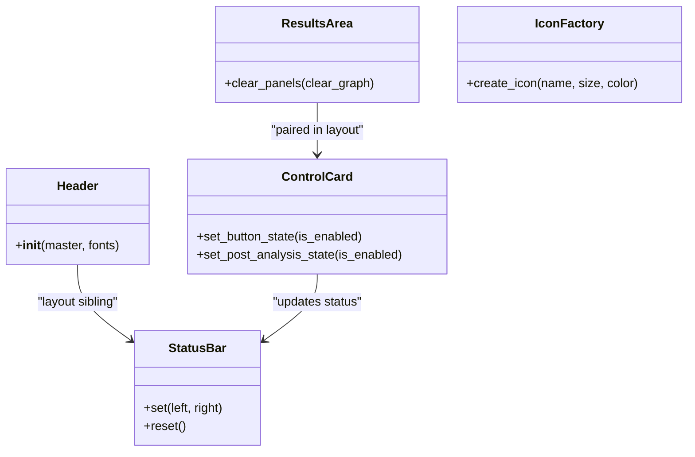
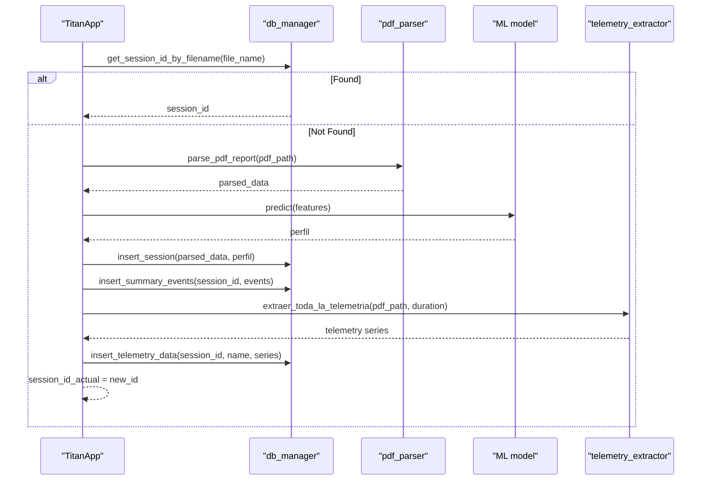
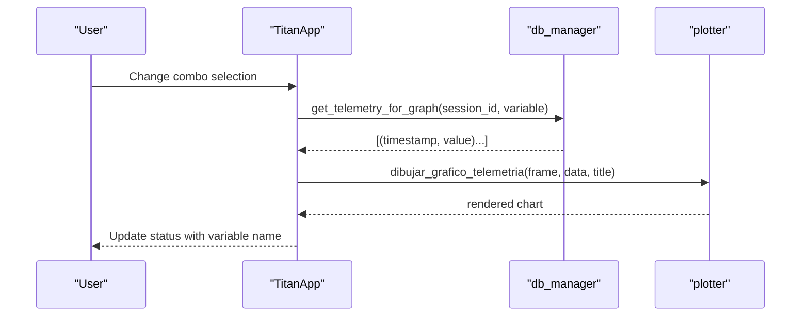
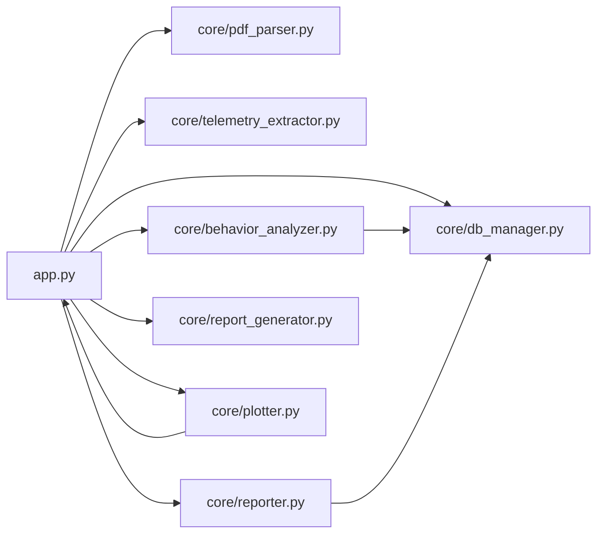

# Desktop Application

<cite>
**Referenced Files in This Document**
- [app.py](file://app.py)
- [main.py](file://main.py)
- [core/pdf_parser.py](file://core/pdf_parser.py)
- [core/db_manager.py](file://core/db_manager.py)
- [core/telemetry_extractor.py](file://core/telemetry_extractor.py)
- [core/plotter.py](file://core/plotter.py)
- [core/behavior_analyzer.py](file://core/behavior_analyzer.py)
- [core/reporter.py](file://core/reporter.py)
- [core/report_generator.py](file://core/report_generator.py)
</cite>

## Table of Contents
1. [Introduction](#introduction)
2. [Project Structure](#project-structure)
3. [Core Components](#core-components)
4. [Architecture Overview](#architecture-overview)
5. [Detailed Component Analysis](#detailed-component-analysis)
6. [Dependency Analysis](#dependency-analysis)
7. [Performance Considerations](#performance-considerations)
8. [Troubleshooting Guide](#troubleshooting-guide)
9. [Conclusion](#conclusion)
10. [Appendices](#appendices)

## Introduction
This document describes the Proyecto Titán desktop application built with CustomTkinter. It explains the main TitanApp class architecture, user interface components (Theme system, Tooltip utilities, Toast notifications, LoadingOverlay for long operations), and custom UI components (Header, StatusBar, ControlCard, ResultsArea). It also documents the end-to-end workflow from PDF selection through processing to result display, keyboard shortcuts, menu options, theme customization, session management, real-time telemetry visualization, and interactive chart generation. Finally, it provides guidance on extending the UI, accessibility considerations, responsive design, and cross-platform compatibility.

## Project Structure
At a high level:
- app.py implements the CustomTkinter desktop application, including the main window, layout, menus, keyboard shortcuts, and all UI components.
- core/ contains data processing modules:
  - pdf_parser.py parses PDF reports into structured session data and summary events.
  - db_manager.py manages SQLite connections and persistence of sessions, events, and telemetry series.
  - telemetry_extractor.py extracts calibrated telemetry curves from PDFs using computer vision and OCR.
  - behavior_analyzer.py analyzes telemetry to derive behavioral metrics and profiles.
  - reporter.py generates human-readable text reports and evolution comparisons.
  - report_generator.py creates professional PDF reports for individual analysis and evolution comparison.
  - plotter.py renders Matplotlib charts inside CustomTkinter frames.

**Diagram sources**
- [app.py:308-584](file://app.py#L308-L584)
- [core/pdf_parser.py:27-57](file://core/pdf_parser.py#L27-L57)
- [core/db_manager.py:23-152](file://core/db_manager.py#L23-L152)
- [core/telemetry_extractor.py:202-239](file://core/telemetry_extractor.py#L202-L239)
- [core/behavior_analyzer.py:150-167](file://core/behavior_analyzer.py#L150-L167)
- [core/reporter.py:51-122](file://core/reporter.py#L51-L122)
- [core/report_generator.py:28-149](file://core/report_generator.py#L28-L149)
- [core/plotter.py:15-70](file://core/plotter.py#L15-L70)

**Section sources**
- [app.py:308-584](file://app.py#L308-L584)
- [core/pdf_parser.py:27-57](file://core/pdf_parser.py#L27-L57)
- [core/db_manager.py:23-152](file://core/db_manager.py#L23-L152)
- [core/telemetry_extractor.py:202-239](file://core/telemetry_extractor.py#L202-L239)
- [core/behavior_analyzer.py:150-167](file://core/behavior_analyzer.py#L150-L167)
- [core/reporter.py:51-122](file://core/reporter.py#L51-L122)
- [core/report_generator.py:28-149](file://core/report_generator.py#L28-L149)
- [core/plotter.py:15-70](file://core/plotter.py#L15-L70)

## Core Components
- Theme: Centralized color palette and appearance mode switching between dark and light themes.
- Tooltip: Non-intrusive help hints that appear when hovering over widgets.
- Toast: Short-lived notifications anchored to the top-right corner of the main window.
- LoadingOverlay: Full-window overlay with indeterminate progress indicator during long operations.
- Header: Title and subtitle banner at the top of the window.
- StatusBar: Persistent status bar showing contextual messages and current session info.
- ControlCard: Sidebar containing action buttons (Process Report, Generate Evolution, Export PDF) and a graph selector combo box.
- ResultsArea: Tabbed area with “Resumen” (text results) and “Gráfico” (interactive chart) panels.

These components are orchestrated by the main TitanApp class, which wires up menus, keyboard shortcuts, and event handlers.

**Section sources**
- [app.py:48-173](file://app.py#L48-L173)
- [app.py:178-303](file://app.py#L178-L303)
- [app.py:308-584](file://app.py#L308-L584)

## Architecture Overview
The application follows a layered architecture:
- Presentation Layer: CustomTkinter UI (TitanApp, Header, StatusBar, ControlCard, ResultsArea, Theme, Tooltip, Toast, LoadingOverlay).
- Business Logic Layer: Behavior analysis, report generation, and evolution comparison.
- Data Layer: PDF parsing, telemetry extraction, and SQLite storage/retrieval.
- Visualization Layer: Matplotlib-based charts embedded in CustomTkinter frames.

**Diagram sources**
- [app.py:411-449](file://app.py#L411-L449)
- [core/pdf_parser.py:27-57](file://core/pdf_parser.py#L27-L57)
- [core/db_manager.py:106-152](file://core/db_manager.py#L106-L152)
- [core/telemetry_extractor.py:202-239](file://core/telemetry_extractor.py#L202-L239)
- [core/behavior_analyzer.py:150-167](file://core/behavior_analyzer.py#L150-L167)
- [core/reporter.py:51-92](file://core/reporter.py#L51-L92)
- [core/plotter.py:15-70](file://core/plotter.py#L15-L70)

## Detailed Component Analysis

### TitanApp Class
Responsibilities:
- Initializes theme, fonts, window geometry, and menu.
- Builds layout with Header, StatusBar, ControlCard, and ResultsArea.
- Binds keyboard shortcuts (Ctrl+O, Ctrl+S, Ctrl+Shift+E, Ctrl+Q).
- Manages session state (ultimo_analisis_realizado, session_id_actual).
- Orchestrates workflows:
  - Single report processing: file dialog -> parse -> ML prediction -> store session/events/telemetry -> analyze behavior -> generate text report -> render default chart -> show toast/status.
  - Evolution comparison: two-file selection -> process both -> generate evolution text.
  - Export to PDF: save last analysis to PDF.
  - Chart rendering: select variable from combo box -> fetch telemetry -> draw chart.

Key methods:
- _setup_app: theme and font setup, window configuration.
- _build_menu: File and View menus with accelerators and theme scaling.
- _bind_shortcuts: global key bindings.
- procesar_reporte_individual: full pipeline for single report.
- generar_reporte_evolucion: compare two sessions.
- mostrar_grafico_seleccionado: dynamic chart update.
- exportar_a_pdf: generate PDF from last analysis.
- _procesar_y_obtener_id: reuse existing session or create new one; copy PDF to exports; run ML model; persist session, events, telemetry.
- _preparar_datos_para_prediccion: build feature vector for ML prediction.
- _error_ui: centralized error display and toast.

**Diagram sources**
- [app.py:411-449](file://app.py#L411-L449)
- [core/db_manager.py:106-152](file://core/db_manager.py#L106-L152)
- [core/telemetry_extractor.py:202-239](file://core/telemetry_extractor.py#L202-L239)
- [core/behavior_analyzer.py:150-167](file://core/behavior_analyzer.py#L150-L167)
- [core/reporter.py:51-92](file://core/reporter.py#L51-L92)
- [core/plotter.py:15-70](file://core/plotter.py#L15-L70)

**Section sources**
- [app.py:308-584](file://app.py#L308-L584)

### Theme System
- Centralized color constants for backgrounds, surfaces, accents, success/warning/danger colors.
- apply_theme(mode): switches CustomTkinter appearance mode between dark and light via menu commands.
- Fonts: consistent typography across UI elements.

Usage:
- Applied globally in _setup_app.
- Used by Tooltip, Toast, LoadingOverlay, Header, StatusBar, ControlCard, ResultsArea.

**Section sources**
- [app.py:48-67](file://app.py#L48-L67)
- [app.py:317-334](file://app.py#L317-L334)

### Tooltip Utilities
- Lightweight helper that shows a floating label near a widget after a delay.
- Uses CTkFrame and CTkLabel styled with Theme colors.
- Bound to Enter/Leave events to schedule/hide tooltips.

**Section sources**
- [app.py:72-111](file://app.py#L72-L111)

### Toast Notifications
- Non-blocking notifications displayed in the top-right corner of the main window.
- Supports different kinds (success, warning, error, info) with distinct background colors.
- Auto-destroys after a configurable duration.

**Section sources**
- [app.py:113-139](file://app.py#L113-L139)

### LoadingOverlay
- Full-screen overlay with an indeterminate progress bar during long-running tasks.
- Positioned over the main window and kept topmost.
- Provides open/close lifecycle control.

**Section sources**
- [app.py:141-173](file://app.py#L141-L173)

### Custom UI Components
- Header: Displays application title and subtitle.
- StatusBar: Left/right labels for contextual status updates.
- ControlCard: Action buttons and tools panel with icons, tooltips, and status integration.
- ResultsArea: Tabbed container with text results and chart frame.

**Diagram sources**
- [app.py:178-303](file://app.py#L178-L303)

**Section sources**
- [app.py:196-303](file://app.py#L196-L303)

### Session Management
- Session identification by filename allows reusing previously processed sessions without re-parsing.
- If not found, the app parses the PDF, predicts operator profile using a machine learning model, inserts session and summary events, extracts telemetry, and persists it.
- Session ID is stored in session_id_actual to drive subsequent chart and analysis operations.

**Diagram sources**
- [app.py:514-547](file://app.py#L514-L547)
- [core/db_manager.py:93-152](file://core/db_manager.py#L93-L152)
- [core/pdf_parser.py:27-57](file://core/pdf_parser.py#L27-L57)
- [core/telemetry_extractor.py:202-239](file://core/telemetry_extractor.py#L202-L239)

**Section sources**
- [app.py:514-547](file://app.py#L514-L547)
- [core/db_manager.py:93-152](file://core/db_manager.py#L93-L152)

### Real-Time Telemetry Visualization and Interactive Charts
- The combo box in ControlCard lists available telemetry variables (Steering, Speed In Km/h, Brake Pad, Acceleration Pad, Fork Height In Mtrs, Tilt Angle In Deg).
- When selected, the app retrieves time-series data from SQLite and renders a Matplotlib chart in the ResultsArea’s chart tab.
- The plotter clears previous content and draws a dark-themed chart with labeled axes and grid lines.

**Diagram sources**
- [app.py:484-492](file://app.py#L484-L492)
- [core/db_manager.py:36-90](file://core/db_manager.py#L36-L90)
- [core/plotter.py:15-70](file://core/plotter.py#L15-L70)

**Section sources**
- [app.py:484-492](file://app.py#L484-L492)
- [core/db_manager.py:36-90](file://core/db_manager.py#L36-L90)
- [core/plotter.py:15-70](file://core/plotter.py#L15-L70)

### Keyboard Shortcuts and Menu Options
- Ctrl+O: Process a single PDF report.
- Ctrl+S: Export current analysis to PDF.
- Ctrl+Shift+E: Generate evolution report comparing two PDFs.
- Ctrl+Q: Close the application.
- File menu:
  - Procesar reporte… (Ctrl+O)
  - Generar evolución… (Ctrl+Shift+E)
  - Exportar PDF… (Ctrl+S)
  - Salir (Ctrl+Q)
- View menu:
  - Tema Oscuro / Tema Claro: switch appearance mode.
  - UI scaling: set_widget_scaling for various percentages.

**Section sources**
- [app.py:336-354](file://app.py#L336-L354)
- [app.py:391-395](file://app.py#L391-L395)

### Theme Customization
- Colors defined in Theme can be extended or overridden.
- Appearance mode toggled via menu commands.
- Font sizes and styles are centrally managed in TitanApp._setup_app.

**Section sources**
- [app.py:48-67](file://app.py#L48-L67)
- [app.py:317-334](file://app.py#L317-L334)

### Extending the UI with New Components
To add a new component:
- Create a subclass of ctk.CTkFrame with consistent theming and fonts.
- Integrate it into TitanApp._build_layout by adding rows/columns and configuring weights for responsiveness.
- Wire actions via ControlCard commands or direct method calls in TitanApp.
- Use Tooltip for help text and StatusBar.set for contextual messaging.
- For charts, use plotter.dibujar_grafico_telemetria within a ResultsArea tab.

Example pattern:
- Add a new button in ControlCard._build with a command bound to a TitanApp method.
- Implement the method to perform work, show LoadingOverlay if needed, update StatusBar, and optionally show Toast.

**Section sources**
- [app.py:220-269](file://app.py#L220-L269)
- [app.py:371-389](file://app.py#L371-L389)
- [core/plotter.py:15-70](file://core/plotter.py#L15-L70)

## Dependency Analysis
High-level dependencies:
- app.py depends on core modules for parsing, storage, analysis, reporting, and plotting.
- core/db_manager.py centralizes SQLite access used by multiple modules.
- core/telemetry_extractor.py uses OpenCV, NumPy, PyPDFium2, and Tesseract for CV/OCR.
- core/behavior_analyzer.py reads telemetry from SQLite and computes metrics.
- core/reporter.py formats text reports based on analysis results.
- core/report_generator.py produces PDF outputs using FPDF.
- core/plotter.py embeds Matplotlib figures into CustomTkinter frames.

**Diagram sources**
- [app.py:308-584](file://app.py#L308-L584)
- [core/db_manager.py:23-152](file://core/db_manager.py#L23-L152)
- [core/behavior_analyzer.py:150-167](file://core/behavior_analyzer.py#L150-L167)
- [core/reporter.py:51-122](file://core/reporter.py#L51-L122)
- [core/report_generator.py:28-149](file://core/report_generator.py#L28-L149)
- [core/plotter.py:15-70](file://core/plotter.py#L15-L70)

**Section sources**
- [app.py:308-584](file://app.py#L308-L584)
- [core/db_manager.py:23-152](file://core/db_manager.py#L23-L152)
- [core/behavior_analyzer.py:150-167](file://core/behavior_analyzer.py#L150-L167)
- [core/reporter.py:51-122](file://core/reporter.py#L51-L122)
- [core/report_generator.py:28-149](file://core/report_generator.py#L28-L149)
- [core/plotter.py:15-70](file://core/plotter.py#L15-L70)

## Performance Considerations
- Avoid blocking the UI thread: Long operations should be wrapped in LoadingOverlay and consider offloading heavy work to background threads if added later.
- Reuse sessions: The app checks for existing sessions by filename to avoid redundant parsing and ML inference.
- Efficient chart rendering: The plotter clears previous widgets before drawing new charts to prevent memory leaks and ensure smooth updates.
- Database queries: Queries are parameterized and minimal; consider indexing frequently filtered columns if dataset grows significantly.
- Image processing: Telemetry extraction uses OpenCV and Tesseract; ensure adequate resources and consider caching intermediate results if processing many large PDFs.

[No sources needed since this section provides general guidance]

## Troubleshooting Guide
Common issues and resolutions:
- Missing ML model file: If modelo_clasificador.joblib is not found under models/, the app displays a detailed error message guiding users to place the file correctly.
- No telemetry data for selected variable: The chart tab shows a friendly message indicating no data available for the chosen metric.
- Database connection errors: The context manager ensures connections are closed; check database path and permissions.
- Parsing failures: If PDF parsing returns None, verify PDF structure and required fields; logs indicate critical errors.
- Export failures: Ensure write permissions to the target directory; check paths and disk space.

Error handling patterns:
- Centralized error display via _error_ui writes details to the Resumen tab and shows a Toast notification.
- Exceptions during chart drawing are caught and reported in the chart area.

**Section sources**
- [app.py:527-531](file://app.py#L527-L531)
- [app.py:571-575](file://app.py#L571-L575)
- [core/plotter.py:66-70](file://core/plotter.py#L66-L70)
- [core/db_manager.py:23-33](file://core/db_manager.py#L23-L33)

## Conclusion
Proyecto Titán provides a robust, user-friendly desktop interface for analyzing forklift operation reports. It integrates PDF parsing, machine learning-based behavior profiling, telemetry extraction, and rich visualizations into a cohesive workflow. The modular architecture enables easy extension, while the UI emphasizes clarity, feedback, and accessibility. With clear keyboard shortcuts, menu options, and theme customization, it supports efficient daily use and scalable growth.

[No sources needed since this section summarizes without analyzing specific files]

## Appendices

### Accessibility Features
- High contrast theme with clearly differentiated colors for backgrounds, surfaces, and accents.
- Consistent font sizing and readable labels across components.
- Tooltips provide contextual help for controls.
- Status bar offers continuous feedback about current actions and state.

[No sources needed since this section provides general guidance]

### Responsive Design Considerations
- Grid weights configure flexible resizing between sidebar and results area.
- Minimum window size ensures usable layout across screen sizes.
- Chart frames adapt to available space; plotter clears previous content to avoid overlap.

**Section sources**
- [app.py:371-389](file://app.py#L371-L389)
- [core/plotter.py:27-36](file://core/plotter.py#L27-L36)

### Cross-Platform Compatibility
- CustomTkinter and Tkinter provide cross-platform GUI capabilities.
- Dependencies like OpenCV, Matplotlib, and FPDF are widely supported across operating systems.
- File dialogs and OS integrations rely on standard libraries for portability.

[No sources needed since this section provides general guidance]