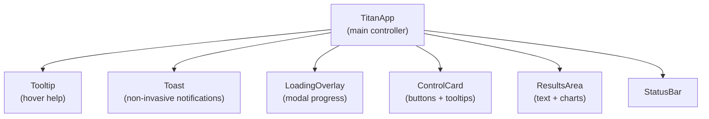
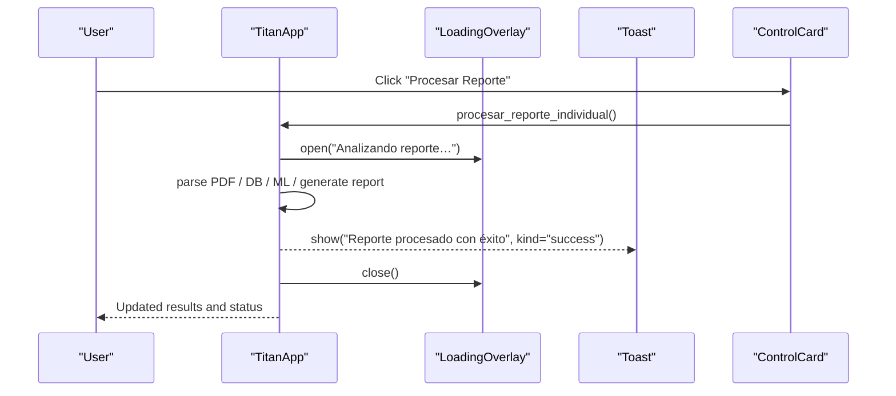
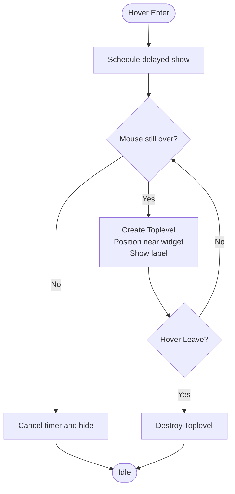
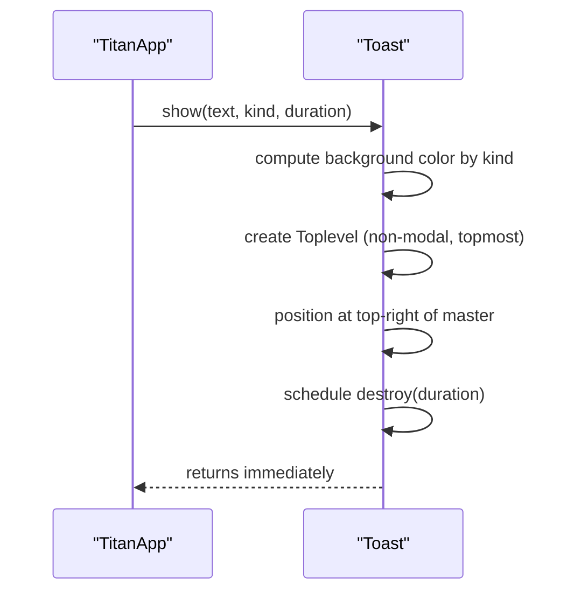
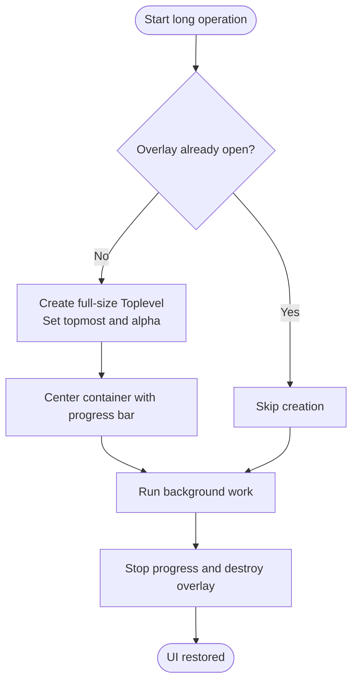
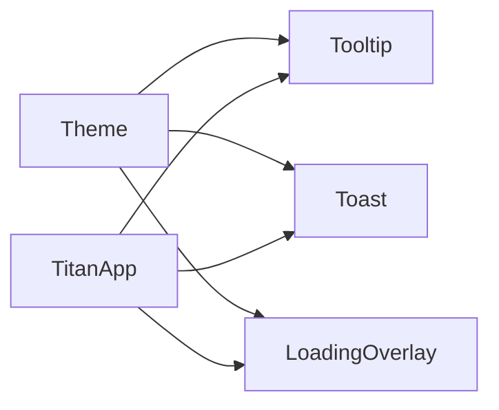

# UI Utilities and Components

<cite>
**Referenced Files in This Document**
- [app.py](file://app.py)
</cite>

## Table of Contents
1. [Introduction](#introduction)
2. [Project Structure](#project-structure)
3. [Core Components](#core-components)
4. [Architecture Overview](#architecture-overview)
5. [Detailed Component Analysis](#detailed-component-analysis)
6. [Dependency Analysis](#dependency-analysis)
7. [Performance Considerations](#performance-considerations)
8. [Troubleshooting Guide](#troubleshooting-guide)
9. [Conclusion](#conclusion)
10. [Appendices](#appendices)

## Introduction
This document explains the interactive utility classes and components that power user feedback in the Proyecto Titán desktop application. It focuses on:
- Tooltip: hover detection, positioning, and delayed display
- Toast: color-coded notifications with auto-dismiss and non-invasive overlay behavior
- LoadingOverlay: modal blocking overlay for long-running operations with progress indication

It also provides practical usage patterns, best practices for user feedback, and accessibility considerations for screen readers and keyboard navigation.

## Project Structure
The utilities are implemented as reusable classes within the main application module and are consumed by the primary app controller to provide consistent UX across workflows such as processing reports, generating evolution reports, and exporting PDFs.

**Diagram sources**
- [app.py:308-390](file://app.py#L308-L390)
- [app.py:72-173](file://app.py#L72-L173)

**Section sources**
- [app.py:72-173](file://app.py#L72-L173)
- [app.py:308-390](file://app.py#L308-L390)

## Core Components
- Tooltip: Lightweight helper text shown near a widget when hovered. Supports configurable delay and precise placement relative to the target widget.
- Toast: Non-blocking notification displayed in the top-right corner with color-coded types (success, warning, error, info). Auto-dismisses after a duration.
- LoadingOverlay: Full-window modal overlay that blocks interaction during long-running tasks and shows an indeterminate progress indicator.

These components are instantiated once per application instance and reused throughout the UI flows.

**Section sources**
- [app.py:72-173](file://app.py#L72-L173)
- [app.py:308-316](file://app.py#L308-L316)

## Architecture Overview
The application orchestrates user interactions through TitanApp, which wires up the three utilities:
- ControlCard buttons bind tooltips for contextual help
- Long-running actions open LoadingOverlay, perform work, then close it
- Success or error outcomes are communicated via Toast

**Diagram sources**
- [app.py:411-449](file://app.py#L411-L449)
- [app.py:141-173](file://app.py#L141-L173)
- [app.py:113-139](file://app.py#L113-L139)
- [app.py:220-259](file://app.py#L220-L259)

## Detailed Component Analysis

### Tooltip
Purpose:
- Provide contextual help when users hover over interactive elements.

Key behaviors:
- Hover detection: Binds to Enter/Leave events on the target widget.
- Delayed display: Uses a configurable delay before showing the tooltip to avoid flicker during quick mouse movements.
- Positioning algorithm: Computes the target widget’s bounding box and places the tooltip slightly offset to the right and below the element using root coordinates.
- Lifecycle: Creates a small Toplevel window with a styled frame and label; hides and destroys it on Leave.

Usage example:
- Attach to any Tkinter/customtkinter widget by instantiating Tooltip with the widget, text, fonts, and optional delay.

Best practices:
- Keep tooltip text concise and actionable.
- Use delays around 300–600 ms to balance responsiveness and stability.
- Avoid heavy content inside tooltips; keep them lightweight for fast rendering.

Accessibility notes:
- Tooltips rely on mouse hover; ensure critical information is also available via focusable controls and status messages.
- For keyboard-only users, consider exposing equivalent help via accessible labels or status bar updates.

**Section sources**
- [app.py:72-111](file://app.py#L72-L111)
- [app.py:220-259](file://app.py#L220-L259)

#### Tooltip Flowchart

**Diagram sources**
- [app.py:72-111](file://app.py#L72-L111)

### Toast
Purpose:
- Deliver brief, non-invasive feedback without interrupting workflow.

Key behaviors:
- Color-coded message types: success, warning, error, info mapped to theme colors.
- Auto-dismiss timing: Automatically closes after a configurable duration.
- Overlay behavior: Displays as a small floating Toplevel anchored to the top-right of the main window; does not block interaction.

Usage example:
- Call show(text, kind, duration) from anywhere in the app to notify users about outcomes.

Best practices:
- Use success for completed actions, warning for cautionary states, error for failures, and info for general updates.
- Keep messages short and clear; include action context when helpful.
- Choose durations appropriate to message importance (e.g., longer for errors).

Accessibility notes:
- Toasts are visual-only; pair with status bar updates or announcements for screen reader users.
- Ensure keyboard users can perceive state changes via focus management or status updates.

**Section sources**
- [app.py:113-139](file://app.py#L113-L139)
- [app.py:411-449](file://app.py#L411-L449)
- [app.py:451-482](file://app.py#L451-L482)
- [app.py:494-513](file://app.py#L494-L513)

#### Toast Sequence

**Diagram sources**
- [app.py:113-139](file://app.py#L113-L139)

### LoadingOverlay
Purpose:
- Block interaction and indicate ongoing work during long-running operations.

Key behaviors:
- Modal blocking: Creates a full-size Toplevel covering the main window; set as topmost and semi-transparent to visually block underlying content.
- Progress indication: Shows an indeterminate progress bar that animates while the operation runs.
- Lifecycle: Single-instance guard prevents overlapping overlays; ensures cleanup on close.

Usage example:
- Open before starting a long task; close in a finally block to guarantee restoration of UI state.

Best practices:
- Always wrap long operations with open/close in try/finally to prevent stuck overlays.
- Provide meaningful status text to inform users what is happening.
- Combine with Toast for completion feedback.

Accessibility notes:
- The overlay is non-modal at the OS level; ensure focus remains on the main window and that no stray focus escapes into the overlay.
- Announce start/end of long operations via status bar or accessible messages for screen readers.

**Section sources**
- [app.py:141-173](file://app.py#L141-L173)
- [app.py:411-449](file://app.py#L411-L449)
- [app.py:451-482](file://app.py#L451-L482)
- [app.py:494-513](file://app.py#L494-L513)

#### LoadingOverlay Flow

**Diagram sources**
- [app.py:141-173](file://app.py#L141-L173)

## Dependency Analysis
- Theme: Centralized color palette used by Tooltip, Toast, and LoadingOverlay for consistent styling.
- customtkinter and tkinter: Used for widgets, frames, labels, progress bars, and Toplevel windows.
- TitanApp: Instantiates and manages instances of Tooltip, Toast, and LoadingOverlay; integrates them into workflows.

**Diagram sources**
- [app.py:48-67](file://app.py#L48-L67)
- [app.py:72-173](file://app.py#L72-L173)
- [app.py:308-316](file://app.py#L308-L316)

**Section sources**
- [app.py:48-67](file://app.py#L48-L67)
- [app.py:72-173](file://app.py#L72-L173)
- [app.py:308-316](file://app.py#L308-L316)

## Performance Considerations
- Tooltip delay reduces unnecessary window creation and improves perceived responsiveness.
- Toast uses lightweight Toplevel windows and auto-cleanup to avoid memory leaks.
- LoadingOverlay uses a single instance pattern to prevent stacking multiple overlays; always close in finally blocks.
- Avoid heavy computations in event handlers; offload to background threads if needed and update UI safely.

[No sources needed since this section provides general guidance]

## Troubleshooting Guide
Common issues and resolutions:
- Tooltip not appearing:
  - Verify the target widget has focus or is visible; check that hover events are bound.
  - Ensure delay is not too high for your use case.
- Toast not visible:
  - Confirm the master window geometry is updated before creating the overlay; call update_idletasks if necessary.
  - Check that duration is sufficient to read the message.
- LoadingOverlay stuck:
  - Ensure close() is called in a finally block after opening.
  - Validate that the overlay was created only once per operation.

**Section sources**
- [app.py:72-111](file://app.py#L72-L111)
- [app.py:113-173](file://app.py#L113-L173)
- [app.py:411-449](file://app.py#L411-L449)
- [app.py:451-482](file://app.py#L451-L482)
- [app.py:494-513](file://app.py#L494-L513)

## Conclusion
The Tooltip, Toast, and LoadingOverlay utilities provide a cohesive, accessible, and robust foundation for user feedback in Proyecto Titán. By following the recommended patterns—delayed tooltips, color-coded toasts, and guarded loading overlays—you can deliver clear, timely, and non-invasive feedback that enhances usability and reliability.

[No sources needed since this section summarizes without analyzing specific files]

## Appendices

### Practical Implementation Examples
- Adding a tooltip to a button:
  - Instantiate Tooltip with the button widget, descriptive text, fonts, and a reasonable delay.
  - Reference: [app.py:220-259](file://app.py#L220-L259)
- Showing a success toast:
  - Call toast.show("Operation completed", kind="success") after finishing a task.
  - Reference: [app.py:411-449](file://app.py#L411-L449)
- Wrapping a long operation with LoadingOverlay:
  - Open before work, close in finally; combine with toast for outcome feedback.
  - References: [app.py:411-449](file://app.py#L411-L449), [app.py:451-482](file://app.py#L451-L482), [app.py:494-513](file://app.py#L494-L513)

### Best Practices for User Feedback Patterns
- Be consistent: Use the same message styles and durations for similar outcomes.
- Keep it brief: Short messages improve readability and reduce cognitive load.
- Provide recovery paths: When errors occur, guide users toward next steps.
- Respect user control: Allow dismissing or extending visibility where appropriate.

[No sources needed since this section provides general guidance]

### Accessibility Considerations
- Screen readers:
  - Pair visual feedback (tooltips, toasts) with status bar updates or accessible announcements.
  - Ensure dynamic content changes are announced to assistive technologies.
- Keyboard navigation:
  - Maintain logical tab order; ensure focus does not escape into overlays unintentionally.
  - Provide keyboard shortcuts for key actions and announce their effects.
- Focus management:
  - On open/close of overlays, return focus to the originating control.
  - Avoid trapping focus unless absolutely necessary; if used, ensure escape handling and clear exit cues.

[No sources needed since this section provides general guidance]