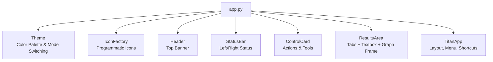
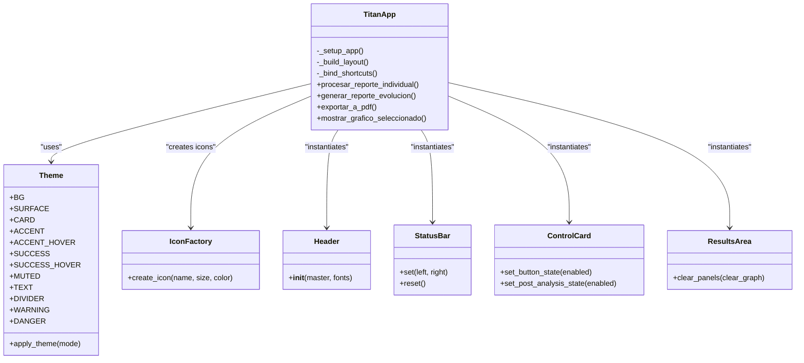
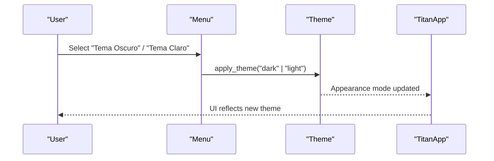
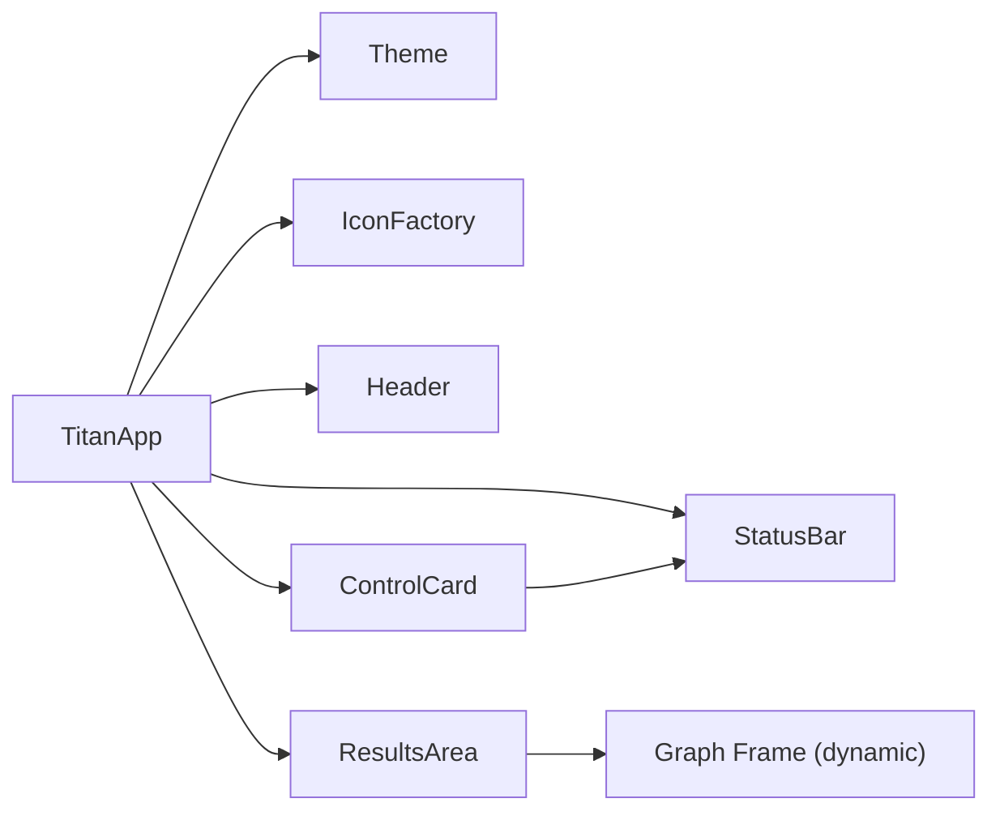

# User Interface Design

<cite>
**Referenced Files in This Document**
- [app.py](file://app.py)
</cite>

## Table of Contents
1. [Introduction](#introduction)
2. [Project Structure](#project-structure)
3. [Core Components](#core-components)
4. [Architecture Overview](#architecture-overview)
5. [Detailed Component Analysis](#detailed-component-analysis)
6. [Dependency Analysis](#dependency-analysis)
7. [Performance Considerations](#performance-considerations)
8. [Troubleshooting Guide](#troubleshooting-guide)
9. [Conclusion](#conclusion)
10. [Appendices](#appendices)

## Introduction
This document describes the user interface design system for the Proyecto Titán desktop application built with CustomTkinter. It focuses on the Theme class and its color palette, theme switching between dark and light modes, custom UI components (Header, StatusBar, ControlCard, ResultsArea), the IconFactory system for programmatic vector icons, the font system, spacing conventions, and visual hierarchy principles. It also provides guidance for extending the theme system and creating new styled components that integrate seamlessly with the existing design language.

## Project Structure
The UI is implemented in a single cohesive module that defines the theme, utilities, custom components, and the main application window. The key responsibilities are:
- Theme management and color palette
- Utility overlays (Tooltip, Toast, LoadingOverlay)
- Custom UI components (Header, StatusBar, ControlCard, ResultsArea)
- Main application orchestration (TitanApp)

**Diagram sources**
- [app.py:48-67](file://app.py#L48-L67)
- [app.py:178-193](file://app.py#L178-L193)
- [app.py:196-202](file://app.py#L196-L202)
- [app.py:204-219](file://app.py#L204-L219)
- [app.py:220-269](file://app.py#L220-L269)
- [app.py:271-303](file://app.py#L271-L303)
- [app.py:308-395](file://app.py#L308-L395)

**Section sources**
- [app.py:48-67](file://app.py#L48-L67)
- [app.py:178-193](file://app.py#L178-L193)
- [app.py:196-202](file://app.py#L196-L202)
- [app.py:204-219](file://app.py#L204-L219)
- [app.py:220-269](file://app.py#L220-L269)
- [app.py:271-303](file://app.py#L271-L303)
- [app.py:308-395](file://app.py#L308-L395)

## Core Components
- Theme: Centralized color palette and appearance mode switcher.
- IconFactory: Creates scalable vector-like icons programmatically using PIL and renders them as CustomTkinter images.
- Header: Top banner with title and subtitle.
- StatusBar: Persistent status area with left/right labels.
- ControlCard: Action panel with buttons, tooltips, and tool selectors.
- ResultsArea: Tabbed results area containing a text report and a graph frame.

Key implementation references:
- Theme constants and apply_theme method
- IconFactory.create_icon static method
- Header, StatusBar, ControlCard, ResultsArea classes

**Section sources**
- [app.py:48-67](file://app.py#L48-L67)
- [app.py:178-193](file://app.py#L178-L193)
- [app.py:196-202](file://app.py#L196-L202)
- [app.py:204-219](file://app.py#L204-L219)
- [app.py:220-269](file://app.py#L220-L269)
- [app.py:271-303](file://app.py#L271-L303)

## Architecture Overview
The application composes a consistent UI by combining a central theme, reusable components, and an orchestrating app class. The layout uses a two-column grid: a sidebar (ControlCard) and a main content area (ResultsArea). A header spans both columns at the top, and a status bar anchors the bottom.

**Diagram sources**
- [app.py:48-67](file://app.py#L48-L67)
- [app.py:178-193](file://app.py#L178-L193)
- [app.py:196-202](file://app.py#L196-L202)
- [app.py:204-219](file://app.py#L204-L219)
- [app.py:220-269](file://app.py#L220-L269)
- [app.py:271-303](file://app.py#L271-L303)
- [app.py:308-395](file://app.py#L308-L395)

## Detailed Component Analysis

### Theme System
- Color palette includes background, surface, card, accent, success, warning, danger, muted, text, and divider colors.
- Theme.apply_theme switches the appearance mode via CustomTkinter to support dark and light themes.
- The main app sets the default color theme and applies the dark mode at startup.

Usage highlights:
- Background and surfaces applied across frames and widgets
- Accent and success used for primary actions and positive feedback
- Warning and danger for alerts and errors
- Muted and text for secondary and primary text

Extending the theme:
- Add new color constants to the Theme class
- Use these constants consistently in new components
- Optionally add hover variants for interactive elements

**Section sources**
- [app.py:48-67](file://app.py#L48-L67)
- [app.py:317-333](file://app.py#L317-L333)

### IconFactory
- Provides a static method to create small, scalable icons programmatically using PIL and returns CustomTkinter images suitable for buttons and labels.
- Supports named icons such as process, compare, export; can be extended with additional shapes or paths.

Best practices:
- Keep icon sizes small and consistent
- Use transparent backgrounds for overlay compatibility
- Reuse created icons across multiple widgets to reduce memory usage

**Section sources**
- [app.py:178-193](file://app.py#L178-L193)

### Header
- Displays the application title and a descriptive subtitle.
- Uses the theme’s surface color for the background and theme text/muted colors for typography.
- Layout uses grid with padding to maintain consistent spacing.

Responsive behavior:
- Expands horizontally with the parent container
- Maintains internal padding for readability

**Section sources**
- [app.py:196-202](file://app.py#L196-L202)

### StatusBar
- Two-label status bar with left and right sections.
- Default message shown initially; updated dynamically during operations.
- Uses theme surface for background and muted text for non-emphasis messages.

API:
- set(left, right): update one or both labels
- reset(): restore default left label

**Section sources**
- [app.py:204-219](file://app.py#L204-L219)

### ControlCard
- Primary action panel containing:
  - Process Report button (success-themed)
  - Generate Evolution button (accent-themed)
  - Divider
  - Analysis tools section with a dropdown and Export to PDF button
- Integrates Tooltips for contextual help
- Binds hover events to update the StatusBar with contextual hints
- Exposes methods to enable/disable controls based on workflow state

Layout and styling:
- Card-style frame with rounded corners and theme card color
- Buttons use consistent height, corner radius, and hover colors
- Dropdown and export button disabled until analysis is complete

State management:
- set_button_state(enabled): toggles primary action buttons
- set_post_analysis_state(enabled): toggles post-analysis tools

**Section sources**
- [app.py:220-269](file://app.py#L220-L269)

### ResultsArea
- Tabbed interface with “Resumen” and “Gráfico” tabs.
- Resumen tab contains a read-only textbox for textual reports.
- Gráfico tab contains a frame where plots are rendered.
- clear_panels allows resetting content and optionally clearing graphs.

Layout:
- Grid-based with weight configuration to fill available space
- Tabs use theme surface and accent for selected indicator
- Textbox uses background and text colors from the theme

**Section sources**
- [app.py:271-303](file://app.py#L271-L303)

### Font System and Visual Hierarchy
- Fonts are defined centrally in the app initialization:
  - Headings: H1, H2, H3 with increasing sizes and bold weights
  - Body: standard readable size
  - Mono: monospaced font for code-like content
- Typography is applied consistently across components to establish hierarchy:
  - H1 for main titles
  - H2 for section headers
  - H3 for subsections and button labels
  - BODY for descriptions and secondary text
  - MONO for technical output

Spacing conventions:
- Consistent padding around labels and buttons
- Vertical rhythm maintained via tuple paddings like (top, bottom)
- Horizontal margins applied uniformly within cards

Accessibility considerations:
- High contrast between text and background colors
- Clear distinction between primary and secondary actions through color and hover states

**Section sources**
- [app.py:317-333](file://app.py#L317-L333)
- [app.py:196-202](file://app.py#L196-L202)
- [app.py:220-269](file://app.py#L220-L269)
- [app.py:271-303](file://app.py#L271-L303)

### Theme Switching Workflow
- The menu provides commands to switch between dark and light modes.
- Theme.apply_theme updates the appearance mode globally.
- The app initializes with dark mode and a specific color theme.

**Diagram sources**
- [app.py:336-354](file://app.py#L336-L354)
- [app.py:48-67](file://app.py#L48-L67)

**Section sources**
- [app.py:336-354](file://app.py#L336-L354)
- [app.py:48-67](file://app.py#L48-L67)

## Dependency Analysis
- The main application depends on:
  - Theme for colors and appearance mode
  - IconFactory for generating icons
  - CustomTkinter widgets for layout and styling
  - PIL for drawing icons
- Components are loosely coupled through composition:
  - TitanApp composes Header, StatusBar, ControlCard, and ResultsArea
  - ControlCard interacts with StatusBar via hover bindings
  - ResultsArea hosts dynamic content (text and graphs)

**Diagram sources**
- [app.py:308-395](file://app.py#L308-L395)
- [app.py:220-269](file://app.py#L220-L269)
- [app.py:271-303](file://app.py#L271-L303)

**Section sources**
- [app.py:308-395](file://app.py#L308-L395)
- [app.py:220-269](file://app.py#L220-L269)
- [app.py:271-303](file://app.py#L271-L303)

## Performance Considerations
- Reuse icons created by IconFactory to avoid redundant image generation.
- Avoid heavy computations in event handlers; offload to background tasks if needed.
- Limit widget creation inside loops; prefer updating existing widgets.
- Use lazy loading for graphs and large text content when possible.
- Keep theme changes minimal; batch UI updates to reduce redraw overhead.

[No sources needed since this section provides general guidance]

## Troubleshooting Guide
Common issues and resolutions:
- Missing model file: If the machine learning model file is not found, the app displays a critical error dialog guiding users to ensure the model exists in the expected directory.
- Errors during processing: Exceptions are caught and displayed in the results area with a toast notification and status bar update.
- Export failures: Export operations show warnings or errors via message boxes and status updates.

Operational tips:
- Verify database path and existence before running analysis workflows.
- Ensure required directories exist (e.g., exports folder).
- Check that the model file is present and compatible.

**Section sources**
- [app.py:514-547](file://app.py#L514-L547)
- [app.py:571-581](file://app.py#L571-L581)

## Conclusion
The Proyecto Titán UI design system centers around a robust Theme class, a set of reusable components, and a consistent visual language. The architecture promotes clarity, extensibility, and maintainability. By following the established patterns for colors, fonts, spacing, and component structure, developers can extend the system with new features while preserving a cohesive user experience.

[No sources needed since this section summarizes without analyzing specific files]

## Appendices

### Extending the Theme System
- Add new color constants to the Theme class.
- Apply the new colors consistently across components.
- Provide hover variants for interactive elements where appropriate.

Example reference points:
- Theme constants and apply_theme
- Usage of Theme colors in components

**Section sources**
- [app.py:48-67](file://app.py#L48-L67)
- [app.py:220-269](file://app.py#L220-L269)

### Creating Custom Styled Components
- Inherit from CustomTkinter frames or widgets.
- Use Theme colors for backgrounds, borders, and text.
- Adopt the established font hierarchy and spacing conventions.
- Integrate with StatusBar for contextual feedback and Tooltips for help.

Reference patterns:
- ControlCard layout and interactions
- ResultsArea tabbed layout and content management

**Section sources**
- [app.py:220-269](file://app.py#L220-L269)
- [app.py:271-303](file://app.py#L271-L303)