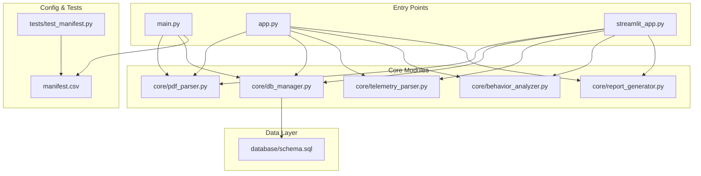
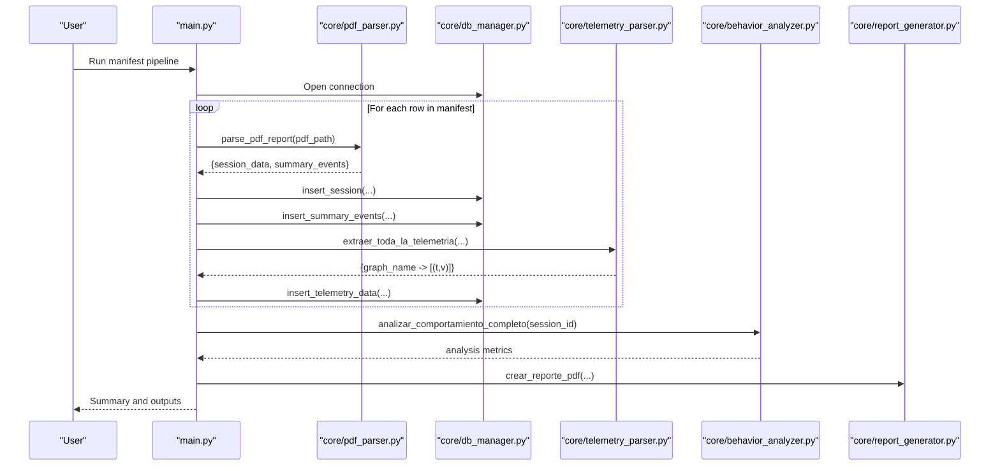
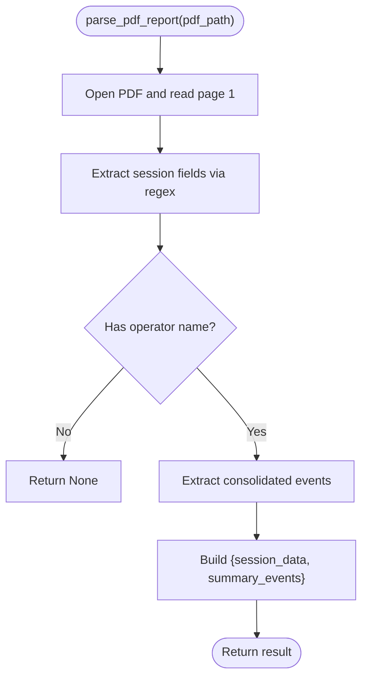
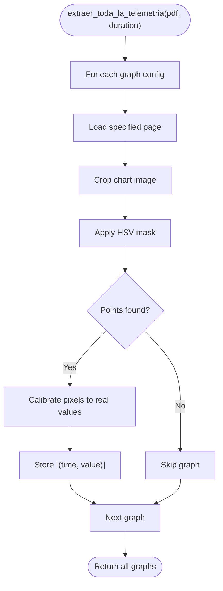
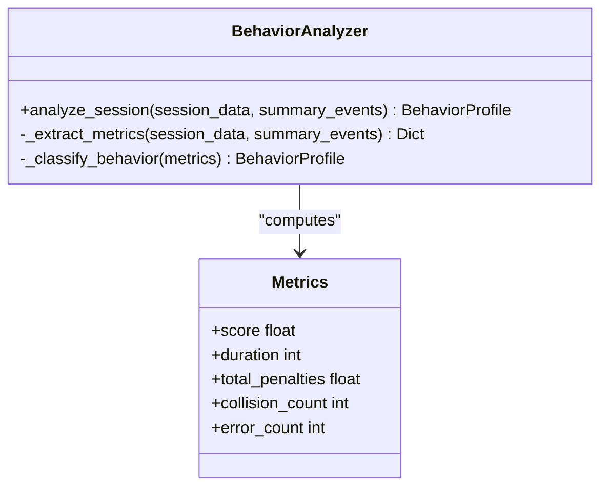
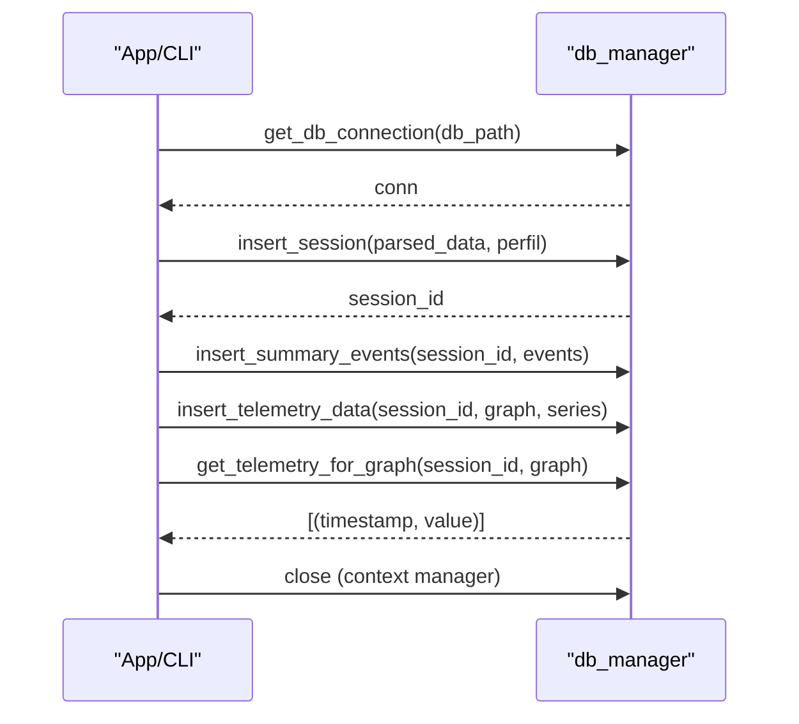
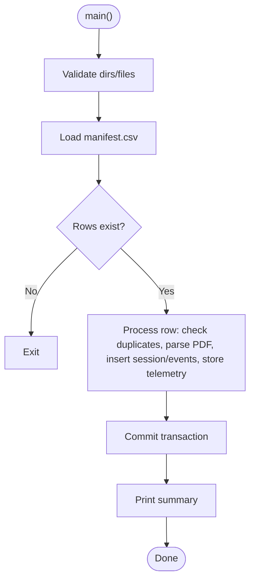
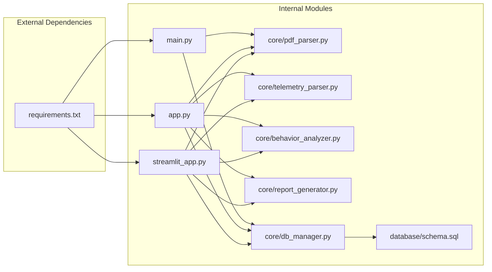

# Developer Guide

<cite>
**Referenced Files in This Document**
- [requirements.txt](file://requirements.txt)
- [main.py](file://main.py)
- [app.py](file://app.py)
- [streamlit_app.py](file://streamlit_app.py)
- [setup_database.py](file://setup_database.py)
- [database/schema.sql](file://database/schema.sql)
- [core/pdf_parser.py](file://core/pdf_parser.py)
- [core/db_manager.py](file://core/db_manager.py)
- [core/telemetry_parser.py](file://core/telemetry_parser.py)
- [core/behavior_analyzer.py](file://core/behavior_analyzer.py)
- [core/report_generator.py](file://core/report_generator.py)
- [manifest.csv](file://manifest.csv)
- [tests/test_manifest.py](file://tests/test_manifest.py)
</cite>

## Table of Contents
1. Introduction
2. Project Structure
3. Core Components
4. Architecture Overview
5. Detailed Component Analysis
6. Dependency Analysis
7. Performance Considerations
8. Troubleshooting Guide
9. Conclusion
10. Appendices

## Introduction
This guide provides developers with setup instructions, development workflow best practices, and contribution guidelines for the project. It explains how to configure your IDE and environment, run and debug the application, understand the codebase architecture and module dependencies, follow coding standards, and contribute new features or parsers. It also covers build and packaging considerations, release management practices, and examples for extending core functionality such as adding new PDF parsers and custom analysis modules.

## Project Structure
The repository is organized into clear layers:
- Entry points: CLI pipeline (main.py), desktop UI (app.py), web UI (streamlit_app.py)
- Core logic: PDF parsing, telemetry extraction, behavior analysis, reporting, database access
- Data layer: SQLite schema and initialization script
- Configuration and manifests: manifest-driven batch processing
- Tests: validation scripts for manifest and DB schema

**Diagram sources**
- [main.py:1-196](file://main.py#L1-L196)
- [app.py:1-591](file://app.py#L1-L591)
- [streamlit_app.py:1-202](file://streamlit_app.py#L1-L202)
- [core/pdf_parser.py:1-124](file://core/pdf_parser.py#L1-L124)
- [core/telemetry_parser.py:1-171](file://core/telemetry_parser.py#L1-L171)
- [core/behavior_analyzer.py:1-236](file://core/behavior_analyzer.py#L1-L236)
- [core/report_generator.py:1-149](file://core/report_generator.py#L1-L149)
- [core/db_manager.py:1-152](file://core/db_manager.py#L1-L152)
- [database/schema.sql:1-59](file://database/schema.sql#L1-L59)
- [manifest.csv:1-20](file://manifest.csv#L1-L20)
- [tests/test_manifest.py:1-110](file://tests/test_manifest.py#L1-L110)

**Section sources**
- [main.py:1-196](file://main.py#L1-L196)
- [app.py:1-591](file://app.py#L1-L591)
- [streamlit_app.py:1-202](file://streamlit_app.py#L1-L202)
- [database/schema.sql:1-59](file://database/schema.sql#L1-L59)

## Core Components
- PDF Parser: Extracts session metadata and summary events from PDF reports using text and regex patterns.
- Telemetry Parser: Extracts time-series data from charts via image cropping, color masking, and calibration.
- Behavior Analyzer: Computes behavioral metrics from telemetry and summarizes driver-like behaviors.
- Report Generator: Produces professional PDF reports for individual sessions and evolution comparisons.
- Database Manager: Provides SQLite connection handling, session/event insertion, and telemetry retrieval.
- Entry Points:
  - main.py: Manifest-driven ETL pipeline that processes multiple PDFs and persists results.
  - app.py: Desktop GUI built with CustomTkinter for interactive analysis and export.
  - streamlit_app.py: Web-based interface for uploading PDFs, viewing results, and comparing sessions.

Key responsibilities and interactions are illustrated below.

**Section sources**
- [core/pdf_parser.py:1-124](file://core/pdf_parser.py#L1-L124)
- [core/telemetry_parser.py:1-171](file://core/telemetry_parser.py#L1-L171)
- [core/behavior_analyzer.py:1-236](file://core/behavior_analyzer.py#L1-L236)
- [core/report_generator.py:1-149](file://core/report_generator.py#L1-L149)
- [core/db_manager.py:1-152](file://core/db_manager.py#L1-L152)
- [main.py:1-196](file://main.py#L1-L196)
- [app.py:1-591](file://app.py#L1-L591)
- [streamlit_app.py:1-202](file://streamlit_app.py#L1-L202)

## Architecture Overview
The system follows a layered architecture:
- Presentation layer: CLI, desktop UI, and Streamlit web UI
- Application orchestration: Session processing, ML prediction integration, report generation
- Domain logic: PDF parsing, telemetry extraction, behavior analysis
- Data persistence: SQLite with a well-defined schema

**Diagram sources**
- [main.py:22-196](file://main.py#L22-L196)
- [core/pdf_parser.py:27-57](file://core/pdf_parser.py#L27-L57)
- [core/db_manager.py:106-152](file://core/db_manager.py#L106-L152)
- [core/telemetry_parser.py:125-154](file://core/telemetry_parser.py#L125-L154)
- [core/behavior_analyzer.py:150-167](file://core/behavior_analyzer.py#L150-L167)
- [core/report_generator.py:28-75](file://core/report_generator.py#L28-L75)

## Detailed Component Analysis

### PDF Parser
- Purpose: Extract session-level metadata and summary event counts from PDF reports.
- Key techniques: Text extraction, regex matching, locale-aware date parsing, duration conversion.
- Extensibility: Add new fields by defining additional regex patterns and mapping them in session data construction.

**Diagram sources**
- [core/pdf_parser.py:27-57](file://core/pdf_parser.py#L27-L57)
- [core/pdf_parser.py:66-124](file://core/pdf_parser.py#L66-L124)

**Section sources**
- [core/pdf_parser.py:1-124](file://core/pdf_parser.py#L1-L124)

### Telemetry Parser
- Purpose: Extract time-series data from chart images embedded in PDFs.
- Key techniques: Page selection, image cropping, HSV color masking, pixel-to-real-value calibration.
- Extensibility: Add new graphs by registering entries in the central configuration with page, image index, color ranges, and calibration bounds.

**Diagram sources**
- [core/telemetry_parser.py:16-72](file://core/telemetry_parser.py#L16-L72)
- [core/telemetry_parser.py:81-154](file://core/telemetry_parser.py#L81-L154)

**Section sources**
- [core/telemetry_parser.py:1-171](file://core/telemetry_parser.py#L1-L171)

### Behavior Analyzer
- Purpose: Compute behavioral metrics from stored telemetry and summarize driving-like behaviors.
- Key functions: Braking sharpness, steering corrections, acceleration spikes, fork height adjustments, tilt adjustments, speed statistics.
- Integration: Consumes telemetry series from the database and returns a consolidated analysis dictionary.

**Diagram sources**
- [core/behavior_analyzer.py:26-67](file://core/behavior_analyzer.py#L26-L67)

**Section sources**
- [core/behavior_analyzer.py:1-236](file://core/behavior_analyzer.py#L1-L236)

### Database Manager
- Purpose: Provide safe SQLite connections and CRUD operations for sessions, events, and telemetry.
- Key capabilities: Context-managed connections, idempotent checks, batch inserts, telemetry retrieval for graphs.

**Diagram sources**
- [core/db_manager.py:23-33](file://core/db_manager.py#L23-L33)
- [core/db_manager.py:106-152](file://core/db_manager.py#L106-L152)

**Section sources**
- [core/db_manager.py:1-152](file://core/db_manager.py#L1-L152)

### Report Generator
- Purpose: Generate professional PDF reports for individual sessions and comparative evolution analyses.
- Features: Header/footer, structured sections, tables with deltas, and color-coded improvements/regressions.

**Section sources**
- [core/report_generator.py:1-149](file://core/report_generator.py#L1-L149)

### Entry Points

#### CLI Pipeline (main.py)
- Orchestrates manifest-driven batch processing: validates structure, loads manifest, iterates rows, parses PDFs, persists data, and prints summaries.
- Idempotency: Skips already processed files based on filename.

**Diagram sources**
- [main.py:22-196](file://main.py#L22-L196)

**Section sources**
- [main.py:1-196](file://main.py#L1-L196)

#### Desktop App (app.py)
- Interactive GUI for single-report analysis, comparison, and PDF export.
- Integrates ML model loading, session storage, telemetry visualization, and behavior analysis.

**Section sources**
- [app.py:1-591](file://app.py#L1-L591)

#### Streamlit App (streamlit_app.py)
- Web interface supporting file upload, per-session analysis, telemetry plotting, and comparison workflows.
- Reuses core modules for parsing, storage, and analysis.

**Section sources**
- [streamlit_app.py:1-202](file://streamlit_app.py#L1-L202)

## Dependency Analysis
- External libraries include PDF processing, computer vision, data manipulation, ML inference, plotting, and UI frameworks.
- Internal dependencies form a clear separation between presentation, orchestration, domain logic, and data layers.

**Diagram sources**
- [requirements.txt:1-61](file://requirements.txt#L1-L61)
- [main.py:1-196](file://main.py#L1-L196)
- [app.py:1-591](file://app.py#L1-L591)
- [streamlit_app.py:1-202](file://streamlit_app.py#L1-L202)
- [core/pdf_parser.py:1-124](file://core/pdf_parser.py#L1-L124)
- [core/telemetry_parser.py:1-171](file://core/telemetry_parser.py#L1-L171)
- [core/behavior_analyzer.py:1-236](file://core/behavior_analyzer.py#L1-L236)
- [core/report_generator.py:1-149](file://core/report_generator.py#L1-L149)
- [core/db_manager.py:1-152](file://core/db_manager.py#L1-L152)
- [database/schema.sql:1-59](file://database/schema.sql#L1-L59)

**Section sources**
- [requirements.txt:1-61](file://requirements.txt#L1-L61)

## Performance Considerations
- Batch processing: The manifest pipeline commits once per batch to reduce overhead.
- Telemetry extraction: Image processing can be CPU-intensive; consider optimizing masks and resolution settings if needed.
- Database queries: Use provided context managers and avoid repeated connections; leverage indexes defined in the schema.
- Reporting: PDF generation is memory-bound; process large datasets incrementally where possible.

[No sources needed since this section provides general guidance]

## Troubleshooting Guide
Common issues and resolutions:
- Missing database or schema:
  - Ensure the database directory exists and run the setup script to apply the schema.
  - If errors persist, delete the existing database file and re-run setup to start clean.
- Manifest validation failures:
  - Verify required columns and presence of referenced PDF files under the reports directory.
- PDF parsing errors:
  - Check that the PDF contains expected text regions and that locale settings allow date parsing.
- Telemetry extraction failures:
  - Confirm that the target pages and image indices match the PDF layout; adjust calibration ranges if chart layouts change.
- ML model not found:
  - Place the trained model file in the models directory before running the desktop or Streamlit apps.

**Section sources**
- [setup_database.py:9-53](file://setup_database.py#L9-L53)
- [tests/test_manifest.py:7-110](file://tests/test_manifest.py#L7-L110)
- [core/pdf_parser.py:27-57](file://core/pdf_parser.py#L27-L57)
- [core/telemetry_parser.py:125-154](file://core/telemetry_parser.py#L125-L154)
- [app.py:514-547](file://app.py#L514-L547)

## Conclusion
This guide outlined the development environment setup, architecture, and contribution practices for the project. By following the recommended workflows and extending core modules through well-defined interfaces, contributors can add new parsers, analysis modules, and reporting features while maintaining code quality and consistency.

[No sources needed since this section summarizes without analyzing specific files]

## Appendices

### Development Environment Setup
- Install dependencies:
  - Use the requirements file to install all necessary packages.
- Initialize the database:
  - Run the database setup script to create or recreate the schema.
- Prepare input data:
  - Place PDF reports in the reports directory and ensure manifest.csv references them correctly.

**Section sources**
- [requirements.txt:1-61](file://requirements.txt#L1-L61)
- [setup_database.py:9-53](file://setup_database.py#L9-L53)
- [manifest.csv:1-20](file://manifest.csv#L1-L20)

### IDE Configuration and Debugging
- Python interpreter:
  - Configure your IDE to use the virtual environment created from the requirements file.
- Run configurations:
  - CLI: Execute the main entry point to run the manifest pipeline.
  - Desktop: Launch the GUI application for interactive workflows.
  - Streamlit: Run the web app for browser-based analysis.
- Debugging tips:
  - Enable logging output to trace parsing and database operations.
  - Inspect intermediate structures (parsed data, telemetry series) when diagnosing failures.
  - Use breakpoints in core modules to validate assumptions about PDF layout and calibration.

**Section sources**
- [main.py:22-196](file://main.py#L22-L196)
- [app.py:308-591](file://app.py#L308-L591)
- [streamlit_app.py:138-202](file://streamlit_app.py#L138-L202)

### Coding Standards and Best Practices
- Modularity:
  - Keep concerns separated: parsing, telemetry, analysis, reporting, and database access in dedicated modules.
- Error handling:
  - Wrap external calls (PDF reading, DB operations) with try/except blocks and return safe defaults or None.
- Data integrity:
  - Validate inputs early (manifest columns, PDF existence) and fail fast with clear messages.
- Extensibility:
  - Centralize configuration (e.g., graph configs) to simplify adding new telemetry graphs.
- Documentation:
  - Update docstrings and comments when modifying core modules.

[No sources needed since this section provides general guidance]

### Contribution Workflow
- Create a feature branch:
  - Isolate changes for clarity and review.
- Implement changes:
  - Follow modular design and maintain backward compatibility where possible.
- Test locally:
  - Run tests to validate manifest structure and database schema.
  - Manually verify parsing and telemetry extraction with sample PDFs.
- Submit a pull request:
  - Include a description of changes, rationale, and any relevant screenshots or logs.
- Code review:
  - Address feedback and update documentation if APIs or behaviors change.

**Section sources**
- [tests/test_manifest.py:7-110](file://tests/test_manifest.py#L7-L110)

### Examples: Extending Core Functionality

#### Adding a New PDF Parser Field
- Steps:
  - Define a new regex pattern for the field you want to extract.
  - Map the extracted value into session data construction.
  - Validate with sample PDFs and update tests if needed.

**Section sources**
- [core/pdf_parser.py:11-25](file://core/pdf_parser.py#L11-L25)
- [core/pdf_parser.py:66-92](file://core/pdf_parser.py#L66-L92)

#### Adding a New Telemetry Graph
- Steps:
  - Register a new entry in the central graph configuration with page number, image index, color ranges, and calibration bounds.
  - Validate extraction by running the telemetry parser against sample PDFs.
  - Ensure downstream components (analysis, reporting) handle the new graph name.

**Section sources**
- [core/telemetry_parser.py:16-72](file://core/telemetry_parser.py#L16-L72)
- [core/telemetry_parser.py:125-154](file://core/telemetry_parser.py#L125-L154)

#### Implementing a Custom Analysis Module
- Steps:
  - Add a new function to compute a metric from telemetry series.
  - Integrate it into the orchestrator to include it in the consolidated analysis output.
  - Update reporting to display the new metric.

**Section sources**
- [core/behavior_analyzer.py:95-167](file://core/behavior_analyzer.py#L95-L167)
- [core/report_generator.py:28-75](file://core/report_generator.py#L28-L75)

### Build, Packaging, and Release Management
- Build:
  - Ensure dependencies are installed and the database schema is applied before building artifacts.
- Packaging:
  - Bundle the application with its dependencies using standard Python packaging tools.
  - Include the models directory and data directories as part of the distribution if required.
- Releases:
  - Tag versions and document changes in release notes.
  - Validate end-to-end flows (CLI, desktop, Streamlit) with representative datasets prior to release.

[No sources needed since this section provides general guidance]