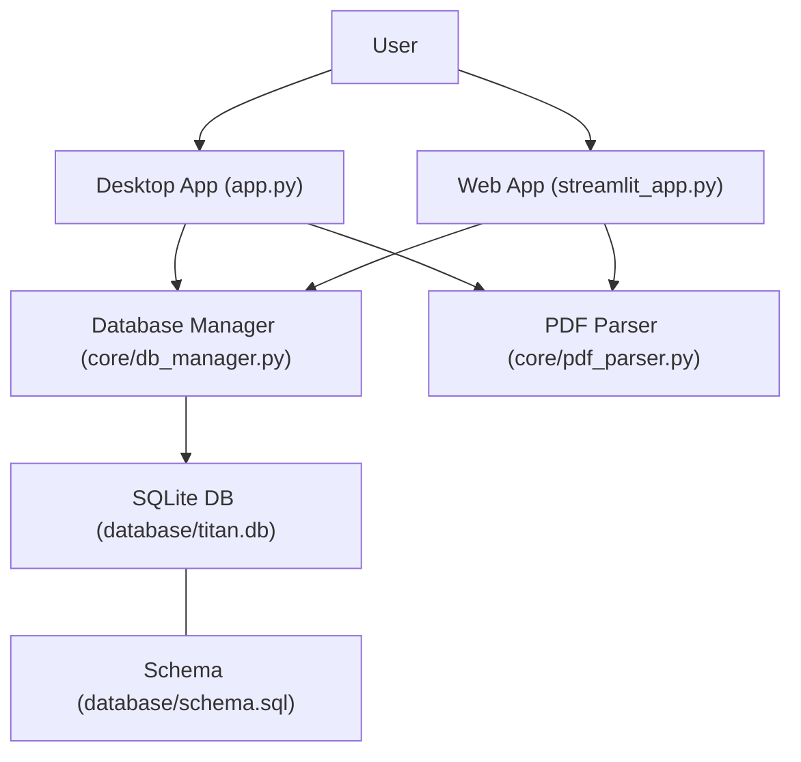
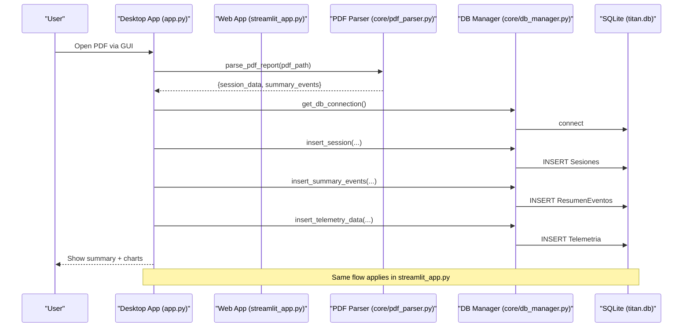
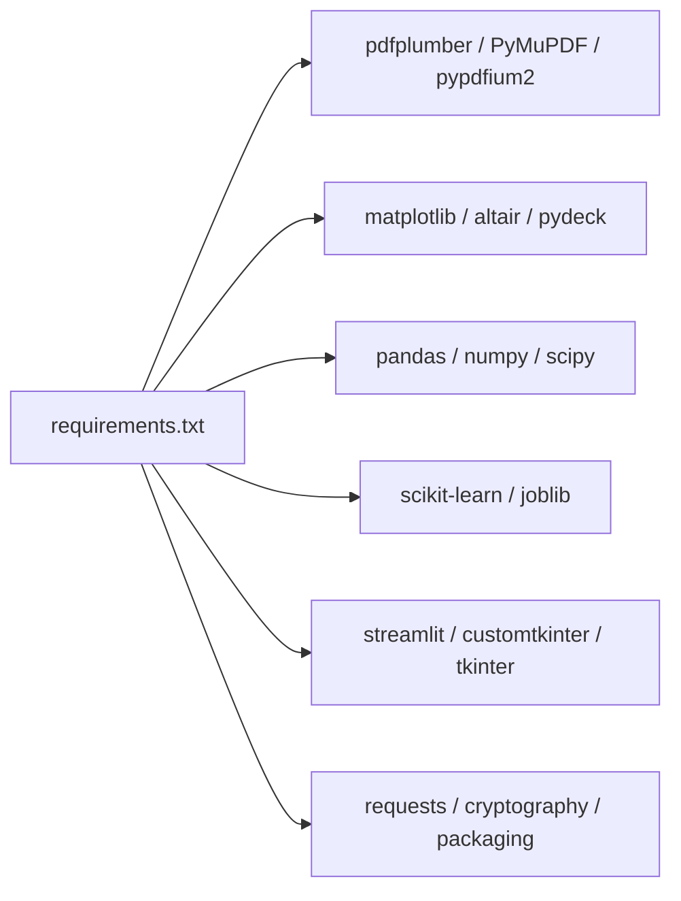

# Getting Started Guide

<cite>
**Referenced Files in This Document**
- [requirements.txt](file://requirements.txt)
- [setup_database.py](file://setup_database.py)
- [database/schema.sql](file://database/schema.sql)
- [app.py](file://app.py)
- [streamlit_app.py](file://streamlit_app.py)
- [core/db_manager.py](file://core/db_manager.py)
- [core/pdf_parser.py](file://core/pdf_parser.py)
</cite>

## Table of Contents
1. Introduction
2. Project Structure
3. Core Components
4. Architecture Overview
5. Detailed Component Analysis
6. Dependency Analysis
7. Performance Considerations
8. Troubleshooting Guide
9. Conclusion
10. Appendices

## Introduction
This guide helps you install, configure, and run Proyecto Titán for the first time. You will set up a Python environment, install dependencies, initialize the SQLite database, and launch both the desktop application and the Streamlit web interface. You will also learn how to process a sample PDF report, view telemetry data, and generate initial analysis reports.

Prerequisites:
- Basic Python programming knowledge
- Understanding of PDF files (how to open and inspect them)
- Familiarity with data analysis concepts (tables, time series, charts)

## Project Structure
Proyecto Titán is organized into clear layers:
- Entry points: app.py (desktop), streamlit_app.py (web), setup_database.py (DB init)
- Data layer: core/db_manager.py (SQLite operations), database/schema.sql (schema)
- Parsing and analysis: core/pdf_parser.py (PDF extraction), core modules for telemetry and reporting
- Outputs: data/exports (processed PDFs), data/reports (optional ETL outputs)

**Diagram sources**
- [app.py:308-589](file://app.py#L308-L589)
- [streamlit_app.py:138-202](file://streamlit_app.py#L138-L202)
- [core/db_manager.py:23-90](file://core/db_manager.py#L23-L90)
- [core/pdf_parser.py:27-57](file://core/pdf_parser.py#L27-L57)
- [database/schema.sql:14-59](file://database/schema.sql#L14-L59)

**Section sources**
- [app.py:308-589](file://app.py#L308-L589)
- [streamlit_app.py:138-202](file://streamlit_app.py#L138-L202)
- [core/db_manager.py:23-90](file://core/db_manager.py#L23-L90)
- [core/pdf_parser.py:27-57](file://core/pdf_parser.py#L27-L57)
- [database/schema.sql:14-59](file://database/schema.sql#L14-L59)

## Core Components
- Desktop Application (app.py): GUI built with customtkinter to load PDFs, parse sessions, store results, visualize telemetry, and export reports.
- Web Application (streamlit_app.py): Streamlit-based interface for uploading PDFs, viewing session info, telemetry charts, and generating comparison reports.
- Database Manager (core/db_manager.py): Context-managed SQLite connections and helpers to insert sessions, events, and telemetry; query telemetry by graph name.
- PDF Parser (core/pdf_parser.py): Extracts session metadata and summary events from PDF reports using regex patterns.
- Schema (database/schema.sql): Defines tables Sesiones, ResumenEventos, Telemetria and indexes.

Key responsibilities:
- Parse PDFs reliably and extract structured fields
- Persist sessions, event summaries, and telemetry timeseries
- Provide UI for processing, visualization, and export
- Support both single-session analysis and comparative evolution reports

**Section sources**
- [app.py:308-589](file://app.py#L308-L589)
- [streamlit_app.py:138-202](file://streamlit_app.py#L138-L202)
- [core/db_manager.py:23-90](file://core/db_manager.py#L23-L90)
- [core/pdf_parser.py:27-57](file://core/pdf_parser.py#L27-L57)
- [database/schema.sql:14-59](file://database/schema.sql#L14-L59)

## Architecture Overview
The system follows a layered architecture:
- Presentation layer: Desktop (Tkinter/customtkinter) and Web (Streamlit)
- Business logic: Session parsing, ML classification (via joblib model), behavior analysis, report generation
- Data layer: SQLite database with schema-driven tables and indexes

**Diagram sources**
- [app.py:411-547](file://app.py#L411-L547)
- [streamlit_app.py:69-110](file://streamlit_app.py#L69-L110)
- [core/pdf_parser.py:27-57](file://core/pdf_parser.py#L27-L57)
- [core/db_manager.py:106-152](file://core/db_manager.py#L106-L152)

## Detailed Component Analysis

### Installation and Environment Setup
- Python version: Use Python 3.8 or newer.
- Create and activate a virtual environment (recommended).
- Install dependencies from requirements.txt using pip.
- Initialize the database by running setup_database.py once per environment.

Steps:
1. Verify Python version (must be 3.8+).
2. Create a virtual environment and activate it.
3. Install dependencies:
   - Run pip install -r requirements.txt
4. Initialize the database:
   - Run python setup_database.py
   - This script removes any existing database file and executes database/schema.sql to create tables and indexes.

Notes:
- The schema defines three main tables: Sesiones, ResumenEventos, Telemetria, with appropriate foreign keys and indexes for performance.
- After initialization, a new database file will be created at database/titan.db.

**Section sources**
- [requirements.txt:1-61](file://requirements.txt#L1-L61)
- [setup_database.py:9-52](file://setup_database.py#L9-L52)
- [database/schema.sql:14-59](file://database/schema.sql#L14-L59)

### Running the Desktop Application
- Launch the desktop app:
  - Run python app.py
- Workflow:
  - Click “Process Report” to select a PDF
  - View summary text and telemetry charts
  - Export analysis to PDF if desired
- Keyboard shortcuts:
  - Ctrl+O: Process report
  - Ctrl+S: Export PDF
  - Ctrl+Shift+E: Generate evolution report (compare two PDFs)
  - Ctrl+Q: Quit

What happens under the hood:
- The app parses the PDF, predicts operator profile using a saved model, stores session data, event summaries, and telemetry timeseries in the database, then displays results.

**Section sources**
- [app.py:308-589](file://app.py#L308-L589)
- [core/pdf_parser.py:27-57](file://core/pdf_parser.py#L27-L57)
- [core/db_manager.py:106-152](file://core/db_manager.py#L106-L152)

### Running the Streamlit Web Interface
- Launch the web app:
  - Run streamlit run streamlit_app.py
- Workflow:
  - Upload an individual PDF to analyze a single session
  - Optionally upload initial and final PDFs and click “Compare reports” to generate an evolution report
- Features:
  - View session JSON, textual report, and telemetry charts
  - Intelligent feedback based on raw events

What happens under the hood:
- Similar to the desktop app: parse PDF, predict profile, persist data, and render charts and reports.

**Section sources**
- [streamlit_app.py:138-202](file://streamlit_app.py#L138-L202)
- [core/pdf_parser.py:27-57](file://core/pdf_parser.py#L27-L57)
- [core/db_manager.py:106-152](file://core/db_manager.py#L106-L152)

### First-Time Usage: Processing a Sample PDF
- Prepare a sample PDF report generated by the training system.
- In the desktop app:
  - Click “Process Report” and select your PDF
  - Review the summary tab and switch to the chart tab to view telemetry
- In the Streamlit app:
  - Upload the same PDF in the sidebar
  - Inspect session details, textual report, and telemetry charts
- To compare progress:
  - Use “Generate evolution” in the desktop app or the “Compare reports” button in Streamlit by providing initial and final PDFs

Expected outcomes:
- A new session record in the database
- Event summaries stored
- Telemetry timeseries stored per graph
- Visualizations available for Steering, Speed, Brake Pad, Acceleration Pad, Fork Height, Tilt Angle

**Section sources**
- [app.py:411-547](file://app.py#L411-L547)
- [streamlit_app.py:150-202](file://streamlit_app.py#L150-L202)
- [core/db_manager.py:36-90](file://core/db_manager.py#L36-L90)

### Viewing Telemetry Data
- Telemetry is stored as time-value pairs per graph per session.
- Querying by session and graph name returns a list of (timestamp, value) tuples used to plot charts.
- Available graphs include Steering, Speed In Km/h, Brake Pad, Acceleration Pad, Fork Height In Mtrs, Tilt Angle In Deg.

How to access:
- Desktop: Select a graph from the combo box to display its chart
- Streamlit: Charts are automatically rendered after processing a PDF

**Section sources**
- [core/db_manager.py:36-90](file://core/db_manager.py#L36-L90)
- [app.py:484-490](file://app.py#L484-L490)
- [streamlit_app.py:173-176](file://streamlit_app.py#L173-L176)

### Generating Initial Analysis Reports
- Desktop:
  - After processing a PDF, use “Export to PDF” to save a formatted analysis report
- Streamlit:
  - Use the textual report output for quick review
  - For comparisons, upload initial and final PDFs and click “Compare reports”

Underlying functions:
- Textual report generation and PDF creation are invoked after successful parsing and storage

**Section sources**
- [app.py:494-512](file://app.py#L494-L512)
- [streamlit_app.py:165-183](file://streamlit_app.py#L165-L183)

## Dependency Analysis
Core runtime dependencies include:
- PDF parsing: pdfplumber, PyMuPDF, pypdfium2
- Visualization: matplotlib, altair, pydeck
- Data handling: pandas, numpy, scipy
- Machine learning inference: scikit-learn, joblib
- Web/desktop UI: streamlit, customtkinter, tkinter
- Utilities: requests, cryptography, packaging, etc.

**Diagram sources**
- [requirements.txt:1-61](file://requirements.txt#L1-L61)

**Section sources**
- [requirements.txt:1-61](file://requirements.txt#L1-L61)

## Performance Considerations
- Database indexing: The schema includes indexes on frequently queried columns (operator name, operator profile, session FK) to speed up lookups.
- Telemetry storage: Timeseries are stored as comma-separated strings per graph; retrieval parses these into lists for plotting. Keep datasets reasonable in size to avoid large string payloads.
- Model loading: The ML model is loaded once per process; ensure the model file exists to avoid repeated failures.
- I/O efficiency: Avoid re-parsing the same PDF multiple times within a session; reuse parsed results where possible.

[No sources needed since this section provides general guidance]

## Troubleshooting Guide
Common issues and resolutions:
- Missing dependencies:
  - Symptom: Import errors when launching apps
  - Resolution: Ensure Python 3.8+ and run pip install -r requirements.txt
- Database not initialized:
  - Symptom: Errors connecting to SQLite or missing tables
  - Resolution: Run python setup_database.py to create database/titan.db and apply schema
- Model file missing:
  - Symptom: Error indicating models/modelo_clasificador.joblib not found
  - Resolution: Place the correct model file in models/ directory before running apps
- Locale-related parsing issues:
  - Symptom: Date/time parsing fails or inconsistent results
  - Resolution: Ensure locale support is available; the parser attempts to set en_US.UTF-8
- No telemetry displayed:
  - Symptom: Charts show no data
  - Resolution: Confirm that telemetry was extracted and inserted; verify graph names match expected values

Where to look in code:
- Database connection and telemetry retrieval: core/db_manager.py
- PDF parsing and field extraction: core/pdf_parser.py
- Initialization script: setup_database.py
- Schema definition: database/schema.sql

**Section sources**
- [core/db_manager.py:23-90](file://core/db_manager.py#L23-L90)
- [core/pdf_parser.py:59-64](file://core/pdf_parser.py#L59-L64)
- [setup_database.py:9-52](file://setup_database.py#L9-L52)
- [database/schema.sql:14-59](file://database/schema.sql#L14-L59)

## Conclusion
You now have everything needed to install, configure, and run Proyecto Titán. Start by setting up Python and dependencies, initialize the database, and launch either the desktop or Streamlit interface. Process a sample PDF to see the full pipeline in action: parsing, storage, visualization, and reporting. Refer to the troubleshooting section if you encounter common setup issues.

[No sources needed since this section summarizes without analyzing specific files]

## Appendices

### Quick Commands Reference
- Install dependencies:
  - pip install -r requirements.txt
- Initialize database:
  - python setup_database.py
- Launch desktop app:
  - python app.py
- Launch web app:
  - streamlit run streamlit_app.py

**Section sources**
- [requirements.txt:1-61](file://requirements.txt#L1-L61)
- [setup_database.py:9-52](file://setup_database.py#L9-L52)
- [app.py:587-589](file://app.py#L587-L589)
- [streamlit_app.py:138-147](file://streamlit_app.py#L138-L147)