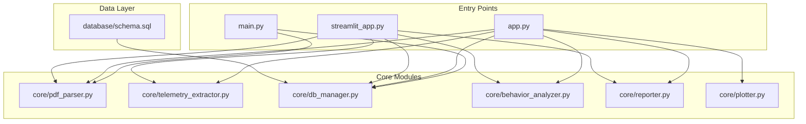
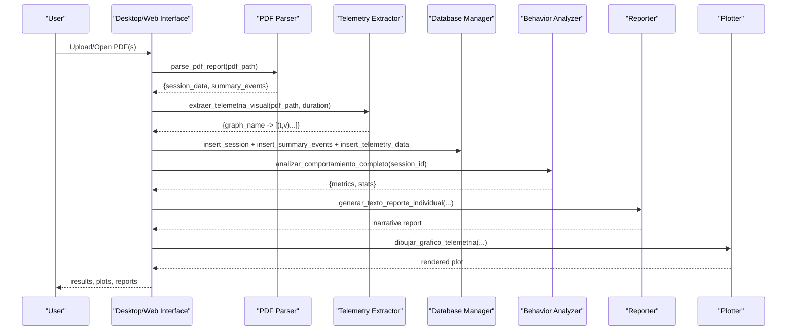
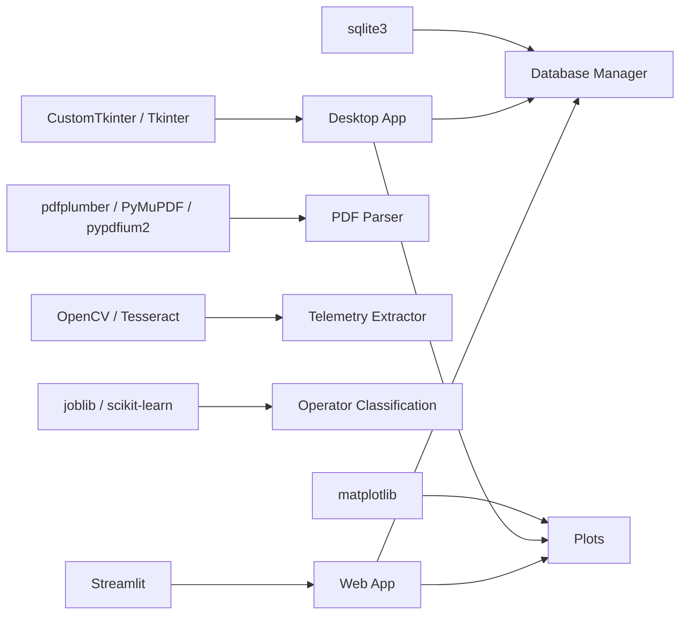

# Project Overview

<cite>
**Referenced Files in This Document**
- [main.py](file://main.py)
- [app.py](file://app.py)
- [streamlit_app.py](file://streamlit_app.py)
- [requirements.txt](file://requirements.txt)
- [core/pdf_parser.py](file://core/pdf_parser.py)
- [core/telemetry_extractor.py](file://core/telemetry_extractor.py)
- [core/db_manager.py](file://core/db_manager.py)
- [core/behavior_analyzer.py](file://core/behavior_analyzer.py)
- [core/reporter.py](file://core/reporter.py)
- [core/plotter.py](file://core/plotter.py)
- [database/schema.sql](file://database/schema.sql)
</cite>

## Table of Contents
1. [Introduction](#introduction)
2. [Project Structure](#project-structure)
3. [Core Components](#core-components)
4. [Architecture Overview](#architecture-overview)
5. [Detailed Component Analysis](#detailed-component-analysis)
6. [Dependency Analysis](#dependency-analysis)
7. [Performance Considerations](#performance-considerations)
8. [Troubleshooting Guide](#troubleshooting-guide)
9. [Conclusion](#conclusion)
10. [Appendices](#appendices)

## Introduction
Proyecto Titán v2.1 is a desktop application with an optional web interface that processes PDF training reports for forklift operators, extracts telemetry data from charts, performs behavioral analysis using machine learning models and rule-based heuristics, and provides comprehensive visualizations to track operator performance and improvement over time. The system supports:
- Session analysis: ingestion of individual training sessions from PDFs into a structured database
- Telemetry extraction: automatic extraction of time-series data (e.g., steering, speed, braking) from PDF charts
- Behavioral profiling: classification of operator behavior profiles and detailed telemetry insights
- Operator classification: ML-driven prediction of operator profile based on session metrics and events
- Visualization: interactive plots and narrative reports for instructors and trainees

The project offers two user experiences:
- Desktop GUI built with CustomTkinter for local processing and visualization
- Web interface built with Streamlit for quick uploads, comparisons, and exports

Common use cases include:
- Individual report processing: upload or open a single PDF to analyze one session
- Multi-session comparison: compare initial and final reports to measure progress
- Batch processing workflows: process multiple PDFs via manifest.csv for automated pipelines

## Project Structure
At a high level, the repository is organized by responsibilities:
- Entry points: main.py (batch ETL), app.py (desktop GUI), streamlit_app.py (web UI)
- Core modules: pdf parsing, telemetry extraction, database management, behavior analysis, reporting, plotting
- Data layer: SQLite schema and database utilities
- Dependencies: requirements.txt lists all libraries used

**Diagram sources**
- [main.py:1-196](file://main.py#L1-L196)
- [app.py:1-591](file://app.py#L1-L591)
- [streamlit_app.py:1-202](file://streamlit_app.py#L1-L202)
- [core/pdf_parser.py:1-124](file://core/pdf_parser.py#L1-L124)
- [core/telemetry_extractor.py:1-239](file://core/telemetry_extractor.py#L1-L239)
- [core/db_manager.py:1-152](file://core/db_manager.py#L1-L152)
- [core/behavior_analyzer.py:1-236](file://core/behavior_analyzer.py#L1-L236)
- [core/reporter.py:1-122](file://core/reporter.py#L1-L122)
- [core/plotter.py:1-70](file://core/plotter.py#L1-L70)
- [database/schema.sql:1-59](file://database/schema.sql#L1-L59)

**Section sources**
- [main.py:1-196](file://main.py#L1-L196)
- [app.py:1-591](file://app.py#L1-L591)
- [streamlit_app.py:1-202](file://streamlit_app.py#L1-L202)
- [requirements.txt:1-61](file://requirements.txt#L1-L61)
- [database/schema.sql:1-59](file://database/schema.sql#L1-L59)

## Core Components
- PDF Parser: Extracts session metadata and summary events from training PDFs using regex patterns and text extraction.
- Telemetry Extractor: Detects chart regions in PDF pages, uses OCR and color segmentation to extract time-series curves, calibrates values to real units, and maps them to known graph names.
- Database Manager: Provides connection handling and CRUD operations for sessions, event summaries, and telemetry series stored in SQLite.
- Behavior Analyzer: Computes telemetry-derived metrics (braking, steering corrections, acceleration spikes, fork height adjustments, tilt adjustments, speed statistics) and classifies operator behavior using rules and ML predictions.
- Reporter: Generates narrative reports and evolution comparisons between sessions, including actionable feedback.
- Plotter: Renders telemetry time-series plots within the desktop GUI using Matplotlib embedded in CustomTkinter.

Key terminology used throughout the codebase:
- Session analysis: End-to-end processing of a single PDF into structured data and insights
- Telemetry extraction: Conversion of chart images in PDFs into calibrated time-series data
- Behavioral profiling: Deriving operator behavior characteristics from session metrics and telemetry
- Operator classification: Predicting operator profile using ML model features derived from session data

**Section sources**
- [core/pdf_parser.py:1-124](file://core/pdf_parser.py#L1-L124)
- [core/telemetry_extractor.py:1-239](file://core/telemetry_extractor.py#L1-L239)
- [core/db_manager.py:1-152](file://core/db_manager.py#L1-L152)
- [core/behavior_analyzer.py:1-236](file://core/behavior_analyzer.py#L1-L236)
- [core/reporter.py:1-122](file://core/reporter.py#L1-L122)
- [core/plotter.py:1-70](file://core/plotter.py#L1-L70)

## Architecture Overview
The system follows a modular pipeline:
- Ingestion: PDFs are parsed to extract session metadata and summary events
- Telemetry Extraction: Charts are detected and converted into time-series data
- Storage: All extracted data is persisted in SQLite for later retrieval and analysis
- Analysis: Telemetry metrics are computed; operator profiles are predicted using ML models
- Visualization & Reporting: Interactive plots and narrative reports are generated for users

**Diagram sources**
- [app.py:411-483](file://app.py#L411-L483)
- [streamlit_app.py:150-202](file://streamlit_app.py#L150-L202)
- [core/pdf_parser.py:27-57](file://core/pdf_parser.py#L27-L57)
- [core/telemetry_extractor.py:202-239](file://core/telemetry_extractor.py#L202-L239)
- [core/db_manager.py:106-152](file://core/db_manager.py#L106-L152)
- [core/behavior_analyzer.py:150-167](file://core/behavior_analyzer.py#L150-L167)
- [core/reporter.py:51-92](file://core/reporter.py#L51-L92)
- [core/plotter.py:15-70](file://core/plotter.py#L15-L70)

## Detailed Component Analysis

### PDF Parser
Responsibilities:
- Extract session metadata (operator name, class, exercise, start time, duration, score)
- Extract summary events (counts, rewards, penalties) from consolidated results tables
- Normalize dates and durations for consistent storage

Implementation highlights:
- Uses regex patterns to locate fields in PDF text
- Handles locale settings for date parsing
- Returns structured dictionaries suitable for downstream processing

Complexity considerations:
- Text extraction and regex matching scale linearly with page size
- Robustness depends on PDF layout consistency

Error handling:
- Graceful fallbacks when fields are missing or malformed
- Returns None on critical failures to signal invalid input

**Section sources**
- [core/pdf_parser.py:12-25](file://core/pdf_parser.py#L12-L25)
- [core/pdf_parser.py:27-57](file://core/pdf_parser.py#L27-L57)
- [core/pdf_parser.py:66-124](file://core/pdf_parser.py#L66-L124)

### Telemetry Extractor
Responsibilities:
- Detect chart candidates in PDF pages using color segmentation
- Use OCR to identify chart titles and map to known graph names
- Extract curve pixels and convert to calibrated time-series data
- Apply fallback heuristics when OCR fails

Implementation highlights:
- HSV color filtering isolates purple curves
- Bounding boxes and morphological operations refine candidate regions
- Calibration maps pixel coordinates to real-world units using predefined ranges
- Deduplication avoids overlapping detections

Complexity considerations:
- Image processing scales with page resolution and number of charts
- OCR adds overhead but improves mapping accuracy

Error handling:
- Skips low-quality crops and unknown graphs
- Logs debug outputs for troubleshooting

**Section sources**
- [core/telemetry_extractor.py:11-19](file://core/telemetry_extractor.py#L11-L19)
- [core/telemetry_extractor.py:58-92](file://core/telemetry_extractor.py#L58-L92)
- [core/telemetry_extractor.py:104-131](file://core/telemetry_extractor.py#L104-L131)
- [core/telemetry_extractor.py:142-177](file://core/telemetry_extractor.py#L142-L177)
- [core/telemetry_extractor.py:181-199](file://core/telemetry_extractor.py#L181-L199)
- [core/telemetry_extractor.py:202-239](file://core/telemetry_extractor.py#L202-L239)

### Database Manager
Responsibilities:
- Provide context-managed connections to SQLite
- Insert session records, event summaries, and telemetry series
- Retrieve telemetry data for plotting and analysis
- Check for duplicate file processing

Implementation highlights:
- Stores timestamps and values as comma-separated strings for compact storage
- Supports efficient queries with indexes on operator and session keys

Complexity considerations:
- Parsing CSV-like strings into numeric arrays occurs at query time
- Indexes improve lookup performance for common queries

Error handling:
- Rolls back on insertion errors
- Returns None for missing data to prevent crashes

**Section sources**
- [core/db_manager.py:13-33](file://core/db_manager.py#L13-L33)
- [core/db_manager.py:36-90](file://core/db_manager.py#L36-L90)
- [core/db_manager.py:93-152](file://core/db_manager.py#L93-L152)
- [database/schema.sql:14-59](file://database/schema.sql#L14-L59)

### Behavior Analyzer
Responsibilities:
- Compute telemetry-derived metrics (braking, steering corrections, acceleration spikes, fork height adjustments, tilt adjustments, speed statistics)
- Classify operator behavior using rule-based thresholds
- Analyze telemetry coverage to assess data completeness

Implementation highlights:
- Uses pandas and numpy for time-series analysis
- Orchestrates multiple analyses into a consolidated result dictionary
- Provides coverage analysis to detect incomplete telemetry

Complexity considerations:
- Metric computation is O(n) per telemetry series
- Coverage analysis scans all series for a session

Error handling:
- Safely handles missing or malformed telemetry data
- Returns zero counts or empty dicts when data is unavailable

**Section sources**
- [core/behavior_analyzer.py:16-67](file://core/behavior_analyzer.py#L16-L67)
- [core/behavior_analyzer.py:71-147](file://core/behavior_analyzer.py#L71-L147)
- [core/behavior_analyzer.py:150-167](file://core/behavior_analyzer.py#L150-L167)
- [core/behavior_analyzer.py:170-205](file://core/behavior_analyzer.py#L170-L205)

### Reporter
Responsibilities:
- Generate narrative reports summarizing session analysis and recommended feedback
- Produce evolution reports comparing two sessions to show improvement

Implementation highlights:
- Combines session metadata, predicted profile, and telemetry metrics into readable text
- Applies rule-based feedback to highlight areas for improvement

Complexity considerations:
- Report generation is lightweight and primarily string formatting

Error handling:
- Handles missing fields gracefully with defaults

**Section sources**
- [core/reporter.py:19-45](file://core/reporter.py#L19-L45)
- [core/reporter.py:51-92](file://core/reporter.py#L51-L92)
- [core/reporter.py:98-120](file://core/reporter.py#L98-L120)

### Plotter
Responsibilities:
- Render telemetry time-series plots inside the desktop GUI
- Clear previous plots and handle missing data scenarios

Implementation highlights:
- Embeds Matplotlib figures into CustomTkinter frames
- Uses dark theme styling for consistency

Complexity considerations:
- Rendering cost proportional to data points
- Efficient cleanup prevents memory leaks

Error handling:
- Displays informative messages when no data is available

**Section sources**
- [core/plotter.py:15-70](file://core/plotter.py#L15-L70)

### Desktop Application (CustomTkinter)
Responsibilities:
- Provide a modern desktop interface for processing individual reports, generating evolution comparisons, exporting PDFs, and viewing telemetry plots
- Integrate ML model loading and operator classification
- Manage UI state, tooltips, toasts, and loading overlays

Implementation highlights:
- Centralized theme and font configuration
- Modular UI components (Header, StatusBar, ControlCard, ResultsArea)
- Keyboard shortcuts and menu actions for productivity

Complexity considerations:
- Asynchronous UX patterns via loading overlays and status updates
- Efficient state management to avoid redundant computations

Error handling:
- Comprehensive try/except blocks with user-friendly error messages
- Fallbacks when ML models are missing

**Section sources**
- [app.py:48-67](file://app.py#L48-L67)
- [app.py:72-173](file://app.py#L72-L173)
- [app.py:178-269](file://app.py#L178-L269)
- [app.py:271-303](file://app.py#L271-L303)
- [app.py:308-395](file://app.py#L308-L395)
- [app.py:411-513](file://app.py#L411-L513)
- [app.py:514-584](file://app.py#L514-L584)

### Web Application (Streamlit)
Responsibilities:
- Offer a lightweight web interface for uploading PDFs, analyzing sessions, comparing initial and final reports, and displaying telemetry charts
- Reuse core modules for parsing, telemetry extraction, database operations, behavior analysis, and reporting

Implementation highlights:
- Sidebar controls for individual and comparative analysis
- Inline plotting with styled Matplotlib figures
- Temporary file handling for uploaded PDFs

Complexity considerations:
- Stateless interactions with persistent SQLite storage
- Minimal overhead for simple workflows

Error handling:
- User-facing warnings and errors for missing models or invalid inputs

**Section sources**
- [streamlit_app.py:32-48](file://streamlit_app.py#L32-L48)
- [streamlit_app.py:54-110](file://streamlit_app.py#L54-L110)
- [streamlit_app.py:112-132](file://streamlit_app.py#L112-L132)
- [streamlit_app.py:138-202](file://streamlit_app.py#L138-L202)

### Batch Processing (Manifest-Based ETL)
Responsibilities:
- Process multiple PDFs listed in manifest.csv
- Validate structure, skip already processed files, and summarize outcomes

Implementation highlights:
- Reads manifest.csv with required columns and filters invalid rows
- Iterates through entries, parses PDFs, inserts sessions and events, and tracks statistics

Complexity considerations:
- Linear processing over manifest rows
- Transactional commits ensure data integrity

Error handling:
- Detailed logging and exit codes for setup issues
- Graceful handling of missing files and parse failures

**Section sources**
- [main.py:15-20](file://main.py#L15-L20)
- [main.py:22-43](file://main.py#L22-L43)
- [main.py:44-98](file://main.py#L44-L98)
- [main.py:100-176](file://main.py#L100-L176)
- [main.py:178-196](file://main.py#L178-L196)

## Dependency Analysis
The system relies on well-defined libraries for each responsibility:
- GUI: customtkinter, tkinter, PIL
- Web: streamlit, matplotlib
- PDF processing: pdfplumber, PyMuPDF, pypdfium2
- Telemetry extraction: opencv-python, pytesseract, numpy
- Data analysis: pandas, numpy, scipy
- Machine learning: joblib, scikit-learn
- Database: sqlite3 (via Python standard library)

**Diagram sources**
- [requirements.txt:11-12](file://requirements.txt#L11-L12)
- [requirements.txt:26-34](file://requirements.txt#L26-L34)
- [requirements.txt:48-52](file://requirements.txt#L48-L52)
- [app.py:13-22](file://app.py#L13-L22)
- [streamlit_app.py:2-30](file://streamlit_app.py#L2-L30)
- [core/pdf_parser.py:4-9](file://core/pdf_parser.py#L4-L9)
- [core/telemetry_extractor.py:6-9](file://core/telemetry_extractor.py#L6-L9)
- [core/db_manager.py:4-7](file://core/db_manager.py#L4-L7)
- [core/plotter.py:6-9](file://core/plotter.py#L6-L9)

**Section sources**
- [requirements.txt:1-61](file://requirements.txt#L1-L61)
- [app.py:13-42](file://app.py#L13-L42)
- [streamlit_app.py:2-30](file://streamlit_app.py#L2-L30)

## Performance Considerations
- PDF parsing efficiency: Prefer minimal text extraction and targeted regex patterns to reduce overhead
- Telemetry extraction optimization: Limit image rendering scale and crop sizes; deduplicate chart candidates to avoid redundant processing
- Database I/O: Use batched inserts for event summaries and telemetry series; leverage indexes for frequent queries
- ML inference: Cache loaded models and reuse feature preparation logic to minimize repeated computations
- Visualization: Downsample large telemetry series for display; close Matplotlib figures promptly to free memory
- Batch processing: Commit transactions once per batch to reduce disk writes; skip already processed files early

[No sources needed since this section provides general guidance]

## Troubleshooting Guide
Common issues and resolutions:
- Missing database: Ensure setup_database.py has been executed to create schema and tables
- Missing ML model: Place modelo_clasificador.joblib in the models directory before running desktop or web interfaces
- Invalid PDF format: Verify PDF contains expected fields and charts; check parser logs for regex matches
- No telemetry data: Confirm charts are detectable by color segmentation; review debug_outputs for cropped candidates
- Duplicate processing: System skips files already present in the database; remove duplicates if reprocessing is required
- Plotting errors: Ensure telemetry series have aligned timestamps and values; inspect database entries for malformed strings

**Section sources**
- [setup_database.py:9-53](file://setup_database.py#L9-L53)
- [app.py:526-531](file://app.py#L526-L531)
- [core/pdf_parser.py:46-57](file://core/pdf_parser.py#L46-L57)
- [core/telemetry_extractor.py:202-239](file://core/telemetry_extractor.py#L202-L239)
- [core/db_manager.py:140-152](file://core/db_manager.py#L140-L152)

## Conclusion
Proyecto Titán v2.1 delivers a robust, modular system for analyzing forklift operator training sessions. It combines PDF parsing, computer vision-based telemetry extraction, machine learning classification, and rich visualizations to support both desktop and web workflows. The architecture emphasizes clarity, extensibility, and practical usability for instructors and trainees alike. By leveraging session analysis, telemetry extraction, behavioral profiling, and operator classification, the system enables continuous improvement tracking and actionable feedback.

[No sources needed since this section summarizes without analyzing specific files]

## Appendices

### Practical Use Cases
- Individual report processing:
  - Desktop: Open app.py, select a PDF, view session details, telemetry plots, and narrative report
  - Web: Upload a PDF via streamlit_app.py sidebar, view results inline
- Multi-session comparison:
  - Desktop: Use “Generar evolución” to compare initial and final reports
  - Web: Upload initial and final PDFs, click “Comparar reportes” to see evolution text
- Batch processing workflows:
  - Prepare manifest.csv with required columns (nombre_archivo_pdf, perfil_etiquetado, id_operador, nombre_ejercicio, fecha_creacion)
  - Run main.py to process all listed PDFs, skipping duplicates and summarizing outcomes

**Section sources**
- [app.py:411-483](file://app.py#L411-L483)
- [streamlit_app.py:141-202](file://streamlit_app.py#L141-L202)
- [main.py:69-98](file://main.py#L69-L98)
- [main.py:100-176](file://main.py#L100-L176)