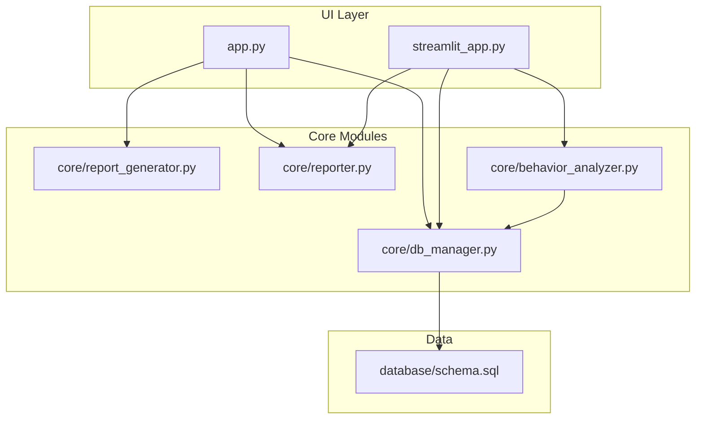
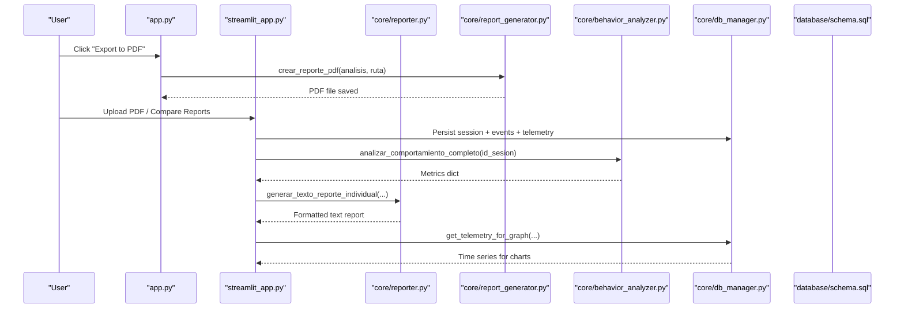
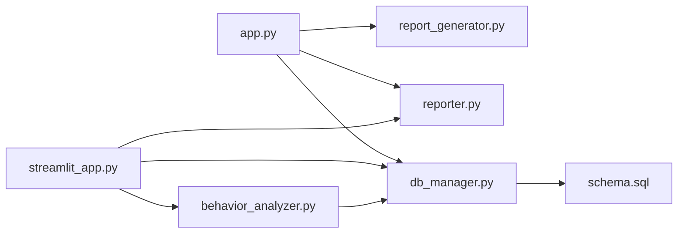

# Reporting and Export

<cite>
**Referenced Files in This Document**
- [report_generator.py](file://core/report_generator.py)
- [reporter.py](file://core/reporter.py)
- [behavior_analyzer.py](file://core/behavior_analyzer.py)
- [db_manager.py](file://core/db_manager.py)
- [schema.sql](file://database/schema.sql)
- [app.py](file://app.py)
- [streamlit_app.py](file://streamlit_app.py)
- [plotter.py](file://core/plotter.py)
</cite>

## Table of Contents
1. Introduction
2. Project Structure
3. Core Components
4. Architecture Overview
5. Detailed Component Analysis
6. Dependency Analysis
7. Performance Considerations
8. Troubleshooting Guide
9. Conclusion
10. Appendices

## Introduction
This document explains the reporting and export system for generating formatted PDF reports, embedding charts, and exporting analysis results. It covers:
- Template-based PDF generation for individual session analysis and evolution (comparative) reports
- Chart embedding capabilities via Matplotlib and integration points
- Data export workflow from analysis results to final documents
- File naming conventions and storage locations
- Guidelines for extending the system with new report types and export formats

The system is designed to be extensible and modular, separating data extraction, analysis, visualization, and output generation.

## Project Structure
The reporting and export functionality spans several modules:
- PDF generation and templates: core/report_generator.py
- Text report composition and narrative feedback: core/reporter.py
- Behavior analysis and telemetry metrics: core/behavior_analyzer.py
- Database access and persistence: core/db_manager.py and database/schema.sql
- UI orchestration and export triggers: app.py and streamlit_app.py
- Visualization helpers: core/plotter.py

**Diagram sources**
- [app.py:39-41](file://app.py#L39-L41)
- [streamlit_app.py:25-27](file://streamlit_app.py#L25-L27)
- [report_generator.py:12-147](file://core/report_generator.py#L12-L147)
- [reporter.py:19-120](file://core/reporter.py#L19-L120)
- [behavior_analyzer.py:26-167](file://core/behavior_analyzer.py#L26-L167)
- [db_manager.py:23-90](file://core/db_manager.py#L23-L90)
- [schema.sql:14-58](file://database/schema.sql#L14-L58)

**Section sources**
- [app.py:39-41](file://app.py#L39-L41)
- [streamlit_app.py:25-27](file://streamlit_app.py#L25-L27)
- [report_generator.py:12-147](file://core/report_generator.py#L12-L147)
- [reporter.py:19-120](file://core/reporter.py#L19-L120)
- [behavior_analyzer.py:26-167](file://core/behavior_analyzer.py#L26-L167)
- [db_manager.py:23-90](file://core/db_manager.py#L23-L90)
- [schema.sql:14-58](file://database/schema.sql#L14-L58)

## Core Components
- PDF template engine: Provides a base PDF class with header/footer and two report generators:
  - Individual session analysis report
  - Evolution comparative report between two sessions
- Text report composer: Formats human-readable reports and generates actionable feedback based on behavior metrics
- Behavior analyzer: Computes telemetry-derived metrics (braking, steering, acceleration, elevation/inclination adjustments, speed statistics) and classifies operator profiles
- Database manager: Persists sessions, event summaries, and time-series telemetry; provides retrieval functions for graphs and session info
- UI integrations: Trigger exports, parse uploaded PDFs, persist results, and visualize telemetry charts

Key responsibilities:
- Generate professional PDFs with consistent headers/footers and structured sections
- Produce text reports with narrative feedback tailored to detected behaviors
- Compute robust metrics from stored telemetry series
- Provide chart rendering utilities for UI embedding

**Section sources**
- [report_generator.py:12-147](file://core/report_generator.py#L12-L147)
- [reporter.py:19-120](file://core/reporter.py#L19-L120)
- [behavior_analyzer.py:26-167](file://core/behavior_analyzer.py#L26-L167)
- [db_manager.py:23-90](file://core/db_manager.py#L23-L90)

## Architecture Overview
The reporting pipeline integrates UI actions, analysis, and output generation:

**Diagram sources**
- [app.py:494-512](file://app.py#L494-L512)
- [report_generator.py:28-75](file://core/report_generator.py#L28-L75)
- [streamlit_app.py:150-176](file://streamlit_app.py#L150-L176)
- [behavior_analyzer.py:150-167](file://core/behavior_analyzer.py#L150-L167)
- [db_manager.py:36-90](file://core/db_manager.py#L36-L90)
- [schema.sql:14-58](file://database/schema.sql#L14-L58)

## Detailed Component Analysis

### PDF Report Generation (Templates and Layout Customization)
- Base PDF class defines header and footer for all generated reports
- Individual session report includes:
  - Session info (operator, class, score)
  - Predicted behavior profile and recommended learning path
  - Telemetry analysis summary (braking, steering, acceleration, elevation/inclination adjustments, speed stats)
- Evolution report includes:
  - Operator identification and overall verdict based on score delta
  - Profile evolution (initial vs final)
  - Comparative table of key metrics with deltas and directional indicators

Customization options:
- Fonts, sizes, alignment, and section titles are set per section
- Color coding for positive/negative deltas in comparative tables
- Page numbering via footer

Extensibility:
- Add new sections by inserting additional cells/multi_cell calls
- Introduce new metrics by updating the data dictionary passed into the generator
- Create new report variants by duplicating the base PDF class or adding new generator functions

**Section sources**
- [report_generator.py:12-75](file://core/report_generator.py#L12-L75)
- [report_generator.py:80-147](file://core/report_generator.py#L80-L147)

### Text Report Composition and Narrative Feedback
- Composes a structured text report with:
  - Session overview and predicted profile
  - Recommended learning path exercises
  - Detailed telemetry analysis
  - Actionable feedback derived from rule-based analysis
- Feedback rules detect patterns such as excessive braking, aggressive steering, abrupt acceleration, speed incidents, micro-adjustments, low operational speed, and rushed profiles

Extensibility:
- Add new feedback rules by extending the function that inspects metrics and appends suggestions
- Format outputs for different audiences by adjusting the text structure

**Section sources**
- [reporter.py:19-92](file://core/reporter.py#L19-L92)
- [reporter.py:98-120](file://core/reporter.py#L98-L120)

### Behavior Analysis and Telemetry Metrics
- Extracts time-series telemetry from the database for specific graph names
- Computes:
  - Braking intensity (rate of change thresholds)
  - Steering corrections (steering rate of change)
  - Acceleration spikes (accelerator rate of change)
  - Elevation and inclination micro-adjustments (sign changes in velocity)
  - Speed statistics (mean, max, incident counts above threshold)
- Orchestrates full behavior analysis into a consolidated metrics dictionary

Performance considerations:
- Efficient parsing of comma-separated timestamp/value strings
- Threshold tuning can impact metric sensitivity and performance

Extensibility:
- Add new graph analyses by implementing functions similar to existing ones
- Adjust thresholds to refine detection logic

**Section sources**
- [behavior_analyzer.py:71-147](file://core/behavior_analyzer.py#L71-L147)
- [behavior_analyzer.py:150-167](file://core/behavior_analyzer.py#L150-L167)

### Database Schema and Persistence
- Tables:
  - Sesiones: stores session metadata including operator, class, exercise, duration, score, and profile
  - ResumenEventos: aggregated event counts, rewards, and penalties per session
  - Telemetria: time-series data for each graph per session
- Indexes optimize queries by operator, profile, and session foreign keys

Extensibility:
- Add new columns or tables as needed for additional metrics or report fields
- Ensure indexes are added for frequently queried fields

**Section sources**
- [schema.sql:14-58](file://database/schema.sql#L14-L58)

### UI Integration and Export Workflow
- Desktop app:
  - Triggers PDF export after an individual analysis is performed
  - Saves PDF to user-selected location and optionally copies to project exports directory
  - Parses uploaded PDFs, persists data, extracts telemetry, and runs ML classification
- Streamlit app:
  - Accepts individual and comparison PDFs
  - Persists sessions and telemetry
  - Displays text reports and telemetry charts
  - Generates evolution comparisons using stored session IDs

File naming and storage:
- Default filename pattern for exported PDFs includes operator name
- Exports directory created under data/exports
- Uploaded PDFs copied to exports upon successful processing

**Section sources**
- [app.py:494-512](file://app.py#L494-L512)
- [app.py:514-547](file://app.py#L514-L547)
- [streamlit_app.py:100-110](file://streamlit_app.py#L100-L110)
- [streamlit_app.py:150-176](file://streamlit_app.py#L150-L176)

### Chart Embedding Capabilities
- Matplotlib-based plotting with dark theme styling
- Desktop integration via CustomTkinter canvas embedding
- Streamlit integration for web display
- Supports dynamic clearing of previous plots and error handling

Extensibility:
- Add new chart types by creating new plot functions
- Customize styles and labels for different audiences

**Section sources**
- [plotter.py:15-70](file://core/plotter.py#L15-L70)
- [streamlit_app.py:112-132](file://streamlit_app.py#L112-L132)

## Dependency Analysis
The reporting system has clear separation of concerns:
- UI layers depend on core modules for analysis and output
- Core modules depend on database schema and managers for data persistence
- Behavior analyzer depends on db_manager for telemetry retrieval
- Report generators depend on analysis results and optional telemetry metrics

**Diagram sources**
- [app.py:39-41](file://app.py#L39-L41)
- [streamlit_app.py:25-27](file://streamlit_app.py#L25-L27)
- [behavior_analyzer.py:150-167](file://core/behavior_analyzer.py#L150-L167)
- [db_manager.py:23-90](file://core/db_manager.py#L23-L90)
- [schema.sql:14-58](file://database/schema.sql#L14-L58)

**Section sources**
- [app.py:39-41](file://app.py#L39-L41)
- [streamlit_app.py:25-27](file://streamlit_app.py#L25-L27)
- [behavior_analyzer.py:150-167](file://core/behavior_analyzer.py#L150-L167)
- [db_manager.py:23-90](file://core/db_manager.py#L23-L90)
- [schema.sql:14-58](file://database/schema.sql#L14-L58)

## Performance Considerations
- Telemetry parsing uses efficient string splitting and numeric conversion; ensure thresholds are tuned to avoid excessive computations
- Database queries are indexed for common filters; consider adding composite indexes if new query patterns emerge
- PDF generation should batch operations where possible to reduce I/O overhead
- Chart rendering should reuse figures and close them promptly to free memory

[No sources needed since this section provides general guidance]

## Troubleshooting Guide
Common issues and resolutions:
- Missing model file for classification: Ensure the machine learning model exists at the expected path before running analysis
- No telemetry data for a graph: Verify that telemetry was extracted and persisted during upload; check graph names match schema expectations
- Export errors: Confirm write permissions to the selected directory and sufficient disk space
- Chart rendering failures: Validate input data format and handle empty datasets gracefully

**Section sources**
- [app.py:523-531](file://app.py#L523-L531)
- [plotter.py:66-70](file://core/plotter.py#L66-L70)

## Conclusion
The reporting and export system provides a robust foundation for generating professional PDF reports, composing actionable text reports, and visualizing telemetry data. Its modular design enables easy extension with new report types, metrics, and export formats. By following the guidelines in this document, you can customize templates, add charts, and integrate additional data sources while maintaining clarity and performance.

[No sources needed since this section summarizes without analyzing specific files]

## Appendices

### Export Workflow Summary
- Individual analysis:
  - Perform analysis to populate ultimo_analisis_realizado
  - Export to PDF using the UI action; default filename includes operator name
- Comparison analysis:
  - Upload initial and final PDFs
  - Persist sessions and telemetry
  - Generate evolution text report comparing scores and profiles
- Storage:
  - Exports directory under data/exports
  - Uploaded PDFs copied to exports upon successful processing

**Section sources**
- [app.py:494-512](file://app.py#L494-L512)
- [app.py:514-547](file://app.py#L514-L547)
- [streamlit_app.py:100-110](file://streamlit_app.py#L100-L110)

### Extending the System
- New report types:
  - Duplicate existing generator functions and adapt data mapping
  - Add new sections and metrics in the PDF template
- New export formats:
  - Implement converters for CSV/JSON using pandas or standard libraries
  - Integrate with UI actions to trigger exports
- New charts:
  - Add plotting functions with consistent styling
  - Wire up to UI components for display

[No sources needed since this section provides general guidance]