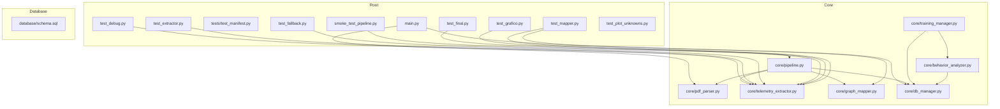
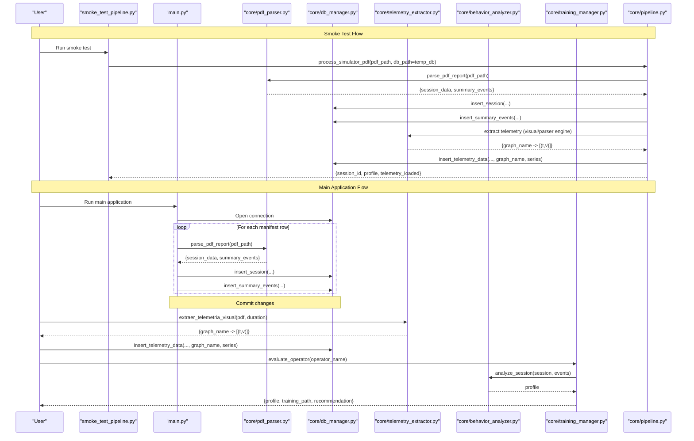
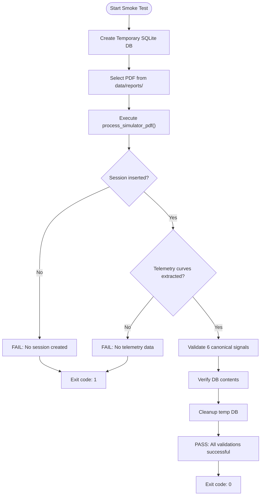
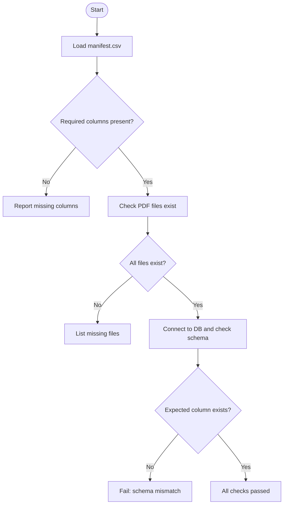
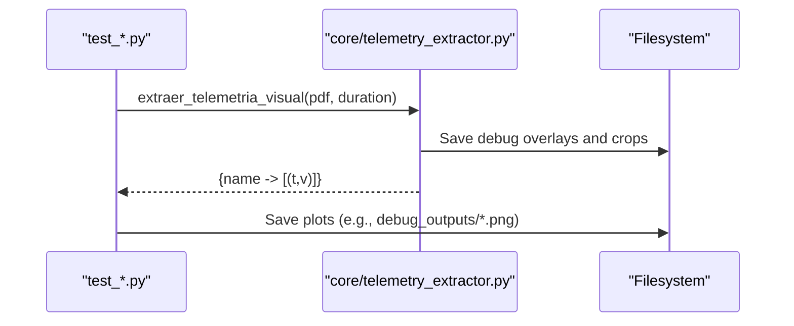
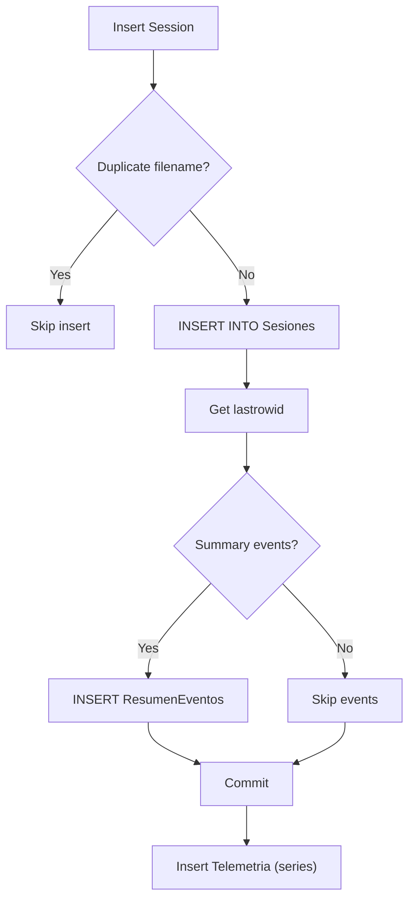
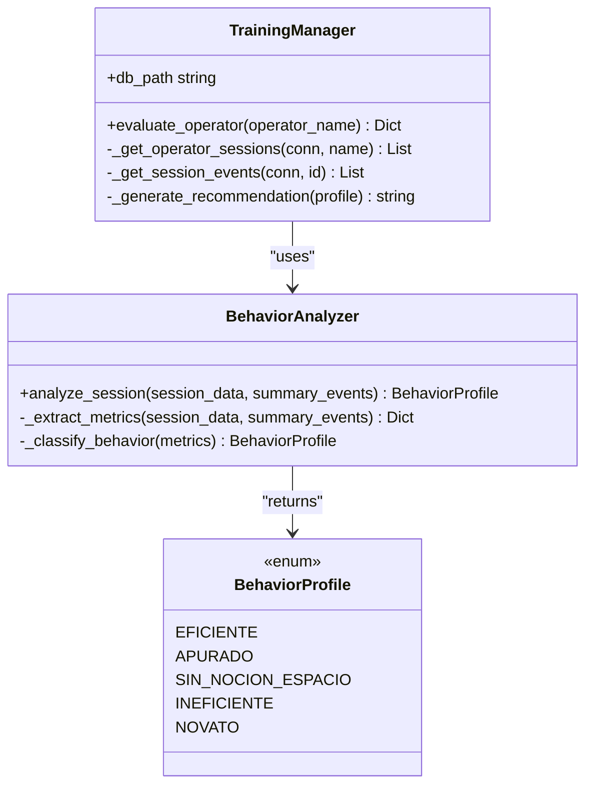
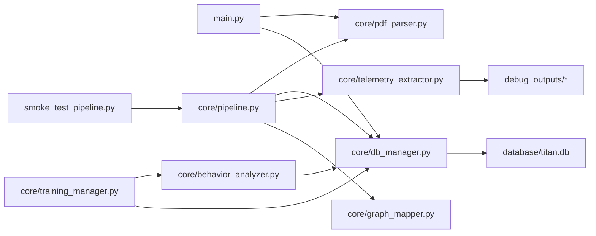

# Testing and Quality Assurance

<cite>
**Referenced Files in This Document**
- [main.py](file://main.py)
- [core/pdf_parser.py](file://core/pdf_parser.py)
- [core/db_manager.py](file://core/db_manager.py)
- [core/telemetry_extractor.py](file://core/telemetry_extractor.py)
- [core/graph_mapper.py](file://core/graph_mapper.py)
- [core/behavior_analyzer.py](file://core/behavior_analyzer.py)
- [core/training_manager.py](file://core/training_manager.py)
- [core/pipeline.py](file://core/pipeline.py)
- [database/schema.sql](file://database/schema.sql)
- [tests/test_manifest.py](file://tests/test_manifest.py)
- [smoke_test_pipeline.py](file://smoke_test_pipeline.py)
- [test_debug.py](file://test_debug.py)
- [test_extractor.py](file://test_extractor.py)
- [test_fallback.py](file://test_fallback.py)
- [test_final.py](file://test_final.py)
- [test_grafico.py](file://test_grafico.py)
- [test_mapper.py](file://test_mapper.py)
- [test_plot_unknowns.py](file://test_plot_unknowns.py)
</cite>

## Update Summary
**Changes Made**
- Added comprehensive documentation for the new smoke test pipeline (smoke_test_pipeline.py)
- Updated architecture overview to include unified pipeline processing
- Enhanced integration testing section with reproducible end-to-end testing approach
- Added new section on smoke testing methodology and temporary database usage
- Updated troubleshooting guide with smoke test debugging capabilities

## Table of Contents
1. [Introduction](#introduction)
2. [Project Structure](#project-structure)
3. [Core Components](#core-components)
4. [Architecture Overview](#architecture-overview)
5. [Detailed Component Analysis](#detailed-component-analysis)
6. [Dependency Analysis](#dependency-analysis)
7. [Performance Considerations](#performance-considerations)
8. [Troubleshooting Guide](#troubleshooting-guide)
9. [Conclusion](#conclusion)
10. [Appendices](#appendices)

## Introduction
This document describes the testing and quality assurance framework for the project, focusing on unit testing strategy, integration testing approaches, and end-to-end validation. It covers test organization, mock strategies, coverage expectations, and how to validate PDF processing pipelines, database operations, and ML model integration (behavior analysis and training recommendations). The framework now includes a comprehensive smoke testing system that provides reproducible testing of the unified pipeline with temporary SQLite databases, ensuring reliable validation without modifying production data.

## Project Structure
The repository organizes core logic under core/, data artifacts under data/, database schema under database/, and a comprehensive testing suite at the repository root plus a small tests/ directory. The current test suite includes:
- A manifest-based validation script that checks CSV structure and database schema.
- **New**: A smoke test pipeline providing reproducible end-to-end testing with temporary databases.
- Diagnostic scripts to exercise telemetry extraction from PDFs and visualize outputs.
- Helper scripts to map extracted graphs to canonical names and plot unknown signals.

**Diagram sources**
- [smoke_test_pipeline.py:1-233](file://smoke_test_pipeline.py#L1-L233)
- [core/pipeline.py:1-297](file://core/pipeline.py#L1-L297)
- [main.py:1-196](file://main.py#L1-L196)
- [core/pdf_parser.py:1-124](file://core/pdf_parser.py#L1-L124)
- [core/telemetry_extractor.py:1-239](file://core/telemetry_extractor.py#L1-L239)
- [core/graph_mapper.py:1-32](file://core/graph_mapper.py#L1-L32)
- [core/behavior_analyzer.py:1-236](file://core/behavior_analyzer.py#L1-L236)
- [core/training_manager.py:1-82](file://core/training_manager.py#L1-L82)
- [core/db_manager.py:1-152](file://core/db_manager.py#L1-L152)
- [database/schema.sql:1-59](file://database/schema.sql#L1-L59)

**Section sources**
- [smoke_test_pipeline.py:1-233](file://smoke_test_pipeline.py#L1-L233)
- [core/pipeline.py:1-297](file://core/pipeline.py#L1-L297)
- [main.py:1-196](file://main.py#L1-L196)
- [tests/test_manifest.py:1-110](file://tests/test_manifest.py#L1-L110)

## Core Components
- **Unified Pipeline**: Centralized ETL processing through `core/pipeline.py` that orchestrates PDF parsing, operator profiling, telemetry extraction, and database insertion in a transactional manner.
- **PDF parsing pipeline**: Extracts session metadata and summary events from PDF reports using regex and text extraction.
- **Telemetry extraction pipeline**: Converts chart images embedded in PDFs into time-series data via computer vision and OCR, with fallback heuristics when labels are missing.
- **Database layer**: Manages SQLite connections, inserts sessions/events/telemetry, and queries telemetry series for downstream analysis.
- **Behavior analysis and training**: Analyzes telemetry and event summaries to classify operator behavior and generate personalized training paths.
- **Graph mapping**: Maps raw graph keys to canonical names based on a configuration file.

Testing strategy highlights:
- **Smoke testing**: Reproducible end-to-end testing with temporary SQLite databases that validates complete pipeline execution without affecting production data.
- Unit-style checks for manifest structure and database schema presence.
- Integration-style scripts that run full pipelines against sample PDFs and verify outputs visually or by counts.
- Diagnostics that save intermediate images and plots to debug_outputs/ for inspection.

**Section sources**
- [core/pipeline.py:1-297](file://core/pipeline.py#L1-L297)
- [core/pdf_parser.py:1-124](file://core/pdf_parser.py#L1-L124)
- [core/telemetry_extractor.py:1-239](file://core/telemetry_extractor.py#L1-L239)
- [core/db_manager.py:1-152](file://core/db_manager.py#L1-L152)
- [core/behavior_analyzer.py:1-236](file://core/behavior_analyzer.py#L1-L236)
- [core/training_manager.py:1-82](file://core/training_manager.py#L1-L82)
- [core/graph_mapper.py:1-32](file://core/graph_mapper.py#L1-L32)
- [database/schema.sql:1-59](file://database/schema.sql#L1-L59)

## Architecture Overview
The system processes PDF reports through a unified pipeline that coordinates multiple components:
- **Unified Processing**: `process_simulator_pdf()` orchestrates the entire ETL flow including metadata parsing, operator profiling, telemetry extraction, and transactional database insertion.
- **Metadata and events**: parse_pdf_report extracts session info and consolidated results, which are inserted into the database.
- **Telemetry charts**: telemetry_extractor renders pages, detects charts, extracts curves, calibrates values, and stores time-series in the database. Downstream modules analyze these series for behavior classification and training recommendations.

**Diagram sources**
- [smoke_test_pipeline.py:91-228](file://smoke_test_pipeline.py#L91-L228)
- [core/pipeline.py:176-297](file://core/pipeline.py#L176-L297)
- [core/pdf_parser.py:27-57](file://core/pdf_parser.py#L27-L57)
- [core/db_manager.py:106-152](file://core/db_manager.py#L106-L152)
- [core/telemetry_extractor.py:202-238](file://core/telemetry_extractor.py#L202-L238)
- [core/behavior_analyzer.py:36-67](file://core/behavior_analyzer.py#L36-L67)
- [core/training_manager.py:15-40](file://core/training_manager.py#L15-L40)

## Detailed Component Analysis

### Smoke Testing Framework
**Updated** Added comprehensive smoke testing capability for reproducible pipeline validation.

- **Purpose**: Provides headless, reproducible testing of the unified pipeline using temporary SQLite databases, ensuring complete ETL workflow validation without affecting production data.
- **Approach**: Creates temporary databases from schema.sql, executes the full pipeline against sample PDFs, validates session insertion and telemetry curve extraction, and cleans up temporary files automatically.
- **Coverage focus**: End-to-end pipeline functionality, temporary database management, error handling, and validation of all six canonical telemetry signals.

**Diagram sources**
- [smoke_test_pipeline.py:63-77](file://smoke_test_pipeline.py#L63-L77)
- [smoke_test_pipeline.py:136-228](file://smoke_test_pipeline.py#L136-L228)
- [core/pipeline.py:176-297](file://core/pipeline.py#L176-L297)

**Section sources**
- [smoke_test_pipeline.py:1-233](file://smoke_test_pipeline.py#L1-L233)
- [core/pipeline.py:176-297](file://core/pipeline.py#L176-L297)

### PDF Parsing Tests and Validation
- Purpose: Ensure manifest.csv has required columns and all referenced PDF files exist; verify database schema includes expected fields.
- Approach: Read CSV, assert required columns, iterate rows to check file existence; connect to SQLite and inspect table schema.
- Coverage focus: Data integrity pre-processing, environment readiness, and schema correctness.

**Diagram sources**
- [tests/test_manifest.py:7-89](file://tests/test_manifest.py#L7-L89)

**Section sources**
- [tests/test_manifest.py:7-89](file://tests/test_manifest.py#L7-L89)

### Telemetry Extraction Tests and Debugging
- Purpose: Validate end-to-end extraction of chart series from PDFs, including OCR-based labeling and fallback heuristics.
- Approach: Run diagnostic scripts that call the extractor, print summaries, and save plots to debug_outputs/. Additional scripts visualize "Unknown" signals and help tune color masks and calibration.
- Coverage focus: Robustness across varied PDF layouts, handling of missing labels, and calibration accuracy.

**Diagram sources**
- [core/telemetry_extractor.py:58-92](file://core/telemetry_extractor.py#L58-L92)
- [core/telemetry_extractor.py:202-238](file://core/telemetry_extractor.py#L202-L238)
- [test_final.py:1-35](file://test_final.py#L1-L35)
- [test_plot_unknowns.py:1-27](file://test_plot_unknowns.py#L1-L27)
- [test_grafico.py:46-109](file://test_grafico.py#L46-L109)

**Section sources**
- [test_debug.py:1-17](file://test_debug.py#L1-L17)
- [test_extractor.py:1-16](file://test_extractor.py#L1-L16)
- [test_fallback.py:1-19](file://test_fallback.py#L1-L19)
- [test_final.py:1-35](file://test_final.py#L1-L35)
- [test_grafico.py:1-148](file://test_grafico.py#L1-L148)
- [test_plot_unknowns.py:1-27](file://test_plot_unknowns.py#L1-L27)
- [core/telemetry_extractor.py:1-239](file://core/telemetry_extractor.py#L1-L239)

### Database Operations Tests
- Purpose: Validate insertion and retrieval of sessions, events, and telemetry; ensure schema compatibility.
- Approach: Use context-managed connections; assert idempotency via duplicate checks; verify stored series can be read back and parsed correctly.
- Coverage focus: Transactional integrity, error handling, and data format consistency.

**Diagram sources**
- [core/db_manager.py:93-152](file://core/db_manager.py#L93-L152)
- [database/schema.sql:14-52](file://database/schema.sql#L14-L52)

**Section sources**
- [core/db_manager.py:93-152](file://core/db_manager.py#L93-L152)
- [database/schema.sql:14-52](file://database/schema.sql#L14-L52)

### ML Model Integration Tests (Behavior Analysis and Training)
- Purpose: Validate behavior classification and training path generation based on telemetry and event summaries.
- Approach: Use TrainingManager to fetch latest session, compute metrics, classify profile, and generate recommendations; assert expected profile categories and non-empty training paths for known scenarios.
- Coverage focus: Rule-based classifier thresholds, telemetry availability, and output completeness.

**Diagram sources**
- [core/training_manager.py:7-40](file://core/training_manager.py#L7-L40)
- [core/behavior_analyzer.py:16-67](file://core/behavior_analyzer.py#L16-L67)

**Section sources**
- [core/training_manager.py:7-82](file://core/training_manager.py#L7-L82)
- [core/behavior_analyzer.py:16-236](file://core/behavior_analyzer.py#L16-L236)

### Graph Mapping Tests
- Purpose: Verify mapping of raw graph keys to canonical names using configuration.
- Approach: Call map_graphs with raw outputs and assert key transformations and presence of suggested names.
- Coverage focus: Configuration-driven mapping correctness and robustness when keys are missing.

**Section sources**
- [core/graph_mapper.py:1-32](file://core/graph_mapper.py#L1-L32)
- [test_mapper.py:1-21](file://test_mapper.py#L1-L21)

## Dependency Analysis
Key dependencies and coupling:
- main.py depends on pdf_parser and db_manager for ETL flow.
- **New**: smoke_test_pipeline.py depends on core/pipeline.py for unified processing and creates temporary databases for isolated testing.
- telemetry_extractor is independent but integrates with filesystem for debug artifacts and later with db_manager for persistence.
- behavior_analyzer reads telemetry from the database and returns derived metrics used by training_manager.
- training_manager orchestrates behavior analysis and generates recommendations.

**Diagram sources**
- [smoke_test_pipeline.py:1-233](file://smoke_test_pipeline.py#L1-L233)
- [core/pipeline.py:1-297](file://core/pipeline.py#L1-L297)
- [main.py:1-196](file://main.py#L1-L196)
- [core/pdf_parser.py:1-124](file://core/pdf_parser.py#L1-L124)
- [core/db_manager.py:1-152](file://core/db_manager.py#L1-L152)
- [core/telemetry_extractor.py:1-239](file://core/telemetry_extractor.py#L1-L239)
- [core/behavior_analyzer.py:1-236](file://core/behavior_analyzer.py#L1-L236)
- [core/training_manager.py:1-82](file://core/training_manager.py#L1-L82)

**Section sources**
- [smoke_test_pipeline.py:1-233](file://smoke_test_pipeline.py#L1-L233)
- [core/pipeline.py:1-297](file://core/pipeline.py#L1-L297)
- [main.py:1-196](file://main.py#L1-L196)
- [core/db_manager.py:1-152](file://core/db_manager.py#L1-L152)
- [core/telemetry_extractor.py:1-239](file://core/telemetry_extractor.py#L1-L239)
- [core/behavior_analyzer.py:1-236](file://core/behavior_analyzer.py#L1-L236)
- [core/training_manager.py:1-82](file://core/training_manager.py#L1-L82)

## Performance Considerations
- PDF rendering scale: Adjust render scale in telemetry extraction to balance accuracy vs. speed.
- Image processing: Limit crop regions and use morphological operations judiciously to reduce CPU usage.
- Database writes: Batch insertions where possible; ensure indexes are used effectively for queries.
- OCR: Minimize OCR calls by narrowing search areas around detected charts.
- **New**: Temporary database creation: Smoke tests create lightweight temporary databases that are automatically cleaned up, minimizing disk I/O overhead.

## Troubleshooting Guide
Common issues and diagnostics:
- Missing PDF files or incorrect manifest entries: Use the manifest test to detect missing files and invalid structures before running the pipeline.
- **New**: Pipeline execution failures: Use smoke_test_pipeline.py with --verbose flag to get detailed logging of each pipeline stage and identify specific failure points.
- No telemetry extracted: Inspect debug_outputs/ for overlay images and cropped candidates; adjust color ranges or mask parameters in the extractor or grafico diagnostic script.
- Unknown graph labels: Use fallback heuristics and plot unknown signals to identify misclassifications; refine OCR region or label matching rules.
- Database schema mismatches: Re-run schema initialization and verify expected columns exist; use schema checks in tests.
- **New**: Environment setup issues: Smoke test provides clear error messages for missing dependencies (Tesseract OCR, Python packages) with installation instructions.

Debugging tools and outputs:
- debug_outputs/: Contains page overlays, candidate crops, masks, and saved plots for visual inspection.
- Diagnostic scripts: Provide step-by-step prints and saved images to trace extraction and calibration steps.
- **New**: Smoke test output: Comprehensive console output showing session ID, operator profile, telemetry curves extracted, and database verification results.

**Section sources**
- [tests/test_manifest.py:7-89](file://tests/test_manifest.py#L7-L89)
- [smoke_test_pipeline.py:113-128](file://smoke_test_pipeline.py#L113-L128)
- [core/telemetry_extractor.py:58-92](file://core/telemetry_extractor.py#L58-L92)
- [test_grafico.py:46-109](file://test_grafico.py#L46-L109)
- [test_plot_unknowns.py:1-27](file://test_plot_unknowns.py#L1-L27)
- [core/db_manager.py:23-33](file://core/db_manager.py#L23-L33)

## Conclusion
The testing framework combines lightweight unit-style validations with comprehensive smoke testing and integration-style diagnostic scripts to cover PDF parsing, telemetry extraction, database operations, and ML-driven behavior analysis. The new smoke testing capability provides reproducible end-to-end validation using temporary databases, ensuring reliable testing without affecting production data. By leveraging structured tests, rich debug outputs, clear failure modes, and the unified pipeline approach, teams can confidently extend features while maintaining quality and reliability.

## Appendices

### Writing New Tests: Guidelines
- Organize tests by feature area (PDF parsing, telemetry extraction, database, behavior analysis).
- Prefer deterministic inputs (fixed PDFs, controlled durations) and assert concrete outputs (counts, types, ranges).
- Use fixtures for shared resources (temporary databases, sample PDFs).
- Mock external dependencies (filesystem, OCR) when necessary to isolate unit tests.
- Add assertions for edge cases (missing labels, empty series, malformed data).
- **New**: Utilize smoke_test_pipeline.py for end-to-end validation of new features that affect the unified pipeline.

**Section sources**
- [tests/test_manifest.py:7-89](file://tests/test_manifest.py#L7-L89)
- [core/telemetry_extractor.py:180-199](file://core/telemetry_extractor.py#L180-L199)
- [core/db_manager.py:106-152](file://core/db_manager.py#L106-L152)
- [smoke_test_pipeline.py:91-228](file://smoke_test_pipeline.py#L91-L228)

### Maintaining Test Suites
- Keep diagnostic scripts aligned with core APIs; update them when extraction logic changes.
- Regularly review debug_outputs/ to catch regressions in chart detection and calibration.
- Update schema tests when database structure evolves.
- Track coverage by adding assertions for critical branches (fallback heuristics, error paths).
- **New**: Maintain smoke test PDF samples in data/reports/ directory to ensure continuous pipeline validation.

**Section sources**
- [core/graph_mapper.py:1-32](file://core/graph_mapper.py#L1-L32)
- [core/behavior_analyzer.py:169-205](file://core/behavior_analyzer.py#L169-L205)
- [database/schema.sql:14-52](file://database/schema.sql#L14-L52)
- [smoke_test_pipeline.py:51-60](file://smoke_test_pipeline.py#L51-L60)

### End-to-End Workflow Example
- Prepare manifest.csv and ensure all PDFs exist.
- **New**: Run smoke_test_pipeline.py for quick validation of the unified pipeline with temporary database.
- Run main.py to process sessions and events using production database.
- Execute telemetry extraction scripts to populate Telemetria.
- Run behavior analysis and training manager to validate profiles and recommendations.
- Inspect debug_outputs/ and database contents to confirm correctness.

**Section sources**
- [smoke_test_pipeline.py:14-20](file://smoke_test_pipeline.py#L14-L20)
- [core/pipeline.py:176-297](file://core/pipeline.py#L176-L297)
- [core/telemetry_extractor.py:202-238](file://core/telemetry_extractor.py#L202-L238)
- [core/training_manager.py:15-40](file://core/training_manager.py#L15-L40)

### Smoke Testing Best Practices
- **Isolation**: Always use temporary databases to avoid polluting production data.
- **Reproducibility**: Use fixed PDF samples and consistent parameters for reliable test results.
- **Validation**: Check both session insertion and telemetry curve extraction for complete pipeline validation.
- **Cleanup**: Automatically remove temporary files after test execution.
- **Error Handling**: Capture and report specific pipeline stages that fail for targeted debugging.

**Section sources**
- [smoke_test_pipeline.py:63-77](file://smoke_test_pipeline.py#L63-L77)
- [smoke_test_pipeline.py:220-228](file://smoke_test_pipeline.py#L220-L228)
- [core/pipeline.py:263-290](file://core/pipeline.py#L263-L290)