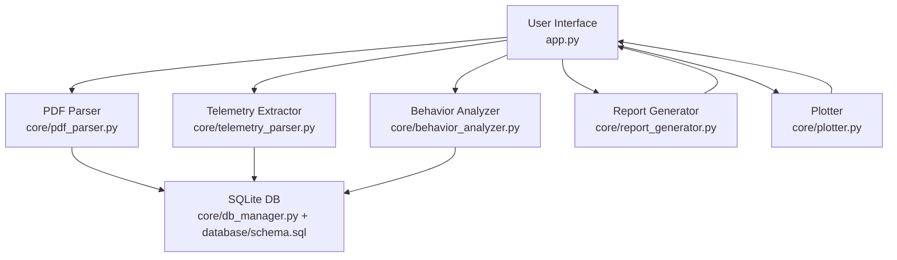
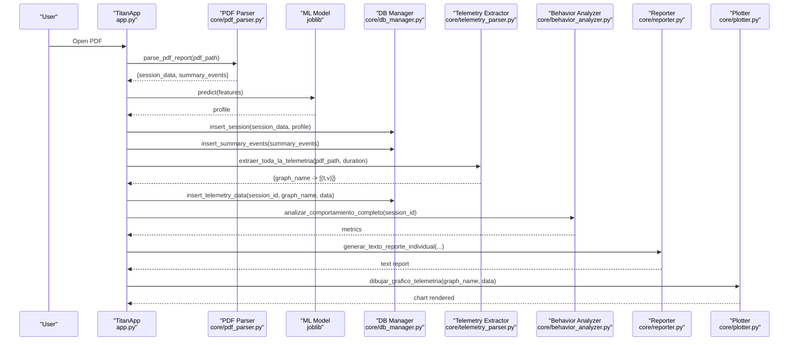
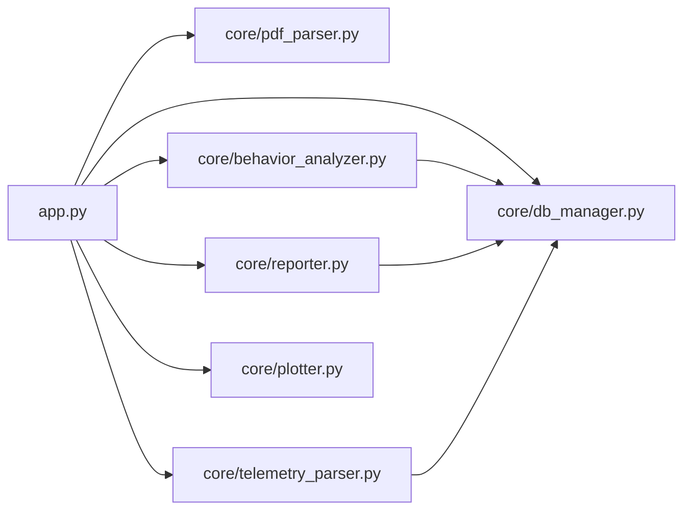

# Troubleshooting and FAQ

<cite>
**Referenced Files in This Document**
- [app.py](file://app.py)
- [main.py](file://main.py)
- [core/pdf_parser.py](file://core/pdf_parser.py)
- [core/telemetry_parser.py](file://core/telemetry_parser.py)
- [core/db_manager.py](file://core/db_manager.py)
- [core/behavior_analyzer.py](file://core/behavior_analyzer.py)
- [core/reporter.py](file://core/reporter.py)
- [core/report_generator.py](file://core/report_generator.py)
- [core/plotter.py](file://core/plotter.py)
- [database/schema.sql](file://database/schema.sql)
- [setup_database.py](file://setup_database.py)
</cite>

## Table of Contents
1. Introduction
2. Project Structure
3. Core Components
4. Architecture Overview
5. Detailed Component Analysis
6. Dependency Analysis
7. Performance Considerations
8. Troubleshooting Guide
9. Conclusion
10. Appendices

## Introduction
This document provides comprehensive troubleshooting guidance for the system that processes PDF training reports, extracts telemetry series, stores results in a SQLite database, analyzes behavior, and generates text/PDF reports. It focuses on common issues during PDF processing, database connectivity problems, performance optimization tips, diagnostic techniques using debug outputs and series data, FAQs about report processing and result interpretation, error message meanings, log analysis, resolution steps, and how to collect diagnostics and seek support.

## Project Structure
The application is organized into:
- UI and orchestration (app.py, main.py)
- PDF parsing and telemetry extraction (core/pdf_parser.py, core/telemetry_parser.py)
- Database management and schema (core/db_manager.py, database/schema.sql, setup_database.py)
- Behavior analysis and reporting (core/behavior_analyzer.py, core/reporter.py, core/report_generator.py)
- Visualization (core/plotter.py)

**Diagram sources**
- [app.py:33-42](file://app.py#L33-L42)
- [core/pdf_parser.py:27-57](file://core/pdf_parser.py#L27-L57)
- [core/telemetry_parser.py:125-154](file://core/telemetry_parser.py#L125-L154)
- [core/db_manager.py:13-33](file://core/db_manager.py#L13-L33)
- [database/schema.sql:14-58](file://database/schema.sql#L14-L58)
- [core/behavior_analyzer.py:150-167](file://core/behavior_analyzer.py#L150-L167)
- [core/report_generator.py:28-75](file://core/report_generator.py#L28-L75)
- [core/plotter.py:15-69](file://core/plotter.py#L15-L69)

**Section sources**
- [app.py:27-42](file://app.py#L27-L42)
- [core/pdf_parser.py:27-57](file://core/pdf_parser.py#L27-L57)
- [core/telemetry_parser.py:125-154](file://core/telemetry_parser.py#L125-L154)
- [core/db_manager.py:13-33](file://core/db_manager.py#L13-L33)
- [database/schema.sql:14-58](file://database/schema.sql#L14-L58)
- [core/behavior_analyzer.py:150-167](file://core/behavior_analyzer.py#L150-L167)
- [core/report_generator.py:28-75](file://core/report_generator.py#L28-L75)
- [core/plotter.py:15-69](file://core/plotter.py#L15-L69)

## Core Components
- PDF parser: Extracts session metadata and summary events from PDF pages using regex patterns and locale-aware date parsing.
- Telemetry extractor: Reads images from specific PDF pages, masks color-coded lines, maps pixel coordinates to real-world values, and returns time-series data per graph.
- Database manager: Provides connection handling, session/event insertion, and telemetry retrieval functions with robust error handling.
- Behavior analyzer: Computes metrics from stored telemetry (braking, steering, acceleration, fork height, tilt, speed) and orchestrates full analysis.
- Reporter and PDF generator: Produce human-readable text reports and formatted PDFs including diagnosis, recommended learning paths, and evolution comparisons.
- Plotter: Embeds Matplotlib charts into the Tkinter-based UI and handles missing data gracefully.

**Section sources**
- [core/pdf_parser.py:27-124](file://core/pdf_parser.py#L27-L124)
- [core/telemetry_parser.py:16-72](file://core/telemetry_parser.py#L16-L72)
- [core/telemetry_parser.py:81-154](file://core/telemetry_parser.py#L81-L154)
- [core/db_manager.py:13-152](file://core/db_manager.py#L13-L152)
- [core/behavior_analyzer.py:71-167](file://core/behavior_analyzer.py#L71-L167)
- [core/reporter.py:19-122](file://core/reporter.py#L19-L122)
- [core/report_generator.py:28-149](file://core/report_generator.py#L28-L149)
- [core/plotter.py:15-69](file://core/plotter.py#L15-L69)

## Architecture Overview
End-to-end flow for processing a single PDF report:

**Diagram sources**
- [app.py:411-449](file://app.py#L411-L449)
- [core/pdf_parser.py:27-57](file://core/pdf_parser.py#L27-L57)
- [core/telemetry_parser.py:125-154](file://core/telemetry_parser.py#L125-L154)
- [core/db_manager.py:106-152](file://core/db_manager.py#L106-L152)
- [core/behavior_analyzer.py:150-167](file://core/behavior_analyzer.py#L150-L167)
- [core/reporter.py:51-92](file://core/reporter.py#L51-L92)
- [core/plotter.py:15-69](file://core/plotter.py#L15-L69)

## Detailed Component Analysis

### PDF Processing Issues
Common symptoms:
- No session data extracted or invalid operator name.
- Missing class name or exercise fields.
- Date parsing failures due to locale mismatch.
- Consolidated results table not parsed correctly.

Diagnostic steps:
- Verify PDF page content matches expected labels; check regex patterns used by the parser.
- Ensure locale is set appropriately for date parsing.
- Inspect console output for warnings about missing session data or critical errors.

Resolution steps:
- Update regex patterns if PDF layout changes.
- Confirm locale availability or fallback behavior.
- Validate consolidated results table format and adjust pattern accordingly.

**Section sources**
- [core/pdf_parser.py:27-57](file://core/pdf_parser.py#L27-L57)
- [core/pdf_parser.py:66-92](file://core/pdf_parser.py#L66-L92)
- [core/pdf_parser.py:94-124](file://core/pdf_parser.py#L94-L124)

### Telemetry Extraction Failures
Common symptoms:
- Graph-specific data missing (e.g., Steering, Speed In Km/h).
- “No image found” or “No data points found” messages.
- Incorrect scaling or out-of-range values.

Diagnostic steps:
- Check GRAPH_CONFIGS for correct page numbers, image indices, color ranges, and calibration bounds.
- Validate PDF contains required images on specified pages.
- Review console logs for extraction errors and point counts.

Resolution steps:
- Adjust page/image index mappings if PDF structure changed.
- Tune HSV color ranges to match line colors in updated PDFs.
- Re-calibrate pixel-to-real value ranges based on axis labels.

**Section sources**
- [core/telemetry_parser.py:16-72](file://core/telemetry_parser.py#L16-L72)
- [core/telemetry_parser.py:81-154](file://core/telemetry_parser.py#L81-L154)

### Database Connectivity and Integrity
Common symptoms:
- Cannot connect to SQLite database.
- Session insertion fails or rollback occurs.
- Telemetry insert fails or no rows returned for graphs.

Diagnostic steps:
- Confirm database file path and existence.
- Run schema setup script to ensure tables exist and are up to date.
- Inspect error prints for SQL exceptions and verify foreign key constraints.

Resolution steps:
- Execute setup_database.py to recreate schema cleanly.
- Ensure unique filename constraint does not block reprocessing; handle duplicates appropriately.
- Validate inserted telemetry strings format and lengths.

**Section sources**
- [core/db_manager.py:13-33](file://core/db_manager.py#L13-L33)
- [core/db_manager.py:106-152](file://core/db_manager.py#L106-L152)
- [database/schema.sql:14-58](file://database/schema.sql#L14-L58)
- [setup_database.py:9-53](file://setup_database.py#L9-L53)

### Behavior Analysis and Metrics
Common symptoms:
- Zero counts for braking, steering corrections, acceleration spikes.
- Speed metrics missing or all zeros.
- Coverage analysis shows low percentages.

Diagnostic steps:
- Verify telemetry data exists for each graph in the database.
- Check thresholds used to detect events (e.g., rate-of-change thresholds).
- Use coverage analysis to confirm timestamps cover the full session duration.

Resolution steps:
- If telemetry is missing, revisit PDF extraction configuration.
- Adjust thresholds only after validating data quality.
- Investigate gaps in timestamp series and consider interpolation or re-extraction.

**Section sources**
- [core/behavior_analyzer.py:71-167](file://core/behavior_analyzer.py#L71-L167)
- [core/behavior_analyzer.py:170-205](file://core/behavior_analyzer.py#L170-L205)

### Reporting and Visualization
Common symptoms:
- Text report lacks feedback or metrics.
- PDF export fails or produces incomplete content.
- Chart not displayed or shows “no data”.

Diagnostic steps:
- Ensure behavior analysis produced non-empty metrics.
- Validate input dictionary keys for reporter and PDF generator.
- Check plotter for empty datasets and error messages.

Resolution steps:
- Populate missing fields in analysis results before generating reports.
- Handle file write permissions for PDF export paths.
- Provide default placeholders when data is unavailable.

**Section sources**
- [core/reporter.py:19-122](file://core/reporter.py#L19-L122)
- [core/report_generator.py:28-149](file://core/report_generator.py#L28-L149)
- [core/plotter.py:15-69](file://core/plotter.py#L15-L69)

## Dependency Analysis
Key dependencies and coupling:
- app.py orchestrates parsing, ML prediction, DB operations, telemetry extraction, behavior analysis, reporting, and plotting.
- pdf_parser.py depends on regex patterns and locale settings.
- telemetry_parser.py depends on OpenCV and pdfplumber for image extraction and color masking.
- db_manager.py encapsulates SQLite interactions and uses context managers for safe connections.
- behavior_analyzer.py reads from DB and computes metrics; relies on consistent telemetry storage format.
- reporter.py formats narrative feedback based on analysis metrics.
- report_generator.py builds PDFs from structured analysis data.
- plotter.py embeds Matplotlib figures into the UI and handles missing data gracefully.

**Diagram sources**
- [app.py:33-42](file://app.py#L33-L42)
- [core/pdf_parser.py:27-57](file://core/pdf_parser.py#L27-L57)
- [core/telemetry_parser.py:125-154](file://core/telemetry_parser.py#L125-L154)
- [core/db_manager.py:13-33](file://core/db_manager.py#L13-L33)
- [core/behavior_analyzer.py:150-167](file://core/behavior_analyzer.py#L150-L167)
- [core/reporter.py:51-92](file://core/reporter.py#L51-L92)
- [core/plotter.py:15-69](file://core/plotter.py#L15-L69)

**Section sources**
- [app.py:33-42](file://app.py#L33-L42)
- [core/pdf_parser.py:27-57](file://core/pdf_parser.py#L27-L57)
- [core/telemetry_parser.py:125-154](file://core/telemetry_parser.py#L125-L154)
- [core/db_manager.py:13-33](file://core/db_manager.py#L13-L33)
- [core/behavior_analyzer.py:150-167](file://core/behavior_analyzer.py#L150-L167)
- [core/reporter.py:51-92](file://core/reporter.py#L51-L92)
- [core/plotter.py:15-69](file://core/plotter.py#L15-L69)

## Performance Considerations
- Batch operations: Use executemany for inserting multiple events to reduce round-trips.
- Connection reuse: Prefer context-managed connections and avoid opening/closing per query where possible.
- Index usage: Leverage indexes on frequently queried columns (e.g., id_sesion_fk, nombre_operador, perfil_operador).
- Data serialization: Store telemetry as comma-separated strings to minimize overhead; ensure minimal precision loss.
- Image processing: Limit resolution and crop regions to reduce memory and CPU usage during color masking.
- Filtering: Skip already processed files via manifest checks to avoid redundant work.

[No sources needed since this section provides general guidance]

## Troubleshooting Guide

### Common Failure Scenarios and Resolutions

- PDF parsing returns no session data
  - Symptoms: Warnings about missing session data; None returned.
  - Causes: Regex mismatches, locale issues, malformed PDF content.
  - Actions: Validate labels and patterns; check locale; inspect first page text extraction.

- Telemetry extraction yields no points
  - Symptoms: “No image found” or “No data points found”; None for graph series.
  - Causes: Wrong page/image index; color range mismatch; insufficient contrast.
  - Actions: Update GRAPH_CONFIGS; adjust HSV ranges; verify PDF images exist.

- Database connection or insertion errors
  - Symptoms: Exception on connect; rollback on insert; missing rows.
  - Causes: Schema mismatch; permission issues; duplicate filenames.
  - Actions: Run setup_database.py; check file paths; handle duplicates; validate inserted formats.

- Behavior metrics are zero or unexpected
  - Symptoms: All counts zero; speed metrics missing.
  - Causes: Missing telemetry; threshold misconfiguration; timestamp gaps.
  - Actions: Confirm telemetry presence; review thresholds; analyze coverage; re-extract if necessary.

- Report generation fails or incomplete
  - Symptoms: Missing feedback; PDF export errors; empty plots.
  - Causes: Incomplete analysis dict; file write permissions; empty datasets.
  - Actions: Populate required keys; ensure writable paths; provide defaults for missing data.

**Section sources**
- [core/pdf_parser.py:27-57](file://core/pdf_parser.py#L27-L57)
- [core/telemetry_parser.py:81-154](file://core/telemetry_parser.py#L81-L154)
- [core/db_manager.py:13-152](file://core/db_manager.py#L13-L152)
- [core/behavior_analyzer.py:71-167](file://core/behavior_analyzer.py#L71-L167)
- [core/reporter.py:19-122](file://core/reporter.py#L19-L122)
- [core/report_generator.py:28-149](file://core/report_generator.py#L28-L149)
- [core/plotter.py:15-69](file://core/plotter.py#L15-L69)

### Diagnostic Tools and Debugging Techniques
- Console logs: Look for explicit error messages and warnings printed during parsing, extraction, and DB operations.
- Series data: Inspect extracted series in debug_outputs/series to validate correctness and completeness.
- Unknowns: Review debug_outputs/unknowns for items that failed classification or extraction.
- Coverage analysis: Use behavior analyzer’s coverage function to assess timestamp coverage relative to session duration.
- Manifest pipeline: For batch processing, check main.py logs for skipped/processed/error counts and success rates.

**Section sources**
- [core/telemetry_parser.py:125-154](file://core/telemetry_parser.py#L125-L154)
- [core/behavior_analyzer.py:170-205](file://core/behavior_analyzer.py#L170-L205)
- [main.py:100-176](file://main.py#L100-L176)

### Error Message Meanings and Log File Analysis
- “ERROR CRÍTICO: Falla irrecuperable al procesar el archivo”: Critical failure in PDF parsing; check file integrity and parser patterns.
- “No se encontraron datos o los datos están vacíos”: Missing or empty telemetry for a graph; verify extraction config and PDF content.
- “Error de base de datos”: SQLite exception; inspect schema and connection parameters; run setup_database.py if needed.
- “No hay datos para visualizar”: Plotter received no data; ensure telemetry was inserted and retrieved successfully.

**Section sources**
- [core/pdf_parser.py:55-57](file://core/pdf_parser.py#L55-L57)
- [core/behavior_analyzer.py:71-93](file://core/behavior_analyzer.py#L71-L93)
- [core/db_manager.py:85-87](file://core/db_manager.py#L85-L87)
- [core/plotter.py:32-36](file://core/plotter.py#L32-L36)

### Resolution Steps for Common Failure Scenarios
- Re-run schema setup to fix structural issues.
- Update GRAPH_CONFIGS to match current PDF layouts.
- Validate manifest.csv columns and drop rows with missing critical fields.
- Ensure model file exists and feature names align with prepared data.
- Handle duplicate filenames by copying exports and skipping reprocessing.

**Section sources**
- [setup_database.py:9-53](file://setup_database.py#L9-L53)
- [core/telemetry_parser.py:16-72](file://core/telemetry_parser.py#L16-L72)
- [main.py:69-98](file://main.py#L69-L98)
- [app.py:526-531](file://app.py#L526-L531)
- [app.py:514-547](file://app.py#L514-L547)

### Collecting Diagnostic Information and Reporting Bugs
- Gather console logs from app runs and batch pipelines.
- Include sample PDFs (redacted if necessary) and corresponding manifest entries.
- Attach debug_outputs/series and debug_outputs/unknowns contents.
- Note environment details: OS, Python version, installed packages.
- Describe steps to reproduce and expected vs actual outcomes.

[No sources needed since this section provides general guidance]

### Support and Escalation
- Start with self-service: verify schema, update configs, and re-run extraction.
- If unresolved, provide collected diagnostics and request assistance.
- For persistent issues, include full stack traces and minimal reproducible examples.

[No sources needed since this section provides general guidance]

## Conclusion
Effective troubleshooting hinges on understanding the end-to-end flow: PDF parsing, telemetry extraction, database storage, behavior analysis, and reporting. By validating configurations, reviewing logs, and leveraging diagnostic outputs, most issues can be resolved quickly. For large datasets, apply performance tuning strategies and maintain clean schemas and indexes. When in doubt, collect comprehensive diagnostics and seek targeted support.

[No sources needed since this section summarizes without analyzing specific files]

## Appendices

### FAQ

- Why is my PDF not being processed?
  - Check for critical parsing errors and ensure the PDF contains expected labels and pages.

- How do I interpret analysis results?
  - Review behavior metrics and feedback; compare against recommended learning paths and thresholds.

- What should I do if telemetry graphs show no data?
  - Verify GRAPH_CONFIGS, image presence, and color ranges; re-extract and confirm insertion into the database.

- How can I improve performance for large datasets?
  - Use batch inserts, leverage indexes, limit image resolution, and skip already processed files via manifest checks.

- Where are debug outputs stored?
  - Under debug_outputs/series for successful extractions and debug_outputs/unknowns for items that failed classification or extraction.

**Section sources**
- [core/telemetry_parser.py:16-72](file://core/telemetry_parser.py#L16-L72)
- [core/behavior_analyzer.py:150-167](file://core/behavior_analyzer.py#L150-L167)
- [core/reporter.py:19-122](file://core/reporter.py#L19-L122)
- [main.py:100-176](file://main.py#L100-L176)