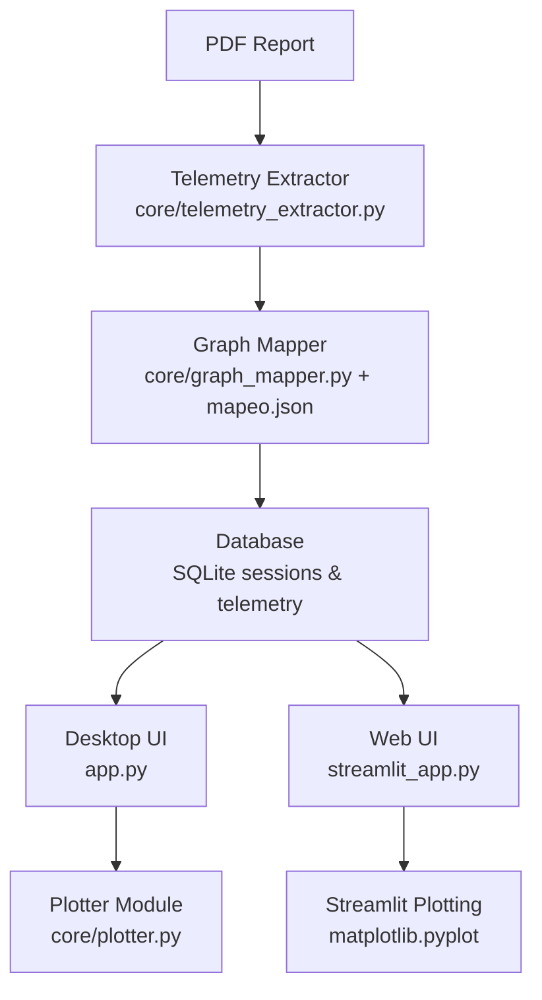
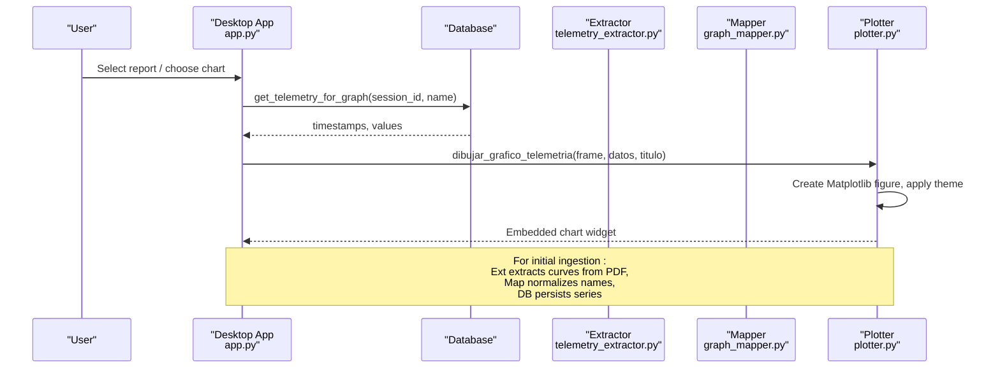
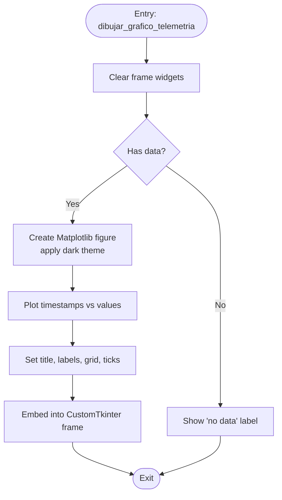
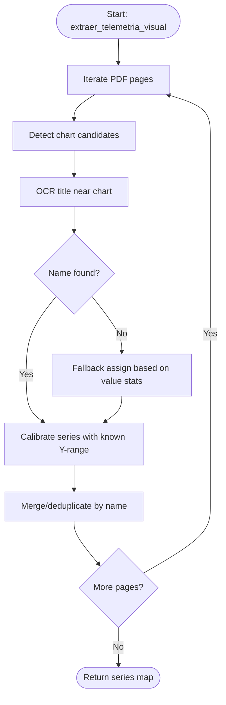
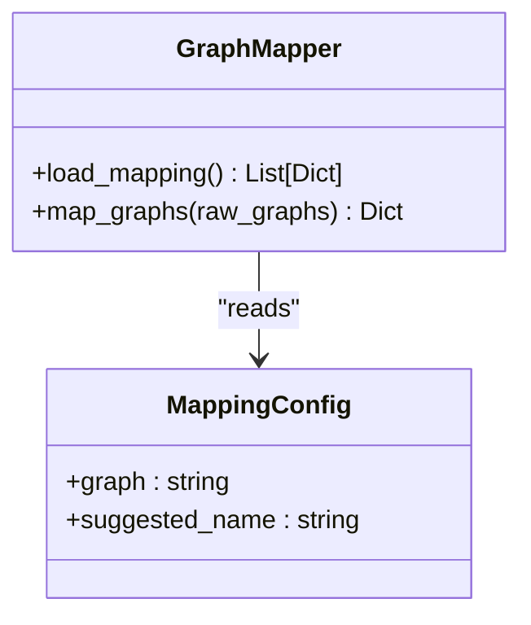
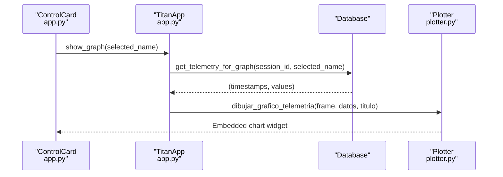
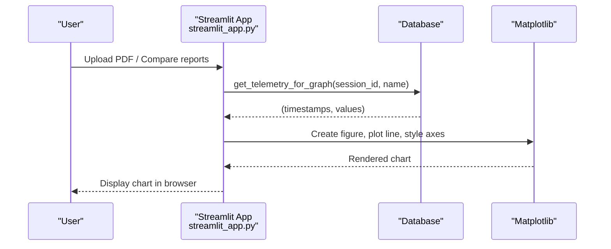
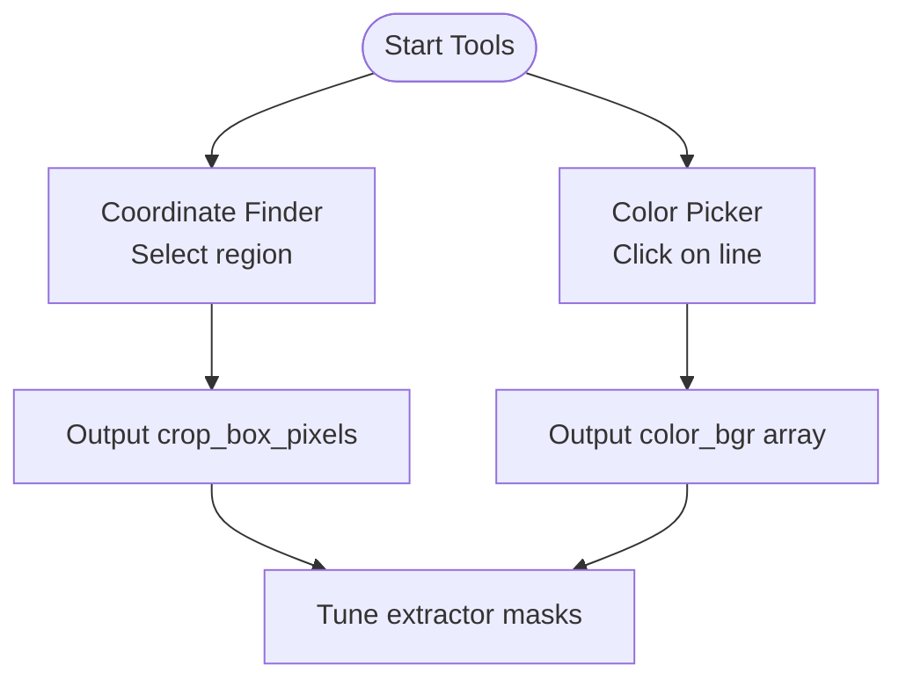
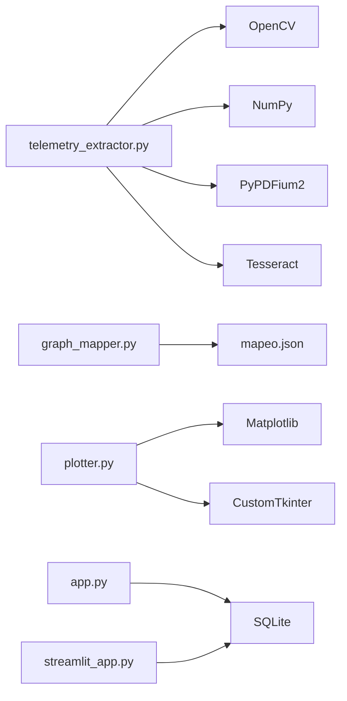

# Visualization System

<cite>
**Referenced Files in This Document**
- [plotter.py](file://core/plotter.py)
- [app.py](file://app.py)
- [streamlit_app.py](file://streamlit_app.py)
- [telemetry_extractor.py](file://core/telemetry_extractor.py)
- [graph_mapper.py](file://core/graph_mapper.py)
- [mapeo.json](file://mapeo.json)
- [coordinate_finder.py](file://coordinate_finder.py)
- [color_picker.py](file://color_picker.py)
</cite>

## Table of Contents
1. Introduction
2. Project Structure
3. Core Components
4. Architecture Overview
5. Detailed Component Analysis
6. Dependency Analysis
7. Performance Considerations
8. Troubleshooting Guide
9. Conclusion
10. Appendices

## Introduction
This document explains the visualization system used to render telemetry charts and support interactive plotting within the application. It focuses on:
- The plotter module for rendering line charts from telemetry data
- Chart types supported (line charts), customization options, and theme integration
- Coordinate finding and chart scaling for accurate data point placement
- Integration points with desktop (CustomTkinter) and web (Streamlit) interfaces
- Guidelines for extending the system with new chart types and interactive features
- Performance considerations for large datasets and real-time updates

The system extracts time-series telemetry from PDF reports, maps extracted series to canonical names, stores them in a database, and renders them as interactive line charts in both desktop and web UIs.

## Project Structure
The visualization pipeline spans extraction, mapping, storage, and rendering:
- Extraction: Converts PDF pages into image crops around detected charts, identifies curves via color segmentation, and calibrates pixel coordinates to real-world values using known ranges.
- Mapping: Normalizes extracted series names to canonical labels using a JSON mapping file.
- Storage: Persists telemetry series per session in a SQLite database.
- Rendering: Draws Matplotlib-based line charts embedded in CustomTkinter frames or Streamlit figures.

**Diagram sources**
- [telemetry_extractor.py:202-239](file://core/telemetry_extractor.py#L202-L239)
- [graph_mapper.py:13-31](file://core/graph_mapper.py#L13-L31)
- [mapeo.json:1-27](file://mapeo.json#L1-L27)
- [app.py:484-490](file://app.py#L484-L490)
- [streamlit_app.py:112-132](file://streamlit_app.py#L112-L132)
- [plotter.py:15-70](file://core/plotter.py#L15-L70)

**Section sources**
- [telemetry_extractor.py:202-239](file://core/telemetry_extractor.py#L202-L239)
- [graph_mapper.py:13-31](file://core/graph_mapper.py#L13-L31)
- [mapeo.json:1-27](file://mapeo.json#L1-L27)
- [app.py:484-490](file://app.py#L484-L490)
- [streamlit_app.py:112-132](file://streamlit_app.py#L112-L132)
- [plotter.py:15-70](file://core/plotter.py#L15-L70)

## Core Components
- Telemetry Extractor: Detects chart regions in PDF pages, extracts curve pixels, and converts them to time-value series using known Y-ranges and total duration.
- Graph Mapper: Maps raw graph identifiers to canonical telemetry names using a JSON configuration.
- Plotter Module: Renders Matplotlib line charts inside CustomTkinter frames with dark theme styling and error handling.
- Desktop UI Integration: Retrieves telemetry by name and session, then calls the plotter to display charts.
- Web UI Integration: Uses Matplotlib directly in Streamlit to render charts per telemetry type.

Key responsibilities:
- Accurate coordinate conversion from pixel space to real-world units
- Robust fallback naming when OCR fails
- Consistent styling across UIs
- Clear separation between data extraction and rendering

**Section sources**
- [telemetry_extractor.py:11-19](file://core/telemetry_extractor.py#L11-L19)
- [telemetry_extractor.py:167-177](file://core/telemetry_extractor.py#L167-L177)
- [graph_mapper.py:13-31](file://core/graph_mapper.py#L13-L31)
- [plotter.py:15-70](file://core/plotter.py#L15-L70)
- [app.py:484-490](file://app.py#L484-L490)
- [streamlit_app.py:112-132](file://streamlit_app.py#L112-L132)

## Architecture Overview
The visualization architecture integrates extraction, normalization, persistence, and rendering:

**Diagram sources**
- [app.py:484-490](file://app.py#L484-L490)
- [plotter.py:15-70](file://core/plotter.py#L15-L70)
- [telemetry_extractor.py:202-239](file://core/telemetry_extractor.py#L202-L239)
- [graph_mapper.py:13-31](file://core/graph_mapper.py#L13-L31)

## Detailed Component Analysis

### Plotter Module (Line Charts in CustomTkinter)
Responsibilities:
- Clears previous widgets before drawing a new chart
- Accepts telemetry tuples of (timestamps, values)
- Creates a Matplotlib figure with dark theme styling
- Embeds the figure into a CustomTkinter frame via FigureCanvasTkAgg
- Handles errors gracefully by displaying an error label

Rendering details:
- Uses a dark background style and custom colors for axes, grid, and face
- Sets title, axis labels, grid, and tick colors for readability
- Packs the canvas widget to fill available space

Error handling:
- Catches exceptions during plotting and shows a user-friendly error message

**Diagram sources**
- [plotter.py:15-70](file://core/plotter.py#L15-L70)

**Section sources**
- [plotter.py:15-70](file://core/plotter.py#L15-L70)

### Telemetry Extraction and Calibration
Responsibilities:
- Detects candidate chart regions using color segmentation and morphological operations
- Optionally uses OCR near chart titles to infer the telemetry name
- Extracts curve pixels and converts them to time-value series
- Applies known Y-ranges per telemetry type to scale values correctly
- Provides fallback heuristics when OCR fails

Coordinate system and scaling:
- Pixel X is mapped linearly to time using total duration
- Pixel Y is mapped to real-world values using predefined ranges per telemetry type
- Series are deduplicated and merged if multiple candidates map to the same name

**Diagram sources**
- [telemetry_extractor.py:58-92](file://core/telemetry_extractor.py#L58-L92)
- [telemetry_extractor.py:104-131](file://core/telemetry_extractor.py#L104-L131)
- [telemetry_extractor.py:167-177](file://core/telemetry_extractor.py#L167-L177)
- [telemetry_extractor.py:181-199](file://core/telemetry_extractor.py#L181-L199)
- [telemetry_extractor.py:202-239](file://core/telemetry_extractor.py#L202-L239)

**Section sources**
- [telemetry_extractor.py:58-92](file://core/telemetry_extractor.py#L58-L92)
- [telemetry_extractor.py:104-131](file://core/telemetry_extractor.py#L104-L131)
- [telemetry_extractor.py:167-177](file://core/telemetry_extractor.py#L167-L177)
- [telemetry_extractor.py:181-199](file://core/telemetry_extractor.py#L181-L199)
- [telemetry_extractor.py:202-239](file://core/telemetry_extractor.py#L202-L239)

### Graph Mapping and Configuration
Responsibilities:
- Loads a JSON mapping that associates raw graph identifiers with suggested canonical names
- Filters and renames extracted series accordingly
- Supports extensibility by editing the mapping file without code changes

Configuration:
- The mapping file defines pairs of graph keys and suggested names for six telemetry types

**Diagram sources**
- [graph_mapper.py:7-11](file://core/graph_mapper.py#L7-L11)
- [graph_mapper.py:13-31](file://core/graph_mapper.py#L13-L31)
- [mapeo.json:1-27](file://mapeo.json#L1-L27)

**Section sources**
- [graph_mapper.py:7-11](file://core/graph_mapper.py#L7-L11)
- [graph_mapper.py:13-31](file://core/graph_mapper.py#L13-L31)
- [mapeo.json:1-27](file://mapeo.json#L1-L27)

### Desktop UI Integration (CustomTkinter)
Responsibilities:
- Provides a control panel to select which telemetry chart to display
- Retrieves telemetry data for the selected chart and session
- Calls the plotter to render the chart in a dedicated frame

Interaction flow:
- User selects a chart from a combo box
- Application queries the database for the corresponding series
- Plotter draws the line chart with consistent styling

**Diagram sources**
- [app.py:220-268](file://app.py#L220-L268)
- [app.py:484-490](file://app.py#L484-L490)
- [plotter.py:15-70](file://core/plotter.py#L15-L70)

**Section sources**
- [app.py:220-268](file://app.py#L220-L268)
- [app.py:484-490](file://app.py#L484-L490)
- [plotter.py:15-70](file://core/plotter.py#L15-L70)

### Web UI Integration (Streamlit)
Responsibilities:
- Displays telemetry charts using Matplotlib within Streamlit
- Iterates through available telemetry types and renders each as a separate chart
- Uses dark theme styling consistent with the desktop experience

Rendering approach:
- Converts stored series into timestamp-value pairs
- Creates a Matplotlib figure and displays it via st.pyplot
- Closes figures to free memory

**Diagram sources**
- [streamlit_app.py:112-132](file://streamlit_app.py#L112-L132)

**Section sources**
- [streamlit_app.py:112-132](file://streamlit_app.py#L112-L132)

### Coordinate Finding Tools
Purpose:
- Provide manual tools to identify chart regions and pick colors for detection parameters
- Useful for tuning extraction accuracy by selecting bounding boxes and sampling line colors

Tools:
- Coordinate Finder: Interactive rectangle selection to output pixel coordinates for cropping
- Color Picker: Click to sample BGR color values for mask thresholds

**Diagram sources**
- [coordinate_finder.py:13-44](file://coordinate_finder.py#L13-L44)
- [color_picker.py:9-18](file://color_picker.py#L9-L18)

**Section sources**
- [coordinate_finder.py:13-44](file://coordinate_finder.py#L13-L44)
- [color_picker.py:9-18](file://color_picker.py#L9-L18)

## Dependency Analysis
- Telemetry Extractor depends on OpenCV, NumPy, PyPDFium2, and Tesseract for page rendering and OCR.
- Graph Mapper depends on a JSON configuration file for name mapping.
- Plotter depends on Matplotlib and CustomTkinter for embedding charts.
- Desktop and Web UIs depend on the database for retrieving telemetry series.

**Diagram sources**
- [telemetry_extractor.py:1-10](file://core/telemetry_extractor.py#L1-L10)
- [graph_mapper.py:1-3](file://core/graph_mapper.py#L1-L3)
- [plotter.py:6-9](file://core/plotter.py#L6-L9)
- [app.py:33-42](file://app.py#L33-L42)
- [streamlit_app.py:17-28](file://streamlit_app.py#L17-L28)

**Section sources**
- [telemetry_extractor.py:1-10](file://core/telemetry_extractor.py#L1-L10)
- [graph_mapper.py:1-3](file://core/graph_mapper.py#L1-L3)
- [plotter.py:6-9](file://core/plotter.py#L6-L9)
- [app.py:33-42](file://app.py#L33-L42)
- [streamlit_app.py:17-28](file://streamlit_app.py#L17-L28)

## Performance Considerations
- Data volume: Telemetry series can be large; consider downsampling or chunking when rendering very long time series to reduce memory and rendering overhead.
- Real-time updates: For live streams, update plots incrementally rather than redrawing full figures each frame. In CustomTkinter, reuse the existing canvas and update data arrays; in Streamlit, use stateful caching and partial re-renders.
- Extraction efficiency: Limit page scans to relevant pages and adjust candidate size filters to avoid unnecessary processing. Use precomputed masks and optimized morphological operations.
- Theme and styling: Applying a single Matplotlib style once per process reduces overhead; avoid recreating styles repeatedly.
- Database access: Batch insertions and transactions improve write performance during ingestion.

[No sources needed since this section provides general guidance]

## Troubleshooting Guide
Common issues and resolutions:
- No data displayed: Ensure the selected chart name matches a stored telemetry series and that the session ID is valid. Verify extraction produced non-empty series and that mapping renamed them correctly.
- Incorrect scaling: Confirm the Y-range definitions match the actual chart units and that total duration is correct. Adjust ranges if chart metadata differs.
- OCR failures: If automatic naming fails, rely on fallback heuristics or manually edit the mapping file to associate raw graph keys with canonical names.
- Rendering errors: The plotter catches exceptions and shows an error label; check logs for underlying causes such as invalid data types or empty series.

**Section sources**
- [plotter.py:66-70](file://core/plotter.py#L66-L70)
- [telemetry_extractor.py:181-199](file://core/telemetry_extractor.py#L181-L199)
- [graph_mapper.py:13-31](file://core/graph_mapper.py#L13-L31)

## Conclusion
The visualization system provides a robust pipeline for extracting telemetry from PDFs, normalizing series names, storing data, and rendering line charts in both desktop and web interfaces. The plotter module offers consistent styling and error handling, while the extraction and mapping components ensure accurate coordinate conversion and flexible configuration. Extending the system involves updating the mapping file, adding new chart types in extraction, and integrating additional UI components.

[No sources needed since this section summarizes without analyzing specific files]

## Appendices

### Supported Chart Types
- Line charts for telemetry time series (Steering, Speed In Km/h, Brake Pad, Acceleration Pad, Fork Height In Mtrs, Tilt Angle In Deg)

Note: Bar charts are not implemented in the current codebase; only line charts are rendered.

**Section sources**
- [telemetry_extractor.py:11-19](file://core/telemetry_extractor.py#L11-L19)
- [streamlit_app.py:38-41](file://streamlit_app.py#L38-L41)
- [app.py:362-362](file://app.py#L362-L362)

### Customization Options and Theme Integration
- Dark theme applied via Matplotlib style and custom colors for axes, grids, and backgrounds
- Consistent styling across desktop and web UIs
- Fonts and colors managed centrally in the desktop app’s theme class

**Section sources**
- [plotter.py:42-54](file://core/plotter.py#L42-L54)
- [app.py:48-67](file://app.py#L48-L67)
- [streamlit_app.py:123-131](file://streamlit_app.py#L123-L131)

### Creating Custom Visualizations
- Add a new telemetry type by:
  - Defining its Y-range in the extractor
  - Adding mapping entries in the JSON config
  - Updating UI lists to include the new chart name
- To add annotations:
  - Extend the plotter to accept annotation parameters and draw markers or text on the Matplotlib axes
- To export charts:
  - Use Matplotlib’s savefig to export to PNG/PDF from the plotter or UI layer

**Section sources**
- [telemetry_extractor.py:11-19](file://core/telemetry_extractor.py#L11-L19)
- [graph_mapper.py:13-31](file://core/graph_mapper.py#L13-L31)
- [plotter.py:15-70](file://core/plotter.py#L15-L70)

### Extending with New Chart Types and Interactive Features
- New chart types:
  - Implement extraction logic in the extractor (color masks, OCR rules, fallback heuristics)
  - Register mapping entries in the JSON config
  - Update UI controls to list and select the new chart
- Interactive features:
  - Add hover tooltips or zoom/pan by integrating Matplotlib event handlers
  - In CustomTkinter, embed interactive canvases and handle events via callbacks
  - In Streamlit, leverage st.plotly_chart or interactive Matplotlib backends

**Section sources**
- [telemetry_extractor.py:58-92](file://core/telemetry_extractor.py#L58-L92)
- [graph_mapper.py:13-31](file://core/graph_mapper.py#L13-L31)
- [plotter.py:15-70](file://core/plotter.py#L15-L70)
- [streamlit_app.py:112-132](file://streamlit_app.py#L112-L132)