# Web Application

<cite>
**Referenced Files in This Document**
- [streamlit_app.py](file://streamlit_app.py)
- [app.py](file://app.py)
- [main.py](file://main.py)
- [requirements.txt](file://requirements.txt)
- [setup_database.py](file://setup_database.py)
- [core/db_manager.py](file://core/db_manager.py)
- [core/pdf_parser.py](file://core/pdf_parser.py)
- [core/telemetry_extractor.py](file://core/telemetry_extractor.py)
- [core/reporter.py](file://core/reporter.py)
- [core/behavior_analyzer.py](file://core/behavior_analyzer.py)
- [core/graph_mapper.py](file://core/graph_mapper.py)
- [database/schema.sql](file://database/schema.sql)
</cite>

## Table of Contents
1. [Introduction](#introduction)
2. [Project Structure](#project-structure)
3. [Core Components](#core-components)
4. [Architecture Overview](#architecture-overview)
5. [Detailed Component Analysis](#detailed-component-analysis)
6. [Dependency Analysis](#dependency-analysis)
7. [Performance Considerations](#performance-considerations)
8. [Troubleshooting Guide](#troubleshooting-guide)
9. [Conclusion](#conclusion)
10. [Appendices](#appendices)

## Introduction
This document describes the web-based interface for Proyecto Titán built with Streamlit. It explains how the application mirrors desktop functionality while providing browser-based access to training analysis tools, including PDF report upload, data processing, interactive visualization, and real-time display of telemetry graphs. It also covers session handling, state management, responsive design considerations, integration with the core processing engine, database connectivity, file management, deployment examples, configuration, security considerations, and performance optimization strategies for web deployment.

## Project Structure
The project is organized into:
- A Streamlit web entry point that provides a modern, browser-based UI for uploading reports and viewing results.
- A desktop Tkinter application that implements the same core workflows for local use.
- A shared core library that handles PDF parsing, telemetry extraction, behavior analysis, reporting, and database operations.
- Database schema and setup utilities for SQLite storage.

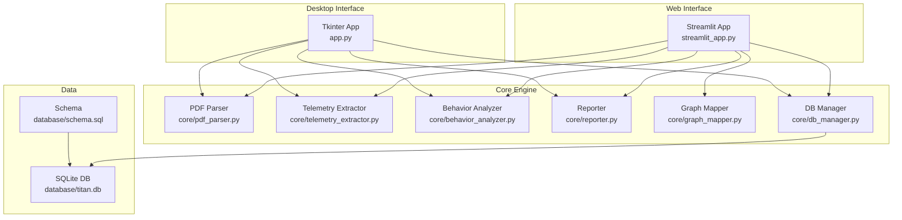

**Diagram sources**
- [streamlit_app.py:1-202](file://streamlit_app.py#L1-L202)
- [app.py:1-591](file://app.py#L1-L591)
- [core/pdf_parser.py:1-124](file://core/pdf_parser.py#L1-L124)
- [core/telemetry_extractor.py:1-239](file://core/telemetry_extractor.py#L1-L239)
- [core/behavior_analyzer.py:1-236](file://core/behavior_analyzer.py#L1-L236)
- [core/reporter.py:1-122](file://core/reporter.py#L1-L122)
- [core/graph_mapper.py:1-32](file://core/graph_mapper.py#L1-L32)
- [core/db_manager.py:1-152](file://core/db_manager.py#L1-L152)
- [database/schema.sql:1-59](file://database/schema.sql#L1-L59)

**Section sources**
- [streamlit_app.py:1-202](file://streamlit_app.py#L1-L202)
- [app.py:1-591](file://app.py#L1-L591)
- [requirements.txt:1-61](file://requirements.txt#L1-L61)

## Core Components
- Streamlit web app: Provides file upload for individual and comparative reports, displays session metadata, text reports, and telemetry charts.
- Desktop app: Implements the same processing pipeline using Tkinter with advanced UI features like themes, tooltips, loading overlays, and export to PDF.
- PDF parser: Extracts session metadata and summary events from PDF reports.
- Telemetry extractor: Automatically extracts time-series data from chart images within PDFs using computer vision and OCR.
- Behavior analyzer: Computes behavioral metrics (braking, steering, acceleration, elevation, tilt, speed) and classifies operator profiles.
- Reporter: Generates narrative reports and evolution comparisons.
- Graph mapper: Maps raw graph names to canonical names used by the system.
- DB manager: Manages SQLite connections and CRUD operations for sessions, event summaries, and telemetry series.

Key responsibilities and interactions are detailed in subsequent sections.

**Section sources**
- [streamlit_app.py:17-48](file://streamlit_app.py#L17-L48)
- [core/pdf_parser.py:27-57](file://core/pdf_parser.py#L27-L57)
- [core/telemetry_extractor.py:202-239](file://core/telemetry_extractor.py#L202-L239)
- [core/behavior_analyzer.py:150-167](file://core/behavior_analyzer.py#L150-L167)
- [core/reporter.py:51-92](file://core/reporter.py#L51-L92)
- [core/graph_mapper.py:13-31](file://core/graph_mapper.py#L13-L31)
- [core/db_manager.py:23-90](file://core/db_manager.py#L23-L90)

## Architecture Overview
The Streamlit app orchestrates user actions (uploading PDFs), delegates processing to core modules, persists results in SQLite, and renders outputs (text reports and plots). The desktop app follows the same flow but uses native widgets and additional UX enhancements.

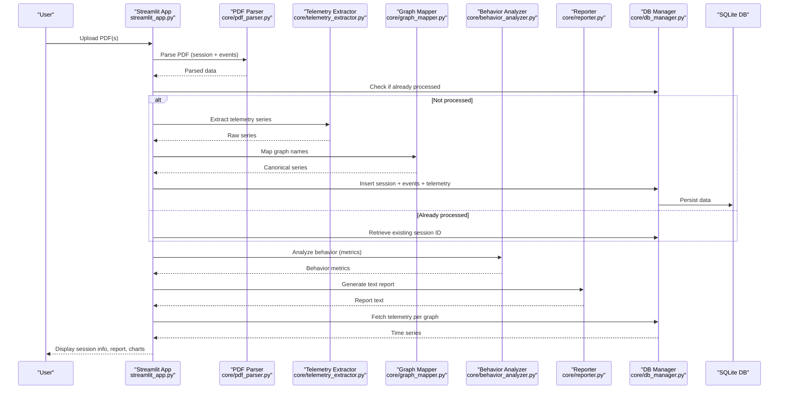

**Diagram sources**
- [streamlit_app.py:69-110](file://streamlit_app.py#L69-L110)
- [streamlit_app.py:149-201](file://streamlit_app.py#L149-L201)
- [core/pdf_parser.py:27-57](file://core/pdf_parser.py#L27-L57)
- [core/telemetry_extractor.py:202-239](file://core/telemetry_extractor.py#L202-L239)
- [core/graph_mapper.py:13-31](file://core/graph_mapper.py#L13-L31)
- [core/behavior_analyzer.py:150-167](file://core/behavior_analyzer.py#L150-L167)
- [core/reporter.py:51-92](file://core/reporter.py#L51-L92)
- [core/db_manager.py:93-152](file://core/db_manager.py#L93-L152)

## Detailed Component Analysis

### Streamlit Web Interface
- File upload: Supports individual report upload and comparison mode (initial vs final).
- Processing pipeline: Parses PDF, predicts operator profile via ML model, stores session and telemetry, and generates reports.
- Visualization: Renders dark-themed matplotlib charts per available telemetry graphs.
- State handling: Uses temporary files for uploaded PDFs; processes on each run; no persistent session state beyond DB.
- Responsive layout: Uses wide layout and sidebar for controls; charts adapt to container width.

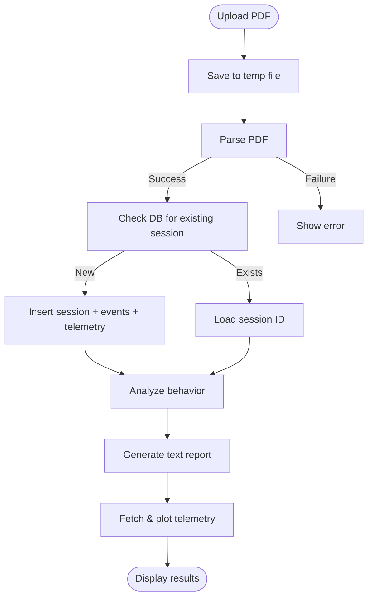

**Diagram sources**
- [streamlit_app.py:69-110](file://streamlit_app.py#L69-L110)
- [streamlit_app.py:149-201](file://streamlit_app.py#L149-L201)

**Section sources**
- [streamlit_app.py:32-48](file://streamlit_app.py#L32-L48)
- [streamlit_app.py:69-110](file://streamlit_app.py#L69-L110)
- [streamlit_app.py:138-201](file://streamlit_app.py#L138-L201)

### Desktop Application (Tkinter)
- Mirrors web functionality with richer UI: theme switching, tooltips, toast notifications, loading overlay, status bar, keyboard shortcuts, and PDF export.
- Same core integrations: PDF parsing, ML prediction, DB persistence, telemetry plotting, and report generation.

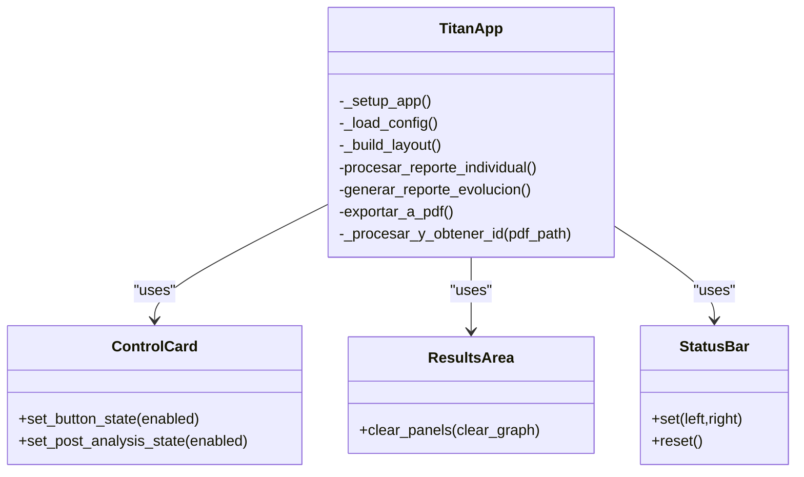

**Diagram sources**
- [app.py:308-584](file://app.py#L308-L584)
- [app.py:220-269](file://app.py#L220-L269)
- [app.py:271-303](file://app.py#L271-L303)
- [app.py:204-219](file://app.py#L204-L219)

**Section sources**
- [app.py:48-67](file://app.py#L48-L67)
- [app.py:178-303](file://app.py#L178-L303)
- [app.py:308-584](file://app.py#L308-L584)

### PDF Parsing
- Extracts session metadata (operator name, class, exercise, start time, duration, score) and summary events (consolidated results table).
- Uses regex patterns and locale-aware date parsing.

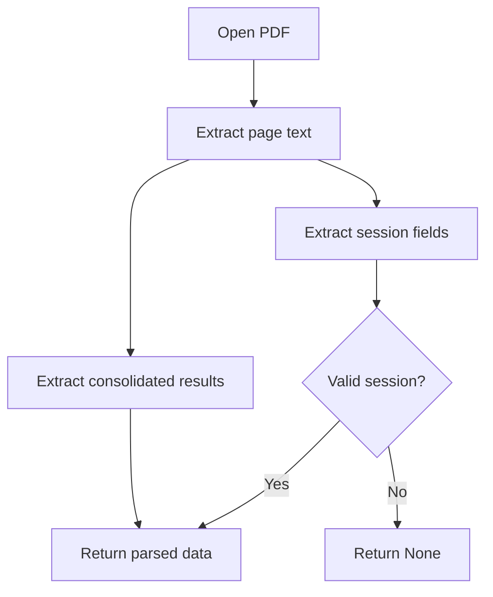

**Diagram sources**
- [core/pdf_parser.py:27-57](file://core/pdf_parser.py#L27-L57)
- [core/pdf_parser.py:66-124](file://core/pdf_parser.py#L66-L124)

**Section sources**
- [core/pdf_parser.py:12-25](file://core/pdf_parser.py#L12-L25)
- [core/pdf_parser.py:27-57](file://core/pdf_parser.py#L27-L57)
- [core/pdf_parser.py:66-124](file://core/pdf_parser.py#L66-L124)

### Telemetry Extraction
- Detects chart candidates via color segmentation and morphological operations.
- Uses OCR to identify chart titles and maps them to canonical names; falls back to heuristics when OCR fails.
- Calibrates pixel coordinates to time and value ranges based on known scales.

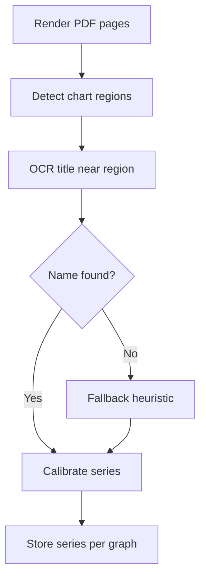

**Diagram sources**
- [core/telemetry_extractor.py:58-92](file://core/telemetry_extractor.py#L58-L92)
- [core/telemetry_extractor.py:104-131](file://core/telemetry_extractor.py#L104-L131)
- [core/telemetry_extractor.py:142-177](file://core/telemetry_extractor.py#L142-L177)
- [core/telemetry_extractor.py:181-198](file://core/telemetry_extractor.py#L181-L198)
- [core/telemetry_extractor.py:202-239](file://core/telemetry_extractor.py#L202-L239)

**Section sources**
- [core/telemetry_extractor.py:11-23](file://core/telemetry_extractor.py#L11-L23)
- [core/telemetry_extractor.py:58-92](file://core/telemetry_extractor.py#L58-L92)
- [core/telemetry_extractor.py:104-131](file://core/telemetry_extractor.py#L104-L131)
- [core/telemetry_extractor.py:142-177](file://core/telemetry_extractor.py#L142-L177)
- [core/telemetry_extractor.py:181-198](file://core/telemetry_extractor.py#L181-L198)
- [core/telemetry_extractor.py:202-239](file://core/telemetry_extractor.py#L202-L239)

### Behavior Analysis
- Computes braking, steering, acceleration, elevation, tilt adjustments, and speed metrics from stored telemetry.
- Orchestrates all analyses and returns consolidated metrics.

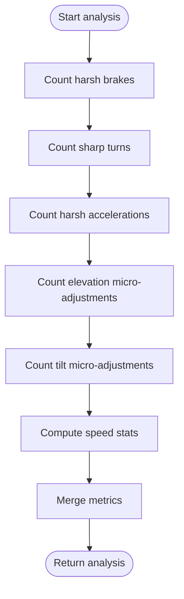

**Diagram sources**
- [core/behavior_analyzer.py:95-147](file://core/behavior_analyzer.py#L95-L147)
- [core/behavior_analyzer.py:150-167](file://core/behavior_analyzer.py#L150-L167)

**Section sources**
- [core/behavior_analyzer.py:16-67](file://core/behavior_analyzer.py#L16-L67)
- [core/behavior_analyzer.py:95-147](file://core/behavior_analyzer.py#L95-L147)
- [core/behavior_analyzer.py:150-167](file://core/behavior_analyzer.py#L150-L167)

### Reporting
- Generates individual narrative reports including predicted profile, recommended learning path, telemetry insights, and actionable feedback.
- Produces evolution reports comparing two sessions.

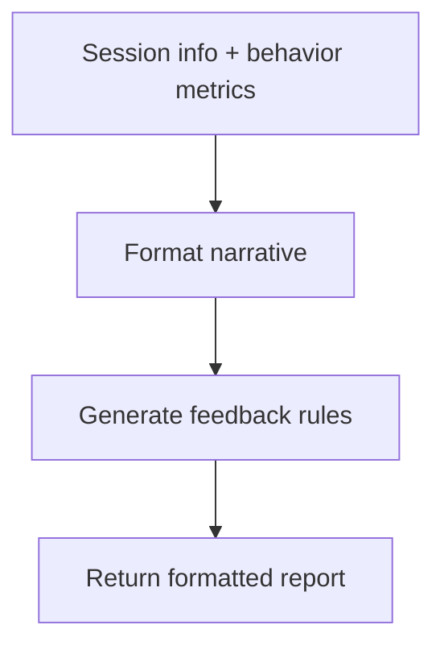

**Diagram sources**
- [core/reporter.py:19-45](file://core/reporter.py#L19-L45)
- [core/reporter.py:51-92](file://core/reporter.py#L51-L92)
- [core/reporter.py:98-120](file://core/reporter.py#L98-L120)

**Section sources**
- [core/reporter.py:19-45](file://core/reporter.py#L19-L45)
- [core/reporter.py:51-92](file://core/reporter.py#L51-L92)
- [core/reporter.py:98-120](file://core/reporter.py#L98-L120)

### Database Connectivity
- Context-managed connections ensure proper resource cleanup.
- Functions handle session insertion, event summary insertion, telemetry series storage, and retrieval for graphs.
- Schema defines tables for sessions, event summaries, and telemetry series with indexes for performance.

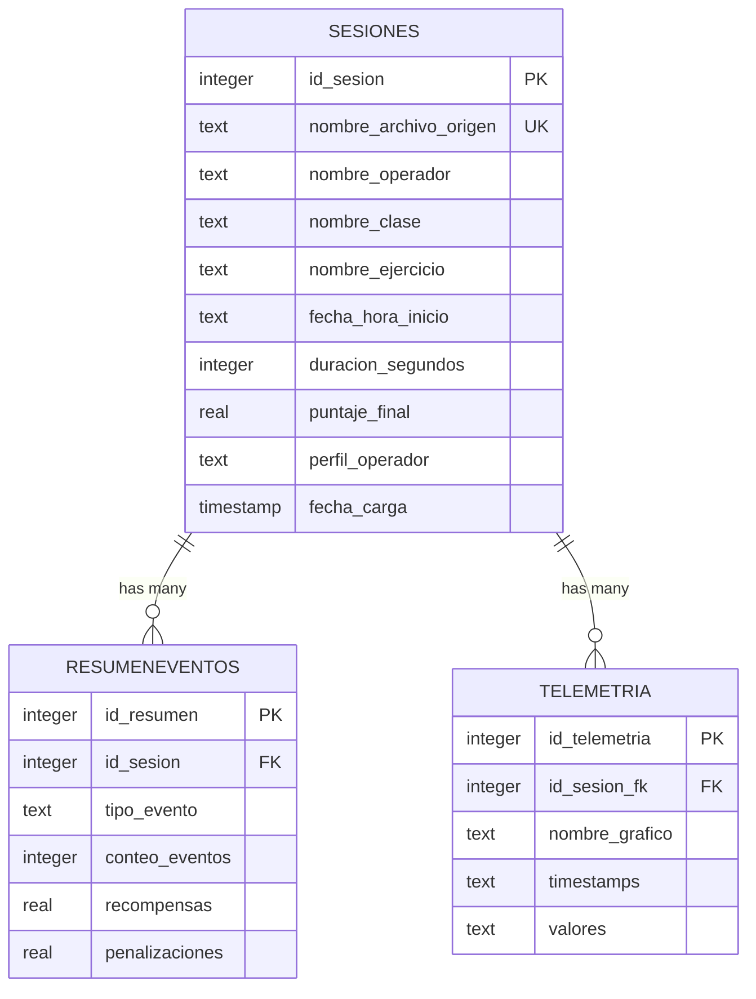

**Diagram sources**
- [database/schema.sql:14-59](file://database/schema.sql#L14-L59)

**Section sources**
- [core/db_manager.py:23-90](file://core/db_manager.py#L23-L90)
- [core/db_manager.py:93-152](file://core/db_manager.py#L93-L152)
- [database/schema.sql:14-59](file://database/schema.sql#L14-L59)

### Batch Processing (Manifest-Based)
- Reads manifest.csv to process multiple PDFs in batch, skipping already processed files and summarizing outcomes.

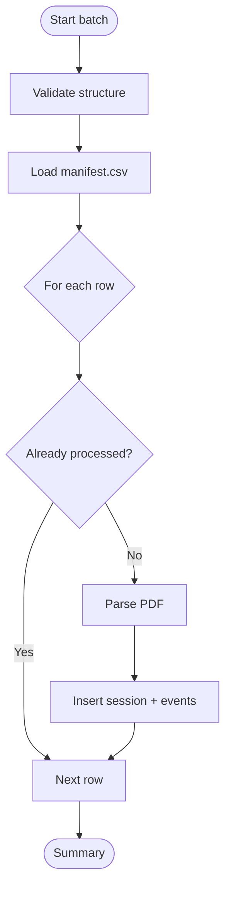

**Diagram sources**
- [main.py:22-43](file://main.py#L22-L43)
- [main.py:100-176](file://main.py#L100-L176)

**Section sources**
- [main.py:15-20](file://main.py#L15-L20)
- [main.py:22-43](file://main.py#L22-L43)
- [main.py:100-176](file://main.py#L100-L176)

## Dependency Analysis
- Streamlit app depends on core modules for parsing, extraction, analysis, reporting, and database operations.
- Desktop app shares the same core dependencies but adds Tkinter-specific UI components.
- Requirements include Streamlit, PDF parsing libraries, computer vision tools, ML inference, and plotting libraries.

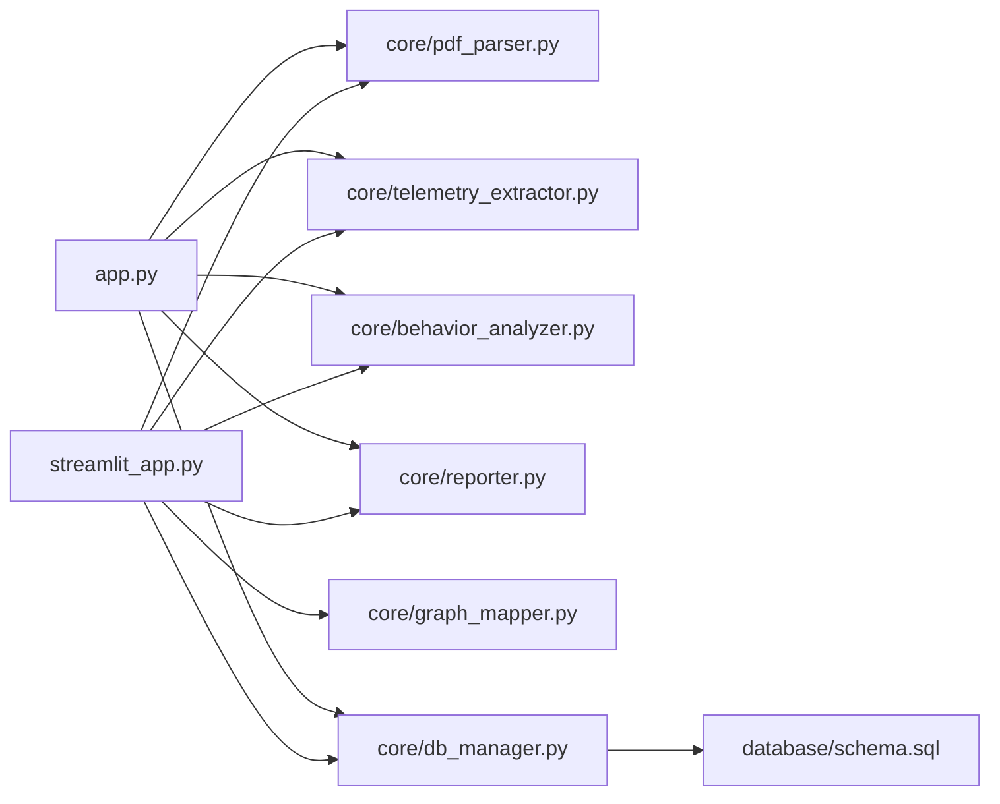

**Diagram sources**
- [streamlit_app.py:17-28](file://streamlit_app.py#L17-L28)
- [app.py:33-42](file://app.py#L33-L42)
- [core/db_manager.py:1-12](file://core/db_manager.py#L1-L12)
- [database/schema.sql:1-59](file://database/schema.sql#L1-L59)

**Section sources**
- [requirements.txt:1-61](file://requirements.txt#L1-L61)
- [streamlit_app.py:17-28](file://streamlit_app.py#L17-L28)
- [app.py:33-42](file://app.py#L33-L42)

## Performance Considerations
- Caching: Use Streamlit caching for expensive operations such as PDF parsing and telemetry extraction to avoid reprocessing on reruns.
- Concurrency: Avoid blocking the main thread during long-running tasks; consider background tasks or progress indicators.
- Database: Ensure indexes exist (schema includes indexes); batch inserts where possible; minimize connection churn via context managers.
- Rendering: Limit chart resolution and number of points; reuse figures; close Matplotlib figures to free memory.
- Model loading: Load ML models once at startup and reuse across requests.
- Storage: Keep exports directory organized; clean up temporary files promptly.

[No sources needed since this section provides general guidance]

## Troubleshooting Guide
- Missing ML model: If the classifier file is not found, the app will show an error indicating the expected path. Ensure the model exists before running.
- No telemetry data: If charts show warnings, verify that telemetry extraction succeeded and that graph names match canonical names.
- Database errors: Connection or query failures will print errors; check schema and permissions.
- PDF parsing failures: If session data cannot be extracted, verify PDF format and content; debug logs indicate critical errors.

**Section sources**
- [streamlit_app.py:82-87](file://streamlit_app.py#L82-L87)
- [streamlit_app.py:112-132](file://streamlit_app.py#L112-L132)
- [core/db_manager.py:85-90](file://core/db_manager.py#L85-L90)
- [core/pdf_parser.py:55-57](file://core/pdf_parser.py#L55-L57)

## Conclusion
The Streamlit web application provides a browser-based interface that mirrors the desktop functionality of Proyecto Titán, enabling users to upload PDF reports, analyze operator behavior, visualize telemetry, and generate comprehensive reports. It integrates tightly with core processing modules and a SQLite database, ensuring consistent data flows and reliable results. With appropriate deployment configuration and performance optimizations, it can serve multiple users efficiently while maintaining responsiveness and usability across devices.

[No sources needed since this section summarizes without analyzing specific files]

## Appendices

### Deployment Examples
- Local development:
  - Install dependencies: pip install -r requirements.txt
  - Initialize database: python setup_database.py
  - Run Streamlit: streamlit run streamlit_app.py
- Production-like deployment:
  - Configure server settings via environment variables or a .toml config file (see Streamlit docs).
  - Set cache directories and secure secrets appropriately.
  - Use a reverse proxy (e.g., Nginx) for HTTPS and authentication if needed.

[No sources needed since this section provides general guidance]

### Configuration Notes
- Paths: Database path, model path, and exports directory are configured in the Streamlit app and desktop app.
- Graph names: Canonical graph names are defined and mapped; ensure consistency between extraction and display.
- Learning routes: Recommended learning paths are tied to predicted profiles.

**Section sources**
- [streamlit_app.py:32-48](file://streamlit_app.py#L32-L48)
- [app.py:356-369](file://app.py#L356-L369)

### Security Considerations
- Input validation: Validate uploaded files and sanitize inputs to prevent injection or malicious payloads.
- Authentication: Integrate Streamlit authentication (e.g., OAuth, JWT) behind a reverse proxy or using Streamlit’s auth extensions.
- Secrets management: Store sensitive configuration (DB credentials, model paths) in environment variables or secret managers.
- Access control: Restrict file uploads to allowed types and sizes; validate MIME types and scan for malware if necessary.

[No sources needed since this section provides general guidance]

### Responsive Design Considerations
- Layout: Use wide layout and sidebar for controls; charts automatically adapt to container width.
- Mobile: Test on smaller screens; consider simplifying layouts or hiding non-essential elements on mobile devices.
- Accessibility: Provide clear labels and alternative text for charts; ensure contrast and readable fonts.

[No sources needed since this section provides general guidance]